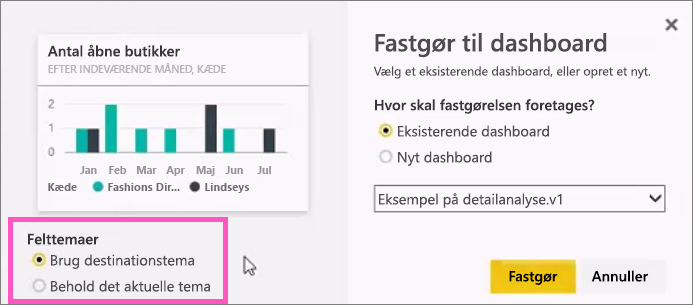

# Fastgør et felt til et Power BI-dashboard fra en rapport
## Fastgørelse af felter fra en rapport
Én måde at tilføje et nyt [dashboardfelt](consumer/end-user-tiles.md) på er inde fra en [Power BI-rapport](consumer/end-user-reports.md). Faktisk, kan du tilføje mange nye felter fra en rapport.  Hvert af disse felter fungerer som et link tilbage til rapporten, når du klikker.

Og hele rapportsider kan fastgøres til et dashboard.  Det kaldes også fastgørelse af et *live*felt.  *Live* fordi du kan interagere med feltet på dashboardet, og fordi ændringer, der foretages i rapporten, i modsætning til individuelle visualiseringsfelter, synkroniseres med dashboardet. Læs mere om dette nedenfor.

Du kan ikke fastgøre felter fra rapporter, der er blevet delt med dig, eller fra Power BI Desktop. 

> **Tip**! Nogle visualiseringer anvender baggrundsbilleder. Fastgørelse fungerer muligvis ikke, hvis baggrundsbilledet er for stort.  Prøv at reducere størrelsen på billedet eller at bruge billedkomprimering.  
> 
> 

## Fastgør et felt fra en rapport
Se Amanda oprette et dashboard ved at fastgøre visuals og billeder fra en Power BI-rapport.

<iframe width="560" height="315" src="https://www.youtube.com/embed/lJKgWnvl6bQ" frameborder="0" allowfullscreen></iframe>

Nu skal du oprette dit eget dashboard ved hjælp af en af Power BI-eksempelrapporterne.

1. Peg på den visualisering, du vil fastgøre, og vælg derefter fastgørelsesikonet . Power BI åbner skærmbilledet **Fastgør til dashboard**.
   
     
2. Beslut, om du vil fastgøre til et eksisterende dashboard eller et nyt dashboard.
   
   * Eksisterende dashboard: Vælg navnet på dashboardet på rullelisten. Dashboards, der er blevet delt med dig, vises ikke på rullelisten.
   * Nyt dashboard: Skriv navnet på det nye dashboard.
3. I nogle tilfælde kan det element, du er ved at fastgøre, allerede anvende et *tema*.  Det kan f.eks. være visuals, der er fastgjort fra en Excel-projektmappe. Hvis det er tilfældet, skal du vælge, hvilket tema der skal anvendes på feltet.
4. Vælg **Fastgør**.
   
   En meddelelse om fuldførelse (næsten helt oppe i højre hjørne) giver dig besked om, at visualiseringen er blevet føjet til dit dashboard som et felt.
   
   
5. Vælg dashboardet med det nye felt fra navigationsruden. Markér feltet for at gå tilbage til rapporten. Eller [rediger feltets visning og funktionsmåde](service-dashboard-edit-tile.md).

## Fastgør en hel rapportside
En anden mulighed er at fastgøre en hel rapportside til et dashboard. Dette er en nem metode til at fastgøre mere end én visualisering ad gangen.  Når du fastgør en hel side, er felterne også *dynamiske*, og du kan interagere med dem direkte på dashboardet. Og de ændringer, du foretager på visualiseringerne tilbage i rapporteditoren, f.eks. ved at tilføje et filter eller ændre de felter, der bruges i diagrammet, afspejles også i dashboardfeltet.  

Du kan få mere at vide under [Fastgør en hel rapportside](service-dashboard-pin-live-tile-from-report.md)

## Næste trin
[Dashboards i Power BI](consumer/end-user-dashboards.md)

[Dashboardfelter i Power BI](consumer/end-user-tiles.md)

[Rapporter i Power BI](consumer/end-user-reports.md)

[Opdatering af data i Power BI](refresh-data.md)

[Grundlæggende begreber i Power BI](consumer/end-user-basic-concepts.md)

Har du flere spørgsmål? [Prøv at spørge Power BI-community'et](http://community.powerbi.com/)

