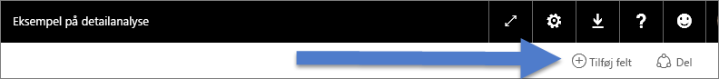
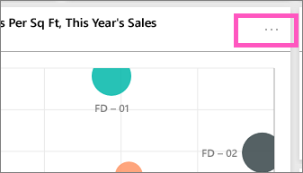
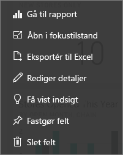

# Dashboardfelter i Power BI
Dashboards og dashboardfelter er en funktion i Power BI-tjenesten ikke Power BI Desktop. Selvom dashboardfelter ikke kan oprettes eller fastgøres i Power BI - Mobil, [kan de vises og deles](mobile-tiles-in-the-mobile-apps.md). Og i Power BI - Mobil kan du [føje billeder til dashboardet med iPhone-appen](mobile-iphone-app-get-started.md).

## Dashboardfelter

Et felt er et snapshot af dine data, der er fastgjort til dashboardet. Et felt kan oprettes fra en rapport, et datasæt, et dashboard, fra feltet Spørgsmål og svar, Excel og fra SQL Server Reporting Services (SSRS) og mere.  Dette skærmbillede viser mange forskellige felter, der er fastgjort til et dashboard.

Ud over fastgørelse kan der oprettes separate felter direkte på dashboardet ved hjælp af [Tilføj felt](service-dashboard-add-widget.md). Separate felter omfatter: tekstfelter, billeder, videoer, streamingdata og webindhold.

Har du brug for hjælp til at forstå de komponenter, der udgør Power BI?  Se [Power BI – Grundlæggende begreber](service-basic-concepts.md).

> [!NOTE]
> Hvis den oprindelige visualisering, der blev brugt til at oprette feltet, ændres, er det ikke tilfældet med feltet.  Hvis du f.eks. har fastgjort et kurvediagram fra en rapport, og du derefter har ændret kurvediagrammet til et søjlediagram, fortsætter dashboardfeltet med at vise et kurvediagram. Dataene opdateres, men visualiseringstypen bliver ikke.
> 
> 

## Fastgør et felt fra...
Der er mange forskellige måder at føje (fastgøre) et felt til et dashboard på. Felter kan fastgøres fra:

* [Power BI Spørgsmål og svar](service-dashboard-pin-tile-from-q-and-a.md)
* [en rapport](service-dashboard-pin-tile-from-report.md)
* [et andet dashboard](service-pin-tile-to-another-dashboard.md)
* [Excel-projektmappe på OneDrive for Business](service-dashboard-pin-tile-from-excel.md)
* [Power BI Publisher til Excel](publisher-for-excel.md)
* [Quick Insights](service-insights.md)
* [SSRS](https://msdn.microsoft.com/library/mt604784.aspx)

Og separate felter til billeder, tekstfelter, videoer, streamingdata og webindhold kan oprettes direkte på dashboardet ved hjælp af [Tilføj felt](service-dashboard-add-widget.md).

  

## Interager med felter på et dashboard
### Flyt og tilpas størrelsen på et felt
Tag et felt, og [flyt det rundt på dashboardet](service-dashboard-edit-tile.md). Peg, og vælg håndtaget  for at tilpasse størrelsen på feltet.

### Peg på et felt for at ændre udseende og funktionalitet
1. Peg på feltet for at vise ellipsen.
   
    
2. Vælg ellipsen for at åbne menuen med felthandlinger.
   
    
   
    Herfra kan du:
   
   * [Åbne den rapport, der blev brugt til at oprette dette felt ](service-reports.md)   
   
   * [Åbne den projektmappe, der blev brugt til at oprette dette felt ](service-reports.md)   
     
     * [Få vist i fokuseringstilstand ](service-focus-mode.md)   
     * [Eksportere data, der bruges i feltet](power-bi-visualization-export-data.md) 
     * [Redigere titel og undertitel, tilføje et hyperlink, vise seneste opdateringstidspunkt](service-dashboard-edit-tile.md) 
     * [Køre indsigt ](service-insights.md) 
     * [Fastgøre feltet til et andet dashboard ](service-pin-tile-to-another-dashboard.md)
       
   * [Fjerne feltet](service-dashboard-edit-tile.md)
     
3. Vælg et tomt område på canvasset for at lukke handlingsmenuen.

### Vælg (klik på) et felt
Når du vælger et felt, afhænger næste handling af, hvordan feltet blev oprettet, og om det har et [brugerdefineret link](service-dashboard-edit-tile.md). Hvis det har et brugerdefineret link, føres du til linket ved at vælge feltet. Ellers føres du til rapporten, Excel Online-projektmappen, SSRS-rapporten, der er i det lokale miljø, eller spørgsmål i Spørgsmål og svar, der blev brugt til at oprette feltet.

> [!NOTE]
> Undtagelsen til dette er videofelter, der er oprettet direkte på dashboardet ved hjælp af **Tilføj felt**. Hvis du vælger et videofelt (der blev oprettet på denne måde), afspilles videoen direkte på dashboardet.   
> 
> 

## Overvejelser og fejlfinding
* Hvis den rapport, der blev brugt til at oprette visualiseringen, ikke blev gemt, sker der ikke noget, når feltet vælges.
* Hvis feltet blev oprettet fra en projektmappe i Excel Online, og du ikke som minimum har læserettigheder til denne projektmappe, åbnes projektmappen ikke i Excel Online, når du vælger feltet.
* For felter, der er oprettet direkte på dashboardet ved hjælp af **Tilføj felt**, og hvis et brugerdefineret hyperlink er angivet, åbnes denne URL-adresse, når titlen, undertitlen eller feltet vælges.  Ellers medfører det som standard ingen handling at vælge et af disse felter oprettet direkte på dashboardet for et billede, en webkode eller et tekstfelt.
* Hvis du ikke har tilladelse til rapporten i SSRS, vil valget af et felt oprettet ud fra SSRS producere en side, der angiver, at du ikke har adgang (rsAccessDenied).
* Hvis du ikke har adgang til netværket, hvor SSRS-serveren er placeret, vil valget af et felt oprettet ud fra SSRS producere en side, der angiver, at serveren ikke blev fundet (HTTP 404). Enheden skal have netværksadgang til rapportserveren for at få vist rapporten.
* Hvis den oprindelige visualisering, der blev brugt til at oprette feltet, ændres, er det ikke tilfældet med feltet.  Hvis du f.eks. har fastgjort et kurvediagram fra en rapport, og du derefter ændrer kurvediagrammet til et søjlediagram, fortsætter dashboardfeltet med at vise et kurvediagram. Dataene opdateres, men visualiseringstypen bliver ikke.

## Næste trin
[Opret et stort talfelt fra en rapport](power-bi-visualization-big-number-report.md)

[Opret et stort talfelt fra Spørgsmål og svar](power-bi-visualization-big-number.md)

[Dashboards i Power BI](service-dashboards.md)  

[Opdatering af data](refresh-data.md)

[Power BI – Grundlæggende begreber](service-basic-concepts.md)

[Eksportér et felt til Power Point](http://blogs.msdn.com/b/powerbidev/archive/2015/09/28/integrating-power-bi-tiles-into-office-documents.aspx)

[Fastgør Reporting Services-elementer til Power BI-dashboards](https://msdn.microsoft.com/library/mt604784.aspx)

Har du flere spørgsmål? [Prøv Power BI-community'et](http://community.powerbi.com/)

