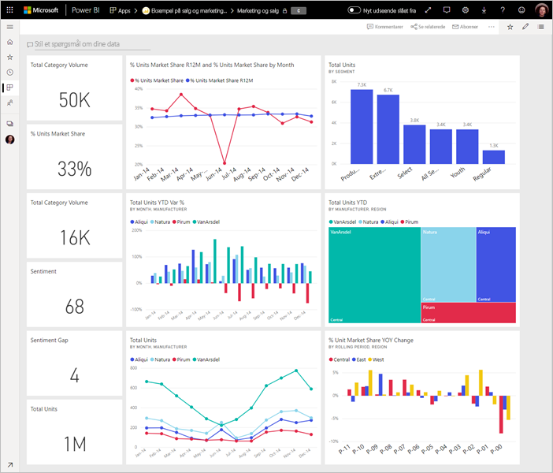

# Tips til udformning af et fantastisk Power BI-dashboard
Nu, hvor du har oprettet et dashboard og tilføjet nogle felter, kan du overveje, hvordan du ikke bare gør dit dashboard flot, men også funktionelt. Generelt betyder det, at man skal få de vigtigste oplysninger til at skille sig ud og gør dem tydelige og ikke rodet.

> [!TIP]
> Kan du lide dette dashboard? Du kan downloade dét og relaterede rapporter fra AppSource. Gå til **Hent data** > **Tjenester**. Søg efter **Microsoft Sample - Sales & Marketing** > **Hent det nu**.

Her er nogle få tip til dashboards.

## Video om bedste praksis for dashboarddesign

Se videoen [Bedste praksis for dashboarddesign i Power BI](https://www.youtube.com/watch?v=-tdkUYrzrio), og få designtip fra Marco Russo fra SQLBI.com.

## Tænk over din målgruppe
Hvad er de vigtigste målepunkter, der kan hjælpe dem med at træffe beslutninger? Hvordan vil dashboardet blive brugt? Hvilke indlærte eller kulturelle forudsætninger kan påvirke designvalg? Hvilke oplysninger skal modtageren bruge for at få succes?

Husk, at et dashboard er en oversigt – et samlet sted, hvor du kan se dataenes aktuelle tilstand. Dashboardet er baseret på underliggende rapporter og datasæt, og de indeholder ofte mange detaljer. Dine læsere kan analysere rapporterne fra dit dashboard. Du skal derfor ikke placere detaljerne på dashboardet, medmindre det er det, dine læsere skal overvåge.

Hvor skal dashboardet vises? Hvis det skal vises på en større skærm, kan du placere mere indhold på det. Men hvis læserne får det vist på deres tablets, er et dashboard med færre felter nemmere at læse.

## Fortæl en historie på én skærm
Eftersom dashboards er beregnet til at vise vigtige oplysninger i overblik, er det bedst, at alle felterne er på samme skærmbillede. Kan du undgå rullepaneler på dit dashboard?

Er dashboardet for rodet?  Fjern alle oplysninger på nær de vigtigste, der er nemme at læse og fortolke.

## Brug fuldskærmstilstand
Når du præsenterer et dashboard, kan du vise det i [fuldskærmsvisning](consumer/end-user-focus.md) uden distraktioner.

## Beton de vigtigste oplysninger
Hvis tekst og visualiseringer på dit dashboard alle har samme størrelse, kan læserne have vanskeligt ved at fokusere på, hvad der er vigtigst. For eksempel er kortvisualiseringer en god måde at fremhæve et vigtigt tal på:  

Men husk at angive kontekst.  

Læs om [oprettelse af et felt med blot et tal](visuals/power-bi-visualization-card.md).

## Placer de vigtigste oplysninger
De fleste personer læser oppefra og ned. Det er derfor en god idé at placere det højeste niveau af data i øverste venstre hjørne og vise flere detaljer, efterhånden som du følger den retning, som modtagerne læser i (venstre mod højre, oppefra og ned).

## Brug den rigtige visualisering til dataene
Undgå at variere visualiseringerne bare for variationens skyld.  Visualiseringer skal give et overblik og være enkle at "læse" og forstå.  En enkel grafisk visualisering er nok til visse data og visualiseringer. Men andre data kan kræve en mere kompleks visualisering - brug titler og etiketter og andre brugerdefinerede hjælpemidler til at hjælpe læseren.  

* Vær forsigtig med at bruge visualiseringer, der er flotte, men som er svære at læse, f.eks. 3D-diagrammer. 
* Det er måske skuffende at finde ud af, at cirkeldiagrammer, kransediagrammer, målere og andre cirkulære diagramtyper ikke er bedste praksis for en datavisualisering. Cirkeldiagrammer er bedst, hvis de har mindre end otte kategorier. Da man ikke kan sammenligne værdier ved siden af hinanden, er det sværere at sammenligne værdier i et cirkeldiagram end i liggende og stående søjlediagrammer. Cirkeldiagrammer kan være gode til visning af dele i forhold til helheder i stedet for at sammenligne delene. Og målerdiagrammer er gode til at vise den aktuelle status i forbindelse med et mål.
* Vær konsekvent med diagramskalaer på akser, rækkefølgen af diagramdimensioner og de farver, som bruges til dimensionsværdier i diagrammer.
* Sørg for, at kode kvantitative data pænt. Brug ikke mere end tre eller fire tal ved visning af tal. Vis måleenheder for et eller to tal til venstre for decimalkommaet og skala for tusinder eller millioner, dvs. 3,4 millioner og ikke 3.400.000.
* Bland ikke præcisions- og tidsniveauer. Sørg for, at tidsrammerne forstås korrekt. Undgå at have et diagram, der har sidste måned ud for filtrerede diagrammer fra en bestemt måned i året.
* Bland ikke små og store målinger i den samme skala, f.eks. et kurvediagram eller liggende søjlediagram. En måling kan f.eks. være i millioner og en anden måling i tusinder. Med sådan en stor skala vil det være svært at se forskellene i den måling, som er i tusinder. Hvis du er nødt til at blande, skal du vælge en visualisering, som tillader brug af en akse mere.
* Fyld ikke dine diagrammer med unødvendige datamærkater. Værdierne i liggende søjlediagrammer forstås normalt uden at vise det faktiske tal.
* Vær opmærksom på, hvordan [diagrammer sorteres](consumer/end-user-change-sort.md). Hvis du vil fremhæve det højeste eller laveste tal, skal du sortere efter målingen. Hvis folk hurtigt skal kunne finde en bestemt kategori blandt mange andre kategorier, skal du sortere efter aksen.  

Se [Visualiseringstyper i Power BI](visuals/power-bi-visualization-types-for-reports-and-q-and-a.md) for at få en mere visualiseringsspecifik vejledning.  

## Få mere at vide om dashboarddesign
For at kunne mestre kunsten at lave et godt dashboard-design bør du overveje at lære de grundlæggende designprincipper for visuel perception, og hvordan du tydeligt kommunikerer handlingsrettet information i kontekst. Heldigvis findes der allerede et bredt udvalg af ressourcer bl.a. rundt omkring på vores blogs. Nogle få af vores foretrukne bøger er bl.a.:

* *Information Dashboard Design* af Stephen Few  
* *Show Me the Numbers* af Stephen Few  
* *Now You See It* af Stephen Few  
* *Envisioning Information* af Edward Tufte  
* *Advanced Presentations* by Design af Andrew Abela   

## De næste trin
[Opret et dashboard fra en rapport](service-dashboard-create.md)  
[Grundlæggende begreber for designere i Power BI-tjenesten](service-basic-concepts.md)  
Har du flere spørgsmål? [Prøv at spørge Power BI-community'et](https://community.powerbi.com/)
