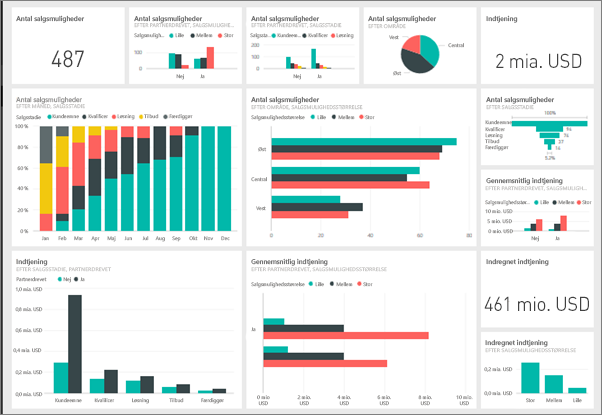
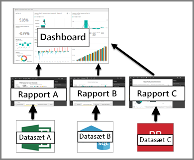

# Dashboards i Power BI-tjenesten

Et Power BI-***dashboard*** er en enkelt side, der ofte kaldes et canvas, hvor der bruges visualiseringer til at fortælle en historie. Da det er begrænset til én side, indeholder et dashboard, der er godt designet, kun de vigtigste elementer fra historien.

Dashboards er en funktion i Power BI-tjenesten og er ikke tilgængelig i Power BI Desktop. Der kan ikke oprettes dashboards på mobilenheder, men du kan [få dem vist og dele dem](mobile-apps-view-dashboard.md).

## Dashboardforfattere og dashboardbrugere
Afhængigt af din rolle kan du være en person, der opretter dashboards til egen brug eller til at dele med kolleger. Oplysninger til dig kan findes under **Dashboards til oprettere**. Hvis du modtager dashboards fra andre. Du vil måske lære, hvordan du forstår og interagerer med dashboardet. Denne artikel er til dig!

### Hvis du skal modtage og bruge dashboards

De visualiseringer, du kan se på dashboardet, kaldes *felter* og er *fastgjort* til dashboardet fra rapporter af dashboard*oprettere*. Hvis du ikke har arbejdet med Power BI før, kan du få et godt overblik ved at læse [Power BI – Grundlæggende begreber](service-basic-concepts.md).

> [!IMPORTANT]
> [Power BI Pro](service-free-vs-pro.md) er påkrævet for at få vist et delt dashboard.

Visualiseringerne på et dashboard stammer fra rapporter, og hver rapport er baseret på et datasæt. Du kan faktisk opfatte et dashboard som en måde at få adgang til underliggende rapporter og datasæt på. Når du vælger en visualisering, bliver du ført til den rapport (og det datasæt), der blev brugt til at oprette den.

## Fordele ved dashboards
Dashboards er en fantastisk måde at holde øje med din virksomhed, søge efter svar og se dine vigtigste data i korte træk på. Visualiseringer på et dashboard kan stamme fra ét underliggende datasæt eller mange og fra én underliggende rapport eller mange. Et dashboard kombinerer data i det lokale miljø og cloudmiljøet, hvilket giver dig en samlet visning, uanset hvor dataene er gemt.

Et dashboard er ikke kun et flot billede. Det er yderst interaktivt og felterne opdateres, når de underliggende data ændres.

## Dashboards sammenlignet med rapporter
[Rapporter](service-reports.md) forveksles ofte med dashboards, da de også er canvasser med visualiseringer. Men der er nogle store forskelle for Power BI-forbrugerne.

| **Egenskab** | **Dashboards** | **Rapporter** |
| --- | --- | --- |
| Sider |Én side |Én eller flere sider |
| Datakilder |Én eller flere rapporter og et eller flere datasæt pr. dashboard |Et enkelt datasæt pr. rapport |
| Tilgængelig i Power BI Desktop |Nej |Ja, ***oprettere*** kan bygge og få vist rapporter i Desktop |
| Abonner |Der kan abonneres på et dashboard |Der kan abonneres på rapportsider |
| Filtrering |Der kan ikke filtreres eller laves udsnit |Der er mange forskellige måder at filtrere, fremhæve og lave udsnit på |
| Fremhævet |Ét dashboard kan angives som dit "udvalgte" dashboard |Der kan ikke oprettes en udvalgt rapport |
| Favorit | Dashboards kan markeres som *favoritter* | Rapporter kan markeres som *favoritter*
| Angivelse af beskeder |Tilgængelig for dashboardfelter i visse tilfælde |Ikke tilgængelig via rapporter |
| Forespørgsler på et naturligt sprog |Tilgængelig via dashboard |Ikke tilgængelig via rapporter |
| Kan underliggende datasættabeller og felter ses? |Nej. Data kan eksporteres, men tabeller og felter på selve dashboardet kan ikke ses. |Ja. Datasættabeller, felter og værdier kan ses. |
| Tilpasning |Nej |I Læsevisning kan du publicere, integrere, filtrere, eksportere, downloade som .pbix, få vist relateret indhold, generere QR-koder og analysere i Excel m.m.  |

## Næste trin
* Bliv fortrolig med dashboards ved at se præsentationen af et af vores [eksempler på et dashboard](sample-tutorial-connect-to-the-samples.md).
* Få mere at vide om [dashboardfelter](service-dashboard-tiles.md), og hvad der sker, når du vælger et.
* Vil du holde øje med et enkelt dashboardfelt og modtage en mail, når den når en bestemt grænse? [Opret beskeder for felterne](service-set-data-alerts.md).
* Stil spørgsmål om dit dashboard. Få mere at vide om, hvordan du bruger [Spørgsmål og svar i Power BI](power-bi-tutorial-q-and-a.md) til at stille et spørgsmål om dine data og få svar i form af en visualisering.
