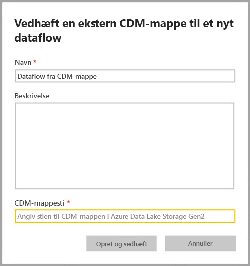
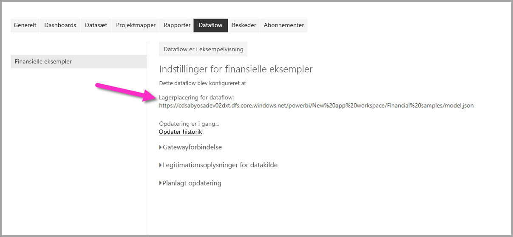

# Føj en CDM-mappe til Power BI som et dataflow (eksempelvisning)

I Power BI kan du tilføje CEM-mapper (Common Data Model), der er gemt i organisationens Azure Data Lake Store Gen2 som dataflow. Når du opretter et dataflow fra en CDM-mappe, kan du bruge **Power BI Desktop** og **Power BI-tjenesten** til at oprette datasæt, rapporter, dashboards og apps, der er baseret på de data, som du placerer i CDM-mapper.

Der er et par krav til oprettelse af dataflow fra CDM-mapper, som beskrevet på følgende liste:

* En administrator skal knytte ADLS Gen2-lagerkontoen i Power BI, før den kan bruges. Se [Opret forbindelse til Azure Data Lake Storage Gen2 til dataflowlager](service-dataflows-connect-azure-data-lake-storage-gen2.md) for at få mere at vide om, hvordan du knytter en ADLS Gen2-konto til Power BI.
* Oprettelse af dataflow fra CDM-mapper er *kun* tilgængeligt i den [nye arbejdsområdeoplevelse](service-create-the-new-workspaces.md). 
* Tilføjelse af en CDM-mappe til Power BI kræver, at brugeren, der tilføjer mappen, skal have [autorisationer til CDM-mappen og dens filer](https://go.microsoft.com/fwlink/?linkid=2029121).
* Du skal være tildelt læse- og kørselstilladelser til alle filer og mapper i CDM-mappen for at føje dem til Power BI.

I følgende afsnit beskrives, hvordan du opretter et dataflow fra en CDM-mappe.

## Godkendelse af brugere til CDM-mapper i forbindelse med oprettelse af et dataflow

Hvis du vil oprette et dataflow fra en CDM-mappe, skal følgende tilladelser tilføjes:
* Den bruger, der skal have adgang til CDM-mappen via Power BI, skal være angivet under rollen **Storage Blob-dataejer** for lagerkontoen.
* Den bruger, der skal have adgang til mappen CDM via Power BI, skal have **læseadgang** og **kørselsadgang** til adgangskontrollisterne både for selve CDM-mappen og de filer eller mapper, den indeholder. 

## Opret et dataflow fra en CDM-mappe

Du kommer i gang med at oprette et dataflow fra en CDM-mappe ved at starte **Power BI-tjenesten** og vælge et **arbejdsområde** i navigationsruden. Du kan også oprette et nyt arbejdsområde, hvor du kan oprette dit nye dataflow.

På den viste skærm skal du vælge at **oprette og tilknytte** som vist på følgende billede.

På det skærmbillede, der derefter vises, kan du navngive dit dataflow, angive en beskrivelse af dataflowet og angive stien til CDM-mappen i organisationens Azure Data Lake Gen2-konto. Læs afsnittet i den artikel, der beskriver [hvordan du finder stien til CDM-mappen](service-dataflows-configure-workspace-storage-settings.md#get-the-uri-of-stored-dataflow-files). 

Når du har angivet oplysningerne, skal du vælge **Opret og tilknyt** for at oprette dataflowet.

Dataflow fra CDM-mapper er markeret med ikonet *ekstern*, når det vises i Power BI. I næste afsnit beskriver vi forskellene mellem standarddataflow og dataflow, der er oprettet ud fra CDM-mapper.

Når tilladelser er angivet korrekt, som beskrevet tidligere i denne artikel, kan du oprette forbindelse til dit dataflow i **Power BI Desktop**.

## Overvejelser og begrænsninger

Når du arbejder med tilladelser til et dataflow, der er oprettet ud fra en CDM-mappe, er processen den samme som for eksterne datakilder i Power BI. Tilladelserne administreres i datakilden og ikke i Power BI. Tilladelser skal være angivet korrekt i selve datakilden, f.eks. som et dataflow, der er oprettet ud fra en CDM-mappe, for at kunne fungere korrekt med Power BI.

Følgende lister hjælper med at tydeliggøre, hvordan dataflow fra CDM-mapper fungerer med Power BI.

Arbejdsområderne Power BI Pro, Premium og Embedded:
* Dataflow fra CDM-mapper kan ikke redigeres
* Tilladelser til at læse et dataflow, der er oprettet ud fra en CDM-mappe administreres af ejeren af CDM-mappen og ikke af Power BI

Power BI Desktop:
* Det er kun brugere, der har tilladelse til både det arbejdsområde, hvor dataflowet blev oprettet, og CDM-mappen, der kan få adgang til data fra Power BI Dataflow-connectoren

På følgende liste er der beskrevet nogle yderligere overvejelser:

* Oprettelse af dataflow fra CDM-mapper er *kun* tilgængelig i den [nye arbejdsområdeoplevelse](service-create-the-new-workspaces.md)
* Linkede objekter er ikke tilgængelige for dataflow, der er oprettet via CDM-mapper

**Power BI Desktop**-kunderne kan ikke få adgang til dataflow, der er gemt under Azure Data Lake Storage Gen2-kontoen, medmindre de er ejer af dataflowet, eller de udtrykkeligt er godkendt til dataflowets CDM-mappe. Overvej følgende situation:

1.    Anna opretter et nyt arbejdsområde og konfigurerer det til at gemme dataflow fra en CDM-mappe.
2.    Ben, der også er medlem af det arbejdsområde, Anna har oprettet, vil gerne bruge Power BI Desktop og dataflowconnectoren til at hente data fra det dataflow, Anna har oprettet.
3.    Ben får vist en fejl, da han ikke er føjet til dataflowets CDM-mappe som en godkendt bruger i datasøen.

  

Problemet kan løses ved, at Ben tildeles læsetilladelser til CDM-mappen og dens filer. Du kan få mere at vide om, hvordan du give adgang til CDM-mappen i [denne artikel](https://go.microsoft.com/fwlink/?linkid=2029121).

## Næste trin

I denne artikel får du vejledning i, hvordan du konfigurerer arbejdsområdelager til dataflow. Du kan finde flere oplysninger i følgende artikler:

Du kan finde flere oplysninger om dataflow, CDM og Azure Data Lake Storage Gen2 i følgende artikler:

* [Integration af dataflow og Azure Data Lake (prøveversion)](service-dataflows-azure-data-lake-integration.md)
* [Konfigurer indstillinger for dataflow for arbejdsområde (eksempelvisning)](service-dataflows-configure-workspace-storage-settings.md)
* [Opret forbindelse til Azure Data Lake Storage Gen2 til dataflowlager (eksempelvisning)](service-dataflows-connect-azure-data-lake-storage-gen2.md)

Du kan finde generelle oplysninger om dataflow i disse artikler:

* [Opret og brug dataflow i Power BI](service-dataflows-create-use.md)
* [Brug af beregnede objekter i Power BI Premium](service-dataflows-computed-entities-premium.md)
* [Brug af dataflow med datakilder i det lokale miljø](service-dataflows-on-premises-gateways.md)
* [Udviklerressourcer til Power BI-dataflow](service-dataflows-developer-resources.md)

Du kan finde flere oplysninger om Azure-lager i disse artikler:
* [Sikkerhedsvejledning til Azure Storage](https://docs.microsoft.com/azure/storage/common/storage-security-guide)
* [Konfiguration af planlagt opdatering](refresh-scheduled-refresh.md)
* [Kom i gang med Github-eksempler fra Azure Data Services](https://aka.ms/cdmadstutorial)

Du kan finde flere oplysninger om Common Data Model i denne oversigtsartikel:
* [Common Data Model – oversigt](https://docs.microsoft.com/powerapps/common-data-model/overview)
* [CDM-mapper](https://go.microsoft.com/fwlink/?linkid=2045304)
* [Fildefinition af CDM-model](https://go.microsoft.com/fwlink/?linkid=2045521)

Du kan altid prøve [at stille spørgsmål i Power BI-community'et](https://community.powerbi.com/).

