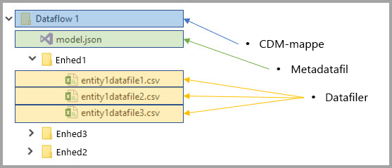

# Integration af dataflow og Azure Data Lake (prøveversion)

Som standard gemmes data, der bruges med Power BI, i et internt lager, der leveres af Power BI. Med integrationen af dataflow og Azure Data Lake Storage Gen2 (ADLS Gen2) kan du gemme dine dataflow på din organisations Azure Data Lake Storage Gen2-konto. 

> [!NOTE]
> Dataflowfunktionaliteten er tilgængelig som en prøveversion og kan ændres og opdateres, før den bliver offentligt tilgængelig.

## Sådan er CDM-mapper relateret til dataflow

Med **dataflow** kan brugere og organisationer samle data fra forskellige kilder og forberede dem til udformning. Med CDM (Common Data Model) kan organisationer bruge et dataformat, der giver semantisk ensartethed på tværs af applikationer og udrulninger. Og med Azure Data Lake Storage Gen2 (ADLS Gen2) kan der anvendes detaljeret styring af adgang og godkendelse for data lakes i Azure. Når de kombineres, giver disse elementer overbevisende centraliserede data, strukturerede data, detaljeret styring af adgang og semantisk ensartethed for apps og tiltag på tværs af virksomheden.

Data, der er gemt i CDM-format, giver semantisk ensartethed på tværs af programmer og udrulninger i en organisation. Med CDM-integration med ADLS Gen2 kan den samme strukturelle ensartethed og semantiske betydning anvendes for data, der er gemt i ADLS Gen2, ved hjælp af CDM-mapper, som indeholder skematiserede data i CDM-standardformat. Standardiserede metadata og selv-beskrivende data i en Azure Data Lake faciliterer nemt metadata og samarbejde mellem dataproducenter og forbrugere, f.eks. Power BI, Azure Data Factory, Azure Data Lake, Databricks og Azure Machine Learning (ML). 

Dataflow gemmer deres definitioner og data i CDM-mapper i følgende formater:

**Model.json**
* Filen med medatabeskrivelsen af **Model.json** indeholder semantiske oplysninger om objektposter og -attributter samt links til de underliggende datafiler. Eksistensen af filen model.json angiver overholdelse af angivne standarder med CDM-metadataformatet og kan omfatte standardobjekter, der har yderligere omfattende, semantiske metadata, der ikke leveres med Windows, som applikationerne kan bruge.
* Power BI gemmer også oplysninger om hver datakilde sammen med den **forespørgsel og de transformationer**, som genereres af Dataflow Editor-oplevelsen i Power BI-tjenesten. Adgangskoder til datakilder gemmes ikke i modelfilen.

**Datafiler**
* Datafilerne er inkluderet i CDM-mappen i en veldefineret struktur og et veldefineret format (undermapper er valgfri, som beskrevet senere i denne artikel), som der refereres til i filen model.json. I øjeblikket skal datafiler være i .csv-format, men yderligere formater understøttes muligvis i efterfølgende opdateringer. 

I følgende diagram kan du se et eksempel på en CDM-mappe, der er oprettet af et Power BI dataflow, som indeholder tre objekter:

Model.json eller metadatafilen på det forrige billede giver markører til objektdatafilerne i hele CDM-mappen.

## Power BI organiserer CDM-mapper i en data lake

Med Power BI-dataflow og den tilhørende integration med ADLS Gen2 kan Power BI producere data i den pågældende data lake. Som dataproducent skal Power BI oprette en CDM-mappe for hvert dataflow, der indeholder filen model.json og dens tilknyttede datafiler. Power BI gemmer sine data isoleret fra andre dataproducenter i den pågældende data lake ved hjælp af *filsystemer*. Du kan læse mere om Azure Data Lake Storage Gen2-filsystemer og hierarkiske navneområder i [artiklen, der beskriver dem](https://docs.microsoft.com/azure/storage/data-lake-storage/namespace).

Power BI bruger undermapper til fjernelse af flertydige udtryk og til at levere forbedret organisering af data, når de vises i **Power BI-tjenesten**. Navngivningen og strukturen af mapper repræsenterer arbejdsområder (mapper) og dataflow (CDM-mapper). I følgende diagram kan du se, hvordan en data lake, der deles af Power BI og andre dataproducenter, kan struktureres. Hver tjeneste, i dette tilfælde Dynamics 365, Dynamics for Finance and Operation og Power BI, opretter og vedligeholder deres eget filsystem. Afhængigt af oplevelsen i hver enkelt tjeneste oprettes der undermapper for bedre at organisere CDM-mapper i filsystemet. 

## Power BI beskytter data i den pågældende data lake

Power BI bruger *Active Directory OAuth Bearer*-tokens og funktionaliteten *POSIX ACL'er*, der leveres af Azure Data Lake Storage Gen2. Disse funktioner muliggør styring af Power BIs adgang til det filsystem, det administrerer i den pågældende data lake, og styring af andre personers adgang til kun at gælde de dataflow eller CDM-mapper, de opretter. 

Der kræves tilladelser af typen Læs, Skriv og Udfør for at oprette og administrere CDM-mapper i Power BI-filsystemet. Hvert dataflow, der oprettes i Power BI, gemmes i sin egen CDM-mappe, og ejeren af dataflowet er tildelt skrivebeskyttet adgang til CDM-mappen og dens indhold. Denne fremgangsmåde beskytter integriteten af de data, Power BI genererer, og giver administratorer mulighed for at overvåge, hvilke brugere der har tilgået CDM-mappen, ved hjælp af overvågningslogge. 

### Godkendelse af brugere eller tjenester til CDM-mapper

Deling af CDM-mapper med dataforbrugere, f.eks. brugere eller tjenester, der har brug for at læse dataene, forenkles med Active Directory OAuth Bearer-tokens og POSIX ACL'er. Dermed får administratorer mulighed for at overvåge, hvem der har tilgået CDM-mappen. Den eneste påkrævede handling er at give et Active Directory-objekt efter eget valg (f.eks. en brugergruppe eller tjeneste) adgang til CDM-mappen. Vi anbefaler, at al adgang til CDM-mappen for en hvilken som helst anden identitet end dataproducenten tildeles som skrivebeskyttet. Hvis du gør det, beskyttes integriteten af de data, som producenten genererer.

For at føje CDM-mapper til Power BI skal den bruger, der tilføjer CDM-mappen, have adgangen *Læs* til adgangskontrollisterne for både selve CDM-mappen og alle filer eller mapper i den. Desuden skal brugeren have adgangen *Udfør* for adgangskontrollisterne for både selve CDM-mappen og alle mapper i den. Det anbefales, at du gennemgår både artiklen [Adgangskontrollister for filer og mapper](https://docs.microsoft.com/azure/storage/blobs/data-lake-storage-access-control#access-control-lists-on-files-and-directories) og artiklen [Bedste praksis for brug af Azure Data Lake Storage Gen2](https://docs.microsoft.com/azure/storage/blobs/data-lake-storage-best-practices) for at få flere oplysninger.

### Alternative former for godkendelse

Personer eller tjenester uden for Power BI kan også gøre brug af alternative former for godkendelse. Disse alternativer giver indehavere af hovedadgangen mulighed for at få adgang til *alle* ressourcer på kontoen og fuld adgang til alle ressourcer i den pågældende lake, og de kan ikke være begrænset til filsystemer eller CDM-mapper. Disse alternativer kan være enkle måder at give adgang på, men de begrænser muligheden for at dele specifikke ressourcer i den pågældende data lake og giver ikke brugerne mulighed for at overvåge, hvem der har tilgået lageret. Du kan se en komplet liste over tilgængelige godkendelsesmetoder i [artiklen Adgangskontrol i Azure Data Lake Storage Gen2](https://docs.microsoft.com/azure/storage/blobs/data-lake-storage-access-control
).

## Næste trin

Denne artikel indeholdt en oversigt over integration af Power BI-dataflow, CDM-mapper og Azure Data Lake Storage Gen2. Du kan finde flere oplysninger i følgende artikler:

Du kan finde flere oplysninger om dataflow, CDM og Azure Data Lake Storage Gen2 i følgende artikler:

* [Konfigurer indstillinger for dataflow for et arbejdsområde (prøveversion)](service-dataflows-configure-workspace-storage-settings.md)
* [Føj en CDM-mappe til Power BI som et dataflow (prøveversion)](service-dataflows-add-cdm-folder.md)
* [Slut Azure Data Lake Storage Gen2 til et dataflowlager (prøveversion)](service-dataflows-connect-azure-data-lake-storage-gen2.md)

Du kan finde generelle oplysninger om dataflow i disse artikler:

* [Opret og brug dataflow i Power BI](service-dataflows-create-use.md)
* [Brug beregnede objekter i Power BI Premium (prøveversion)](service-dataflows-computed-entities-premium.md)
* [Brug dataflow med datakilder i det lokale miljø (prøveversion)](service-dataflows-on-premises-gateways.md)
* [Udviklerressourcer til Power BI-dataflow (prøveversion)](service-dataflows-developer-resources.md)

Du kan finde flere oplysninger om Azure-lager i disse artikler:
* [Sikkerhedsvejledning til Azure Storage](https://docs.microsoft.com/azure/storage/common/storage-security-guide)
* [Kom i gang med Github-eksempler fra Azure Data Services](https://aka.ms/cdmadstutorial)

Du kan finde flere oplysninger om Common Data Model i denne oversigtsartikel:
* [Common Data Model – oversigt](https://docs.microsoft.com/powerapps/common-data-model/overview)
* [CDM-mapper](https://go.microsoft.com/fwlink/?linkid=2045304)
* [Fildefinition af CDM-model](https://go.microsoft.com/fwlink/?linkid=2045521)

Du kan altid prøve [at stille spørgsmål i Power BI-community'et](http://community.powerbi.com/).
