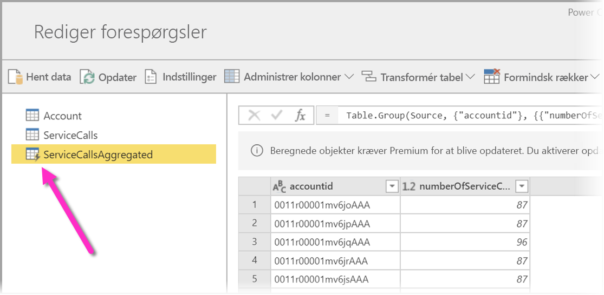
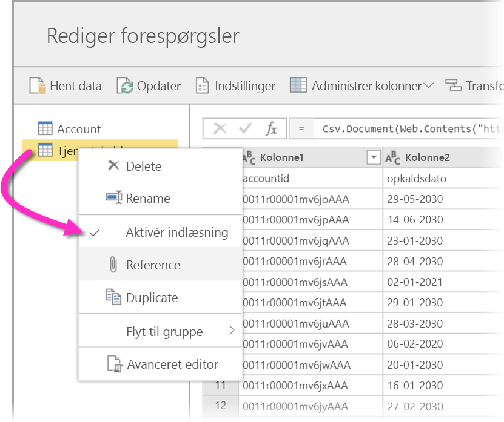

# Brug af beregnede objekter i Power BI Premium (prøveversion)

Du kan udføre **i lager-beregninger**, når du bruger **dataflow** vha. et Power BI Premium-abonnement. Dermed kan du udføre beregninger af dine eksisterende dataflow og få resultater, der giver dig mulighed for at fokusere på oprettelse af rapporter og analyser. 

Hvis du vil udføre **i lager-beregninger**, skal du først oprette dataflowet og hente data ind i det pågældende Power BI-dataflowlager. Når du har et dataflow, der indeholder data, kan du oprette **beregnede objekter**, som er objekter, der udfører i lager-beregninger. 

Der er to måder, du kan oprette forbindelse mellem dataflowdata og Power BI på:

* [Brug af oprettelse af et dataflow vha. selvbetjening](service-dataflows-create-use.md)
* Brug af et eksternt dataflow

I følgende afsnit beskrives, hvordan du kan oprette beregnede objekter for dine dataflowdata.

> [!NOTE]
> Dataflowfunktionaliteten er tilgængelig som prøveversion og kan ændres og opdateres, før den bliver generelt tilgængelig.

## Sådan opretter du beregnede objekter 

Når du har et dataflow med en liste over objekter, kan du udføre beregninger af disse objekter.

I værktøjet til oprettelse af dataflow i Power BI-tjenesten skal du vælge **Rediger objekter**, derefter højreklikke på det objekt, du vil bruge som udgangspunkt for dit beregnede objekt, og som du vil udføre beregninger af. I genvejsmenuen skal du vælge **Reference**.

Du skal markere indstillingen **Aktivér indlæsning**, som vist på nedenstående billede, for at objektet kan vælges som beregnet objekt. Højreklik på objektet for at få vist denne genvejsmenu.

Når du markerer **Aktivér indlæsning**, opretter du et nyt objekt, hvor kilden er det refererede objekt. Ikonet ændres, og ikonet **beregnet** vises, som det fremgår af følgende billede.

Alle de transformationer, du udfører i forbindelse med det nyligt oprettede objekt, køres vha. de data, der allerede findes i Power BI-dataflowlageret. Det betyder, at forespørgslen ikke køres i forhold til den eksterne datakilde, som dataene blev importeret fra (f.eks. den SQL-database, dataene blev hentet fra), men i stedet udføres på de data, der er placeret i dataflowlageret.

### Eksempler på use cases
Hvilken type transformationer kan udføres vha. beregnede objekter? Alle transformationer, du normalt angiver vha. transformationsbrugergrænsefladen i Power BI eller M-editoren, understøttes, når du udfører i lager-beregninger. 

Se følgende eksempel: Du har et *Account*-objekt, der indeholder rådata for alle kunderne fra dit Dynamics 365-abonnement. Du har også rådata om *ServiceCalls* fra Service Center med data fra supportopkald, der blev udført fra den anden konto hver dag hele året.

Forestil dig, at du vil forbedre *Account*-objektet med data fra disse *ServiceCalls*. 

Først skal du samle dataene fra ServiceCalls for at beregne antallet af supportopkald, der blev udført for hver konto i det seneste år. 

Derefter vil du flette *Account*-objektet med *ServiceCallsAggregated*-objektet for at beregne den forbedrede **Account**-tabel.

Derefter kan du se resultaterne, der vises som *EnrichedAccount* på følgende billede.

Og det er det – transformationen er udført vha. dataene i det dataflow, der er placeret i dit Power BI Premium-abonnement, og ikke på kildedataene.

## Overvejelser og begrænsninger

Det er vigtigt at bemærke, at hvis du fjerner arbejdsområdet fra Power BI Premium-kapaciteten, opdateres det tilknyttede dataflow ikke længere. 

## Næste trin

I denne artikel beskrives beregnede objekter og dataflow, der er tilgængelige i Power BI-tjenesten. Her er nogle flere artikler, der kan være nyttige.

* [Selvbetjent dataforberedelse med dataflow](service-dataflows-overview.md)
* [Opret og brug dataflow i Power BI](service-dataflows-create-use.md)
* [Brug af dataflow med datakilder i det lokale miljø (prøveversion)](service-dataflows-on-premises-gateways.md)
* [Udviklerressourcer til Power BI-dataflow (prøveversion)](service-dataflows-developer-resources.md)

Du kan finde flere oplysninger om Power-forespørgsel og planlagt opdatering i disse artikler:
* [Oversigt over forespørgsler i Power BI Desktop](desktop-query-overview.md)
* [Konfiguration af planlagt opdatering](refresh-scheduled-refresh.md)

Du kan finde flere oplysninger om Common Data Model i denne oversigtsartikel:
* [Common Data Model – oversigt](https://docs.microsoft.com/powerapps/common-data-model/overview)

