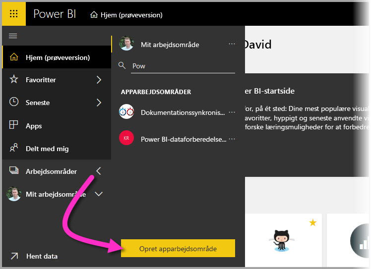
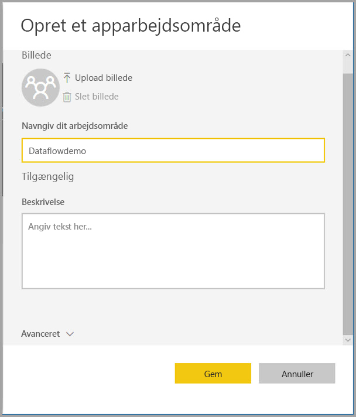
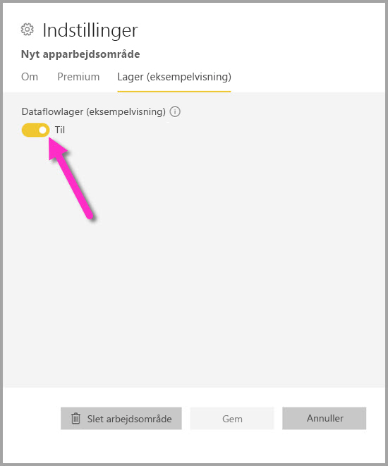

# Konfigurer indstillinger for dataflow for arbejdsområder (prøveversion)

Med Power BI og dataflow kan du gemme definitionsfilen og datafiler for et dataflow for et arbejdsområde på din Azure Data Lake Storage Gen2-konto. Administratorer af arbejdsområder kan konfigurere Power BI til dette, og i denne artikel gennemgås de trin, der er nødvendige for at komme dertil. 

Før du kan konfigurere lagringsplaceringen for dataflowet for et arbejdsområde, skal dit firmas globale administrator slutte din organisations lagerkonto til Power BI og aktivere tilladelser til tildeling af lager for den pågældende lagerkonto. *[Opret forbindelse til Azure Data Lake Storage Gen2 for dataflowlager (prøveversion)](service-dataflows-connect-azure-data-lake-storage-gen2.md)* 

Der er to måder at konfigurere lagerindstillinger for dataflow for arbejdsområder på: 

* Under oprettelsen af arbejdsområdet
* Ved at redigere et eksisterende arbejdsområde

I følgende afsnit gennemgås begge. 

> [!IMPORTANT]
> Lagerindstillingen for dataflow for arbejdsområder kan kun ændres, hvis arbejdsområdet ikke indeholder nogen dataflow. Denne funktion er desuden kun tilgængelig i forbindelse med nye arbejdsområder. Du kan få mere at vide om nye arbejdsområder i artiklen [Opret nye arbejdsområder (prøveversion) i Power BI](service-create-the-new-workspaces.md).

## Opret et nyt arbejdsområde, og konfigurer dets dataflowlager

Hvis du vil oprette et nyt arbejdsområde i Power BI-tjenesten, skal du vælge **Arbejdsområder > Opret arbejdsområde**.

I dialogboksen Opret et arbejdsområde, vises der muligvis et gult felt med titlen **Prøveversion af forbedrede arbejdsområder**. I dette område skal du vælge **Prøv nu**.

I den viste dialogboks kan du give din nyt arbejdsområde et entydigt navn. Vælg ikke **Gem** endnu, da du skal foretage avancerede indstillinger.

Udvid derefter området **Avanceret** i dialogboksen **Opret et arbejdsområde**, hvor du kan slå indstillingen **Dataflowlager (prøveversion)** til.

Vælg **Gem** for at oprette det nye arbejdsområde. Alle nye dataflow, der oprettes i dette arbejdsområde, gemmer nu sin definitionsfil (filen Model.json) og sine data på din organisations Azure Data Lake Storage Gen2-konto. 

## Opdater dataflowlageret for et eksisterende arbejdsområde

Et alternativ til at oprette et nyt arbejdsområde er, at du kan opdatere et eksisterende arbejdsområde til at gemme definitionsfilen og data på din organisations Azure Data Lake Storage Gen2-konto. Husk, at lagerindstillingen for dataflowet kun kan ændres, hvis arbejdsområdet ikke indeholder nogen dataflow.

Du redigerer et arbejdsområde ved at vælge ellipsen **(...)** og derefter vælge **Rediger arbejdsområde**. 

I vinduet **Rediger arbejdsområde**, der vises, skal du udvide **Avanceret** og derefter angive indstillingen **Dataflowlager (prøveversion)** til **Til**. 

Vælg derefter **Gem**. Alle nye dataflow, der oprettes i dette arbejdsområde, gemmer nu sin definitionsfil og sine data på din organisations Azure Data Lake Storage Gen2-konto.

## Få URI'en for gemte dataflowfiler

Når du opretter et dataflow i et arbejdsområde, der er tildelt din organisations Azure Data Lake-konto, kan du få adgang til dets definitions- og datafiler direkte. Deres placering er tilgængelig på siden **Indstillinger for dataflow**. Du kommer dertil ved at følge disse trin:

Vælg ellipsen **(...)** ud for et dataflow, der er angivet under **Dataflows** i arbejdsområdet. Vælg **Indstillinger** i den viste menu.

I de viste oplysninger kan du se placeringen af dataflowets CDM-mappe under **Lagringsplacering for dataflow**, som vist på følgende billede.

> [!NOTE]
> Power BI konfigurerer tilladelser for ejeren af dataflowet, så vedkommende har læsertilladelser til den CDM-mappe, hvor dataflowfilerne gemmes. Hvis andre personer eller tjenester skal have adgang til lagringsplaceringen for dataflowet, skal ejeren af lagerkontoen give adgang i Azure.

## Overvejelser og begrænsninger

Visse dataflowfunktioner understøttes ikke, når dataflowlageret er i Azure Data Lake Storage Gen2: 

Arbejdsområderne Power BI Pro, Premium og Embedded:
* Funktionen **Tilknyttede elementer** understøttes kun blandt arbejdsområder på samme lagerkonto
* Tilladelser for arbejdsområdet gælder ikke for dataflow, der er gemt i Azure Data Lake Storage Gen2. Det er kun ejeren af dataflowet, der kan få adgang til det.
* Ellers er alle funktioner til forberedelse af data de samme som for dataflow, der er gemt i Power BI-lageret

På følgende liste er der beskrevet nogle yderligere overvejelser:

* Når lagringsplaceringen for et dataflow er konfigureret, kan den ikke ændres.
* Det er kun ejeren af et dataflow, der er gemt i Azure Data Lake Storage Gen2, som kan få adgang til dataene.
* Datakilder i det lokale miljø i delte Power BI-kapaciteter understøttes ikke i dataflow, der er gemt i din organisations Azure Data Lake Storage Gen2.

**Power BI Desktop**-kunder kan ikke få adgang til dataflow, der er gemt på Azure Data Lake Storage Gen2-kontoen, medmindre de er ejeren af dataflowet. Overvej følgende situation:

1.  Anna opretter et nyt arbejdsområde og konfigurerer det til at gemme dataflow i organisationens datasø.
2.  Ben, der også er medlem af det arbejdsområde, Anna har oprettet, vil gerne bruge Power BI Desktop og dataflowconnectoren til at hente data fra det dataflow, Anna har oprettet.
3.  Ben får vist en fejl, da han ikke er føjet til dataflowets CDM-mappe som en godkendt bruger i datasøen.

    

## Næste trin

Denne artikel indeholdt en vejledning i, hvordan du konfigurerer et arbejdsområdelager til dataflow. Du kan finde flere oplysninger i følgende artikler:

Du kan finde flere oplysninger om dataflow, CDM og Azure Data Lake Storage Gen2 i følgende artikler:

* [Integration af dataflow og Azure Data Lake (prøveversion)](service-dataflows-azure-data-lake-integration.md)
* [Føj en CDM-mappe til Power BI som et dataflow (prøveversion)](service-dataflows-add-cdm-folder.md)
* [Slut Azure Data Lake Storage Gen2 til et dataflowlager (prøveversion)](service-dataflows-connect-azure-data-lake-storage-gen2.md)

Du kan finde generelle oplysninger om dataflow i disse artikler:

* [Opret og brug dataflow i Power BI](service-dataflows-create-use.md)
* [Brug beregnede objekter i Power BI Premium (prøveversion)](service-dataflows-computed-entities-premium.md)
* [Brug dataflow med datakilder i det lokale miljø (prøveversion)](service-dataflows-on-premises-gateways.md)
* [Udviklerressourcer til Power BI-dataflow (prøveversion)](service-dataflows-developer-resources.md)

Du kan finde flere oplysninger om Azure-lager i disse artikler:

* [Sikkerhedsvejledning til Azure Storage](https://docs.microsoft.com/azure/storage/common/storage-security-guide)
* [Kom i gang med Github-eksempler fra Azure Data Services](https://aka.ms/cdmadstutorial)

Du kan finde flere oplysninger om Common Data Model i denne oversigtsartikel:

* [Common Data Model – oversigt](https://docs.microsoft.com/powerapps/common-data-model/overview)
* [CDM-mapper](https://go.microsoft.com/fwlink/?linkid=2045304)
* [Fildefinition af CDM-model](https://go.microsoft.com/fwlink/?linkid=2045521)

Du kan altid prøve [at stille spørgsmål i Power BI-community'et](https://community.powerbi.com/).
