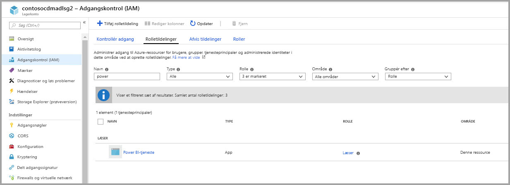
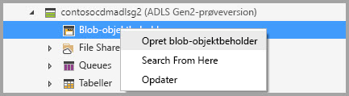
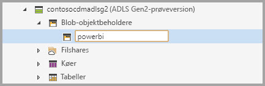
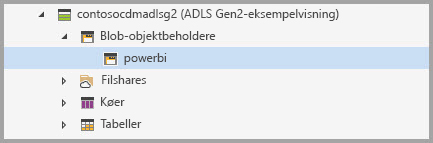
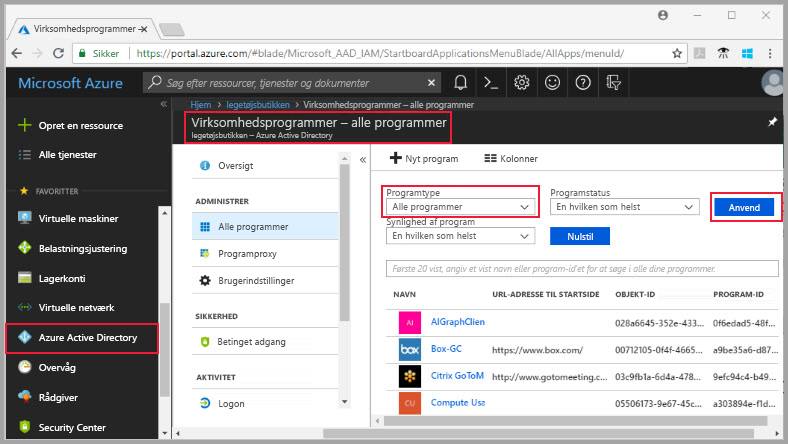
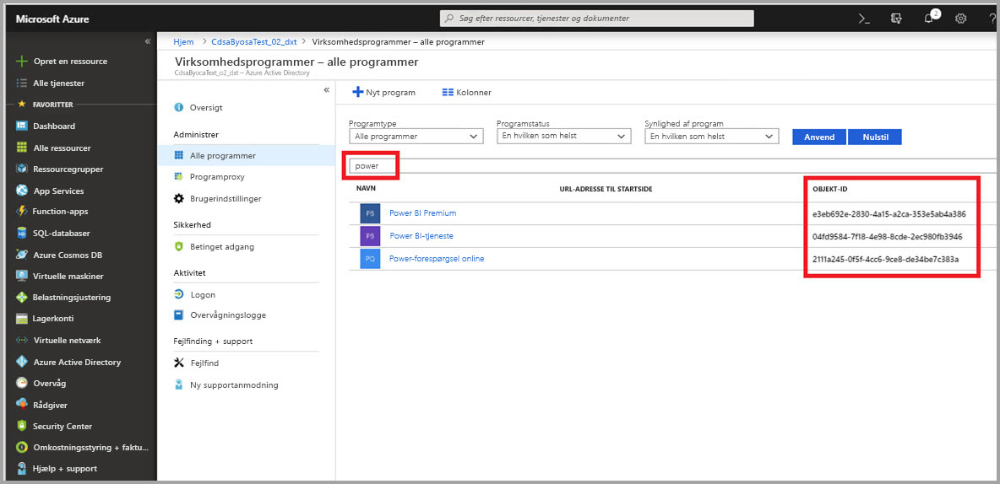
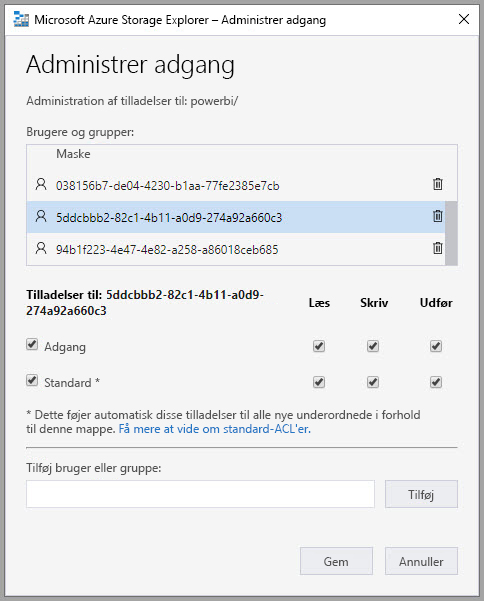
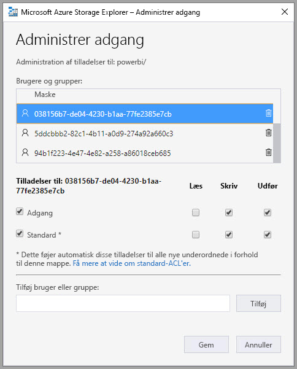
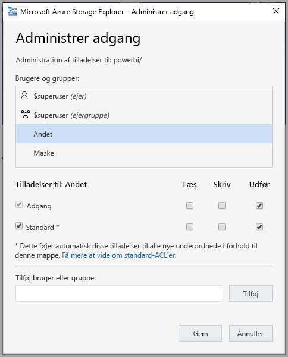

# Tilslut Azure Data Lake Storage Gen2 for at få et dataflowlager (prøveversion)

Du kan konfigurere Power BI-arbejdsområder til at gemme dataflow på din organisations Azure Data Lake Storage Gen2-konto. I denne artikel beskrives de generelle trin, der er nødvendige for at gøre det, og du får samtidigt en vejledning og bedste praksis. Der er nogle fordele ved at konfigurere arbejdsområder til at gemme definitioner og datafiler for dataflow i din data lake, herunder følgende:

* Azure Data Lake Storage Gen2 giver enormt skalerbare lagringsmuligheder for data
* Dataflowet definition data og filer kan udnyttes af din IT-afdeling for udviklerne at udnytte Data i Azure og kunstig intelligens (AI)-tjenester, som vist i den [GitHub-eksempler fra Azure-datatjenester](https://aka.ms/cdmadstutorial)
* Gør det muligt for udviklere i din organisation at integrere dataflowet data i interne programmer og line of business-løsninger, ved hjælp af udviklerressourcer til dataflows og Azure

Hvis du vil bruge Azure Data Lake Storage Gen2 til dataflow, skal du bruge følgende:

* **Power BI-lejer** – Mindst én konto i din AAD-lejer (Azure Active Directory) skal være tilmeldt Power BI
* **En global administratorkonto** – Denne konto kræves for at tilslutte og konfigurere Power BI for at gemme definition og data for dataflowet på din Azure Data Lake Storage Gen2-konto
* **Et Azure-abonnement** – Du skal have et Azure-abonnement for at bruge Azure Data Lake Storage Gen2
* **Ressourcegruppe** – Brug en eksisterende ressourcegruppe, eller opret en ny
* **En Azure Storage-konto med Data Lake Storage Gen2 funktionen er aktiveret** 

> [!TIP]
> Hvis du ikke har et Azure-abonnement, skal du oprette en [gratis konto](https://azure.microsoft.com/free/), før du begynder.

> [!WARNING]
> Når lagringsplaceringen for et dataflow er konfigureret, kan den ikke ændres. Se de [overvejelser og begrænsninger](#considerations-and-limitations) afsnit i slutningen af denne artikel for at andre elementer, der er vigtigt at overveje.

## Forbered din Azure Data Lake Storage Gen2 til Power BI

Før du kan konfigurere Power BI med en Azure Data Lake Storage Gen2-konto, skal du oprette og konfigurere en lagerkonto. Lad os se nærmere på kravene til Power BI:

1. Lagerkontoen skal oprettes i den samme AAD-lejer som din Power BI-lejer.
2. Lagerkontoen skal oprettes i det samme område som din Power BI-lejer. Du kan få hjælp til at se, hvor din Power BI-lejer er placeret, under [Hvor findes min Power BI-lejer?](service-admin-where-is-my-tenant-located.md)
3. Funktionen *Hierarkisk navneområde* skal være aktiveret for lagerkontoen.
4. Power BI-tjenesten skal tildeles en rolle af typen *Læser* på lagerkontoen.
5. Der skal oprettes et filsystem med navnet **powerbi**.
6. Power BI-tjenester skal have tilladelse til det **powerbi**-filsystem, du opretter.

I følgende afsnit finder du en detaljeret gennemgang af de trin, der er nødvendige for at konfigurere din Azure Data Lake Storage Gen2-konto.

### Opret lagerkontoen

Følg trinnene i artiklen [Opret en Azure Data Lake Storage Gen2-lagerkonto](https://docs.microsoft.com/azure/storage/blobs/data-lake-storage-quickstart-create-account).

1. Sørg for, at du vælger den samme placering som din Power BI-lejer, og angiv dit lager som **StorageV2 (Generel v2)**
2. Sørg for, at du aktiverer funktionen Hierarkisk navneområde
3. Det anbefales, at du angiver replikeringsindstillingen til **Geografisk redundant lager med læseadgang (RA-GRS)**

### Tildel en rolle af typen Læser til Power BI-tjenesten

Derefter skal du give Power BI-tjenesten en rolle af typen Læser på din oprettede lagerkonto. Det er en indbygget rolle, så trinnene er ligetil. 

Følg trinnene under [Tildel en indbygget RBAC-rolle](https://docs.microsoft.com/azure/storage/common/storage-auth-aad-rbac#assign-a-built-in-rbac-role).

I vinduet **Tilføj rolletildeling** skal du vælge rollen **Læser** og tildele den til Power BI-tjenesten. Brug derefter Søg til at finde **Power BI-tjenesten**. På følgende billeder kan du se, at rollen **Læser** er tildelt Power BI-tjenesten.

> [!NOTE]
> Tillad mindst 30 minutter, før tilladelse til at blive overført til Power BI fra portalen. Hver gang du ændrer tilladelser på portalen, giver mulighed for 30 minutter, før disse tilladelser, der afspejles i Power BI. 

### Opret et filsystem til Power BI

Du skal oprette et filsystem med *powerbi*, før din lagerkonto kan føjes til Power BI. Der er mange måder at oprette sådan et filsystem på, herunder ved hjælp af Azure Databricks, HDInsight, AZCopy eller Azure Storage Explorer. I dette afsnit kan du se en enkel måde at oprette et filsystem på ved hjælp af Azure Storage Explorer.

Til dette trin kræves det, at du installerer Azure Storage Explorer version 1.6.2 eller nyere. Hvis du vil installere Azure Storage Explorer til Windows, Linux eller Macintosh, skal du se [Azure Storage Explorer](https://azure.microsoft.com/features/storage-explorer/).

1. Når du har installeret Azure Storage Explorer, vises vinduet Microsoft Azure Storage Explorer – Opret forbindelse ved den første start. Selvom Storage Explorer giver flere måder at oprette forbindelse til lagerkonti på, er der i øjeblikket kun én måde, der understøttes, for den nødvendige konfiguration. 

2. I ruden til venstre skal du finde og udvide den lagerkonto, du oprettede tidligere.

3. Højreklik på BLOB-beholdere, og vælg Opret BLOB-beholder i kontekstmenuen.

   

4. Der vises et tekstfelt under mappen BLOB-beholdere. Angiv navnet *powerbi* 

   

5. Tryk på Enter, når du er færdig, for at oprette BLOB-beholderen

   

I næste afsnit kan du tildele serien af Power BI-tjenester fuld adgang til det filsystem, du oprettede. 

### Tildel Power BI tilladelser til filsystemet

Hvis du vil tildele tilladelser til filsystemet, anvender du indstillinger for adgangskontrolliste, som giver adgang til Power BI-tjenesten. Første trin til at gøre det er at hente Power BI-tjenestens identitet i din lejer. Du kan få vist dine AAD-programmer (Azure Active Directory) under afsnittet **Virksomhedsapps** på Azure Portal.

Du finder dine lejerprogrammer ved at følge disse trin:

1. På [Azure Portal](https://portal.azure.com/) skal du vælge **Azure Active Directory** i navigationspanelet til venstre.
2. På Azure **Active Directory**-bladet skal du vælge **Virksomhedsprogrammer**.
3. I rullemenuen **Programtype** skal du vælge **Alle programmer** og derefter vælge **Anvend**. Et eksempel på dine lejerprogrammer vises, hvilket ligner følgende billede.

    

4. Skriv *Power* i søgelinjen, så vises der en samling af objekt-id'er for programmerne Power BI og Power-forespørgsel. Du skal bruge alle tre værdier i de efterfølgende trin.  

    

5. Vælg og kopiere både objekt-id'er til Power BI-tjenesten og Power-forespørgsel online fra resultaterne af din søgning. Vær klar til at indsætte disse værdier i de efterfølgende trin.

7. Brug derefter **Azure Storage Explorer** til at navigere til det *powerbi*-filsystem, du oprettede i forrige afsnit. Følg vejledningen under afsnittet [Administration af adgang](https://docs.microsoft.com/azure/storage/blobs/data-lake-storage-how-to-set-permissions-storage-explorer#managing-access) i artiklen [Angiv tilladelser på fil- og mappeniveau ved hjælp af Azure Storage Explorer](https://docs.microsoft.com/azure/storage/blobs/data-lake-storage-how-to-set-permissions-storage-explorer).

8. For hver af de to objekt-id'er til Power BI, du hentede i trin 5, skal du tildele adgang af typen **Læs**, **Skriv** og **Udfør** samt standardadgangskontrollister til dit *powerbi*-filsystem.

   

9. For det objekt-id for Power Query Online, du indsamlede under trin 4, skal du tildele ACL'er af typen **Skriv**, **Udfør**, Adgang og Standard til dit *powerbi*-filsystem.

   

10. For **Andet** skal du desuden tildele adgang af typen **Udfør** samt standardadgangskontrollister.

    

## Slut Azure Data Lake Storage Gen2 til Power BI

Når du har konfigureret din Azure Data Lake Storage Gen2 konto i Azure-portalen, du forbindelse til Power BI i den **Power BI-administrationsportalen**. Du kan også administrere Power BI dataflowet lagerplads i den **dataflowet storage** indstillinger afsnit af Power BI-administrationsportalen. Du kan finde detaljerede oplysninger med hjælp til start og grundlæggende brug under [Sådan kommer du til administrationsportalen](service-admin-portal.md).

Du tilslutter din **Azure Data Lake Storage Gen2**-konto ved hjælp af følgende trin:

1. Naviger til den **dataflowet indstillinger** fanen på den **Power BI-administrationsportalen**

     

2. Vælg den **oprette forbindelse til din Azure Data Lake Storage Gen2** knap. Følgende vindue vises.

     

3. Angiv **abonnements-id'et** for lagerkontoen.
4. Angiv **navnet på den ressourcegruppe**, som lagerkontoen blev oprettet i.
5. Angiv **navnet på lagerkontoen**.
6. Vælg **Opret forbindelse**.

Når disse trin er fuldført, er din Azure Data Lake Storage Gen2-konto sluttet til Power BI. 

> [!NOTE]
> Hvis du vil konfigurere en forbindelse til Azure Data Lake Storage Gen2 på Power BI-administrationsportalen, skal du have tilladelser som Global administrator. Globale administratorer kan dog ikke oprette forbindelse til et eksternt lager på administrationsportalen.  

Derefter skal du gøre det muligt for personer i din organisation at konfigurere deres arbejdsområder, hvilket giver dem mulighed for at bruge denne lagerkonto til definition og datalager for dataflow. Lad os gøre det i det næste afsnit. 

## Giv administratorer tilladelse til at tildele arbejdsområder

Som standard gemmes definitions- og datafiler for dataflowet i det lager, der leveres af Power BI. For at få adgang til dataflowfiler på din egen lagerkonto skal administratorer af arbejdsområdet først konfigurere arbejdsområdet for at tillade tildeling og lagring af dataflow på den nye lagerkonto. Før en administrator af et arbejdsområde kan konfigurere indstillingerne for dataflowlageret, skal administratoren have tilladelser til tildeling af lager på **Power BI-administrationsportalen**.

For at give tilladelser til tildeling af lager, skal du gå til den **dataflowet indstillinger** fanen i den **Power BI-administrationsportalen**. Der er en alternativknap for *Giv administratorer af arbejdsområdet tilladelse til at tildele arbejdsområder til denne lagerkonto*, som skal være angivet til **Tillad**. Når du aktiverer skyderen, skal du vælge knappen **Anvend**, før ændringerne træder i kraft. 

 

Det var det. Administratorer af Power BI-arbejdsområdet kan nu tildele workflow til det filsystem, du oprettede.

## Overvejelser og begrænsninger

Denne funktion er en prøveversionsfunktion, og funktionsmåden kan ændres, når den frigives. Der er nogle få overvejelser og begrænsninger, du skal huske på, når du arbejder med dataflowlageret:

* Når der er konfigureret en placering for dataflowlageret, kan den ikke ændres.
* Det er som standard kun ejere af et dataflow, der er gemt i Azure Data Lake Storage Gen2, der kan få adgang til dataene. Hvis du vil give andre personer adgang til de dataflow, der er gemt i Azure, skal du føje dem til dataflowets CDM-mappe 
* Oprettelse af dataflow med linkede objekter er kun muligt, når de gemmes på den samme lagerkonto
* Datakilder i det lokale miljø i delte Power BI-kapaciteter understøttes ikke i dataflow, der er gemt i din organisations data lake

Der er også nogle få kendte problemer, som beskrevet i dette afsnit.

Power BI Desktop-kunder kan ikke få adgang til dataflow, der er gemt på en **Azure Data Lake Storage-konto**, medmindre de er ejer af dataflowet, eller de er godkendt til CDM-mappen i den pågældende lake. Scenariet er som følger:

1. Anna har oprettet et nyt apparbejdsområde og konfigureret det til at gemme dataflow i organisationens data lake. 
2. Ben, der også er medlem af det arbejdsområde, Anna har oprettet, vil gerne bruge Power BI Desktop og dataflowconnectoren til at hente data fra det dataflow, Anna har oprettet.
3. Ben modtager en lignende fejl, da han ikke blev godkendt til den dataflowet CDM mappe i lake.

Ofte stillede spørgsmål og svar omfatter følgende:

**Spørgsmål:** Hvad hvis jeg tidligere har oprettet dataflow i et arbejdsområde og gerne vil ændre deres lagringsplacering?

**Svar:** Du kan ikke ændre lagringsplaceringen af et dataflow, efter den er oprettet. 

**Spørgsmål:** Hvornår kan jeg ændre lagringsplaceringen af dataflowet i et arbejdsområde?

**Svar:** Ændring af dataflowets lagringsplaceringen i et arbejdsområde er kun tilladt, hvis arbejdsområdet ikke indeholder nogen dataflow.

## Næste trin

Denne artikel indeholdt en vejledning i, hvordan du slutter Azure Data Lake Gen2 til et dataflowlager. Du kan finde flere oplysninger i følgende artikler:

Du kan finde flere oplysninger om dataflow, CDM og Azure Data Lake Storage Gen2 i følgende artikler:

* [Integration af dataflow og Azure Data Lake (prøveversion)](service-dataflows-azure-data-lake-integration.md)
* [Konfigurer indstillinger for dataflow for et arbejdsområde (prøveversion)](service-dataflows-configure-workspace-storage-settings.md)
* [Føj en CDM-mappe til Power BI som et dataflow (prøveversion)](service-dataflows-add-cdm-folder.md)

Du kan finde generelle oplysninger om dataflow i disse artikler:

* [Opret og brug dataflow i Power BI](service-dataflows-create-use.md)
* [Ved hjælp af den beregnede enheder på Power BI Premium](service-dataflows-computed-entities-premium.md)
* [Ved hjælp af dataflows med datakilder i det lokale miljø](service-dataflows-on-premises-gateways.md)
* [Udviklerressourcer til Power BI dataflows](service-dataflows-developer-resources.md)

Du kan finde flere oplysninger om Azure-lager i disse artikler:
* [Sikkerhedsvejledning til Azure Storage](https://docs.microsoft.com/azure/storage/common/storage-security-guide)

Du kan finde flere oplysninger om Common Data Model i denne oversigtsartikel:
* [Common Data Model – oversigt](https://docs.microsoft.com/powerapps/common-data-model/overview)
* [CDM-mapper](https://go.microsoft.com/fwlink/?linkid=2045304)
* [Fildefinition af CDM-model](https://go.microsoft.com/fwlink/?linkid=2045521)

Du kan altid prøve [at stille spørgsmål i Power BI-community'et](http://community.powerbi.com/).
