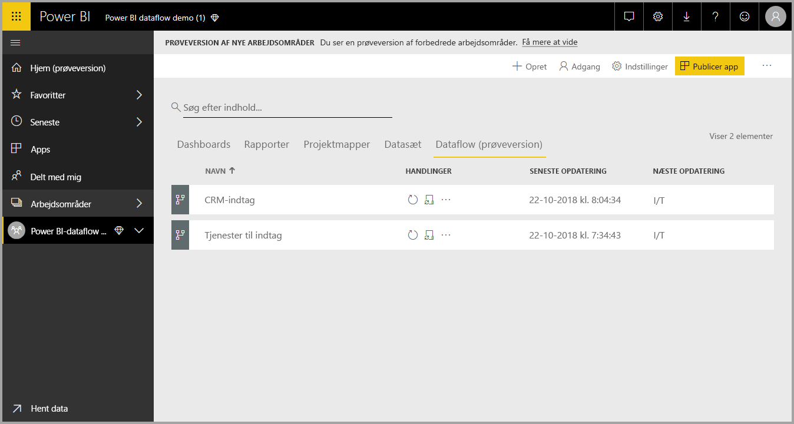
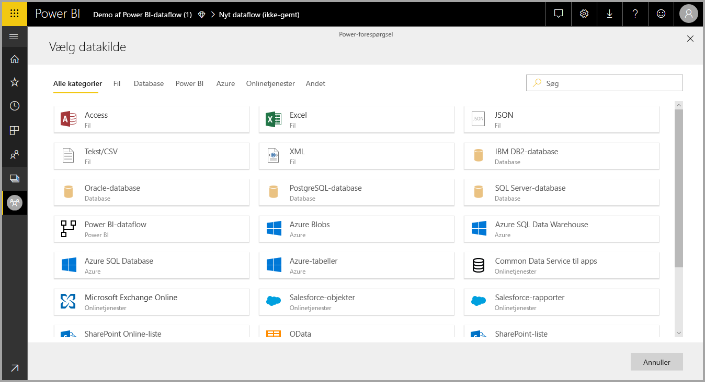
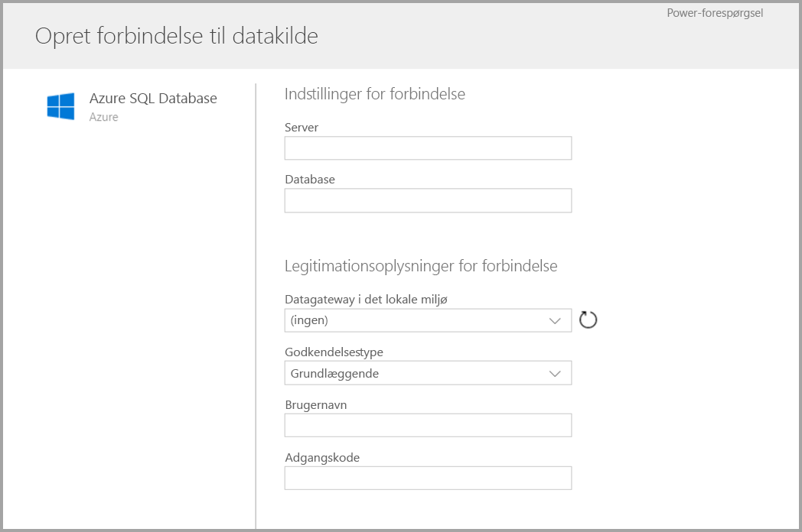
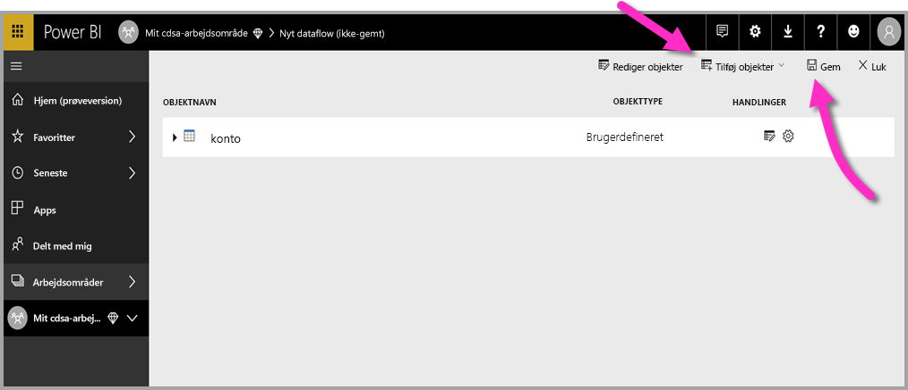
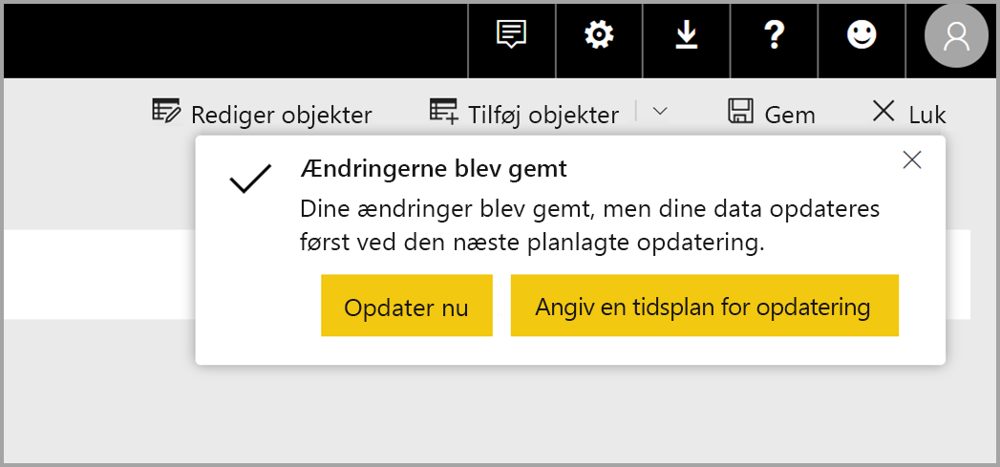
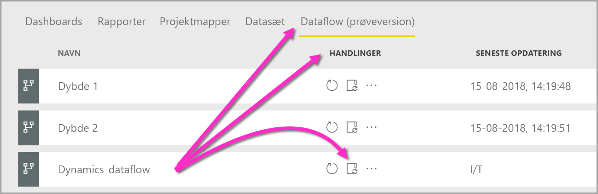

# Oprettelse og brug af dataflow i Power BI

Med klargøring af avancerede data, som er tilgængelig i **Power BI**, kan du oprette en samling af data, hvilket kaldes et dataflow. Det kan du derefter bruge til at oprette forbindelse til virksomhedens data fra forskellige kilder, rense dataene, transformere dem og derefter indlæse dem i Power BI-lageret.

Et **dataflow** er en samling af *objekter* (objekter er ligesom tabeller), der oprettes og administreres i arbejdsområder i Power BI-tjenesten. Du kan tilføje og redigere objekter i dataflowet samt administrere tidsplaner for opdatering af data direkte fra det arbejdsområde, hvor dataflowet er oprettet.

Når du opretter et dataflow, kan du bruge **Power BI Desktop** og **Power BI-tjenesten** til at oprette datasæt, rapporter, dashboards og apps, der er baseret på de data, som du placerer i Power BI-dataflow, og dermed få indsigt i dine forretningsaktiviteter.

Der er tre primære trin til at bruge et dataflow:

1. Opret dataflowet ved hjælp af Microsoft-værktøjer, der er udviklet til at gøre det nemt
2. Planlæg hyppigheden for opdateringer af de data, du vil overføre til dataflowet
3. Byg datasættet ved hjælp af dataflowet via Power BI Desktop 

I følgende afsnit gennemgår vi hvert af disse trin og bliver fortrolige med de værktøjer, der skal bruges til at fuldføre hvert trin. Lad os komme i gang.

## Oprettelse af et dataflow
Du opretter et dataflow ved at starte Power BI-tjenesten i en browser og derefter vælge et **arbejdsområde** i navigationsruden til venstre, som vist på følgende skærm. Dataflow er ikke tilgængelige i *Mit arbejdsområde* i Power BI-tjenesten. Du kan også oprette et nyt arbejdsområde, hvor du kan oprette dit nye dataflow. 

Når du først er i **arbejdsområdet**, hvor du kan oprette et dataflow, vises knappen **+ Opret** i øverste højre hjørne på lærredet. Vælg knappen **+ Opret**, og vælg derefter **Dataflow** på rullelisten. 

Det er vigtigt at vide, at der kun er *én ejer* af et hvilket som helst dataflow. Ejeren er den person, der opretter det. Det er kun ejeren, der kan redigere dataflowet. Alle medlemmer af **arbejdsområdet**, som har læse- eller skrivetilladelser til det arbejdsområde, hvor dataflowet er oprettet, kan oprette forbindelse til dataflowet fra **Power BI Desktop**, som beskrevet senere i denne artikel.

Derfra kan du tilføje **objekter**, hvilket beskrives nærmere i næste afsnit.

### Tilføj objekter

Et **objekt** er et sæt felter, der bruges til at lagre data på samme måde som en tabel i en database. På følgende billede kan du se udvalget af datakilder, hvorfra du kan overføre data til Power BI.

Når du vælger en datakilde, bliver du bedt om at angive forbindelsesindstillingerne, herunder den konto, der skal bruges, når du opretter forbindelse til datakilden, som vist på følgende billede.

Når du har forbindelse, kan du vælge, hvilke data der skal bruges til dit objekt. Når du vælger data og en kilde, opretter Power BI efterfølgende forbindelse til datakilden igen for at holde data i dataflowet opdateret med den hyppighed, som du vælger senere i konfigurationsprocessen.

Når du vælger data til brug i objektet, kan du anvende datafloweditoren til at forme eller transformere disse data til det format, der er nødvendigt til brug i dit dataflow.

### Brug af datafloweditor

Når du vælger, hvilke data fra din kilde der skal bruges til dit objekt, kan du forme dit datavalg til den formular, der fungerer bedst til dit objekt, ved hjælp af redigering af en Power-forespørgsel, som ligner **Power-forespørgselseditor** i  **Power BI Desktop**. Du kan få mere at vide om Power-forespørgsel i [artiklen Oversigt over forespørgsel](desktop-query-overview.md) til Power BI Desktop. Power-forespørgsel er indbygget i Power BI Desktop som Power-forespørgselseditor. 

Hvis du vil have vist den kode, som forespørgselseditoren opretter i hvert trin, eller du vil oprette din egen formningskode, kan du bruge den **avancerede editor**. 

### Dataflow og CDM (Common Data Model)

Dataflowobjekter indeholder nye værktøjer, så du nemt kan knytte dine data til Common Data Model (Microsofts standardiserede skema), berige den med data fra Microsoft og tredjeparter og få forenklet adgang til maskinel indlæring. Disse nye funktioner kan udnyttes til at give intelligent og handlingsrettet indsigt i dine virksomhedsdata. Når du har fuldført alle transformationer i trinnet Rediger forespørgsler, kan du knytte kolonner fra tabeller i dine datakilder til felter i standardobjekter, som defineret af Common Data Model. Standardobjekter har et kendt skema, der er defineret af Common Data Model.

Du kan finde flere oplysninger om denne fremgangsmåde og Common Data Model i artiklen [Hvad er Common Data Model?](https://docs.microsoft.com/powerapps/common-data-model/overview)

Du gør brug af Common Data Model i dit dataflow ved at klikke på transformationen **Knyt til standard** i dialogboksen **Rediger forespørgsler**. På skærmen **Tilknyt objekter**, som vises, kan du vælge det standardobjekt, du vil tilknytte.

Når du knytter en kildekolonne til standardfeltet, sker følgende:

1. Kildekolonnen påtager sig standardfeltnavnet (kolonnen omdøbes, hvis navnene er forskellige)
2. Kildekolonnen henter datatypen for standardfeltet

Alle standardfelter, der ikke er tilknyttet, får *Null*-værdier for at bevare standardobjektet Common Data Model.

Alle kildekolonner, der ikke er tilknyttet, forbliver, som de er, for at sikre, at resultatet af tilknytningen er et standardobjekt med brugerdefinerede felter.

Når du har fuldført dine valg, og dit objekt og dets dataindstillinger er klar til at blive gemt, kan du vælge **Gem** i menuen. Bemærk, at du kan oprette flere objekter ved at vælge knappen **Tilføj objekter**, og du kan redigere objekterne for at tilpasse forespørgslerne og de objekter, du har oprettet.

Når du vælger **Gem**, bliver du bedt om at navngive dataflowet og angive en beskrivelse.

Når du er klar og har valgt knappen **Gem**, vises der et vindue, hvor du får besked om, at dit **dataflow** er blevet oprettet. 

Fantastisk! Nu er du klar til næste trin, hvilket er planlægning af hyppigheden for opdatering af dine datakilder.

## Planlæg hyppigheden for opdatering

Når dataflowet er blevet gemt, kan du planlægge hyppigheden for opdatering for hver af dine forbundne datakilder.

Power BI-dataflow bruger processen for opdatering af Power BI-data til at holde dine data opdateret. I **Power BI-tjenesten** under afsnittet **arbejdsområde** er der en samling af områder, hvor dine oplysninger kan angives, herunder dataflow, som vist på følgende billede.

Posten *Dynamics-dataflow* på forrige billede er det dataflow, vi oprettede i forrige afsnit. Du planlægger en opdatering ved at vælge ikonet **Planlæg opdatering** under afsnittet **Handlinger**, som vist på følgende billede. 

Når du vælger ikonet **Planlæg opdatering**, bliver du ført til ruden **Planlæg opdatering**, hvor du kan angive tidspunkt og hyppighed for opdatering af dataflowet.

Du kan finde flere oplysninger om planlægning af opdatering i artiklen om [konfiguration af planlagt opdatering](refresh-scheduled-refresh.md), hvor funktionsmåden af opdatering af Power BI-datasæt beskrives. Dataflow fungerer på samme måde som Power BI-datasæt, hvad angår indstillinger for opdatering. 

## Opret forbindelse til dataflowet i Power BI Desktop

Når du har oprettet dit dataflow, og du har planlagt hyppigheden af opdateringen for hver enkelt datakilde, der skal udfylde modellen, er du klar til det tredje og sidste trin, som er at oprette forbindelse til dataflowet fra **Power BI Desktop**. 

Du opretter forbindelse til dataflowet ved at vælge **Hent data > Power BI > Power BI-dataflow (beta)** i Power BI Desktop, som vist på følgende billede.

Herfra kan du navigere til det **arbejdsområde**, hvor du gemte dataflowet, vælge dataflowet og derefter vælge de objekter, du har oprettet, på listen.

Du kan også bruge **søgelinjen** øverst i vinduet til hurtigt at finde navnet på dit dataflow eller dine objekter blandt mange dataflowobjekter.

Når du vælger objektet og derefter vælger knappen **Indlæs**, vises objekterne i ruden **Felter** i **Power BI Desktop** og fungerer på samme måde som **tabeller** fra et hvilket som helst andet datasæt.

## Brug af dataflow, der er gemt i Azure Data Lake Storage Gen2

Nogle organisationer vil muligvis bruge deres eget lager til oprettelse og administration af dataflow. Du kan integrere dataflow i Azure Data Lake Storage Gen2, hvis du følger kravene og administrerer tilladelserne korrekt. Dokumentationen til alle krav i forbindelse med denne tilgang tager udgangspunkt i oversigtsdokumentet til [Integration af dataflow og Azure Data Lake (prøveversion)](service-dataflows-azure-data-lake-integration.md).

## Fejlfinding af dataforbindelser

Det kan ske, at der opstår problemer med dataflowet, når der oprettes forbindelse til datakilder. I dette afsnit finder du tip til fejlfinding, når sådanne problemer opstår. 

* **Salesforce-connector** – Brug af en prøvekonto til Salesforce med dataflow resulterer i en forbindelsesfejl, uden at der angives nogen oplysninger. For at løse problemet skal du bruge en produktionskonto til Salesforce eller en udviklerkonto til test.

* **SharePoint-connector** – Sørg for at angive rodadressen på SharePoint-webstedet uden nogen undermapper eller dokumenter. Brug f.eks. links, der ligner følgende: https://microsoft.sharepoint.com/teams/ObjectModel/ 

* **JSON-fileconnector** – I øjeblikket kan du kun oprette forbindelse til en JSON-fil ved hjælp af basisgodkendelse.  Oprettelse af forbindelse til en JSON-fil ved hjælp af legitimationsoplysningerne i URL-adressen (f.eks, https://XXXXX.blob.core.windows.net/path/file.json?sv=2019-01-01&si=something&sr=c&sig=123456abcdefg...) er **ikke** understøttet i øjeblikket.  

* **Azure SQL Data Warehouse** – Dataflow understøtter i øjeblikket ikke AAD-godkendelse (Azure Active Directory) for Azure SQL Data Warehouse. Brug basisgodkendelse til dette scenarie.

## Næste trin

I denne artikel blev det beskrevet, hvordan du opretter dine egne **dataflow** og opretter et datasæt og en rapport i **Power BI Desktop**, hvor du kan drage fordel af det. Følgende artikler indeholder nyttige oplysninger og scenarier, når du bruger dataflow:

* [Selvbetjent dataforberedelse med dataflow](service-dataflows-overview.md)
* [Brug af beregnede objekter i Power BI Premium](service-dataflows-computed-entities-premium.md)
* [Brug af dataflow med datakilder i det lokale miljø](service-dataflows-on-premises-gateways.md)
* [Udviklerressourcer til Power BI-dataflow](service-dataflows-developer-resources.md)
* [Integration af dataflow og Azure Data Lake (prøveversion)](service-dataflows-azure-data-lake-integration.md)

Du kan finde flere oplysninger om Common Data Model i denne oversigtsartikel:
* [Common Data Model – oversigt](https://docs.microsoft.com/powerapps/common-data-model/overview)
* [Få mere at vide om Common Data Model-skemaet og objekter på GitHub](https://github.com/Microsoft/CDM)

Relaterede artikler om Power BI Desktop:

* [Opret forbindelse til datasæt i Power BI-tjenesten fra Power BI Desktop](desktop-report-lifecycle-datasets.md)
* [Oversigt over forespørgsler i Power BI Desktop](desktop-query-overview.md)

Relaterede artikler om Power BI-tjenesten:
* [Konfigurering af planlagt opdatering](refresh-scheduled-refresh.md)
