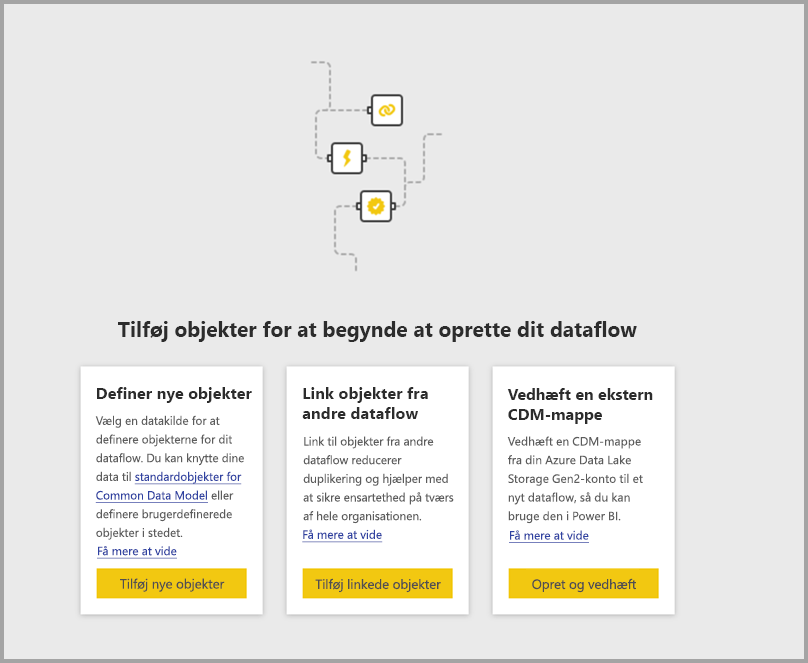
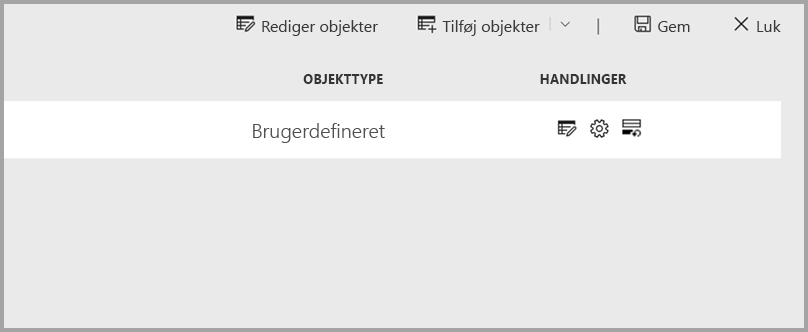
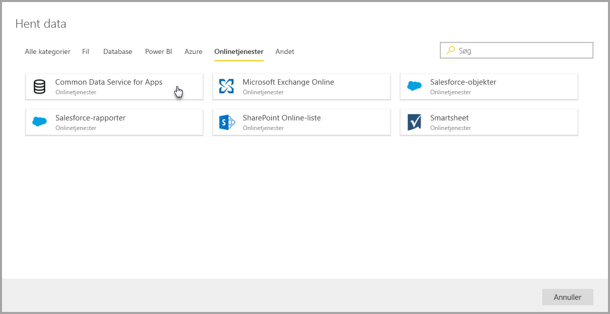
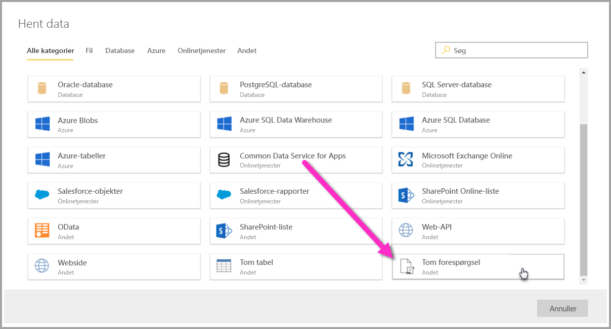

# Opret forbindelse til datakilder til Power BI-dataflow (prøveversion)

Med Power BI-dataflow kan du oprette forbindelse til mange forskellige datakilder for at oprette nye dataflow eller føje nye enheder til et eksisterende dataflow.

Denne artikel indeholder en liste over de mange tilgængelige datakilder til oprettelse eller tilføjelse af dataflow og beskriver, hvordan du kan oprette disse dataflow ved hjælp af disse datakilder.

Du kan få en oversigt over, hvordan du opretter og bruger dataflow, i [oprettelse og brug af dataflow i Power BI (prøveversion)](service-dataflows-create-use.md).

## Opret et dataflow fra en datakilde

Du opretter forbindelse til data ved at vælge menuelementet **+ Opret** i **Power BI-tjenesten** og derefter vælge **dataflow** i den menu, der vises. Når du har foretaget et valg, vises følgende billede på lærredet i Power BI-tjenesten. 

Hvis dit dataflow findes allerede, kan du føje nye enheder til dit dataflow ved at vælge **Tilføj enheder**, som vises nedenfor, eller ved at vælge **Hent data** i oprettelsesværktøjet til dataflow.

På følgende billede vises knappen **Hent data** i oprettelsesværktøjet til dataflow. 

## Datakilder til dataflow

Du kan få vist de tilgængelige datakilder ved at vælge **Hent Data** i oprettelsesværktøjet til dataflow, som derefter viser en dialogboks til valg af kategorier og hver enkelt datakilde, som vist på følgende billede.

Datakilder til dataflow er organiseret i følgende kategorier, der vises langs toppen af dialogboksen **Hent data**:

* Alle kategorier
* Fil
* Database
* Power BI
* Azure
* Onlinetjenester
* Andet

Kategorien **Alle kategorier** indeholder alle datakilder fra alle kategorier. 

Kategorien **Fil** indeholder følgende tilgængelige dataforbindelser til dataflow:

* Adgang
* Excel
* JSON
* Tekst/CSV
* XML

Kategorien **Database** indeholder følgende tilgængelige dataforbindelser til dataflow:

* IBM DB2-database
* MySQL-database
* Oracle Database
* PostgreSQL-database
* SQL Server Database
* Sybase-database
* Teradata-database

Kategorien **Power BI** indeholder følgende tilgængelige dataforbindelser til dataflow:

* Power BI-dataflow

Kategorien **Azure** indeholder følgende tilgængelige dataforbindelser til dataflow:

* Azure Blobs
* Azure Data Explorer
* Azure SQL Data Warehouse
* Azure SQL Database
* Azure-tabeller

Kategorien **Onlinetjenester** indeholder følgende tilgængelige dataforbindelser til dataflow:

* Common Data Service til apps
* Microsoft Exchange Online
* Salesforce-objekter
* Salesforce-rapporter
* SharePoint Online-liste
* Smartsheet

Kategorien **Andet** indeholder følgende tilgængelige dataforbindelser til dataflow:

* Active Directory
* OData
* SharePoint-liste
* Web-API
* Webside
* Tom tabel
* Tom forespørgsel

## Oprettelse af forbindelse til en datakilde

Hvis du vil oprette forbindelse til en datakilde, skal du vælge den pågældende datakilde. Vi bruger et eksempel til at vise, hvordan processen fungerer, men hver dataforbindelse til dataflow benytter samme proces. Forskellige forbindelser kan kræve særlige legitimationsoplysninger eller andre oplysninger, men flowet er det samme. I vores eksempel kan du på følgende billede se, at **CDS for Apps** er valgt fra dataforbindelseskategorien **Onlinetjenester**.

Der vises et vindue med forbindelse til den valgte dataforbindelse. Hvis der kræves legitimationsoplysninger, bliver du bedt om at angive dem. På følgende billede vises en Server URL-adresse, der angives for at oprette forbindelse til en CDS for Apps-server.

Når forbindelsesoplysninger for URL-adressen eller ressourcen er angivet, skal du vælge **Log på** for at angive de legitimationsoplysninger, der skal bruges til dataadgang, og derefter vælge **Næste**.

**Power-forespørgsel Online** igangsætter og opretter forbindelse til datakilden og viser derefter de tilgængelige tabeller fra den pågældende datakilde i vinduet **Navigator**, som vist på følgende billede.

Du kan vælge de tabeller og data, du vil indlæse, ved at markere afkrydsningsfeltet ud for hver i venstre rude. Du indlæser dataene ved at vælge **OK** nederst i vinduet **Navigator**. En Power-forespørgsel Online-dialogboks vises, hvor du kan redigere forespørgsler og udføre alle de andre ændringer, du vil foretage af de markerede data.

Så nemt er det. Andre datakilder har lignende flow og bruger Power-forespørgsel Online til at redigere og transformere de data, du indsætter i dataflowet.

## Oprettelse af forbindelse til flere datakilder

Der er flere dataforbindelser, der ikke vises i brugergrænsefladen til Power BI-dataflow, men som understøttes med nogle få ekstra trin. 

Du kan benytte følgende fremgangsmåde til at oprette en forbindelse til en connector, der ikke vises i brugergrænsefladen:

1. Åbn **Power BI Desktop**, og vælg **Hent data**.
2. Åbn **Power-forespørgselseditor** i Power BI Desktop, højreklik på den relevante forespørgsel, og åbn **Avanceret editor**, som vist på følgende billede. Herfra kan du kopiere det M-script, der vises i den avancerede editor.

     

3. Åbn Power BI-dataflowet, og vælg **Hent data** for at få en tom forespørgsel, som vist på følgende billede.

     

4. Indsæt den kopierede forespørgsel i den tomme forespørgsel for dataflowet.

     

Hvorefter scriptet opretter forbindelse til den angivne datakilde. 

På følgende liste vises, hvilke connectorer du kan bruge i øjeblikket ved at kopiere og indsætte M-forespørgslen i en tom forespørgsel:

* Amazon Redshift
* SAP Business Warehouse 
* SAP HANA
* Analysis Services
* Azure Analysis Services
* Google Analytics
* Adobe Analytics
* ODBC
* OLE DB
* Mappe
* SharePoint Online-mappe
* SharePoint-mappe
* Hadoop HDFS
* Azure HDInsight (HDFS)
* Hadoop-fil (HDFS)
* Informix (beta)
* Vertica

Det er det eneste, du skal gøre for at oprette forbindelse til datakilder i Power BI-dataflow.

## Næste trin

I denne artikel viste vi, hvilke datakilder du kan oprette forbindelse til for dataflow. De følgende artikler kommere nærmere ind på almindelige forbrugsscenarier for dataflows. 

* [Selvbetjent dataforberedelse i Power BI (prøveversion)](service-dataflows-overview.md)
* [Opret og brug dataflow i Power BI](service-dataflows-create-use.md)
* [Brug beregnede objekter i Power BI Premium (prøveversion)](service-dataflows-computed-entities-premium.md)
* [Brug dataflow med datakilder i det lokale miljø (prøveversion)](service-dataflows-on-premises-gateways.md)
* [Udviklerressourcer til Power BI-dataflow (prøveversion)](service-dataflows-developer-resources.md)
* [Integration af dataflow og Azure Data Lake (prøveversion)](service-dataflows-azure-data-lake-integration.md)

Du kan finde flere oplysninger om Power-forespørgsel og planlagt opdatering i disse artikler:
* [Oversigt over forespørgsler i Power BI Desktop](desktop-query-overview.md)
* [Konfiguration af planlagt opdatering](refresh-scheduled-refresh.md)

Du kan finde flere oplysninger om Common Data Model i denne oversigtsartikel:
* [Common Data Model – oversigt](https://docs.microsoft.com/powerapps/common-data-model/overview)

