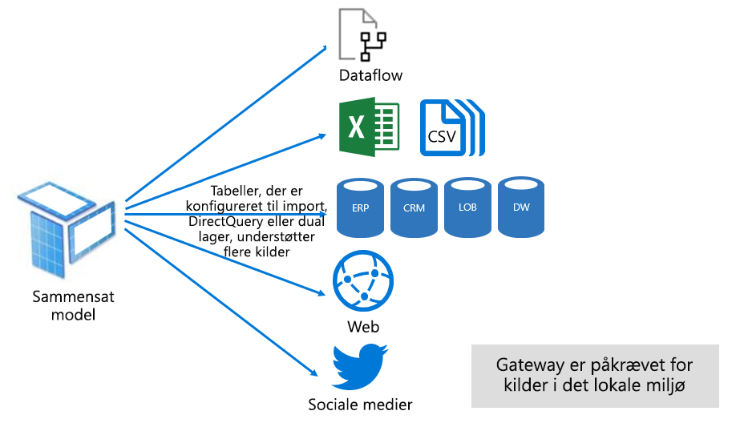

# Tilstande for datasæt i Power BI-tjenesten

Denne artikel indeholder en teknisk forklaring af tilstande for datasæt i Power BI. Den gælder for datasæt, der repræsenterer en direkte forbindelse til en eksternt hostet Analysis Services-model og også for modeller, der er udviklet i Power BI Desktop. I artiklen forklares det teoretiske grundlag for hver enkelt tilstand og eventuelle konsekvenser for Power BI-kapacitetens ressourcer.

De tre tilstande for datasæt er:

- [Importér](#import-mode)
- [DirectQuery](#directquery-mode)
- [Sammensat](#composite-mode)

## Importtilstand

Tilstanden _Importér_ er den mest almindelige tilstand, der bruges til at udvikle modeller. Denne tilstand giver en ekstremt hurtig ydeevne takket være forespørgsler i hukommelsen. Den giver også designfleksibilitet til modeludviklere og understøttelse af bestemte funktioner i Power BI-tjenesten (Spørgsmål og svar, Hurtig indsigt osv.). Disse styrker gør den til standardtilstanden, når du opretter en ny Power BI Desktop-løsning.

Det er vigtigt at forstå, at importerede data altid lagres på disken. Når dataene forespørges eller opdateres, skal de være fuldt indlæst i hukommelsen i Power BI-kapaciteten. Når importmodellerne er i hukommelsen, kan de opnå meget hurtige forespørgselsresultater. Det er også vigtigt at forstå, at der ikke findes en importmodel, der indlæses delvist i hukommelsen.

Når dataene opdateres, komprimeres og optimeres de og gemmes på disken af VertiPaq-programmet. Når den er indlæst fra disken i hukommelsen, er det muligt at se komprimering med faktor 10. Det er derfor rimeligt at forvente, at 10 GB kildedata kan komprimeres til en størrelse på ca. 1 GB. Lagerstørrelsen på disken opnå en reduktion på 20 % i forhold til den komprimerede størrelse. Forskellen i størrelse kan bestemmes ved at sammenligne Power BI Desktop-filstørrelsen med filens hukommelsesforbrug i Jobliste.

Du kan opnå fleksibilitet i designet på tre forskellige måder. Datamodellører kan:

- Integrere data ved at cachelagre data fra dataflow og eksterne datakilder, uanset datakildetypen eller -formatet
- Udnytte hele sættet af funktioner i [Power Query-formelsproget](/powerquery-m/) (også kaldet M) til oprettelsen af forespørgsler, når du opretter forespørgsler til forberedelse af data
- Udnytte hele sættet af [DAX-funktioner (Data Analysis Expressions)](/dax/), når modellen forbedres med forretningslogik. Der er understøttelse af beregnede kolonner, beregnede tabeller og målinger.

Som vist på følgende billede kan en importmodel integrere data fra et vilkårligt antal understøttede datakildetyper.

Selvom der er mange overbevisende fordele forbundet med importmodeller, er der dog også nogle ulemper:

- Hele modellen skal indlæses i hukommelsen, før Power BI kan forespørge modellen, hvilket kan øge presset på tilgængelige kapacitetsressourcer, især efterhånden som antallet af og størrelsen på importmodeller vokser
- Modeldata er kun så aktuelle som den seneste opdatering, hvorfor importmodeller normalt skal opdateres efter en tidsplan
- En fuld opdatering fjerner alle data fra alle tabeller og genindlæser dem fra datakilden. Denne operation kan være meget dyr både med hensyn til tid og ressourcer for Power BI-tjenesten og datakilden eller -kilderne.

    > [!NOTE]
    > Power BI kan opnå en trinvis opdatering for at undgå at afkorte og genindlæse hele tabeller. Denne funktion understøttes dog kun, hvis datasættet er hostet i arbejdsområder på Premium-kapaciteter. Du kan få flere oplysninger i artiklen [Trinvis opdatering i Power BI Premium](service-premium-incremental-refresh.md).

Fra et ressourcemæssigt perspektiv i Power BI-tjenesten kræver importmodeller:

- Tilstrækkelig hukommelse til at indlæse modellen, når den forespørges eller opdateres
- Behandling af ressourcer og yderligere hukommelsesressourcer til at opdatere data.

## DirectQuery-tilstand

Tilstanden _DirectQuery-_ er et alternativ til tilstanden Importér. Modeller, der er udviklet i tilstanden DirectQuery, importerer ikke data. I stedet består de kun af metadata, der definerer modelstrukturen. Når der sendes en forespørgsel til modellen, bruges oprindelige forespørgsler til at hente data fra den underliggende datakilde.

Der er to primære årsager til at overveje at udvikle en DirectQuery-model:

- Når datamængderne er for store – selv når der anvendes [metoder til reduktion af data](guidance/import-modeling-data-reduction.md) – til at blive indlæst i en model eller simpelthen for store til at blive opdateret
- Når rapporter og dashboards skal levere data næsten i realtid, ud over hvad der kan opnås inden for planlagte opdateringsgrænser. (De planlagte opdateringsgrænser er otte gange om dagen for delt kapacitet og 48 gange om dagen for en Premium-kapacitet).

Der er flere fordele ved at bruge DirectQuery-modeller:

- Der er ingen størrelsesgrænser for importmodeller
- Modellerne behøver ikke at blive opdateret
- Rapportbrugere får vist de nyeste data, når de interagerer med rapportfiltre og udsnit. Rapportbrugere kan også opdatere hele rapporten for at hente aktuelle data.
- Rapporter i realtid kan udvikles ved hjælp af funktionen [Automatisk sideopdatering](desktop-automatic-page-refresh.md)
- Felter i dashboardet kan, når de er baseret på DirectQuery-modeller, blive opdateret automatisk så ofte som hvert 15. minut

Men der er dog adskillige ulemper og begrænsninger forbundet med DirectQuery-modeller:

- Modellen skal være baseret på en enkelt understøttet datakilde. Det er derfor, en eventuel dataintegration allerede skal ske i datakilden. De datakilder, der understøttes, er relations- og analysesystemer, som understøtter mange populære datalagre.

    > [!TIP]
    > Mange Microsoft-datakilder understøttes. Microsoft-datakilder inkluderer SQL Server, Azure Data Bricks, Azure HDInsight Spark (Beta), Azure SQL Database og Azure SQL Data Warehouse. Du kan finde flere oplysninger i artiklen [Datakilder, der understøttes af DirectQuery i Power BI](desktop-directquery-data-sources.md).

- Ydeevnen kan være langsom, hvilket kan påvirke Power BI-tjeneste negativt. Dette problem kan opstå, fordi nogle forespørgsler er CPU-tunge for Power BI-tjenesten. Det kan også skyldes, at datakilden ikke er optimeret til de forespørgsler, Power BI sender.
- Power Query-forespørgsler skal kunne delegeres. Dette krav betyder, at Power Query-logik ikke kan være for komplekst. Derudover skal logikken være begrænset til at bruge M-udtryk og -funktioner, der kan omdannes til oprindelige forespørgsler, som forstås af datakilden.
- DAX-formularer er begrænset til kun at bruge funktioner, der kan omdannes til oprindelige forespørgsler, som forstås af datakilden. Desuden er der ingen understøttelse af beregnede tabeller eller DAX Time Intelligence-funktioner.
- Modelforespørgsler, der kræver hentning af mere end en million rækker, mislykkes
- Rapporter og dashboards med flere visualiseringer kan vise inkonsekvente resultater, især når datakilden er svingende.
- Funktionerne Spørgsmål og svar og Hurtig indsigt understøttes ikke

Fra et ressourcemæssigt perspektiv i Power BI-tjenesten kræver DirectQuery-modeller:

- Minimal hukommelse til at indlæse modellen (kun metadata), når der sendes der en forespørgsel
- Nogle gange skal Power BI-tjenesten bruge betydelige processorressourcer til at generere og behandle forespørgsler, der sendes til datakilden. Når denne situation opstår, kan det påvirke dataoverførselshastigheden, især når brugere forespørger modellen samtidig.

Du kan finde flere oplysninger i [Brug DirectQuery i Power BI Desktop](desktop-use-directquery.md).

## Tilstanden Sammensat

Tilstanden _Sammensat_ kan blande tilstandene Importér og DirectQuery eller integrere flere DirectQuery-datakilder. Modeller, der er udviklet i sammensat tilstand,understøtter konfiguration af lagringstilstanden for hver modeltabel. Den understøtter også beregnede tabeller (defineret med DAX).

Tabellagringstilstanden kan konfigureres som Import, DirectQuery eller Dobbelt. En tabel, der konfigureres som en tabeltilstanden Dobbelt, består både af Importér og DirectQuery, og det giver Power BI-tjenesten mulighed for at bestemme, hvilken tilstand der er mest effektiv at bruge for en forespørgsel for den enkelte forespørgsel.

Sammensatte modeller har til formål at levere det bedste fra tilstandene Import og DirectQuery. Når sådanne modeller er konfigureret korrekt, kan de kombinere en høj forespørgselsydeevne for modeller i hukommelsen med muligheden for at hente data i næsten realtid fra datakilder.

Udviklere, der udvikler sammensatte modeller, konfigurerer sandsynligvis tabeller af dimensionstypen i lagringstilstanden Importér eller Dobbelt og faktatypetabeller i tilstanden DirectQuery. Du kan finde flere oplysninger om modeltabelroller i [Forstå, hvad et stjerneskema er, og hvorfor det er vigtigt for Power BI](guidance/star-schema.md).

Lad os f.eks. tage en model med en **Produkt**-dimensionstypetabel i tilstanden Dobbelt og en **Salg**-faktatypetabel i tilstanden DirectQuery. **Produkt**tabellen kan forespørges hurtigt og effektivt fra hukommelsen for at gengive et rapportudsnit. **Salgs**tabellen kan også forespørges i tilstanden DirectQuery med den relaterede **Produkt**tabel. Den sidste forespørgsel kan muliggøre genereringen af en enkelt effektiv oprindelig SQL-forespørgsel for at forbinde **Produkt** og **Salg**-tabellerne og filtrere efter udsnitsværdierne.

Generelt gælder de fordele og ulemper, der er forbundet med Importér og DirectQuery, for sammensatte modeller, afhængigt af hvordan hver tabel er konfigureret.

Du kan finde flere oplysninger under [Brug sammensatte modeller i Power BI Desktop](desktop-composite-models.md).

## Næste trin

- [Datasæt i Power BI-tjenesten](service-dataset-modes-understand.md)
- [Lagringstilstand i Power BI Desktop](desktop-storage-mode.md)
- [Brug af DirectQuery in Power BI](desktop-directquery-about.md)
- [Brug sammensatte modeller i Power BI Desktop](desktop-composite-models.md)
- Har du flere spørgsmål? [Prøv at spørge Power BI-community'et](https://community.powerbi.com/)
