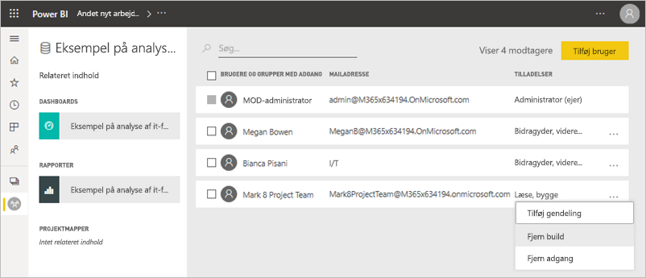

# Tilladelsen Opret for delte datasæt (prøveversion)

Når du opretter en rapport i Power BI Desktop, gemmes dataene i den pågældende rapport i en *datamodel*. Når du publicerer dine rapporter i Power BI-tjenesten, publicerer du også dataene som et *datasæt*. Du kan give andre *tilladelsen Opret* for den pågældende rapport, så de kan finde og genbruge det datasæt, du har delt. I denne artikel forklares det, hvordan du styrer adgang til dataene ved hjælp af tilladelsen Opret.

Tilladelsen Opret anvendes på datasæt. Når du giver brugerne tilladelsen Opret, kan de oprette nyt indhold i dit datasæt, f.eks. rapporter, dashboards, fastgjorte felter fra Spørgsmål og svar samt Søgning efter indsigt. 

Brugerne skal også have tilladelsen Opret for at kunne arbejde med data *uden for* Power BI:

- For at eksportere de underliggende data.
- For at bygge nyt indhold i datasættet, f. eks. med [Analysér i Excel](service-analyze-in-excel.md).
- For at få adgang til dataene via XMLA-slutpunktet.

## Måder at give tilladen Opret på

Du kan give tilladelsen Opret for et datasæt på forskellige måder:

- Medlemmer af et arbejdsområde med mindst en rolle som Bidragyder har automatisk tilladelsen Opret for datasæt i det pågældende arbejdsområde og tilladelse til at kopiere en rapport.
 
- Medlemmer af arbejdsområdet, hvor datasættet er placeret, kan tildele tilladelsen til specifikke brugere eller sikkerhedsgrupper i centret for tilladelser. Hvis du er medlem af arbejdsområdet, skal du vælge **Flere indstillinger** (...) ud for et datasæt > **Administrer tilladelser**.

    

    Derved åbnes centret for tilladelser for det pågældende datasæt, hvor du kan angive og ændre tilladelser.

    

- En administrator eller et medlem af arbejdsområdet, hvor datasættet er placeret, kan beslutte under publicering af appen, at brugere med tilladelse til appen også får tilladelsen Opret for de underliggende datasæt. Du kan finde flere oplysninger under [Del et datasæt](service-datasets-share.md).

- Lad os antage, at du har tilladelserne Del igen og Opret for et datasæt. Når du deler en rapport eller et dashboard, der er baseret på et datasæt, kan du angive, at modtagerne også får tilladelsen Opret for det underliggende datasæt.

    

Du kan fjerne tilladelsen Opret for et datasæt fra en person. Hvis du gør det, kan de stadig få vist rapporten, som er baseret på det delte datasæt, men de kan ikke længere redigere den. Du kan finde flere oplysninger i det næste afsnit.

## Fjern tilladelsen Opret for et datasæt

På et tidspunkt kan du få brug for at fjerne tilladelsen Opret for nogle brugere af et delt datasæt. 

1. Gå til siden med listen over **Datasæt** i et arbejdsområde. 
1. Vælg **Flere indstillinger** (...) ud for datasættet > **Administrer tilladelse**.

    

1. Vælg **Flere indstillinger** (...) ud for et navn > **Fjern Opret**.

    

    De kan stadig se rapporten, som er baseret på det delte datasæt, men de kan ikke længere redigere den.

### Fjern tilladelsen Opret for et datasæt i en app

Lad os sige, at du har distribueret en app fra et arbejdsområde til en gruppe personer. Senere beslutter du, at du vil fjerne adgangen til appen for nogle personer. Selvom du fjerner deres adgang til appen, så fjernes tilladelserne Opret og Del igen ikke fra dem. Det er et ekstra trin. 

1. Vælg **Opdater app** på en side med en liste over arbejdsområder. 

    

1. På fanen **Tilladelser** skal du vælge **X** for at slette personen eller gruppen. 

    
1. Vælg **Opdater program**.

    Du får vist en meddelelse, der forklarer, at du skal gå til **Administrer tilladelser** for at fjerne tilladelsen Opret for brugere med eksisterende adgang. 

    

1. Vælg **Opdater**.

1. Gå til siden med listen over **Datasæt** i arbejdsområdet. 
1. Vælg **Flere indstillinger** (...) ud for datasættet > **Administrer tilladelse**.

    

1. Vælg **Flere indstillinger** (...) ud for deres navn > **Fjern Opret**.

    

    De kan stadig se rapporten, som er baseret på det delte datasæt, men de kan ikke længere redigere den.

## Flere detaljerede tilladelser

Power BI introducerede tilladelsen Opret i juni 2019 som et supplement til de eksisterende tilladelser Læs og Del igen. Alle brugere, der allerede havde tilladelsen Læs for datasæt via apptilladelser, deling eller adgang til et arbejdsområde på dette tidspunkt, fik også tilladelsen Opret for de samme datasæt. De fik tilladelsen Opret automatisk, fordi de med tilladelsen Læs allerede havde ret til at oprette nyt indhold baseret på datasættet ved hjælp af Analysér i Excel eller Eksportér.

Med den mere detaljerede tilladelse Opret kan du vælge, hvem der kun kan se indholdet i den eksisterende rapport eller på det eksisterende dashboard, og hvem der kan oprette indhold, som er forbundet til de underliggende datasæt.

Hvis dit datasæt bruges af en rapport uden for datasættets arbejdsområde, kan du ikke slette dette datasæt. I stedet får du vist en fejlmeddelelse.

Du kan fjerne tilladelsen Opret. Hvis du gør det, kan de personer, hvis tilladelser du har tilbagekaldt, stadig få vist rapporten, men de kan ikke længere redigere den eller eksportere underliggende data. Brugere med læsetilladelse kan stadig eksportere opsummerede data. 

## De næste trin

- [Brug datasæt på tværs af arbejdsområder (prøveversion)](service-datasets-across-workspaces.md)
- Har du nogen spørgsmål? [Prøv at spørge Power BI-community'et](https://community.powerbi.com/)
