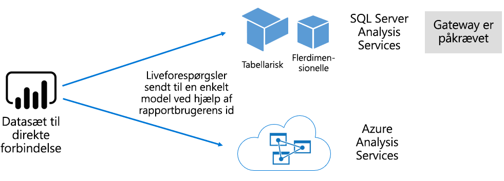

# Datasæt i Power BI-tjenesten

Denne artikel indeholder en teknisk forklaring af Power BI-datasæt.

## Typer af datasæt

Power BI-datasæt repræsenterer en kilde til de data, der er klar til rapportering og visualisering. Der er fem forskellige typer datasæt, som oprettes på følgende måder:

- Oprette forbindelse til en eksisterende datamodel, der ikke er hostet i en Power BI-kapacitet
- Overføre en Power BI Desktop-fil, der indeholder en model.
- Overføre en Excel-projektmappe (der indeholder en eller flere tabeller i Excel og/eller en projektmappedatamodel) eller overføre en CSV-fil (kommasepareret)
- Bruge Power BI-tjenesten til at oprette et [push-datasæt](developer/automation/walkthrough-push-data.md)
- Bruge Power BI-tjenesten til at oprette et [streaming eller hybridstreamingdatasæt](service-real-time-streaming.md)

Med undtagelse af streamingdatasæt repræsenterer datasættet en datamodel, der udnytter teknologierne til fintudviklet modellering i [Analysis Services](/analysis-services/analysis-services-overview).

> [!NOTE]
> Ordene _datasæt_ og _modeller_ bruges nogle gange synonymt i dokumentationen. Fra Power BI-tjenestens perspektiv kaldes det som hovedregel et **datasæt**, og fra et udviklingsmæssigt perspektiv en **model**. I forbindelse med dokumentationen betyder de stort set det samme.

### Eksternt hostede modeller

Der findes to typer eksternt hostede modeller: SQL Server Analysis Services og [Azure Analysis Services](/azure/analysis-services/analysis-services-overview).

Oprette af forbindelse til en SQL Server Analysis Services-model omfatter installation af [datagatewayen i det lokale miljø](service-gateway-onprem.md), uanset om det er i det lokale miljø eller VM-hostet IaaS (Infrastruktur som en service). Azure Analysis Services kræver ikke en gateway.

Oprettelse af forbindelse til Analysis Services giver ofte mening, når der findes eksisterende modelinvesteringer, der typisk udgør en del af EDW (Enterprise Data Warehouse). Power BI kan oprette en _direkte forbindelse_ til Analysis Services ved at gennemtvinge tilladelser til data ved hjælp af Power BI-rapportbrugerens identitet. I forbindelse med SQL Server Analysis Services understøttes både flerdimensionelle modeller (kuber) og tabelmodeller. Som vist på følgende billede overfører et datasæt med direkte forbindelse forespørgsler til eksternt hostede modeller.

### Modeller, der er udviklet i Power BI Desktop

Power BI Desktop – et klientprogram, der er beregnet til Power BI-udvikling – kan bruges til at udvikle en model. Modellen er i praksis en Analysis Services-tabelmodel. Modeller kan udvikles ved at importere data fra dataflows, som derefter kan integreres med andre eksterne datakilder. Selvom selve modelleringen er uden for denne artikels område, er det vigtigt at forstå, at der er tre forskellige typer af eller _tilstande_ for modeller, der kan udvikles ved hjælp af Power BI Desktop. Disse tilstande afgør, om data importeres til modellen, eller om de forbliver i datakilden. De tre tilstande er: Import, DirectQuery og Sammensat. Du kan finde flere oplysninger om hver tilstand i artiklen [Tilstande for datasæt i Power BI-tjenesten](service-dataset-modes-understand.md).

Modeller, der hostes eksternt, Power BI Desktop-modeller kan gennemtvinge sikkerhed på rækkeniveau (RLS) for at begrænse de data, der kan hentes, for en bestemt bruger. Brugere, der er tildelt til sikkerhedsgruppen **Sælgere**, kan f.eks. kun få vist rapportdata for det eller de salgsområder, de er blevet tildelt til. RLS-rollerne kan være _dynamiske_ eller _statiske_. Dynamiske roller filtrerer efter rapportbrugeren, mens statiske roller anvender de samme filtre for alle de brugere, der er tildelt til rollen. Du kan finde flere oplysninger i [Sikkerhed på rækkeniveau med Power BI](service-admin-rls.md).

### Excel-projektmappemodeller

Oprettelse af datasæt, der er baseret på [Excel-projektmapper](service-excel-workbook-files.md) eller [CSV-filer](service-comma-separated-value-files.md), resulterer automatisk i oprettelsen af en model. Excel-tabeller og CSV-data importeres for at oprette tabeller i modellen, mens en datamodel i Excel-projektmappen transponeres for at oprette en Power BI-model. I alle tilfælde importeres fildata til en model.

## Oversigt

Man kan derefter skelne mellem de Power BI-datasæt, der repræsenterer modeller:

- De er enten hostet i Power BI-tjenesten eller hostes eksternt af Analysis Services.
- De kan gemme importerede data, eller de kan sende passthrough-forespørgselsanmodninger til underliggende datakilder eller en blanding af begge dele.

Her er en oversigt over vigtige fakta om Power BI-datasæt, der repræsenterer modeller:

- Modeller, der hostes af SQL Server Analysis Services, kræver en gateway for at udføre direkte forbindelse-forespørgsler.
- Power BI-hostede modeller, der importerer data:
  - Skal være fuldt indlæst i hukommelsen, så de kan forespørges.
  - Kræver opdatering for at holde dataene aktuelle og skal omfatte gateways, når kildedataene ikke er tilgængelig direkte via internettet.
- Power BI-hostede modeller, der bruger [DQ](desktop-directquery-about.md)-lagringstilstand (DirectQuery) kræver forbindelse til kildedataene. Når modellen forespørges, udsteder Power BI forespørgsler til kildedataen for at hente aktuelle data. Denne tilstand skal omfatte gateways, når kildedata ikke er tilgængelige direkte via internettet.
- Modeller kan gennemtvinge RLS-regler, der benytter filtre for at begrænse adgang til data for bestemte brugere.

## Overvejelser

Det er vigtigt at forstå, hvor modellerne hostes, deres lagringstilstand, eventuelle afhængigheder af gateways, størrelsen af de importerede data samt opdateringstype og -frekvens for at kunne udrulle og administrere Power BI på effektiv vis. Disse konfigurationer kan alle have stor indflydelse på Power BI-kapacitetsressourcerne. Derudover bør selve modeldesignet, herunder forespørgsler til dataforberedelse, relationer og beregninger, også indgå i de forskellige overvejelser.

Det er også vigtigt at forstå, at Power BI-hostede import modeller kan opdateres i overensstemmelse med en tidsplan eller udløses efter behov af en bruger i Power BI-tjenesten.

## Næste trin

- [Tilstande for datasæt i Power BI-tjenesten](service-dataset-modes-understand.md)
- Har du flere spørgsmål? [Prøv at spørge Power BI-community'et](https://community.powerbi.com/)
