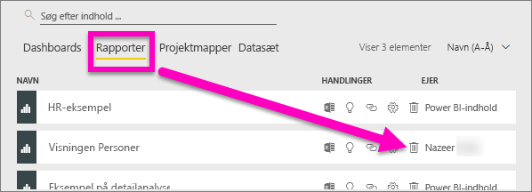
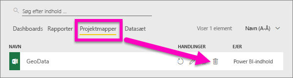
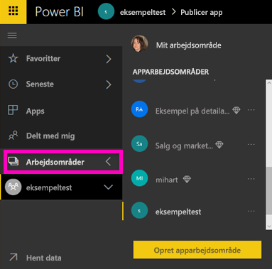
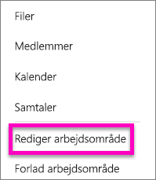
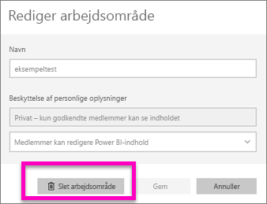
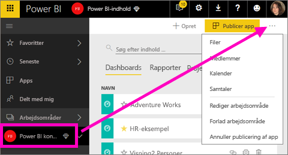
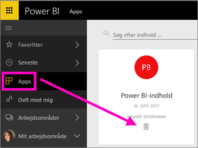

# Slet næsten alt i Power BI-tjenesten
I denne artikel kan du lære, hvordan du sletter et dashboard, en rapport, en projektmappe, et datasæt, en app og et arbejdsområde i Power BI-tjenesten.

## Slet et dashboard
Dashboards kan fjernes. Når du fjerner et dashboard, sletter du ikke det underliggende datasæt eller de rapporter, der er knyttet til dette dashboard.

* Hvis du er ejeren af dashboardet, kan du fjerne det. Hvis du har delt dashboardet med kolleger, fjernes det fra deres Power BI-arbejdsområder, når du fjerner det fra dit Power BI-arbejdsområde.
* Hvis et dashboard er delt med dig, og du ikke længere vil se det, kan du fjerne det.  Når du fjerner et dashboard, fjernes det ikke fra alle andres Power BI-arbejdsområde.
* Hvis et dashboard er en del af en [organisationsindholdspakke](service-organizational-content-pack-disconnect.md), kan du kun fjerne det ved at fjerne det tilknyttede datasæt.

### Sådan sletter du et dashboard
1. Vælg fanen **Dashboards** i dit arbejdsområde.
2. Find det dashboard, du vil slette, og vælg sletteikonet .

    

## Slet en rapport
Bare rolig, når du sletter en rapport, bliver det datasæt, som rapporten er baseret på, ikke slettet.  Eventuelle visualiseringer, som du har fastgjort fra rapporten, er også sikre. De forbliver på dashboardet, indtil du sletter dem enkeltvist.

### Sådan sletter du en rapport
1. Vælg fanen **Rapporter** i dit arbejdsområde.
2. Find den rapport, du vil slette, og vælg sletteikonet .   

    
3. Bekræft sletningen.

   

   > [!NOTE]
   > Hvis rapporten er en del af en [indholdspakke](service-organizational-content-pack-introduction.md), kan du ikke slette den ved hjælp af denne metode.  Se [Fjern din forbindelse til en organisationsindholdspakke](service-organizational-content-pack-disconnect.md).
   >
   >

## Slet en projektmappe
Projektmapper kan fjernes. Men når du fjerner en projektmappe, fjerner du også alle rapporter og dashboardfelter, der indeholder data fra denne projektmappe.

Hvis projektmappen er gemt på OneDrive for Business, bliver denne ikke slettet fra OneDrive, når du sletter den fra Power BI.

### Sådan sletter du en projektmappe
1. Vælg fanen **Projektmapper** i dit arbejdsområde.
2. Find den projektmappe, du vil slette, og vælg sletteikonet .

    
3. Bekræft sletningen.

   

## Slet et datasæt
Datasæt kan slettes. Når du sletter et datasæt, sletter du dog også alle rapporter og dashboardfelter, der indeholder data fra det pågældende datasæt.

Hvis et datasæt er en del af en eller flere [organisationsindholdspakker](service-organizational-content-pack-disconnect.md), kan du kun slette det ved at fjerne det fra de indholdspakker, hvor det bruges, vente på, at det bliver behandlet og derefter prøve at slette det igen.

### Sådan sletter du et datasæt
1. Vælg fanen **Datasæt** i dit arbejdsområde.
2. Find det datasæt, du vil slette, og vælg ellipserne (...).  

    
3. Vælg **Slet** på rullelisten.

   
4. Bekræft sletningen.

   

## Slet et apparbejdsområde
> [!WARNING]
> Når du opretter et apparbejdsområde, opretter du en Office 365-gruppe. Når du sletter et apparbejdsområde, sletter du denne Office 365-gruppe. Det betyder, at gruppen også slettes fra andre O365-produkter, f.eks. SharePoint og Microsoft Teams.
>
>

Som forfatter af apparbejdsområdet, kan du slette det. Når du sletter det, slettes den tilknyttede app også for alle gruppemedlemmer, og den fjernes fra din AppSource, hvis du har udgivet appen i hele organisationen. Sletning af et apparbejdsområde adskiller sig fra at forlade et apparbejdsområde.

### Sådan sletter du et apparbejdsområde – hvis du er administrator
1. Vælg **Arbejdsområder** i navigationen til venstre.

    
2. Vælg ellipsen (...) til højre for det arbejdsområde, der skal slettes, og vælg **Rediger arbejdsområde**.

   
3. I vinduet **Rediger arbejdsområde** skal du vælge **Slet arbejdsområde** > **Slet**.

    

### Sådan fjerner du et apparbejdsområde fra din liste
Hvis du vil ikke længere være medlem af et apparbejdsområde, kan du ***forlade*** det, så fjernes det fra din liste. Selvom du forlader et arbejdsområde, har alle andre medlemmer af arbejdsområdet det stadig.  

> [!IMPORTANT]
> Hvis du er den eneste administrator af apparbejdsområdet, tillader Power BI ikke, at du forlader det.
>
>

1. Start i det apparbejdsområde, du vil fjerne.
2. I øverste højre hjørne skal du vælge ellipsen (...) og vælge **Forlad arbejdsområde** > **Forlad**.

      

   > [!NOTE]
   > De indstillinger, du kan se på rullelisten, afhænger af, om du er administrator eller medlem af dette apparbejdsområde.
   >
   >

## Slet eller fjerne en app
Apps kan nemt fjernes fra din side med applisten. Det er dog kun appadministrator, der kan slette en app.

### Fjern en app fra din side med applisten
Selvom du sletter en app fra din side med applisten, slettes appen ikke for andre medlemmer.

1. Vælg **Apps** i navigationen til venstre for at åbne siden med applisten.
2. Hold over den app, du vil slette, og vælg sletteikonet .

   

   Hvis du kommer til at fjerne en app ved et uheld, har du flere muligheder for at få den tilbage.  Du kan bede personen, der oprettede appen, om at sende den igen. Du kan finde den oprindelige mail med linket til appen. Du kan undersøge, om meddelelsen om appen stadig findes i [meddelelsescentret](service-notification-center.md), eller du kan kontrollere din organisations [AppSource](service-install-use-apps.md).

## Overvejelser og fejlfinding
Denne artikel indholdte oplysninger om, hvordan du sletter de større komponenter i Power BI-tjenesten. Men der er flere ting, du kan slette i Power BI.  

* [Fjern et udvalgt dashboard](service-dashboard-featured.md#change-the-featured-dashboard)
* [Fjern et dashboard fra favoritter](service-dashboard-favorite.md)
* [Slet en rapportside](service-delete.md)
* [Slet et dashboardfelt](service-dashboard-edit-tile.md)
* [Slet en rapportvisualisering](service-delete.md)

Har du flere spørgsmål? [Prøv at spørge Power BI-community'et](http://community.powerbi.com/)
