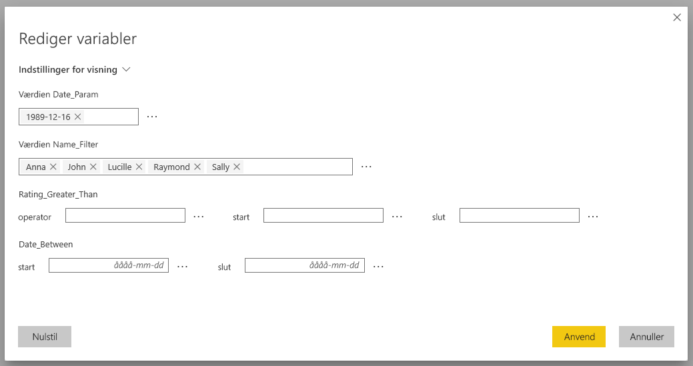
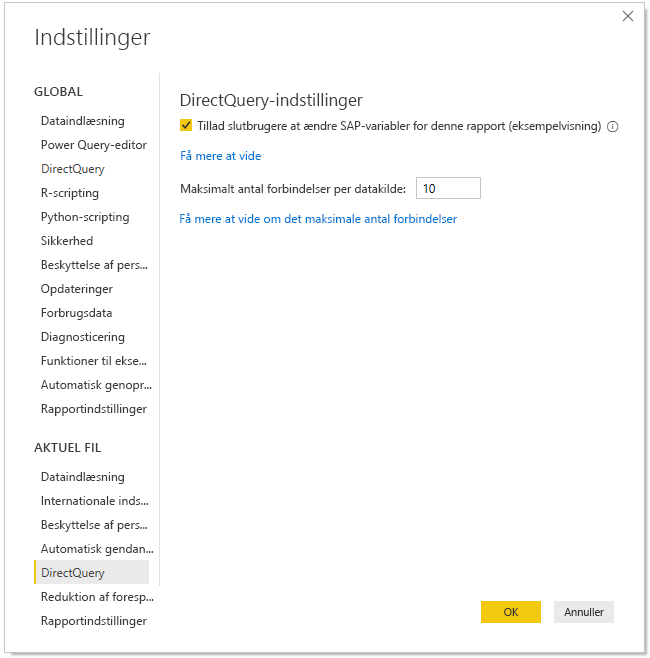

# Rediger SAP-variabler i Power BI-tjenesten

Når du bruger SAP Business Warehouse eller SAP HANA med DirectQuery, kan forfattere af rapporter nu give slutbrugere mulighed for at redigere SAP-variabler i **Power BI-tjenesten** for Premium- og delte arbejdsområder. Bemærk, at denne funktion IKKE fungerer for rapporter under fanen Delt med mig i Mit arbejdsområde. 

I dette dokument beskrives kravene til redigering af variabler i Power BI, hvordan denne funktion aktiveres, og hvor variabler i Power BI-tjenesten kan redigeres.

## Krav til Rediger SAP-variabler

Der er et par krav til at bruge funktionen Rediger SAP-variabler. På følgende liste beskrives disse krav.

**Den nye filteroplevelse kræves** – Du skal have aktiveret den [nye filteroplevelse](power-bi-report-filter.md) for din rapport. Her kan du se, hvordan du aktiverer den for din rapport i Power BI Desktop:
- Vælg **Filer** > **Indstillinger** > **Indstillinger** i Power BI Desktop
- Under **Aktuel fil** skal du vælge **Rapportindstillinger**.
- Under **Filtreringsoplevelse** skal du vælge **Aktivér den opdaterede filtreringsrude**.

**DirectQuery-forbindelser kræves** – Du skal oprette forbindelse til SAP-datakilden ved hjælp af DirectQuery. Importforbindelser understøttes ikke.

**Konfiguration af enkeltlogon kræves** – enkeltlogon (SSO) skal være konfigureret, før denne funktion fungerer. Du kan finde flere oplysninger under [Oversigt over enkeltlogon (SSO)](service-gateway-sso-overview.md).

**Nye gatewaybits kræves** – Download den nyeste gateway, og opdater din eksisterende gateway. Du kan finde flere oplysninger under [Tjenestegateway](service-gateway-onprem.md).

**Kun flerdimensionel til SAP HANA** – I forbindelse med SAP HANA kan funktionen Rediger SAP-variabler kun bruges sammen med flerdimensionelle modeller og fungerer ikke med relationelle kilder.

**Understøttes ikke i nationale cloudmiljøer** – Power Query Online er i øjeblikket ikke tilgængelig i nationale cloudmiljøer. Denne funktion understøttes derfor ikke i nationale cloudmiljøer.

## Sådan aktiverer du funktionen

Hvis du vil aktivere funktionen **Rediger SAP-variabler**, skal du i Power BI Desktop oprette forbindelse til en SAP HANA- eller SAP BW-datakilde. Gå derefter til **Filer > Indstillinger > Indstillinger**, og vælg derefter **DirectQuery** i sektionen Aktuel fil i ruden til venstre. Når du vælger dette, kan du se DirectQuery-indstillinger i ruden til højre og et afkrydsningsfelt, hvor du kan **give slutbrugere tilladelse til at ændre SAP-variabler i rapporten** som vist på følgende billede.

## Brug Rediger SAP-variabler i Power BI Desktop

Når du bruger Rediger SAP-variabler i Power BI Desktop, kan du redigere variablerne ved at vælge linket Rediger variabler i menuen **Rediger forespørgsler** på båndet. Følgende dialogboks vises derefter. Denne funktion har været tilgængelig i Power BI Desktop i et stykke tid. Forfattere af rapporter kan vælge variabler for rapporten ved hjælp af følgende dialogboks.

## Brug Rediger SAP-variabler i tjenesten

Når rapporten er publiceret i Power BI-tjenesten, kan brugerne se linket **Rediger variabler** i ruden Nyt filter. Hvis du publicerer rapporten for første gang, kan det tage op til fem minutter, før linket Rediger variabler vises. Hvis linket ikke vises, skal du opdatere datasættet manuelt.
Det gør du ved at gøre følgende:

1. Vælg fanen **Datasæt** på indholdslisten for et arbejdsområde i Power BI-tjenesten.

2. Find det datasæt, du vil opdatere, og vælg ikonet **Opdater**.

    

3. Når du vælger linket Rediger variabler, åbnes dialogboksen **Rediger variabler**, hvor brugerne kan tilsidesætte variabler. Når du vælger knappen **Nulstil**, nulstilles variablerne til de oprindelige værdier, som blev vist, da dialogboksen blev åbnet.

    

4. Eventuelle ændringer i dialogboksen **Rediger variabler** fastholdes kun for denne bruger (ligesom andre funktionsmåder for fastholdelse i Power BI). Hvis du vælger **Nulstil til standard**, som vist på følgende billede, nulstilles rapporten til forfatteren af rapportens oprindelige tilstand, herunder variablerne.

    

Når du arbejder på en publiceret rapport i Power BI-tjenesten, der bruger SAP HANA eller SAP BW med funktionen **Rediger variabler** aktiveret, kan ejeren af rapporten ændre disse standarder. Ejeren af rapporten kan ændre variablerne i redigeringstilstand og gemme rapporten for at gøre det muligt for disse indstillinger at blive de *nye standardindstillinger* for den pågældende rapport. Alle andre brugere, der har adgang til rapporten, efter ejeren af rapporten har foretaget sådanne ændringer, vil se disse nye indstillinger som de nye standardindstillinger.

## Næste trin

Du kan finde flere oplysninger om SAP HANA, SAP BW eller DirectQuery ved at læse følgende artikler:

- [Brug SAP HANA i Power BI Desktop](desktop-sap-hana.md)
- [DirectQuery og SAP Business Warehouse (BW)](desktop-directquery-sap-bw.md)
- [DirectQuery og SAP HANA](desktop-directquery-sap-hana.md)
- [Brug af DirectQuery in Power BI](desktop-directquery-about.md)
