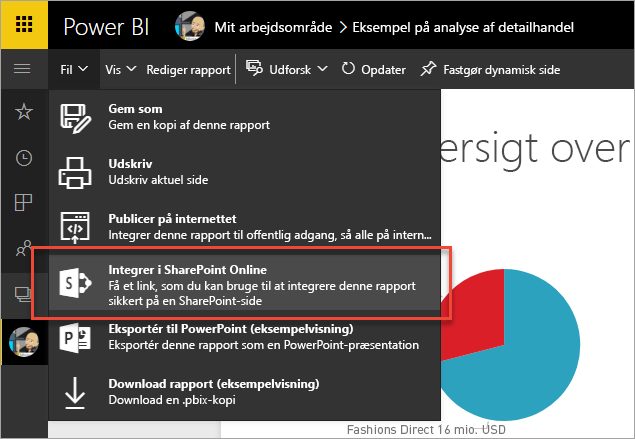
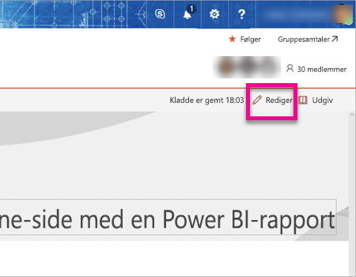
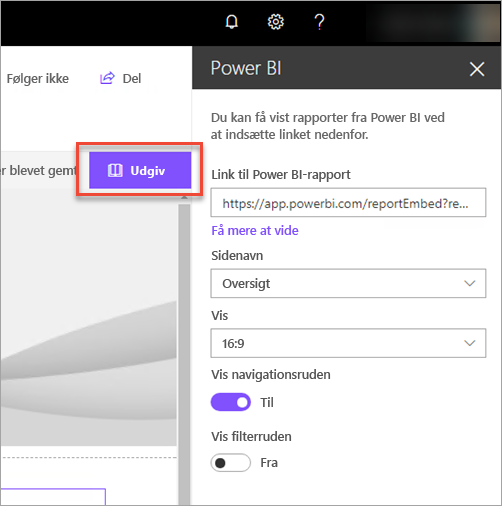
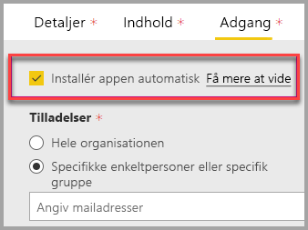
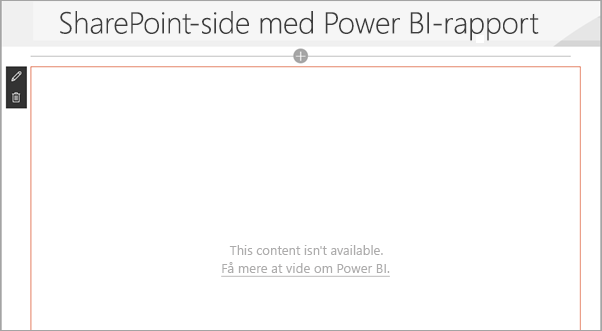

# Integrer med rapportwebdelen i SharePoint Online

Med Power BI’s nye rapportwebdel til SharePoint Online kan du nemt kan integrere interaktive Power BI-rapporter på SharePoint Online-sider.

Når du bruger den nye indstilling **Integrer i SharePoint Online**, er de integrerede rapporter helt sikre, så du kan nemt oprette sikre interne webportaler.

## Krav

Der er et par krav for, at **Integrer i SharePoint Online**-rapporter kan fungere.

* Du skal have en Power BI Pro-licens eller en [Power BI Premium-kapacitet (EM- eller P-SKU)](service-premium.md#premium-capacity-nodes) med en Power BI-licens.
* Power BI-webdelen til SharePoint Online kræver [moderne sider](https://support.office.com/article/Allow-or-prevent-creation-of-modern-site-pages-by-end-users-c41d9cc8-c5c0-46b4-8b87-ea66abc6e63b).

## Integrer din rapport

Hvis du vil integrere din rapport i SharePoint Online, skal du først hente URL-adressen til rapporten og derefter bruge denne URL-adresse med den nye Power BI-webdel i SharePoint Online.

### Hent en URL-adresse til rapporten

1. Få vist rapporten i Power BI-tjenesten.

2. Vælg menuen **Filer**.

3. Vælg **Integrer i SharePoint Online**.

    

4. Kopiér URL-adressen fra dialogboksen.

    

### Føj Power BI-rapporten til en SharePoint Online-side

1. Åbn den ønskede side i SharePoint Online, og vælg **Rediger**.

    

    Eller opret en ny moderne webside ved at vælge **+ Ny** i SharePoint Online.

    

2. Vælg **+**, og vælg webdelen **Power BI**.

    

3. Vælg **Tilføj rapport**.

    

4. Indsæt rapportens URL-adresse i ruden med egenskaber. Denne URL-adresse til rapporten er den URL-adresse, du har kopieret fra trinnene ovenfor. Rapporten indlæses automatisk.

    

5. Vælg **Publicer** for at gøre ændringerne synlige for dine SharePoint Online-brugere.

    

## Giv adgang til rapporter

Integrering af en rapport i SharePoint Online giver ikke automatisk brugere tilladelse til at få vist rapporten. Tilladelserne til at få vist rapporten angives i Power BI-tjenesten.

> [!IMPORTANT]
> Sørg for at gennemse, hvem der kan få vist rapporten, i Power BI-tjenesten, og giv adgang til dem, der er ikke angivet.

Du kan give adgang til rapporten i Power BI-tjenesten på to måder. Hvis du bruger en Office 365-gruppe til at kompilere dit SharePoint Online-teamwebsted, kan du angive brugeren som medlem af **apparbejdsområdet i Power BI-tjenesten** og på **SharePoint-siden**. Du kan finde flere oplysninger under [Administrer dit apparbejdsområde](service-manage-app-workspace-in-power-bi-and-office-365.md).

Du kan også dele en rapport direkte med brugerne ved at integrere rapporten i en app. Der er et par trin, du skal følge, for at integrere en rapport i en app.  

1. Opretteren af appen er en Pro-bruger.

2. Opretteren genererer en rapport i et apparbejdsområde. *For at kunne dele med **brugere af den gratis version af Power BI** skal arbejdsområdet være angivet som et **Premium-arbejdsområde**.*

3. Opretteren publicerer appen og installerer den derefter. *Forfatteren skal sørge for at installere appen for at få adgang til rapportens URL-adresse, som bruges til at integrere med SharePoint Online.*

4. Nu skal alle slutbrugere også installere appen. Du kan dog angive, at appen skal forudinstalleres for slutbrugere, ved hjælp af funktionen **Installér appen automatisk**, som kan aktiveres på [Power BI-administrationsportalen](service-admin-portal.md).

   

5. Opretteren åbner appen og går til rapporten.

6. Opretteren kopierer URL-adressen til den integrerede rapport fra den rapport, der er installeret af appen. *Brug ikke rapportens oprindelige URL-adresse fra apparbejdsområdet.*

7. Opret et nyt teamwebsted i SharePoint Online.

8. Føj rapportens URL-adresse, som du kopierede under trin 6, til Power BI-webdelen.

9. Tilføj alle slutbrugere og/eller grupper, som skal bruge dataene på siden SharePoint Online og i den Power BI-app, du har oprettet.

    > [!NOTE]
    > **Brugerne eller grupperne skal have adgang både til siden SharePoint Online og rapporten i Power BI-appen for at få vist rapporten på SharePoint-siden.**

10. Nu kan slutbrugeren gå til teamwebstedet i SharePoint Online og få vist rapporterne på siden.

## Multifaktorgodkendelse

Hvis du bliver bedt om at logge på ved hjælp af multifaktorgodkendelse i dit Power BI-miljø, bliver du muligvis bedt om at logge på med en sikkerhedsenhed for at bekræfte din identitet. Dette kan ske, hvis du ikke loggede på SharePoint Online ved hjælp af multifaktorgodkendelse, men dit Power BI-miljø kræver en konto, der er godkendt af en sikkerhedsenhed.

> [!NOTE]
> Multifaktorgodkendelse understøttes endnu ikke med Azure Active Directory 2.0. Brugerne modtager en meddelelse med ordet *fejl*. Hvis brugeren logger på SharePoint Online igen ved hjælp af sin sikkerhedsenhed, kan vedkommende muligvis få vist rapporten.

## Indstillinger for webdele

Nedenfor findes en beskrivelse af de indstillinger, der kan tilpasses til Power BI-webdelen til SharePoint Online.

| Egenskab | Beskrivelse |
| --- | --- |
| Sidenavn |Angiver den standardside, der vises af webdelen. Vælg en værdi på rullelisten. Hvis der ikke vises nogen sider, har rapporten enten kun én side, eller den URL-adresse, du har indsat, indeholder et sidenavn. Fjern rapportsektion fra URL-adressen for at vælge en bestemt side. |
| Vis |Indstillingen til at justere, hvordan rapporten er tilpasset SharePoint Online-siden. |
| Vis navigationsruden |Viser eller skjuler ruden Sidenavigation. |
| Vis filterruden |Viser eller skjuler filterruden. |

## Rapporter, der ikke indlæses

Rapporten indlæses muligvis ikke i Power BI-webdelen, og du kan få vist følgende meddelelse.

*Dette indhold er ikke tilgængeligt.*

Der er to almindelige årsager til denne meddelelse.

1. Du har ikke adgang til rapporten.
2. Rapporten blev slettet.

Kontakt ejeren af SharePoint Online-siden for at få hjælp til at udbedre problemet.

## Licensering

Brugere, der ser en rapport i SharePoint, skal enten have en **Power BI Pro-licens**, eller indholdet skal være i et arbejdsområde, der er i en **[Power BI Premium-kapacitet (EM- eller P-SKU)](service-admin-premium-purchase.md)**.

## Kendte problemer og begrænsninger

* Fejl: "Der opstod en fejl. Prøv at logge af og på igen, og besøg derefter denne side igen. Korrelations-ID: udefineret. HTTP-svarstatus: 400, serverfejlkode 10001. Meddelelse: Manglende opdateringstoken"
  
  Hvis du modtager denne fejl, kan du prøve at udføre et af fejlfindingstrinnene nedenfor.
  
  1. Log af SharePoint, og log på igen. Sørg for at lukke alle browservinduer, før du logger på igen.

  2. Hvis din brugerkonto kræver multifaktorgodkendelse, skal du sikre, at du logger på SharePoint ved hjælp af din multifaktorgodkendelsesenhed (telefonapp, chipkort osv.)
  
  3. Azure B2B-gæstebrugerkonti understøttes ikke. Brugerne kan se det Power BI-logo, der viser, at delen indlæses, men den viser ikke rapporten.

* Power BI understøtter ikke de samme oversatte sprog som SharePoint Online. Derfor ser du muligvis ikke den korrekte oversættelse i den integrerede rapport.

* Der kan opstå tekniske problemer, hvis du bruger Internet Explorer 10. Du kan se de [browsere, der understøttes af Power BI](consumer/end-user-browsers.md) og [Office 365](https://products.office.com/office-system-requirements#Browsers-section).

* Power BI-webdelen er ikke tilgængelig i [nationale clouds](https://powerbi.microsoft.com/en-us/clouds/).

* Den klassiske SharePoint-server understøttes ikke med denne webdel.

* [URL-filtre](service-url-filters.md) understøttes ikke med SPO-webdelen.

## Næste trin

* [Tillad eller forbyd, at slutbrugere opretter moderne webstedssider](https://support.office.com/article/Allow-or-prevent-creation-of-modern-site-pages-by-end-users-c41d9cc8-c5c0-46b4-8b87-ea66abc6e63b)  
* [Opret og distribuer en app i Power BI](service-create-distribute-apps.md)  
* [Del et dashboard med kolleger og andre](service-share-dashboards.md)  
* [Hvad er Power BI Premium?](service-premium.md)
* [Integrer en rapport på en sikker portal eller et websted](service-embed-secure.md)

Har du flere spørgsmål? [Prøv at spørge Power BI-community'et](http://community.powerbi.com/)