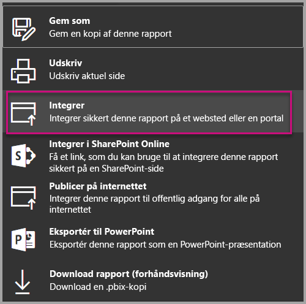
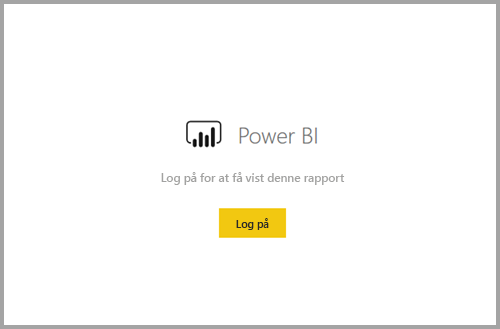
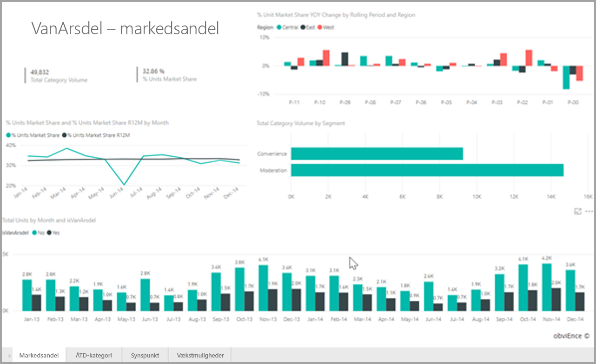

# <a name="embed-a-report-in-a-secure-portal-or-website"></a>Integrer en rapport på en sikker portal eller et websted

Den nye sikre indstilling **Integrer** for rapporter i Power BI giver brugerne mulighed for nemt og sikkert at integrere rapporter på interne webportaler, uanset om de er **skybaserede** eller **hostes i det lokale miljø**, f.eks. SharePoint 2019. Rapporter, der er integreret på denne måde, overholder alle elementtilladelser og datasikkerheden via sikkerhed på rækkeniveau (RLS). Funktionen er designet til at tillade integration uden kode i en hvilken som helst portal, der accepterer at integrere en URL-adresse eller iFrame.

Indstillingen **Integrer** understøtter også [URL-filtre](service-url-filters.md) og URL-indstillinger. Indstillingen **Integrer** giver dig mulighed for at integrere med portaler ved hjælp af en strategi med begrænset kode, der kun kræver grundlæggende kendskab til HTML og JavaScript.

## <a name="how-to-embed-power-bi-reports-into-portals"></a>Sådan **integrerer** du Power BI-rapporter på portaler

1. Den nye indstilling **Integrer** er tilgængelig på menuen **Filer** til rapporter i Power BI-tjenesten.

    

2. Vælg indstillingen Integrer for at åbne en dialogboks, der indeholder et link og en iFrame, der bruges til at integrere rapporten sikkert.

    

3. Når du integrerer din URL-adresse på webportalen, eller hvis du åbner URL-adressen direkte, skal brugeren igennem en godkendelse, inden vedkommende får adgang til rapporten. I eksemplet nedenfor er brugeren ikke logget på Power BI i den pågældende browsersession. Når brugeren trykker på **Log på**, åbnes der muligvis et nyt browservindue eller en ny fane. Kontrollér, om blokering af pop op-vinduer er aktiveret, hvis du ikke bliver bedt om at logge på.

    

4. Når brugeren er logget på, åbnes rapporten, som viser dataene og giver brugerne mulighed for at navigere mellem sider og angive filtre. Rapporten vises kun til brugere, der har tilladelse til at få vist rapporten i Power BI. Alle regler for sikkerhed på rækkeniveau (RLS) anvendes også. Desuden skal brugeren have en korrekt licens – det kræver enten en Power BI Pro-licens, eller at rapporten er placeret i et arbejdsområde, der har Power BI Premium-kapacitet. Brugeren skal logge på hver gang, der åbnes et nyt browservindue, men når brugeren er logget på én gang, indlæses de øvrige rapporter automatisk.

    

5. Når du bruger indstillingen iFrame, er det bedst at redigere den leverede HTML-kode for at angive den ønskede højde og bredde, så den passer til websiden på din portal.

    

## <a name="granting-access-to-reports"></a>Giv adgang til rapporter

Indstillingen Integrer giver ikke automatisk brugere tilladelse til at få vist rapporten. Tilladelserne til at få vist rapporten angives i Power BI-tjenesten.

Hvis du vil give adgang til rapporten i Power BI-tjenesten, kan du dele rapporten med de brugere, der har brug for at få adgang til den integrerede rapport. Hvis du bruger en Office 365-gruppe, kan du angive brugeren som medlem af app-arbejdsområdet i Power BI-tjenesten. Du kan finde flere oplysninger under [Administrer dit apparbejdsområde](service-manage-app-workspace-in-power-bi-and-office-365.md).

## <a name="licensing"></a>Licensering

Brugere, der får vist den integrerede rapport, skal enten have en Power BI Pro-licens, eller indholdet er placeret i et arbejdsområde, der har [Power BI Premium-kapacitet (EM eller P SKU)](service-admin-premium-purchase.md).

## <a name="customize-your-embed-experience-using-url-settings"></a>Tilpas din integrerede oplevelse ved hjælp af URL-indstillinger

Den integrerede URL-adresse understøtter flere indstillinger for input, der hjælper dig med at tilpasse din brugeroplevelse. Hvis du bruger den angivne iFrame, skal du sørge for at opdatere URL-adressen i indstillingerne for src i din iFrame.

| Egenskab  | Beskrivelse  |  |  |  |
|--------------|-----------------------------------------------------------------------------------------------------------------------------------------------------------------------------------------------------------------------|---|---|---|
| pageName  | Du kan bruge forespørgselsparametern **pageName** til angive, hvilken side i rapporten der skal åbnes. Værdien **pageName** værdi svarer til slutningen af rapportens URL-adresse, når du får vist en rapport i Power BI-tjenesten, som vist i eksemplet nedenfor. |  |  |  |
| URL-filtre  | Du kan bruge [URL-filtre](service-url-filters.md) i den integrerede URL-adresse, du har modtaget i brugergrænsefladen i Power BI til at filtrere indholdet af den integrerede rapport. På denne måde kan du skabe integrationer, der kun kræver begrænset kode og helt grundlæggende erfaring med HTML og JavaScript.  |  |  |  |

## <a name="set-which-page-opens-when-the-report-is-embedded"></a>Angiv, hvilke siden der åbnes, når rapporten integreres

Den værdi, der skal angives i indstillingen *pageName*, svarer til slutningen af rapportens URL-adresse, når du får vist en rapport i Power BI-tjenesten.

1. Åbn rapporten fra Power BI-tjenesten i din webbrowser, og kopiér derefter URL-adressen fra adresselinjen.

    

2. Tilføj indstillingen *pageName* i slutningen af URL-adressen.

    

## <a name="filter-report-content-using-url-filters"></a>Filtrer rapportens indhold ved hjælp af URL-filtre

Til nogle avancerede funktioner kan du anvende [URL-filtre](service-url-filters.md) til at skabe mere specifikke oplevelser med rapporten. I eksemplet nedenfor filtrerer URL-adressen rapporten, så der kun vises data for energibranchen.

Der kan opnås en stor effekt ved at kombinere **pageName** og [URL-filtre](service-url-filters.md). Du kan skabe specifikke oplevelser ved hjælp af grundlæggende HTML og JavaScript.

I dette eksempel kan du se, hvordan du kan tilføje en knap på en HTML-side:

```html
<button class="textLarge" onclick='show("ReportSection", "Energy");' style="display: inline-block;">Show Energy</button>
```

Når der trykkes på knappen, kalder den en funktion, der opdaterer din iFrame med en opdateret URL-adresse, der indeholder filteret til energibranchen.

```javascript
function show(pageName, filterValue)

{

var newUrl = baseUrl + "&pageName=" + pageName;

if(null != filterValue && "" != filterValue)

{

newUrl += "&$filter=Industries/Industry eq '" + filterValue + "'";

}

//Assumes there’s an iFrame on the page with id=”iFrame”

var report = document.getElementById("iFrame")

report.src = newUrl;

}
```


Du kan tilføje lige så mange knapper, du vil, og på den måde skabe en brugerdefineret oplevelse med begrænset kode. 

## <a name="considerations-and-limitations"></a>Overvejelser og begrænsninger

* Understøtter ikke eksterne gæstebrugere med Azure business-to-business (B2B).

* Sikker integration fungerer for rapporter, der er publiceret til Power BI-tjenesten.

* Brugeren skal logge på for at få vist rapporten, når vedkommende åbner et nyt browservindue.

* Visse browsere kræver, at du opdaterer siden efter logon, især når du bruger InPrivate- eller Inkognito-tilstand.

* Hvis du ønsker en oplevelse med enkeltlogon, skal du bruge indstillingen Integrer i SharePoint Online eller oprette en brugerdefineret integration ved hjælp af den strategi, at [brugeren ejer dataene](developer/embed-sample-for-your-organization.md). Få mere at vide om, [brugeren ejer dataene](developer/embed-sample-for-your-organization.md).

* Muligheden for automatisk godkendelse, der er tilgængelig med indstillingen **Integrer** fungerer ikke sammen med Power BI JavaScript API. Til Power BI JavaScript API kan du bruge den strategi til integreringen, at [brugeren ejer dataene](developer/embed-sample-for-your-organization.md). Få mere at vide om, [brugeren ejer dataene](developer/embed-sample-for-your-organization.md).

## <a name="next-steps"></a>Næste trin

* [Måder at dele dit arbejde på](service-how-to-collaborate-distribute-dashboards-reports.md)

* [URL-filtre](service-url-filters.md)

* [Webdel til rapporten SharePoint Online](service-embed-report-spo.md)

* [Publicer på internettet](service-publish-to-web.md)