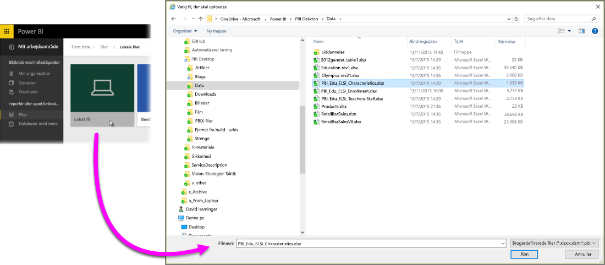
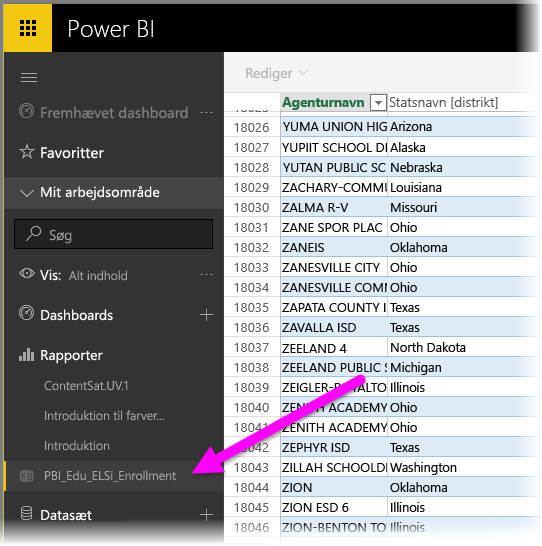

# Hent data fra Excel-projektmappefiler

Microsoft Excel er et af mest anvendte virksomhedsprogrammer. Det er også en af de mest almindelige måder at hente dine data til Power BI på.

## Hvilke typer projektmapper understøtter Power BI?
Power BI understøtter import af eller oprettelse af forbindelse til projektmapper, der er oprettet i Excel 2007 og senere. Projektmapper skal gemmes med filtypen .xlsx eller .xlsm og have en størrelse på under 1 GB. Nogle af de funktioner, der er beskrevet i denne artikel, er kun tilgængelige i nyere versioner af Excel.

### Projektmapper med områder eller tabeller med data
Hvis din projektmappe har simple regneark med dataområder, skal du sørge for at formatere disse områder som tabeller, så du får mest muligt ud af dine data i Power BI. Når du opretter rapporter i Power BI, får du på denne måde vist navngivne tabeller og kolonner i ruden Felter, hvilket gør det meget nemmere at visualisere dine data.

### Projektmapper med datamodeller
Projektmapper kan indeholde en datamodel med en eller flere tabeller med data, der er indlæst ved hjælp af sammenkædede tabeller, Power-forespørgsel (hent og omdan i Excel 2016) eller Power Pivot. Power BI understøtter alle datamodelegenskaber som f.eks. relationer, målinger, hierarkier og KPI'er.

> [!NOTE]
> Projektmapper med datamodeller kan ikke deles på tværs af Power BI-lejere. En bruger, der logger på Power BI ved hjælp af en *contoso.com*-konto, kan f.eks. ikke dele en Excel-projektmappe med en bruger, der logger på med en Power BI-logonkonto fra *woodgrovebank.com*.
> 
> 

### Projektmapper med forbindelser til eksterne datakilder
Hvis du bruger Excel til at oprette forbindelse til en ekstern datakilde, kan du oprette rapporter og dashboards, der er baseret på data fra den forbundne datakilde, når din projektmappe er i Power BI. Du kan også konfigurere Planlagt opdatering, så der automatisk oprettes forbindelse direkte til datakilden og hentes opdateringer. Du behøver ikke længere foretage manual opdatering fra båndet Data i Excel. Alle visualiseringer i rapporter og felter i dashboards, der er baseret på data fra den pågældende datakilde, opdateres automatisk. Du kan få mere at vide under [Opdatering af data i Power BI](refresh-data.md).

### Projektmapper med Power-visningsark, pivottabeller og diagrammer
Den måde, dine Power-visningsark, pivotabeller og diagrammer vises eller ikke vises på i Power BI, afhænger af hvor din projektmappefil er gemt, og hvordan du vælger at hente den ind i Power BI. Dette gennemgås yderligere nedenfor.

## Datatyper
Power BI understøtter følgende datatyper: Helt tal, Decimaltal, Valuta, Dato, Sand/Falsk, Tekst. Det giver en bedre oplevelse med Power Bi, hvis data markeres som specifikke datatyper i Excel .

## Forbered din projektmappe til Power BI
Se denne nyttige video, hvis du vil vide mere om, hvordan du sikrer dig, at dine Excel-projektmapper er klar til Power BI.

<iframe width="500" height="281" src="https://www.youtube.com/embed/l2wy4XgQIu0" frameborder="0" allowfullscreen></iframe>

## Det gør en forskel, hvor din projektmappe er gemt
**Lokal** – Hvis du gemmer din projektmappefil på et lokalt drev på din computer eller på en anden placering i din organisation, kan du indlæse din fil i Power BI fra Power BI. Filen forbliver på den lokale harddisk, så det er ikke hele filen, der importeres til Power BI. Der sker det, at et nyt datasæt oprettes i Power BI, og data og en eventuel datamodel fra projektmappen indlæses i datasættet. Hvis projektmappen indeholder Power View-ark , vises de på Power BI-webstedet under Rapporter. Excel 2016 har også funktionen **Publicer** (i menuen **Filer**). Brugen af **Publicer** svarer grundlæggende til brugen af **Hent Data > Filer > lokalfil** fra Power BI, men det er ofte lettere at opdatere datasættet i Power BI, hvis du jævnligt foretager ændringer i projektmappen.

**OneDrive – erhverv** – Hvis du har OneDrive for Business, og du logger på med den samme konto, du bruger til at logge på Power BI, er det den klart mest effektive metode til at holde dit arbejde i Excel synkroniseret med datasæt, rapporter og dashboards i Power BI. Da både Power BI og OneDrive findes i skyen, opretter Power BI *forbindelse* til din projektmappe på OneDrive ca. hver time. Hvis der findes ændringer, opdateres datasættet, rapporter og dashboards automatisk i Power BI. Du kan også bruge Publicer til at opdatere dit datasæt og dine rapporter i Power Bi med det samme, på samme måde som hvis du gemmer din projektmappe på et lokalt drev. Ellers synkroniserer Power BI automatisk, normalt inden for en time.

**OneDrive – personlig** – Hvis du gemmer dine projektmappefiler på din egen OneDrive-konto, får du mange af de samme fordele som med OneDrive for Business. Den største forskel er, at når du første gang opretter forbindelse til din fil (med funktionen Hent data > Filer > OneDrive - personlig), skal du logge på OneDrive med din Microsoft-konto, som normalt er forskellig fra, hvad du bruger til at logge på Power BI. Når du logger på med OneDrive med din Microsoft-konto, skal du sørge for at vælge indstillingen Forbliv logget på. På denne måde kan Power BI oprette forbindelse til din projektmappefil ca. hver time og sikre, at dit datasæt og dine rapporter i Power BI er synkroniseret.

**SharePoint – teamwebsteder** – Lagring af dine Power BI Desktop-filer på SharePoint – Teamwebsteder er stort set det samme som at gemme på OneDrive for Business. Den største forskel er, hvordan du opretter forbindelse til filen fra Power BI. Du kan angive en URL-adresse, eller du kan oprette forbindelse til rodmappen.

## En Excel-projektmappe – to måder at bruge den på
Hvis du gemmer dine projektmappefiler på **OneDrive**, er der flere forskellige måder, du kan udforske dine data i Power BI på

### Importér Excel-data i Power BI
Når du vælger **Importér**, importeres alle understøttede data i tabeller og/eller en datamodel til et nyt datasæt i Power BI. Hvis du har Power View-ark, genskabes disse i Power BI som rapporter.

Du kan fortsætte med at redigere din projektmappe. Når dine ændringer er gemt, skal de synkroniseres med datasættet i Power BI, som regel inden for cirka en time. Hvis du har brug, at dette sker hurtigere, kan du blot klikke på Publicer igen, så eksporteres dine ændringer med det samme. Eventuelle visuelle effekter, du har i rapporter og dashboards, opdateres også.

Vælg denne indstilling, hvis du har brugt Get & Transform data (Hent og transformér data) eller Power Pivot til at indlæse data i en datamodel, eller hvis din projektmappe indeholder Power View-ark med visualiseringer, som du vil have vist i Power BI.

I Excel 2016 kan du også bruge Publicer > Eksportér. Det er næsten det samme. Du kan få mere et vide i [Publicer i Power BI fra Excel 2016](service-publish-from-excel.md).

### Opret forbindelse til, administrer og få vist Excel i Power BI
Når du vælger **Opret forbindelse**, vises din projektmappe i Power BI på samme måde, som den ville blive vist i Excel Online. Men i modsætning til Excel Online får du nogle fantastiske funktioner, så du kan fastgøre elementer fra dine regneark direkte i dine dashboards.

Du kan ikke redigere din projektmappe i Power BI. Men hvis du har brug at foretage ændringer, kan du klikke på Rediger og derefter redigere din projektmappe i Excel Online eller åbne den i Excel på din computer. Alle ændringer, du foretager, gemmes i projektmappen på OneDrive.

Når du vælger denne fremgangsmåde, oprettes der ingen datasæt i Power BI. Din projektmappe vises i navigationsruden i Power BI-arbejdsområdet under Rapporter. Projektmapper, der er forbundet, har et særligt Excel-ikon.

Vælg denne indstilling, hvis du kun har data i regneark, eller hvis du har intervaller, pivottabeller og diagrammer, du vil fastgøre til dashboards.

I Excel 2016 kan du også bruge Publicer > Upload. Det er næsten det samme. Du kan få mere et vide i [Publicer i Power BI fra Excel 2016](service-publish-from-excel.md).

## Importér eller opret forbindelse til en Excel-projektmappe fra Power BI
1. I Power BI skal du klikke på **Hent data** i navigationsruden.
   
   
2. I Filer skal du klikke på **Hent**.
   
   
3. Find din fil.
   
   
4. Hvis din projektmappefil er placeret på OneDrive eller SharePoint – Teamwebsteder, skal du vælge **Importér** eller **Opret forbindelse**.

## Lokale Excel-projektmapper
Du kan også bruge en lokal Excel-fil og overføre den til Power BI. Du skal blot vælge **Lokal fil** i den forrige menu og derefter navigere til den placering, hvor du har gemt dine Excel-projektmapper.

Når du har valgt, kan du vælge at overføre din fil til Power BI.

Når din projektmappe er overført, får du en meddelelse om, at projektmappen er klar.

Når projektmappen er klar, kan du finde den i afsnittet **Rapporter** i Power BI.

## Publicer fra Excel 2016 til Power BI-webstedet
Når du bruger funktionen **Publicer i Power BI** i Excel 2016 er det i praksis det samme som at bruge **Hent data** i Power BI til at importere eller oprette forbindelse til din fil. Vi går ikke nærmere i detaljer her, men du kan få mere at vide i [Publicer til Power BI fra Excel 2016](service-publish-from-excel.md).

## Fejlfinding
Er projektmappefilen for stor? Se [Reducer størrelsen på en Excel-projektmappe for at få den vist i Power BI](reduce-the-size-of-an-excel-workbook.md).

Når du i øjeblikket vælger Importér, importerer Power BI kun data, der er del af en navngivet tabel eller en datamodel. Det betyder, at hvis projektmappen ikke indeholder navngivne tabeller, Power View-ark eller Excel-datamodeller, kan du få vist denne fejl: **"Vi kunne ikke finde data i din Excel-projektmappe"**. I [denne artikel](service-admin-troubleshoot-excel-workbook-data.md) forklares det, hvordan du retter din projektmappe og importerer den igen.

## Næste trin
**Udforsk dine data** – Når du har hentet data og rapporter fra din fil til Power BI, er det tid til at udforske dem. Du skal blot højreklikke på det nye datasæt og derefter klikke på Udforsk. Hvis du har valgt at oprette forbindelse til en projektmappefil på OneDrive i trin 4, vises din projektmappe i Rapporter. Når du klikker på den, åbnes den i Power BI på samme måde, som den ville blive åbnet i Excel Online.

**Planlæg opdatering** – Hvis din Excel-projektmappefil opretter forbindelse til eksterne datakilder, eller hvis du har importeret fra et lokalt drev, kan du konfigurere planlagt opdatering for at sikre, at dit datasæt eller din rapport altid er opdateret. Konfigurationen af planlagt opdatering er i de fleste tilfælde meget nem at udføre, men de nærmere detaljer ligger uden for emnet af denne artikel. Se [Opdatering af data i Power BI](refresh-data.md) for at få mere at vide.

[Publicer i Power BI fra Excel 2016](service-publish-from-excel.md)

[Power BI Publisher til Excel](publisher-for-excel.md)

[Opdatering af data i Power BI](refresh-data.md)

