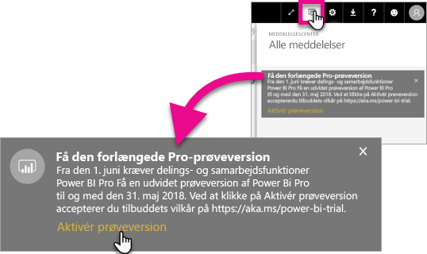
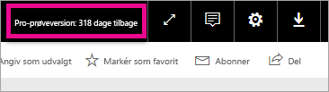

# Aktivering af udvidet Pro-prøveversion
Fra 1. juni 2017 vil alle berettigede brugere kunne tilmelde sig den udvidede Pro-prøveversion til Power BI-tjenesten.

<iframe width="640" height="360" src="https://www.youtube.com/embed/tPsNoPyY9aA?showinfo=0" frameborder="0" allowfullscreen></iframe>

Som en del af [meddelelsen fra 3. maj 2017 om Power BI Premium](https://powerbi.microsoft.com/blog/microsoft-accelerates-modern-bi-adoption-with-power-bi-premium/) fortalte Microsoft om ændringer af den gratis Power BI-tjeneste med ikrafttræden fra 1. juni 2017. Disse ændringer omfatter udvidelse af adgang til alle datakilder, højere grænser for arbejdsområdets lagerplads og højere opdaterings- og streaminghastigheder til den gratis tjeneste, så den svarer til Power BI Pro.

Det blev også meddelt, at delings- og samarbejdsfunktioner udelukkende gælder for Power BI Pro-brugere, herunder peer-to-peer-dashboarddeling, gruppearbejdsområder (kaldes nu apparbejdsområder), eksport til PowerPoint og analyse i Excel med Power BI-apps. Eksport til CSV/Excel og PowerPoint blev identificeret i meddelelsen fra 3. maj som en funktion, der er begrænset til Power BI Pro, men efter modtagelse af feedback fra det brede bruger-community har strategien udviklet sig til også gøre funktionen tilgængelig for brugere af den gratis tjeneste.

Fra 1. juni 2017 vil eksisterende brugere af den gratis tjeneste, som har været aktive inden for det sidste år (på eller før 2. maj 2017), være berettiget til en gratis 12-måneders udvidet prøveversion af Power BI Pro. Med tilbuddet kan brugerne gøre brug af alle funktioner i Power BI Pro det næste år som et tegn på påskønnelse af community'et og for at give brugerne tid til at tilpasse sig ændringerne.

Berettigede brugere vil den 1. juni 2017 modtage en besked, når de logger på tjenesten, for at gøre dem opmærksom på, at ændringerne er trådt i kraft, med en meddelelse om at tilmelde sig den udvidede Power BI Pro-prøveversion. En brugers it-administrator styrer ikke meddelelser i produktet og har heller ikke mulighed for at tilmelde en bruger til den udvidede Power BI Pro-prøveversion. Hver berettiget bruger skal selv fuldføre denne proces.

Brugerne kan vælge at tilmelde sig tilbuddet når som helst i løbet af 12-måneders perioden, men den udvidede Pro-prøveversion afsluttes for alle brugere den 31. maj 2018, uanset hvornår de accepterer tilbuddet. På nuværende tidspunkt får brugerne mulighed for at købe Power BI Pro eller konvertere til den gratis version af Power BI, uden delings- og samarbejdsfunktioner, hvis de vælger ikke at købe Power BI Pro.

Der er ikke foretaget ændringer af Power BI Pro. Disse brugere påvirkes ikke og vil ikke modtage meddelelser, når de logger på tjenesten den 1. juni 2017 eller derefter. Brugere, som afviser tilbuddet på den udvidede Power BI Pro-prøveversion eller ikke er berettiget til tilbuddet, vil fortsat kunne bruge den gratis version af Power BI uden delings- og samarbejdsfunktionalitet. De kan til enhver tid tilmelde sig en almindelig 60-dages Power BI Pro-prøveversion ved at gå til Power BI-[webstedet](https://powerbi.microsoft.com/get-started/).

## Berettigelse til udvidet Pro-prøveversion
Din konto skal opfylde følgende krav for at være berettiget til tilbuddet om den udvidede Pro-prøveversion.

* Brugere af gratis Power BI, som har været aktive mellem 3. maj 2016 og 2. maj 2017, er berettiget til en udvidet Pro-prøveversion.
* Brugere, der tidligere har brugt eller i øjeblikket er på *60-dages Pro-prøveversionen i produktet*, er stadig berettiget til den udvidede Pro-prøveversion.

> [!NOTE]
> Brugere, som har fået tildelt licenser fra abonnementerne på Power BI Pro eller Power BI Pro-prøveversionen, i Office 365, er udelukket fra dette tilbud.
> 
> 

## Sådan aktiverer du
Der er to måder at aktivere den udvidede Pro-prøveversion på. Den første er, når du logger på Power BI. Hvis du havde overset det, findes der også en indstilling i meddelelsesområdet.

> [!NOTE]
> Meddelelserne i produktet styres ikke af din administrator og sendes til berettigede brugere.
> 
> 

### Oplevelse ved logon
Når du logger på Power BI-tjenesten, og du er berettiget, får du vist en pop op-meddelelse. Hvis du vælger **Aktivér prøveversion**, starter den udvidede Pro-prøveversion. Der kræves ingen yderligere handling.

Du har derefter mulighed for at få adgang til alle eksisterende delte dashboards og rapporter i løbet af prøveperioden.

Hvis du har valgt **Ikke nu**, kan den udvidede Pro-prøveversion aktiveres når som helst indtil udgangen af prøveperioden den 31. maj 2018.

### Aktivering på et senere tidspunkt
Hvis du overså pop op-vinduet ved at vælge **Ikke nu**, kan den udvidede Pro-prøveversion aktiveres når som helst indtil udgangen af prøveperioden den 31. maj 2018. Dette kan gøres i **meddelelsescenteret**.

I meddelelsescenteret får du vist en meddelelse om den udvidede Pro-prøveversion. Meddelelsen vil være tilgængelig, indtil brugeren afviser den.

I meddelelsen kan du vælge **Aktivér prøveversion** for at begynde prøveversionen. Der kræves ingen yderligere handling.

Du har derefter mulighed for at få adgang til alle eksisterende delte dashboards og rapporter i løbet af prøveperioden.

## Efter aktivering
Efter aktivering kan du øverst til højre se, hvor mange dage der resterer af prøveperioden.

Du kan gennemgå vilkårene i [vilkår og betingelser for tilbuddet om udvidet Pro-prøveversion](https://aka.ms/power-bi-trial). Den udvidede Pro-prøveversion kører til 31. maj 2018 for alle brugere, der er berettiget.

## Ofte stillede spørgsmål
**Hvad sker der med nye brugere, som tilmeldte sig efter 3. maj 2017?**

Brugere, der har tilmeldt sig den gratis Power BI på eller efter 3. maj 2017, er ikke berettiget til den udvidede Pro-prøveversion. Men de er berettiget til den almindelige 60-dages Pro-prøveversion.

**Hvordan finder jeg ud af, hvem i min organisation der er berettiget til den udvidede Pro-prøveversion?**

Der er ikke en direkte måde at finde ud af det på, men du kan få vist rapporten over integrerede programmer i Azure Active Directory for Power BI for at se, hvem der er aktive brugere i din organisation inden for de seneste 30 dage. Det kan give dig en ide om, hvem der kan være berettiget. Du kan finde flere oplysninger i [Find Power BI-brugere, der er logget på](service-admin-access-usage.md).

Disse aktive brugere i berettigelsesperioden, og som er på gratis licenser, modtager pop op-beskeden. 

> [!NOTE]
> Azure AD-rapporten angiver ikke, om en bruger er gratis bruger eller Pro i Power BI. Den rapporterer kun, hvilke brugere der har logget på Power BI, og hvornår de loggede på. Hvis en bruger er angivet i denne rapport, betyder det ikke nødvendigvis, at de er berettiget til den udvidede Pro-prøveversion.
> 
> 

**Kan administratorer forhindre en bruger i at aktivere den udvidede Pro-prøveversion?**

Nej. Administratorer har ikke mulighed for at forhindre brugere i at aktivere den udvidede Pro-prøveversion eller 60-dages prøveversionen af Power BI Pro i tjenesten.

## Næste trin
[Vilkår og betingelser for tilbud om udvidet Pro-prøveversion](https://aka.ms/power-bi-trial)  
[Power BI-serviceaftale til individuelle brugere](https://powerbi.microsoft.com/terms-of-service/)  
[Power BI Premium-meddelelse](https://aka.ms/pbipremium-announcement)  
[Find Power BI-brugere, der er logget på](service-admin-access-usage.md)

Har du flere spørgsmål? [Prøv at spørge Power BI-community'et](https://community.powerbi.com/)

