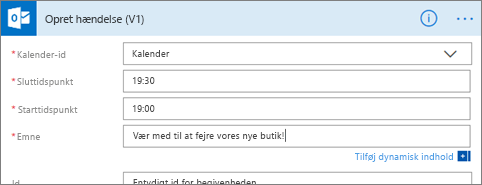
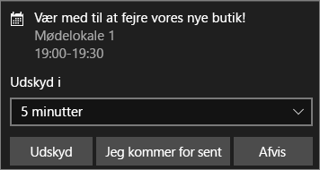

# Microsoft Flow og Power BI

[Microsoft Flow](https://flow.microsoft.com/en-us/documentation/getting-started) er en SaaS til automatisering af arbejdsprocesser på tværs af det stigende antal programmer og tjenester, erhvervsbrugere er afhængige af. Med Flow kan du automatisere opgaver ved at integrere dine foretrukne apps og tjenester (herunder Power BI) for at få meddelelser, synkronisere filer, indsamle data og meget mere. Gentagne opgaver bliver nemme med automatisering af arbejdsprocessen.

[Kom i gang med at bruge Flow nu.](https://flow.microsoft.com/documentation/getting-started)

Se, hvordan Sirui opretter et Flow, der sender en detaljeret mail til kollegaer, når der udløses en besked i Power BI. Følg derefter en trinvis vejledning under videoen for at prøve det selv.

<iframe width="560" height="315" src="https://www.youtube.com/embed/YhmNstC39Mw" frameborder="0" allowfullscreen></iframe>

## Opret et flow, der udløses af databeskeder i Power BI
Denne vejledning viser, hvordan du opretter to forskellige flows; et fra en skabelon og et fra bunden. Følg med ved at [oprette en databesked i Power BI](service-set-data-alerts.md) og [tilmelde dig Microsoft Flow](https://flow.microsoft.com/en-us/#home-signup) (det er gratis!).

## Opret et flow, der bruger Power BI – fra en skabelon
I denne opgave skal vi bruge en skabelon til at oprette et enkelt flow, der udløses af en databesked i Power BI (meddelelse).

1. Log på Microsoft Flow (flow.microsoft.com).
2. Vælg **Mine flow**.
   
   
3. Vælg **Opret fra skabelon**.
   
    
4. Brug søgefeltet til at finde Power BI-skabeloner, og vælg **Send en meddelelse til en Slack-kanal, når en Power BI-databesked udløses**.
   
    
5. Vælg **Brug denne skabelon**.
   
   
6. Hvis du bliver spurgt, skal du oprette forbindelse til Slack og Power BI ved at vælge **Log på** og derefter følge anvisningerne. En grøn markering fortæller dig, om du er logget på.  Når du har bekræftet dine tilslutninger, skal du vælge **Fortsæt**.
   
   

### Byg flowet
Denne skabelon indeholder en udløser (Power BI-databesked om nye olympiske medaljer til Irland) og en handling (send en meddelelse til Slack). Når du vælger et felt, viser Flow dynamisk indhold, du kan inkludere.  I dette eksempel inkluderer vi feltværdien og feltets URL-adresse i meddelelsens brødtekst.

1. Vælg Power BI-databeskeden fra rullemenuen i udløseren. Vælg **Ny medalje til Irland**. Hvis du vil vide mere om, hvordan du opretter en besked, skal du læse [Databeskeder i Power BI](service-set-data-alerts.md).
   
   
2. Hvis du vil sende data til Slack, skal du indtaste et kanalnavn og en meddelelse (du kan også vælge den standardmeddelelse, Flow opretter). Bemærk, det dynamiske indhold vi har medtaget i meddelelsens tekstfelt.
   
   > [!NOTE]
   > Medtag "@" i starten af dit kanalnavn.  Hvis Slack-kanalen f.eks. har navnet "kanalA", skal du indtaste "@channelA" i Flow.
   > 
   > 
   
   
3. Når du er færdig, skal du vælge **Opret flow** eller **Gem flow**.  Flowet er oprettet og vurderet.  Flow giver dig besked, hvis det finder fejl.
4. Hvis der er fundet fejl, skal du vælge **Rediger flow** for at løse dem, ellers skal du vælge **Udført** for at køre det nye flow.
   
   
5. Åbn din Slack-konto for at få vist meddelelsen.  
   
   

## Opret et Flow, der bruger Power BI – fra bunden
I denne opgave skal vi oprette et enkelt flow fra bunden, der udløses af en databesked i Power BI (meddelelse).

1. Log på Microsoft Flow.
2. Vælg **Mine flow** > **Opret fra blank**.
   
   
3. Brug søgefeltet til at finde en Power BI-udløser, og vælg **Udløs et flow med en Power BI-datastyret besked**.

### Byg dit flow
1. Vælg navnet på beskeden på rullelisten.  Hvis du vil vide mere om, hvordan du opretter en besked, skal du læse [Databeskeder i Power BI](service-set-data-alerts.md).
   
    
2. Vælg **Nyt trin** > **Tilføj en handling**.
   
   
3. Søg efter **Outlook**, og vælg **Opret begivenhed**.
   
   
4. Udfyld begivenhedens felter. Når du vælger et felt, viser Flow dynamisk indhold, du kan inkludere.
   
   
5. Vælg **Opret flow**, når du er færdig.  Flow gemmer og vurderer flowet. Vælg **Udført** for at køre dette flow, hvis der ikke er nogen fejl.  Det nye flow er føjet til din side **Mine flow**.
   
   
6. Når flowet udløses af Power BI-databeskeden, modtager du en Outlook-begivenhedsmeddelelse svarende til denne.
   
    

## Næste trin
* [Kom i gang med Microsoft Flow](https://flow.microsoft.com/en-us/documentation/getting-started/)
* [Indstil databeskeder i Power BI-tjenesten](service-set-data-alerts.md)
* [Indstil databeskeder på din iPhone](mobile-set-data-alerts-in-the-mobile-apps.md)
* [Indstil databeskeder i Power BI-mobilappen til Windows 10](mobile-set-data-alerts-in-the-mobile-apps.md)
* Har du flere spørgsmål? [Prøv Power BI-community'et](http://community.powerbi.com/)

