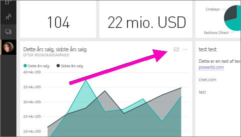
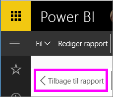

# Vis et visuelt element for et felt eller en rapport i dashboardet i fokuseringstilstand
<iframe width="560" height="315" src="https://www.youtube.com/embed/dtdLul6otYE" frameborder="0" allowfullscreen></iframe>

## Hvad er fokuseringstilstand?
Med ***fokuseringstilstand*** kan du udvide (åbne i et nyt vindue) et visuelt element for et felt eller en rapport i dashboardet for at få vist flere detaljer.  Du kan i fokuseringstilstand se og redigere filtre, der var anvendt, da dette visuelle element blev oprettet.  

> [!NOTE]
> Fokus adskiller sig fra [fuldskærmstilstand](service-tile-fullscreen-mode.md).
> 
> 

1. Peg på feltet eller det visuelle element, og vælg ikonet **Fokuseringstilstand** .  
   
   
2. Hele canvasset åbnes og udfyldes. Fokuseringstilstand for visualisering af felter og rapporter i dashboardet er næsten identisk, men der er nogle forskelle. Hvis du f.eks. vil afslutte fokuseringstilstand i en rapport, skal du vælge **Tilbage til rapport**. Og hvis du vil afslutte fokuseringstilstand i et dashboard, skal du vælge **Afslut Fokustilstand**. Andre forskelle findes i **Overvejelser og fejlfinding** nedenfor.
   
   
3. Udvid filterruden for at få vist alle de filtre, der er anvendt på dette visuelle element.
   
   
4. Udforsk yderligere ved at ændre filtrene, og hvis du finder noget interessant, kan du fastgøre det visuelle element til et dashboard.   
5. Forlad fokuseringstilstand, og vend tilbage til dashboardet ved at vælge **< Afslut Fokustilstand** (i det øverste venstre hjørne af det visuelle element).
   
        
   
    Forlad fokuseringstilstand, og vend tilbage til rapportsiden ved at vælge **Tilbage til rapport**.    
   
    

## Gå fra fokuseringstilstand til fuldskærmstilstand
I fokuseringstilstand kan feltet eller det visuelle element derefter [ses i fuld skærm (tv-tilstand).](service-tile-fullscreen-mode.md) Fuldskærmstilstand vises uden forstyrrende menuer og navigationsknapper.

## Overvejelser og fejlfinding
* Når du bruger fokuseringstilstand med en visualisering i en rapport, kan du se og redigere alle filtre: visualiseringsniveau, sideniveau og rapportniveau.    
* Når du bruger fokuseringstilstand med en visualisering i et dashboard, kan du kun se og redigere filteret på visualiseringsniveau.

Har du flere spørgsmål? [Prøv Power BI-community'et](http://community.powerbi.com/)

