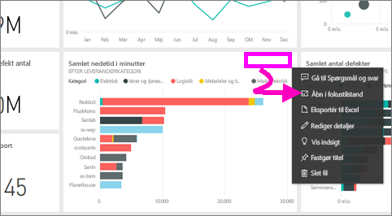
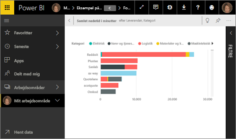
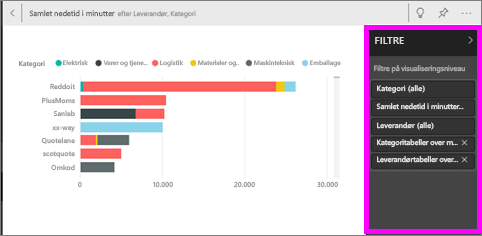
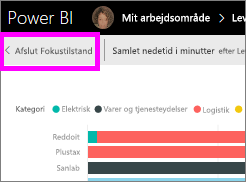

# Vis et dashboardfelt eller en rapportvisualisering i fokustilstand
<iframe width="560" height="315" src="https://www.youtube.com/embed/dtdLul6otYE" frameborder="0" allowfullscreen></iframe>

## Hvad er fokustilstand?
Med ***fokuseringstilstand*** kan du udvide (åbne i et nyt vindue) et visuelt element for et felt eller en rapport i dashboardet for at få vist flere detaljer.  I fokustilstand kan du se og redigere filtre, der var anvendt, da denne visual blev oprettet.  

> [!NOTE]
> Fokus adskiller sig fra [fuldskærmstilstand](service-fullscreen-mode.md).
> 
## Fokustilstand for dashboardfelter
1. Peg på feltet visualisering, vælg ellipsen (...) og vælg **Åbn i fokustilstand** .  
   
2. Feltet åbnes og hele rapportlærredet udfyldes. 

   

3. Udvid filterruden for at få vist alle de filtre, der er anvendt på dette visuelle element.
   
   

4. Udforsk yderligere ved at ændre filtrene, og hvis du finder noget interessant, kan du fastgøre det visuelle element til et dashboard.

5. Forlad fokustilstand, og vend tilbage til dashboardet ved at vælge **< Afslut fokustilstand** (i det øverste venstre hjørne af din visual).
   
        

## Fokustilstand for rapportvisualiseringer

1. Peg på rapportvisualiseringen, og vælg ikonet **fokustilstand** .  
   
   
2. Visualiseringen åbnes og udfylder hele lærredet. 

   
   
3. Udvid filterruden for at få vist alle de filtre, der er anvendt på dette visuelle element.
   
   
4. Udforsk yderligere ved at ændre filtrene, og hvis du finder noget interessant, kan du fastgøre det visuelle element til et dashboard.   
5. Forlad fokustilstand, og vend tilbage til rapporten ved at vælge **Tilbage til rapport** (i det øverste venstre hjørne af din visual). 
   
      

## Gå fra fokustilstand til fuldskærmsvisning
I fokustilstand kan feltet eller din visual derefter [ses i fuld skærm (tv-tilstand.)](service-fullscreen-mode.md) Fuldskærmsvisning vises uden forstyrrende menuer og navigationsknapper.

## Overvejelser og fejlfinding
* Når du bruger fokustilstand med en visualisering i en rapport, kan du se og redigere alle filtre: visualiseringsniveau, sideniveau og rapportniveau.    
* Når du bruger fokustilstand med en visualisering i et dashboard, kan du kun se og redigere filteret på visualiseringsniveau.

Har du flere spørgsmål? [Prøv at spørge Power BI-community'et](http://community.powerbi.com/)

