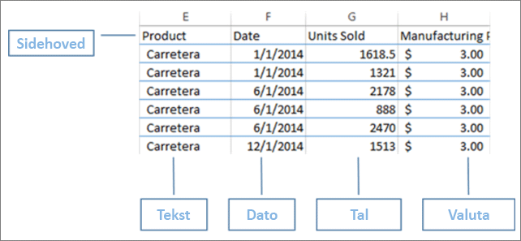
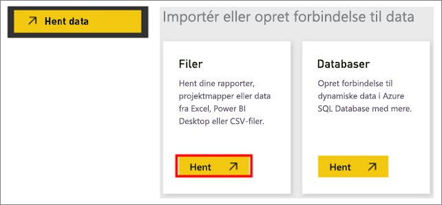
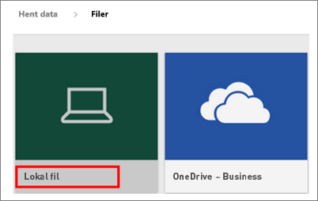
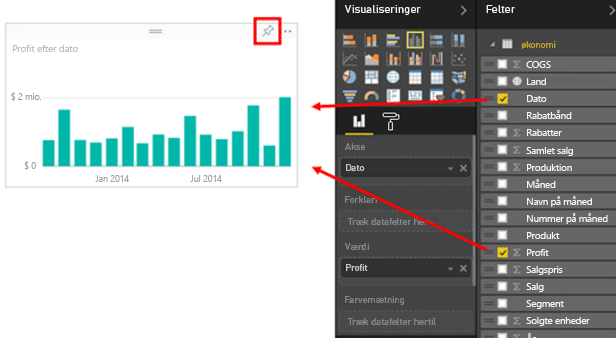
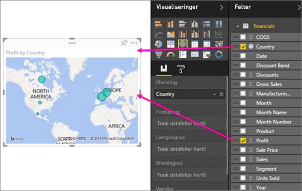
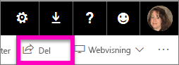
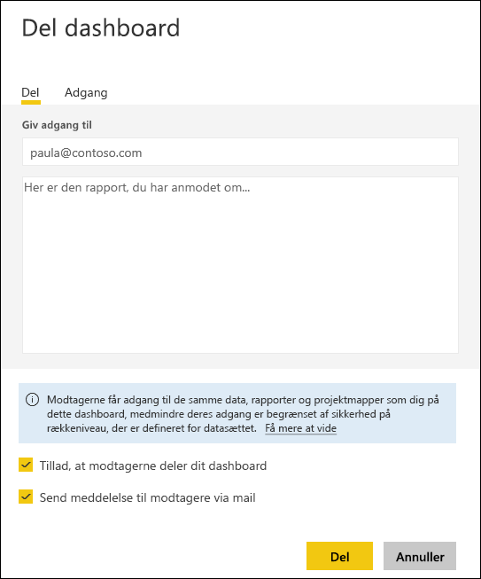

# Fra Excel-projektmappe til fantastisk rapport på ingen tid
Din chef vil gerne se en rapport om dine seneste salgstal kombineret med dine seneste kampagneannoncer, inden dagen er omme. Men de seneste data befinder sig på forskellige systemer hos tredjeparter og i filer på din bærbare computer. Tidligere har det taget timevis at oprette visuals og formatere en rapport. Du begynder at blive bekymret.

Bare rolig. Med Power BI kan du oprette en imponerende rapport på ingen tid.

I dette eksempel uploader vi en Excel-fil fra et lokalt system, opretter en ny rapport og deler den med kollegaer – alt sammen fra Power BI.

## Forbered dine data
Lad os tage en simpel Excel-fil som eksempel. Før du kan indlæse din Excel-fil i Power BI, skal du organisere dine data i en flad tabel. Det betyder, at hver kolonne indeholder den samme datatype – f.eks. tekst, dato, tal eller valuta. Du skal have en kolonneoverskrift, men der må ikke være en kolonne eller række, der viser totaler.

Formatér derefter dataene som en tabel. I Excel skal du vælge **Formatér som tabel** i gruppen Typografier på fanen Hjem. Vælg en tabeltypografi, der skal anvendes på regnearket. Dit Excel-regneark er nu klar til at blive indlæst i Power BI.

## Upload din Excel-fil til Power BI
Power BI opretter forbindelse til mange datakilder, herunder Excel-filer, der findes på din computer. Log på Power BI for at komme i gang. Hvis du ikke har tilmeldt dig, [kan du gøre det gratis](https://powerbi.com).

Du vil oprette et nyt dashboard. Åbn **Mit arbejdsområde**, og vælg ikonet **+ Opret**.

Vælg **Dashboard**, angiv et navn, og vælg **Opret**. Det nye dashboard vises – uden data.

Vælg **Hent data** nederst i venstre navigationsrude. Vælg **Hent** i feltet Filer under Opret forbindelse til data på siden Hent data.

Vælg **Lokal fil** på siden Filer. Gå til Excel-projektmappefilen på computeren, og markér den for at indlæse den i Power BI. Vælg **Importér**.

> **BEMÆRK!** Brug [projektmappen Financial Sample](sample-financial-download.md) for at følge med i resten af dette selvstudium.
> 
> 

## Opbyg din rapport
Når Power BI har importeret din Excel-fil, kan du begynde at opbygge din rapport. Når meddelelsen **Dit datasæt er parat** vises, skal du vælge **Vis datasæt**.  Power BI åbnes i redigeringsvisningen og viser rapportlærredet. Til højre finder du ruderne Visualizations, Filters og Fields.

Bemærk, at dataene fra tabellen din Excel-projektmappe vises i ruden Felter. Under tabellens navn viser Power BI kolonneoverskrifterne som individuelle felter.

Nu kan du begynde at oprette visualiseringer. Din chef vil gerne se profit over tid. I ruden Fields skal du trække **Profit** over på rapportlærredet. Power BI viser et søjlediagram som standard. Derefter skal du trække **Date** over på rapportlærredet. Power BI opdaterer søjlediagrammet for at vise profit efter dato.

> **TIP!** Hvis diagrammet ikke ser ud som forventet, skal du kontrollere dine aggregeringer. For eksempel kan du under **Value** højreklikke på det felt, du lige har tilføjet, og kontrollere, at dataene lægges sammen på den måde, du ønsker.  I dette eksempel bruger vi **Sum**.
> 
> 

Din chef vil gerne vide, hvilke lande/områder der er mest rentable. Imponer hende med en kortvisualisering. Vælg et tomt område på lærredet, og træk felterne **Country** og derefter **Profit** dertil fra ruden Fields. Power BI opretter en kortvisual med bobler, der repræsenterer avancen for hver af de enkelte placeringer.

Hvad med at vise en visual for salg efter produkt og markedssegment? Nemt nok. Markér afkrydsningsfelterne ud for Sales, Product og Segment i ruden Fields. Power BI opretter straks et liggende søjlediagram. Du kan ændre diagramtypen ved at vælge et af ikonerne i menuen Visualizations. Du kan f.eks. ændre det til et stablet liggende søjlediagram.  Hvis du vil sortere diagrammet, skal du vælge ellipsen (...) > **Sort by**.

Fastgør alle dine visuals til dashboardet. Du er klar til at dele dem med dine kollegaer.

## Del dit dashboard
Du vil gerne dele dashboardet med din chef, Paula. Du kan dele dit dashboard og den underliggende rapport med enhver kollega, der har en Power BI-konto. De kan interagere med rapporten, men du kan ikke gemme ændringerne.

Hvis du vil dele din rapport, skal du vælge **Del** øverst på dashboardet.

Power BI viser siden Del dashboard. Angiv mailadresser på modtagerne i det øverste område. Tilføj en meddelelse i feltet nedenfor. Hvis du vil tillade dine kollegaer at dele dit dashboard med andre, skal du markere **Tillad, at modtagerne må dele dette dashboard**. Vælg **Del**.

Næste trin

* [Kom i gang med Power BI-tjenesten](service-get-started.md)
* [Kom i gang med Power BI Desktop](desktop-getting-started.md)
* [Power BI – Grundlæggende begreber](service-basic-concepts.md)
* Har du flere spørgsmål? [Prøv at spørge Power BI-community'et](http://community.powerbi.com/)

