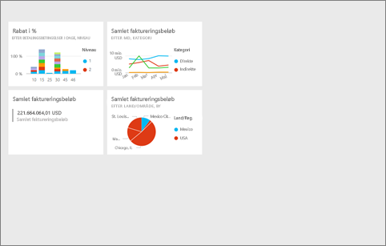
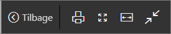
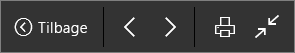
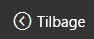
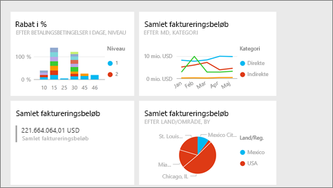
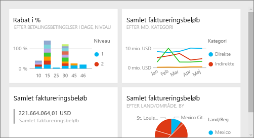
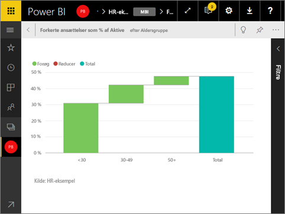

# Fuldskærmsvisning i Power BI-tjenesten
## Hvad er fuldskærmsvisning?

Få vist dit Power BI-indhold (dashboards, rapportsider, felter og visualiseringer) uden forstyrrende menuer og navigationslinjer.  Du får en rendyrket og komplet visning af dit indhold med et øjekast – hele tiden. Dette kaldes også tv-tilstand. Den tilgængelige funktionalitet i fuldskærmsvisning varierer afhængigt af indhold. 

Hvis du bruger Power BI – Mobil, er [fuld skærm tilgængelig for Windows 10 Mobile-apps](mobile-windows-10-app-presentation-mode.md). Power BI Desktop har ikke en fuldskærmstilstand for rapporter eller visualiseringer, men har Tilpas til siden for [relationsvisning](desktop-report-view.md) og [fokustilstand for rapportvisuals](service-focus-mode.md).

 

Nogle situationer, hvor det giver mening at bruge fuldskærmstilstand, er følgende:

* Præsentation af dit dashboard, felt, en visual eller en rapport på et møde eller en konference.
* Visning på et kontor på en dedikeret stor skærm eller projektor.
* Visning på en lille skærm.
* Gennemse i låst tilstand – du kan røre skærmen eller holde musen over felter uden at åbne underliggende rapporter eller dashboards.

> **BEMÆRK!** Fuldskærmsvisning adskiller sig fra [Fokustilstand (pop ud)](service-focus-mode.md).
> 
> 

Se Amanda åbne og navigere på sit dashboard i fuldskærmsvisning og derefter anvende nogle URL-parametre til at styre standardvisningen. Følg derefter den trinvise vejledning under videoen for at prøve det selv.

<iframe width="560" height="315" src="https://www.youtube.com/embed/c31gZkyvC54" frameborder="0" allowfullscreen></iframe>

## Dashboards og rapportsider i fuldskærmsvisning
1. På menulinjen i Power BI over dit dashboard eller din rapport skal du vælge **fuld skærm**-ikonet  . Dit dashboardlærred eller din rapportside fylder hele skærmen. Nedenstående eksempel er et dashboard.
   
      
2. I fuldskærmsvisning har du flere valgmuligheder i menuen.  Hvis du vil have vist menuen, skal du blot bevæge musen eller markøren. 
   
     Menu til dashboards    
         
   
     Menu til rapportsider    
        
   
        
    Brug knappen **Tilbage** for at navigere til den forrige side i browseren. Hvis den forrige side var en Power BI-side, vises den også i fuldskærmsvisning.  Fuldskærmsvisning bevares, indtil du afslutter ved at lukke den.
   
        
    Brug denne knap til at udskrive dit dashboard eller en rapportside i fuldskærmsvisning. 
   
        
    Brug knappen **Tilpas til skærm** for at få vist et dashboard i den størst mulige størrelse, uden at der er brug for rullepaneler.     
   
    
   
           
    Nogle gange er du ligeglad med rullepaneler, men vil have dashboardet til at fylde hele bredden af den tilgængelige plads. Vælg knappen **Tilpas til bredde**.    
   
    
   
           
    I rapporter i fuldskærmsvisning kan du bruge disse pile til at flytte mellem siderne i rapporten.    
3. Hvis du vil afslutte fuldskærmsvisning, skal du vælge ikonet **Afslut fuld skærm**.
   
      

## Visualiseringer og dashboardfelter i fuldskærmsvisning
1. For at få vist felter i dashboardet og rapportvisualiseringer i fuldskærmsvisning skal du starte med det felt eller den visualisering, der allerede er i [Fokustilstand](service-focus-mode.md). 
   
    
2. Vælg derefter ikonet Fuld skærm   for det pågældende felt eller visuelle element. Det pågældende felt eller visuelle element vises i fuld skærm uden menuer eller navigationslinjer.
   
    

## Næste trin
[Dashboards i Power BI](service-dashboards.md)  
[Fokustilstand](service-focus-mode.md)    

Har du flere spørgsmål? [Prøv at spørge Power BI-community'et](http://community.powerbi.com/)

