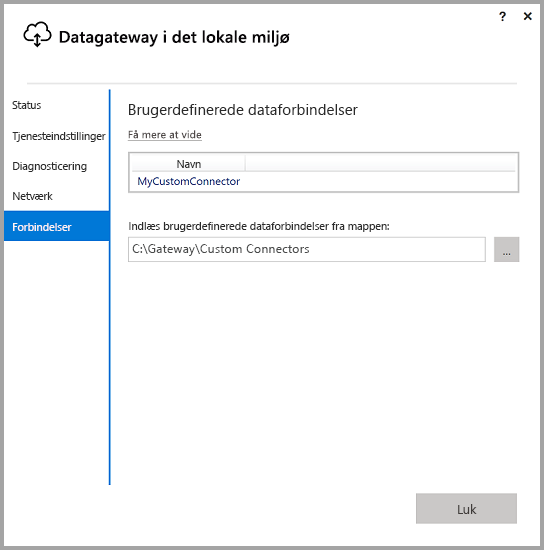
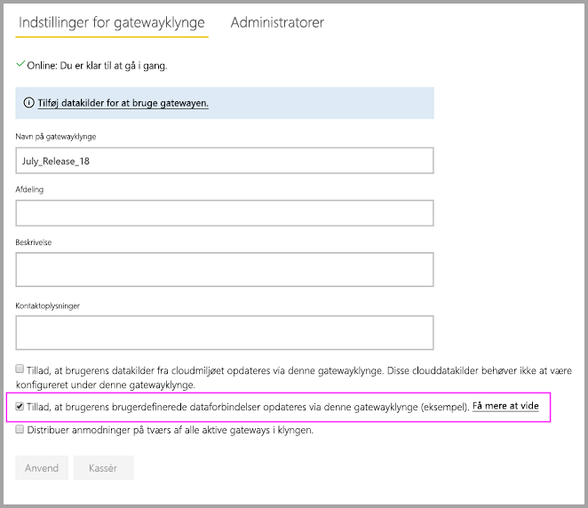
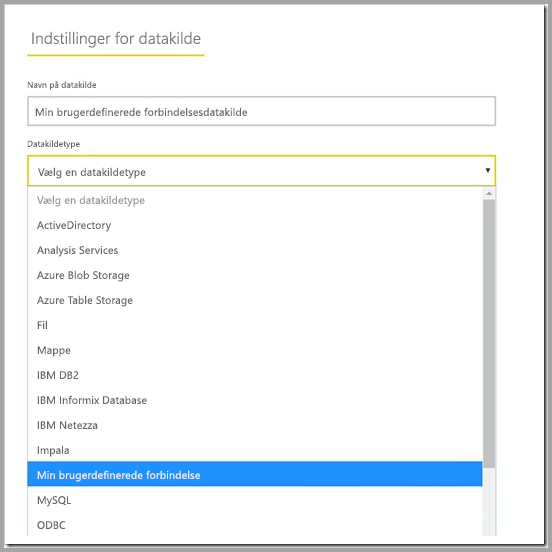

# Brug brugerdefinerede dataconnectors med datagatewayen i det lokale miljø

[!INCLUDE [gateway-rewrite](includes/gateway-rewrite.md)]

Med dataconnectors til Power BI kan du oprette forbindelse til og få adgang til data fra et program, en tjeneste eller en datakilde. Du kan udvikle brugerdefinerede dataconnectors og bruge dem i Power BI Desktop.

Hvis du vil vide mere om, hvordan du udvikler brugerdefinerede dataconnectors til Power BI, skal du se [GitHub-siden om SDK til dataconnector](http://aka.ms/dataconnectors). Dette websted indeholder oplysninger om, hvordan du kommer godt i gang og eksempler til Power BI og Power-forespørgsel.

Når du opretter rapporter i Power BI Desktop, der bruger brugerdefinerede dataconnectors, kan du bruge datagatewayen i det lokale miljø til at opdatere rapporterne fra Power BI-tjenesten.

## Sådan aktiverer og bruger du denne egenskab

Når du installerer versionen fra juli 2018 af datagatewayen i det lokale miljø eller en nyere version, kan du se fanen **Connectors** i programmet til datagatewayen i det lokale miljø, og du kan vælge en mappe, du vil indlæse brugerdefinerede connectors fra. Du skal vælge en mappe, som den bruger, der kører gatewaytjenesten, har adgang til (det er som standard *NT SERVICE\PBIEgwService*). Gatewayen indlæser automatisk filerne til den brugerdefinerede connector i mappen, og du kan se dem på listen over dataconnectors.

Hvis du bruger datagatewayen i det lokale miljø (personlig tilstand), kan du på nuværende tidspunkt uploade din Power BI-rapport til Power BI-tjenesten og bruge gatewayen til at opdatere den.

Du skal stadig oprette en datakilde til din brugerdefinerede connector i forbindelse med datagatewayen i det lokale miljø. På siden med indstillinger for gatewayen i Power BI-tjenesten skulle der blive vist en ny indstilling, når du vælger gatewayklyngen for at tillade brugen af brugerdefinerede connectors med denne klynge. Sørg for, at alle gateways i klyngen har juli 2018-udgivelsen eller nyere, for at indstillingen er tilgængelig. Vælg indstillingen for at aktivere brugen af brugerdefinerede connectors med denne klynge.

Når denne indstilling er aktiveret, kan du se dine brugerdefinerede connectors som datakilder, du kan oprette under denne gatewayklynge. Når du opretter en datakilde ved hjælp af den nye brugerdefinerede connector, kan du nu opdatere Power BI-rapporter ved hjælp af den brugerdefinerede connector i Power BI-tjenesten.

## Overvejelser og begrænsninger

* Kontrollér, at den mappe, du opretter, er tilgængelig for gatewaytjenesten i baggrunden. Mapper under din brugers Windows-mappe eller systemmapper vil normalt ikke være tilgængelige. I programmet til datagatewayen i det lokale miljø vises der en meddelelse, hvis mappen ikke er tilgængelig (dette gælder ikke for den personlige version af gatewayen)
* Hvis brugerdefinerede connectors skal kunne fungere sammen med datagatewayen i det lokale miljø, skal de implementere sektionen "TestConnection" i koden til den brugerdefinerede connector. Dette er ikke påkrævet, når du bruger brugerdefinerede connectors med Power BI Desktop. Derfor kan du have en, der virker med Desktop, men ikke med gatewayen. I [denne dokumentation](https://github.com/Microsoft/DataConnectors/blob/master/docs/m-extensions.md#implementing-testconnection-for-gateway-support) kan du se, hvordan du implementerer sektionen TestConnection.

## Næste trin

* [Administrer din datakilde – Analysis Services](service-gateway-enterprise-manage-ssas.md)  
* [Administrer din datakilde – SAP HANA](service-gateway-enterprise-manage-sap.md)  
* [Administrer din datakilde – SQL Server](service-gateway-enterprise-manage-sql.md)  
* [Administrer din datakilde – Oracle](service-gateway-onprem-manage-oracle.md)  
* [Administrer din datakilde – Import/Planlagt opdatering](service-gateway-enterprise-manage-scheduled-refresh.md)  

* [Konfigurer proxyindstillinger for datagatewayen i det lokale miljø](/data-integration/gateway/service-gateway-proxy)  
* [Brug Kerberos til SSO (enkeltlogon) fra Power BI til datakilder i det lokale miljø](service-gateway-sso-kerberos.md)  

Har du flere spørgsmål? [Prøv at spørge Power BI-community'et](http://community.powerbi.com/)
