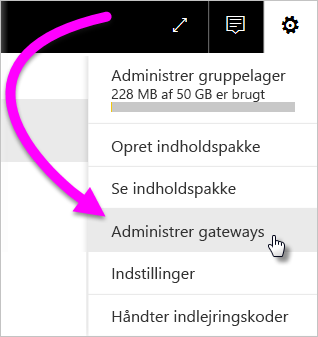
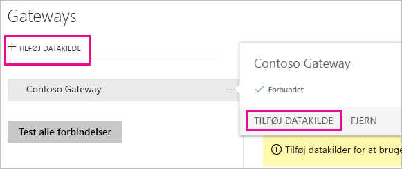
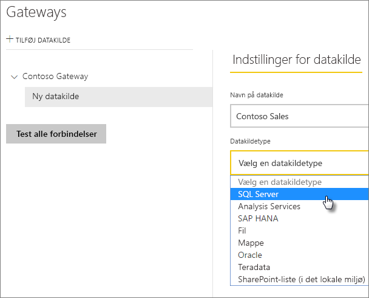
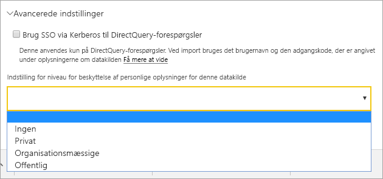
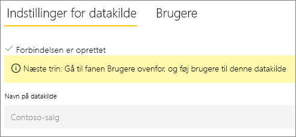
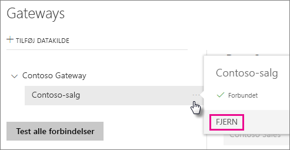
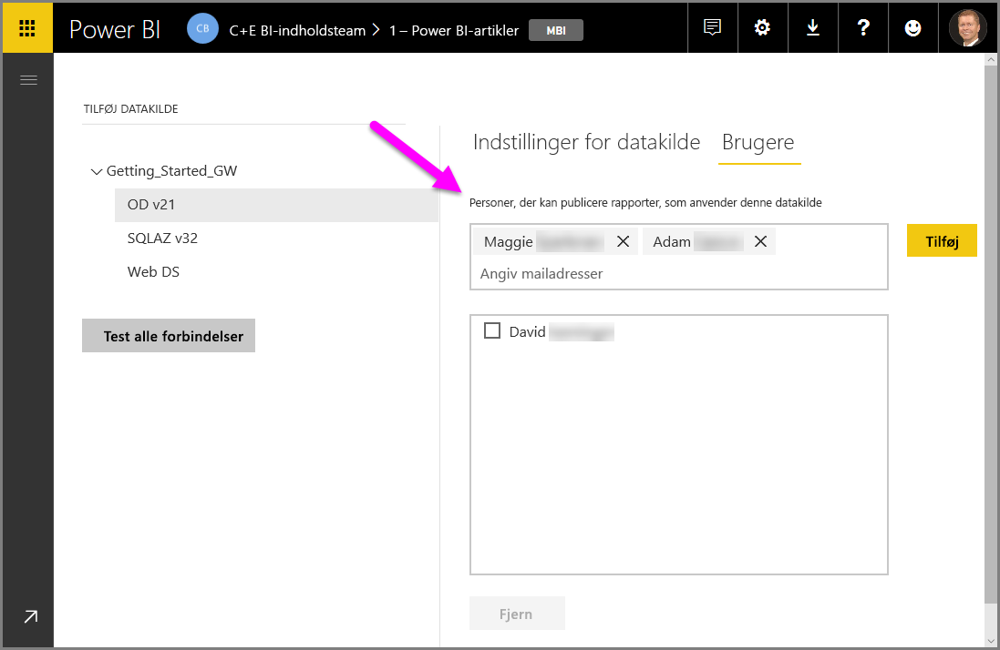
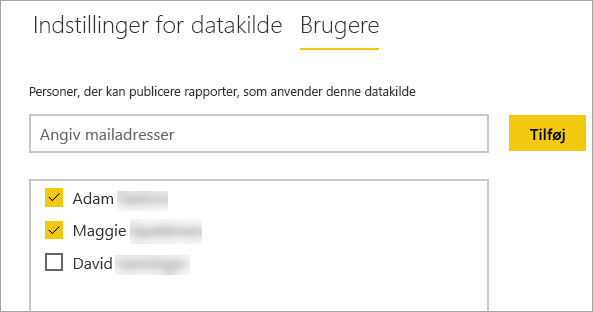
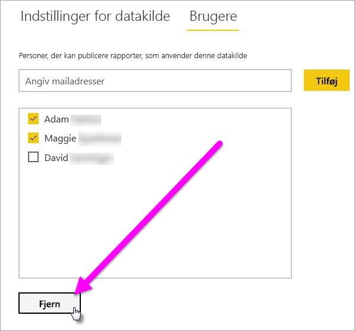

# Administrer datakilder

[!INCLUDE [gateway-rewrite](includes/gateway-rewrite.md)]

Power BI understøtter mange datakilder i det lokale miljø, og de har hver især sine egne krav. En gateway kan bruges til en enkelt datakilde eller flere datakilder. I dette eksempel viser vi dig, hvordan du tilføjer SQL Server som en datakilde. Trinnene svarer til trinnene for andre datakilder.

De fleste handlinger til administration af datakilder kan også udføres vha. API'er. Du kan finde flere oplysninger i [REST API'er (gateways)](/rest/api/power-bi/gateways).

## Tilføj en datakilde

1. I øverste højre hjørne af Power BI-tjenesten skal du vælge tandhjulsikonet  > **Administrer gateways**.

    

2. Vælg en gateway, og vælg derefter **Tilføj datakilde**. Eller gå til **Gateways** > **Tilføjdata kilde**.

    

3. Vælg **Datakildetype**.

    

4. Angiv oplysninger for datakilden. I dette eksempel er det **Server**, **Database** og andre oplysninger. 

    

5. Du kan vælge **godkendelsesmetoden** **Windows** eller **Basic** (SQL-godkendelse) for SQL Server. Hvis du vælger **Basic**, skal du angive legitimationsoplysningerne for datakilden.

6. Under **Avancerede indstillinger** kan du eventuelt konfigurere [niveauet for beskyttelse af personlige oplysninger](https://support.office.com/article/Privacy-levels-Power-Query-CC3EDE4D-359E-4B28-BC72-9BEE7900B540) for din datakilde (gælder ikke for [DirectQuery](desktop-directquery-about.md)).

    

7. Vælg **Tilføj** Du får vist *Forbindelsen er oprettet*, hvis processen lykkes.

    

Du kan nu bruge denne datakilde til at inkludere data fra SQL Server i dine Power BI-dashboards og -rapporter.

## Fjern en datakilde

Du kan fjerne en datakilde, hvis du ikke længere bruger den. Hvis du fjerner en datakilde, ødelægger det alle dashboards og rapporter, der anvender den pågældende datakilde.

Hvis du vil fjerne en datakilde, skal du gå til datakilden og derefter vælge **Fjern**.

## Brug af datakilden til planlagt opdatering eller DirectQuery

Når du opretter datakilden, er den tilgængelig til brug med enten DirectQuery-forbindelser eller via en planlagt opdatering.

> [!NOTE]
>Server- og databasenavne skal matche mellem Power BI Desktop og datakilden i datagatewayen i det lokale miljø.

Linket mellem dit datasæt og datakilden i gatewayen er baseret på dit servernavn og databasenavn. Disse navne skal være ens. Hvis du f.eks. angiver en IP-adresse for servernavnet i Power BI Desktop, skal du bruge IP-adressen til datakilden i konfigurationen af gatewayen. Hvis du bruger *SERVER\INSTANCE* i Power BI Desktop, skal du bruge det samme i den datakilde, der er konfigureret for gatewayen.

Hvis du er angivet under fanen **Brugere** i den datakilde, der er konfigureret i gatewayen, og server- og databasenavnet stemmer overens, får du vist gatewayen som en mulighed, der kan bruges sammen med en planlagt opdatering.

> [!WARNING]
> Hvis dit datasæt indeholder flere datakilder, skal hver enkelt datakilde føjes til gatewayen. Hvis en eller flere datakilder ikke er føjet til gatewayen, kan du ikke se gatewayen som tilgængelig i forbindelse med en planlagt opdatering.

### Begrænsninger

OAuth er kun en understøttet godkendelsesplan for brugerdefinerede connectors med datagatewayen i det lokale miljø. Du kan ikke tilføje andre datakilder, der kræver OAuth. Hvis dit datasæt har en datakilde, der kræver OAuth, og denne datakilde ikke er en brugerdefineret connector, kan du ikke bruge gatewayen til planlagt opdatering.

## Administrer brugere

Når du har føjet en datakilde til en gateway, giver du brugere og mailaktiverede sikkerhedsgrupper adgang til den specifikke datakilde (ikke hele gatewayen). Brugerlisten for datakilden styrer kun, hvem der har tilladelse til at udgive rapporter, der indeholder data fra datakilden. Rapporternes ejere kan oprette dashboards, indholdspakker og apps og derefter dele disse med andre brugere.

Du kan også give brugere og sikkerhedsgrupper administrativ adgang til gatewayen.

### Føj brugere til en datakilde

1. I øverste højre hjørne af Power BI-tjenesten skal du vælge tandhjulsikonet  > **Administrer gateways**.

2. Vælg den datakilde, hvor du vil tilføje brugere.

3. Vælg **Brugere**, og angiv en bruger fra din organisation, som du vil give adgang til den valgte datakilde. På følgende skærmbillede tilføjer du f.eks. Maggie og Adam.

    

4. Hvis du vælger **Tilføj**, vises det tilføjede medlems navn i feltet.

    

Husk, at du skal føje brugere til hver enkelt datakilde, som du vil give adgang til. Hver datakilde har en separat liste over brugere. Føj brugere separat til hver enkelt datakilde.

### Fjern brugere fra en datakilde

Under fanen **Brugere** for datakilden kan du fjerne brugere og sikkerhedsgrupper, som bruger denne datakilde.

## Lagring af krypterede legitimationsoplysninger i clouden

Når du føjer en datakilde til gatewayen, skal du angive legitimationsoplysninger for den pågældende datakilde. Alle forespørgsler til datakilden kører ved hjælp af disse legitimationsoplysninger. Legitimationsoplysningerne er krypteret på en sikker måde. De anvender symmetrisk kryptering, så de ikke kan dekrypteres i cloudmiljøet, før de er gemt i cloudmiljøet. Legitimationsoplysningerne sendes til den maskine, der kører gateway'en, i det lokale miljø, hvor de dekrypteres, når datakilderne tilgås.

## Liste over tilgængelige datakildetyper

Datagatewayen i det lokale miljø understøtter følgende datakilder til Power BI. Ud over datakilder i det lokale miljø kan kilder bag en firewall, VPN eller et virtuelt netværk også have brug for en datagateway.

| **Datakilde** | **Live/DirectQuery** | **Manuel eller planlagt opdatering (brugerkonfigureret)** |
| --- | --- | --- |
| Amazon Redshift |Ja |Ja |
| Analysis Services |Ja |Ja |
| AtScale-kuber |Ja |Ja |
| Azure Active Directory |Nej |Ja |
| Azure Blob Storage |Nej |Ja |
| Azure DevOps Server |Nej |Ja |
| Azure Table Storage |Nej |Ja |
| BI Connector |Ja |Ja |
| Denodo |Ja |Ja |
| Dremio |Ja |Ja |
| EmigoDataSourceConnector |Nej |Ja |
| Essbase |Ja |Ja |
| Exasol |Ja |Ja |
| Fil |Nej |Ja |
| Mappe |Nej |Ja |
| Paxatas |Nej |Ja |
| IBM DB2 |Ja |Ja |
| IBM Informix Database |Nej |Ja |
| IBM Netezza |Ja |Ja |
| Impala |Ja |Ja |
| Jethro ODBC |Ja |Ja |
| Kyligence Enterprise |Ja |Ja |
| MarkLogic ODBC |Ja |Ja |
| Microsoft Graph Security |Nej |Ja |
| MySQL |Nej |Ja |
| ODBC |Nej |Ja |
| OData |Nej |Ja |
| OLE DB |Nej |Ja |
| Oracle |Ja |Ja |
| PostgreSQL |Nej |Ja |
| QubolePresto |Ja |Ja |
| Hurtig basisconnector |Nej |Ja |
| SAP Business Warehouse-meddelelsesserver |Ja |Ja |
| SAP Business Warehouse-server |Ja |Ja |
| SAP HANA |Ja |Ja |
| SQL Server |Ja |Ja |
| SharePoint |Nej |Ja |
| Snowflake |Ja |Ja |
| Spark |Ja |Ja |
| SurveyMonkey |Nej |Ja |
| Sybase |Nej |Ja |
| TeamDesk.Database |Nej |Ja |
| Teradata |Ja |Ja |
| Vertica |Ja |Ja |
| Web |Nej |Ja |
| Workforce Dimensions |Nej |Ja |

## Næste trin

* [Administrer din datakilde – Analysis Services](service-gateway-enterprise-manage-ssas.md)
* [Administrer din datakilde – SAP HANA](service-gateway-enterprise-manage-sap.md)
* [Administrer din datakilde – SQL Server](service-gateway-enterprise-manage-sql.md)
* [Administrer din datakilde – Oracle](service-gateway-onprem-manage-oracle.md)
* [Administrer din datakilde – Import/planlagt opdatering](service-gateway-enterprise-manage-scheduled-refresh.md)
* [Vejledning til installation af en datagateway](service-gateway-deployment-guidance.md)

Har du flere spørgsmål? Prøv at spørge [Power BI-community'et](https://community.powerbi.com/).
