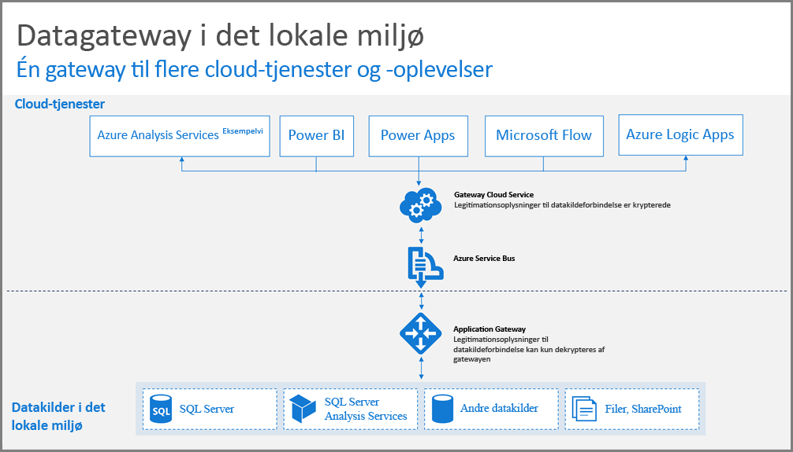
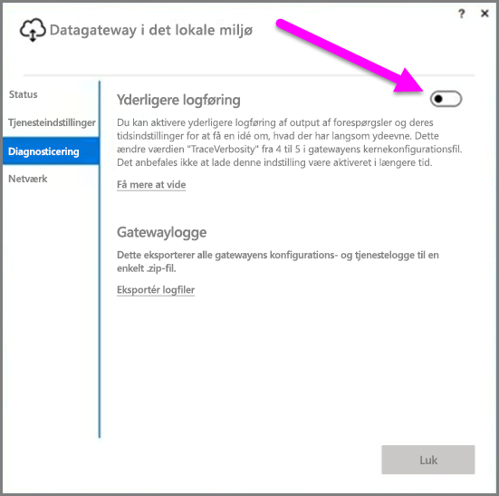
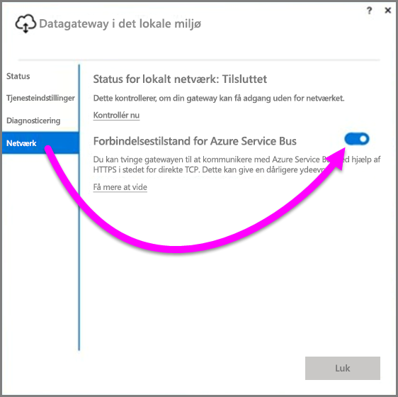
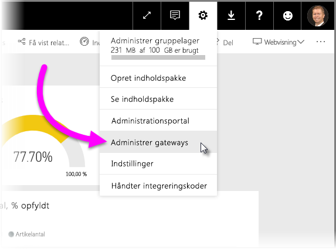

# Vejledning i at installere en datagateway til Power BI
Denne artikel indeholder vejledning og overvejelser ved installation af en datagateway i dit netværksmiljø. En **gateway** er software, der gør det nemmere at få adgang til data, der er placeret på et privat netværk i det lokale miljø til efterfølgende brug i en cloudtjeneste som Power BI. Denne artikel giver en trinvis vejledning i at installere og konfigurere **datagatewayen i det lokale miljø**.

Hvis du vil vide mere om **datagateway i det lokale miljø**, inklusive et link til installationsvejledningen, så kan du se [blogindlægget](https://powerbi.microsoft.com/blog/power-bi-gateways-march-update/).

## Overvejelser ved installationen af datagatewayen i det lokale miljø
Før vi begynder på en detaljeret gennemgang af installation og udrulning, er der en række overvejelser, som du bør holde dig for øje. De nedenstående afsnit beskriver vigtige faktorer, som du bør tage i betragtning.

### Antal brugere
Antallet af brugere, som forbruger en rapport, der bruger gatewayen, er en vigtig metrik i forbindelse med beslutningen om, hvor gatewayen skal installeres. Her er nogle spørgsmål, som bør tages med i overvejelserne:

* Bruges disse rapporter på forskellige tidspunkter på dagen af brugerne?
* Hvilke typer forbindelser bruger de (DirectQuery eller Import)?
* Bruger alle brugerne den samme rapport?

Hvis samtlige brugere tilgår en given rapport på samme tidspunkt på dagen, bør du sørge for at installere gatewayen på en computer, der har kapacitet til at håndtere alle disse anmodninger (se de følgende afsnit for oplysninger om ydelsestællere og mindskekrav, der kan hjælpe dig med at fastsætte dette).

Der findes en begrænsning i **Power BI**, der kun tillader *én* gateway pr. *rapport*, så selvom en rapport er baseret på flere datakilder, så skal alle disse kilder gå gennem en enkelt gateway. Men hvis et dashboard er baseret på *adskillige* rapporter, så kan du bruge en dedikeret gateway til hver bidragende rapport og derigennem distribuere gateway-belastningen mellem de pågældende rapporter, der bidrager til det enkelte dashboard.

### Forbindelsestype
**Power BI** giver mulighed for to typer forbindelser, **DirectQuery** og **Import**. Ikke alle datakilder understøtter begge forbindelsestyper, og mange årsager kan bidrage til, at man vælger den ene frem for den anden, som f.eks. sikkerhedskrav, ydeevne, datagrænser og datamodelstørrelser. Du kan få mere at vide om forbindelsestype og understøttede datakilder i *listen over tilgængelige datakildetyper* i [artiklen om datagateway i det lokale miljø](service-gateway-onprem.md).

Brugen af gatewayen kan variere afhængigt af den brugte forbindelsestype. Du bør f.eks. altid prøve at adskille **DirectQuery**-datakilder fra **Planlagt opdatering**-datakilder, når det er muligt (hvis altså de er i forskellige rapporter og kan adskilles). Dette forhindrer, at gatewayen ophobes med tusindvis af DirectQuery-anmodninger samtidigt med morgenens planlagte opdatering af en stor datamodelstørrelse, der bruges til virksomhedens primære dashboard. Følgende overvejelser bør tages i hver situation:

* **Planlagt opdatering**: Afhængigt af din forespørgselstørrelse og antallet af foretagne opdateringer pr. dag kan du vælge at forblive mellem de anbefalede mindstekrav til hardware eller opgradere til en computer med større ydeevne. Hvis en given forespørgsel ikke foldes, så sker transformationen på gatewayens computer og dermed drager gatewayens computer fordel af at have mere tilgængelig RAM.
* I relation til **DirectQuery**: En forespørgsel sendes hver gang, en given bruger åbner rapporten eller gransker data. Så hvis du forventer, at flere end 1000 brugere tilgår data samtidigt, så bør du sørge for, at din computer har robuste og kapacitetstunge hardwarekomponenter. Flere CPU-kerner vil resultere i et forbedret gennemløb for en **DirectQuery**-forbindelse.

Der er følgende krav til en maskine, hvorpå du installerer en **datagateway i det lokale miljø**:

**Minimum:**

* .NET 4.5 Framework
* 64-bit-version af Windows 7 / Windows Server 2008 R2 (eller nyere)

**Anbefalet:**

* CPU med 8 kerner
* 8 GB hukommelse
* 64-bit-version af Windows 2012 R2 (eller nyere)

### Placering
Gateway-installationens placering kan have stor indvirkning på din forespørgselsydeevne, så du bør sørge for, at din gateway, datakildeplacering og Power BI-lejeren er placeret så tæt på hinanden som muligt for at minimere netværksventetid. For at fastsætte din Power BI-lejerplacering i Power BI-tjenesten, skal du vælge **?**- ikonet i det øverste højre hjørne og vælge **Om Power BI**.

### Overvågning af gateways
Der findes et par værktøjer, du kan bruge til at overvåge brugen af og ydeevnen knyttet til dine installerede gateways.

#### Ydelsestællere
Der er mange ydelsestællere, der kan bruges til at evaluere og vurdere aktiviteter, der opstår på gatewayen. Tællerne kan hjælpe dig med at se, om du har store mængder aktiviteter af den specifikke type, som kan få dig til at udrulle en ny gateway.

> [!NOTE]
> Disse tællere opsamler ikke specifik opgavevarighedstid.
> 
> 

*Gatewaytælleren* vil i supplement med computertælleren give dig et billede af, hvor stor en belastning din computer håndterer og kan give en indikation af, om serverens ressourcekapacitet belastes betydeligt eller overbelastes.

Disse tællere kan tilgås fra **Windows Ydelsesmåler** og kan forbruges af ethvert rapporteringsværktøj, du bruger til dette formål. Du kan få en detaljeret gennemgang af, hvordan du bruger gatewayens ydelsesovervågning med Power BI i det følgende community-oprettede blogindlæg.

* [Overvågning af datagateways i det lokale miljø](https://insightsquest.com/2016/08/08/monitor-on-premises-data-gateways/)

#### Logfiler
Konfigurations- og tjenestelogfiler viser en anden dimension af, hvad der sker med din gateway. Du skal altid kontrollere dine gateway-logfiler, når forbindelsen ikke fungerer som forventet, idet ikke alle fejlmeddelelser vises på Power BI-tjenesten.

Du kan let få vist alle logfiler på din lokale computer ved at bruge knappen *Exportlogfiler* på **datagatewayen i det lokale miljø**, når du genåbner gatewayen efter den indledende installation er færdig og derefter vælger **Diagnostik > Eksportlogfiler**.

#### Yderligere logføring
På gatewayen udføres som standard grundlæggende logføring. Hvis du er i gang med at efterforske gateway-problemer og har brug for flere oplysninger om forespørgselsforbindelsen, så kan du midlertidigt aktivere *Detaljeret logføring* for at indsamle yderligere logføringoplysninger. Dette gøres ved at vælge **Diagnostik > Yderligere logføring** i den installerede gateway.

Når du aktiverer denne indstilling, vil det sandsynligvis øge logstørrelsen markant, baseret på brugen af gatewayen. Det anbefales, at du deaktiverer **Yderligere logføring**, når du er færdig med at gennemse logfilerne. Det anbefales ikke, at du lader indstillingen forblive aktiveret under normal brug af gatewayen.

#### Netværkskonfiguration
Gatewayen opretter en udgående forbindelse til **Azure Service Bus**. Gatewayen kommunikerer på følgende udgående porte:

* TCP 443 (standard)
* 5671
* 5672
* 9350 til og med 9354

Gatewayen kræver *ikke* indgående porte. Alle påkrævede porte er angivet på den ovenstående liste.

Det anbefales, at du føjer IP-adresserne for dit dataområde til hvidlisten i din firewall. Du kan downloade en liste over IP-adresser, som findes på [Microsoft Azure Datacenter IP-listen](https://www.microsoft.com/download/details.aspx?id=41653). Listen opdateres ugentligt. Gatewayen kommunikerer med **Azure Service Bus** ved hjælp af den specificerede IP-adresse foruden det fuldt kvalificerede domænenavn (FQDN). Hvis du tvinger gatewayen til at kommunikere ved hjælp af HTTPS, vil gatewayen udelukkende bruge FQDN, og der foregår ingen kommunikation via IP-adressen.

#### Gennemtving HTTPS-kommunikation med Azure Service Bus
Du kan tvinge gatewayen til at kommunikere med **Azure Service Bus** ved hjælp af HTTPS i stedet for direkte TCP. Dette vil bevirke en mindre ydelsesforringelse. Du kan også tvinge gatewayen til at kommunikere med **Azure Service Bus** ved at bruge gatewayens brugergrænseflade (begyndende med versionen af gatewayen fra marts 2017).

Dette gør du ved at vælge **Netværk** i gatewayen og derefter slå **Azure Service Bus-forbindelsestilstand** **Til**.

### Yderligere vejledning
Dette afsnit giver yderligere vejledning i at udrulle og administrere gateways.

* Undgå at have et enkelt fejlpunkt. Hvis det er muligt, skal du distribuere dine datakilder i det lokale miljø over flere gateways; således, hvis der opstår fejl på én computer, så kan du stadig opdatere dele af dine data uden helt at miste funktionaliteten.
* Gatewayen kan ikke installeres på en domænecontroller, så det skal du ikke planlægge eller prøve at gøre.
* Du må ikke installere en gateway på en computer, der kan slås fra, gå i dvaletilstand eller ikke kan etablere forbindelse til internettet (f.eks. en bærbar-pc), fordi gatewayen ikke kan køre under nogen af disse betingelser.
* Undgå at installere en gateway på et trådløst netværk, idet ydelsen kan forringes over et trådløst netværk.

#### Gateway-genopretning
Du kan genoprette din eksisterende gateway eller flytte den til en ny computer ved hjælp af **genoprettelsesnøglen**. Genoprettelsesnøglen leveres til brugeren, som installerer gatewayen, og den kan *ikke* ændres senere. Genoprettelsesnøglen bruges til både datakryptering og gateway-genopretning.

Du kan genoprette din gateway ved at sikre, at du er administrator på gatewayen, sørge for at du kender gateway-navnet, sørge for at du har den rigtige genoprettelsesnøgle, og at du har adgang til en ny computer med de samme ydeevnekarakteristikker.

Når du er logget på, skal du vælge indstillingen **Migrer en eksisterende gateway**. Dernæst skal du vælge den pågældende gateway, som du vil genoprette eller migrere, og endelig skal du angive genoprettelsesnøglen og trykke på konfigurér. Når dette trin er udført, bliver den gamle gateway erstattet af den nye gateway, og den nye gateway arver dens navn og alle tidligere konfigurerede datakilder. Alle datakilder føres nu gennem den nye computer, uden at der skal genudgives noget. Automatisk failover understøttes ikke endnu, men det er en funktion, som gateway-teamet aktivt overvejer.

#### Administratorer
Du kan finde en liste over gateway-administratorer i **Power BI-tjenesten**. Når du er logget på **Power BI**-tjenesten, skal du vælge **Indstillinger** (tandhjulsikonet) **> Administrer gateways > Gateway UI**.  

Derfra kan du vælge en gateway og se en liste over gateway-administratorer. De angivne administratorer kan tilgå, genoprette og slette gatewayen. De kan også tilføje og slette datakilder i gatewayen. For at sørge for, at alle administratorer i organisationen har adgang til alle gateways i deres gruppe, så anbefales følgende:

* Opret en **AAD**-sikkerhedsgruppe og føj andre brugere til den, derefter føjer du denne sikkerhedsgruppe til listen over respektive gateway-administratorer. Dette sikrer, at flere end én person har adgang til gatewayen i tilfælde af en fejl, eller når du har brug for at genoprette eller migrere gatewayen. Dette giver desuden andre administratorer et overblik over, hvilke gateways der bruges i deres gruppe, og hvilke datakilder der findes på hver gateway.

## Næste trin
[Konfiguration af proxyindstillinger](service-gateway-proxy.md)  
[Fejlfinding af datagateway i det lokale miljø](service-gateway-onprem-tshoot.md)  
[Ofte stillede spørgsmål vedrørende datagateway i det lokale miljø](service-gateway-onprem-faq.md)  

Har du flere spørgsmål? [Prøv at spørge Power BI-community'et](http://community.powerbi.com/)

