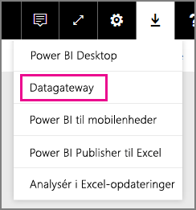
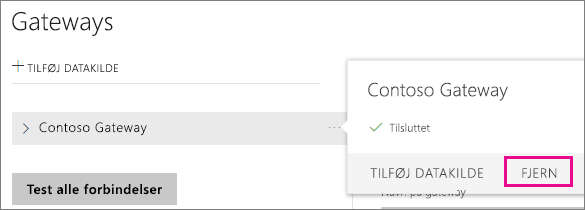
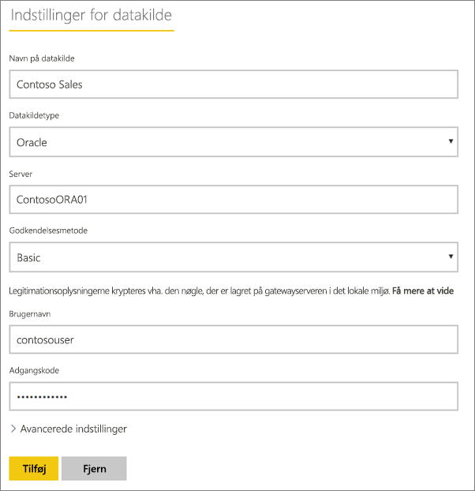
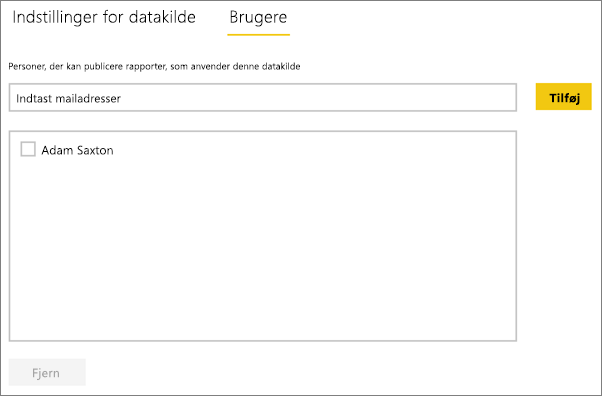
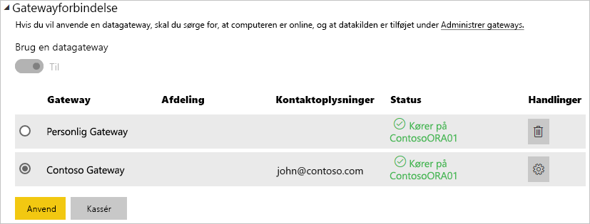

# Administrer din datakilde – Import/Planlagt opdatering
Når du har installeret datagatewayen i det lokale miljø, skal du tilføje datakilder, der kan bruges sammen med gatewayen. Denne artikel indeholder oplysninger om, hvordan du arbejder med gateways og datakilder, der bruges til planlagt opdatering, i modsætning til DirectQuery eller direkte forbindelser.

## Download og installér gatewayen
Du kan downloade gatewayen fra Power BI-tjenesten. Vælg **Downloads** > **Datagateway**, eller gå til [siden til download af gateway](https://go.microsoft.com/fwlink/?LinkId=698861).

## Tilføj en gateway
Hvis du vil tilføje en gateway, skal du blot [downloade](https://go.microsoft.com/fwlink/?LinkId=698863) og installere virksomhedsgatewayen på en server i dit miljø. Når du har installeret gatewayen, vises den på listen over gateways under **Administrer gateways**.

> [!NOTE]
> **Administrer gateways** vises ikke, før du er administrator af mindst én gateway. Det kan du blive ved enten at blive tilføjet som administrator eller ved at installere og konfigurere en gateway.
> 
> 

## Fjern en gateway
Hvis du fjerner en gateway, slettes også eventuelle datakilder under denne gateway.  Dette vil også ødelægge alle dashboards og rapporter, der anvender disse datakilder.

1. Vælg tandhjulsikonet  i øverste højre hjørne > **Administrer gateways**.
2. Gateway > **Fjern**
   
   

## Tilføj en datakilde
Du kan tilføje en datakilde ved enten at vælge en gateway og klikke på **Tilføj datakilde** eller gå til Gateway > **Tilføj datakilde**.

Du kan derefter vælge **Datakildetype** på listen. Alle datakilder, der er angivet på listen, kan bruges til planlagt opdatering med virksomhedsgatewayen. Analysis Services, SQL Server og SAP HANA kan enten bruges til planlagt opdatering eller DirectQuery/direkte forbindelser.

Du skal derefter angive oplysninger om datakilden, herunder kildeoplysninger og -legitimationsoplysninger, som skal bruges til at få adgang til datakilden.

> [!NOTE]
> Alle forespørgsler til datakilden kører ved hjælp af disse legitimationsoplysninger. Du kan finde flere oplysninger i hovedartiklen om datagateways i det lokale miljø, hvor det beskrives, hvordan du gemmer [legitimationsoplysninger](service-gateway-onprem.md#credentials).
> 
> 

Du kan klikke på **Tilføj**, når du har udfyldt det hele.  Du kan nu bruge denne datakilde til planlagt opdatering med dine data i det lokale miljø. Du får vist *Forbindelsen blev oprettet*, hvis det lykkes.

<!-- Shared Install steps Include -->
[!INCLUDE [gateway-onprem-datasources-include](./includes/gateway-onprem-datasources-include.md)]

### Avancerede indstillinger
Du kan konfigurere niveauet for beskyttelse af personlige oplysninger for datakilden. Dette styrer, hvordan data kan blandes. Dette bruges kun til planlagt opdatering. [Få mere at vide](https://support.office.com/article/Privacy-levels-Power-Query-CC3EDE4D-359E-4B28-BC72-9BEE7900B540)

## Fjern en datakilde
Hvis du fjerner en datakilde, ødelægger det alle dashboards eller rapporter, der anvender den pågældende datakilde.  

Hvis du vil fjerne en datakilde, skal du gå til datakilden > **Fjern**.

## Administrer administratorer
Under fanen Administratorer for gatewayen kan du tilføje og fjerne brugere, som kan administrere gatewayen. Du kan kun tilføje brugere på nuværende tidspunkt. Sikkerhedsgrupper kan ikke tilføjes.

## Administrer brugere
Under fanen Brugere for datakilden kan du tilføje og fjerne brugere eller sikkerhedsgrupper, som kan bruge denne datakilde.

> [!NOTE]
> Listen over brugere kan kun bruges til at styre, hvem der har tilladelse til at publicere rapporter. Rapporternes ejere kan oprette dashboards eller indholdspakker og dele dem med andre brugere.
> 
> 

## Brug af datakilden med planlagt opdatering
Når du har oprettet datakilden, bliver den tilgængelig til brug med enten DirectQuery-forbindelser eller via planlagt opdatering.

> [!NOTE]
> Server- og databasenavn skal stemme overens mellem Power BI Desktop og datakilden i datagatewayen i det lokale miljø!
> 
> 

Linket mellem dit datasæt og datakilden i gatewayen er baseret på dit servernavn og databasenavn. Disse skal stemme overens. Hvis du f.eks. angiver en IP-adresse for servernavnet i Power BI Desktop, skal du bruge IP-adressen til datakilden i konfigurationen af gatewayen. Hvis du bruger *SERVER\FOREKOMST* i Power BI Desktop, skal du bruge det samme i den datakilde, der er konfigureret for gatewayen.

Hvis du er angivet på fanen **Brugere** for den datakilde, der er konfigureret i gatewayen, og server- og databasenavnet stemmer overens, får du vist gatewayen som en mulighed, der kan bruges sammen med planlagt opdatering.

> [!WARNING]
> Hvis dit datasæt indeholder flere datakilder, skal hver enkelt datakilde tilføjes i gatewayen. Hvis en eller flere datakilder ikke er føjet til gatewayen, kan du ikke se gatewayen som tilgængelig i forbindelse med planlagt opdatering.
> 
> 

## Begrænsninger
* OAuth er ikke en understøttet godkendelsesplan for datagatewayen i det lokale miljø. Du kan ikke tilføje datakilder, der kræver OAuth. Hvis dit datasæt har en datakilde, der kræver OAuth, kan du ikke bruge gatewayen til planlagt opdatering.

## Næste trin
[Datagateway i det lokale miljø](service-gateway-onprem.md)  
[Datagateway i det lokale miljø – detaljeret](service-gateway-onprem-indepth.md)  
[Fejlfinding af datagateway i det lokale miljø](service-gateway-onprem-tshoot.md)  
Har du flere spørgsmål? [Prøv at spørge Power BI-community'et](http://community.powerbi.com/)

