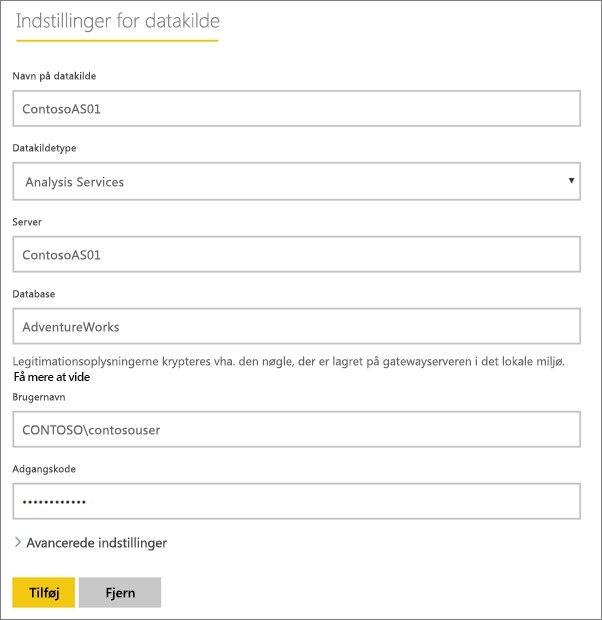
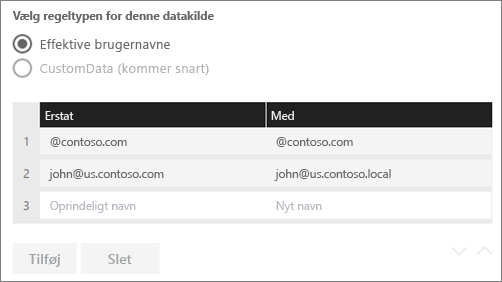
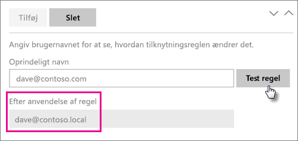
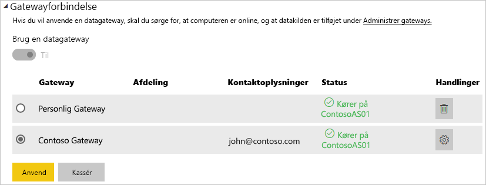

# <a name="manage-your-data-source---analysis-services"></a>Administrer din datakilde – Analysis Services

[!INCLUDE [gateway-rewrite](includes/gateway-rewrite.md)]

Når du har [installeret datagatewayen i det lokale miljø](/data-integration/gateway/service-gateway-install), skal du [tilføje datakilder](service-gateway-data-sources.md#add-a-data-source), der kan bruges sammen med gatewayen. Denne artikel indeholder oplysninger om, hvordan du arbejder med gateways og Analysis Services-datakilder, der enten bruges til planlagte opdateringer eller til direkte forbindelser.

Hvis du vil have mere at vide om, hvordan du konfigurerer en direkte forbindelse til Analysis Services, skal du [se denne video](https://www.youtube.com/watch?v=GPf0YS-Xbyo&feature=youtu.be).

> [!NOTE]
> Hvis du har en Analysis Services-datakilde, skal du installere gatewayen på en computer, der er tilsluttet det samme område/domæne som din Analysis Services-server.

## <a name="add-a-data-source"></a>Tilføj en datakilde

Du kan finde oplysninger om, hvordan du tilføjer en datakilde i [Tilføj en datakilde](service-gateway-data-sources.md#add-a-data-source). Vælg Analysis Services som **datakildetypen**, hvis du opretter forbindelse til enten en flerdimensionel server eller en tabellarisk server.


Du skal derefter udfylde oplysningerne om datakilden, herunder **Server** og **Database**. Den **brugernavn** og den **adgangskode**, som du angiver, bruges af gatewayen til at oprette forbindelse til Analysis Services-forekomsten.

> [!NOTE]
> Den Windows-konto, du angiver, skal have administratorrettigheder på serveren for den forekomst, som du opretter forbindelse til. Hvis adgangskoden til kontoen er angivet til at udløbe, kan brugerne få en forbindelsesfejl, hvis adgangskoden ikke er opdateret for datakilden. Hvis du vil have mere at vide om, hvor legitimationsoplysningerne gemmes, skal du se [Lagring af krypterede legitimationsoplysninger i cloudmiljøet](service-gateway-data-sources.md#storing-encrypted-credentials-in-the-cloud).



Vælg **Tilføj**, når du har udfyldt det hele. Du kan nu bruge denne datakilde til planlagt opdatering eller direkte forbindelser op mod en Analysis-server, der er i det lokale miljø. Du får vist *Forbindelsen blev oprettet*, hvis det lykkes.


### <a name="advanced-settings"></a>Avancerede indstillinger

Du kan eventuelt konfigurere niveauet for beskyttelse af personlige oplysninger for datakilden. Dette styrer, hvordan data kan kombineres. Dette bruges kun for planlagte opdateringer. Det gælder ikke for direkte forbindelser. Hvis du vil vide mere om niveauer for beskyttelse af personlige oplysninger, skal du se [Niveauer for beskyttelse af personlige oplysninger (Power-forespørgsel)](https://support.office.com/article/Privacy-levels-Power-Query-CC3EDE4D-359E-4B28-BC72-9BEE7900B540).


## <a name="usernames-with-analysis-services"></a>Brugernavne med Analysis Services

<iframe width="560" height="315" src="https://www.youtube.com/embed/Qb5EEjkHoLg" frameborder="0" allowfullscreen></iframe>

Hver gang en bruger interagerer med en rapport, der har forbindelse til Analysis Services, overføres det effektive brugernavn til gatewayen og derefter til den lokale Analysis Services-server. Den mailadresse, du logger på Power BI med, er den, vi sender til Analysis Services, som den effektive bruger. Den overføres i forbindelsesegenskaben [EffectiveUserName](https://msdn.microsoft.com/library/dn140245.aspx#bkmk_auth). Denne mailadresse skal matche et defineret UPN (brugerens hovednavn) på det lokale Active Directory-domæne. UPN'et er en egenskab for en Active Directory-konto. Den pågældende Windows-konto skal være til stede i en Analysis Services-rolle. Hvis der ikke findes et match i Active Directory, kan der ikke logges på. Hvis du vil vide mere om Active Directory og brugernavngivelse, skal du se [Attributter for brugernavngivning](https://msdn.microsoft.com/library/ms677605.aspx).

Du kan også [knytte dit Power BI-logonnavn til et UPN for en lokal mappe](service-gateway-enterprise-manage-ssas.md#mapping-usernames-for-analysis-services-data-sources).

## <a name="mapping-usernames-for-analysis-services-data-sources"></a>Tilknytning af brugernavne til Analysis Services-datakilder

<iframe width="560" height="315" src="https://www.youtube.com/embed/eATPS-c7YRU" frameborder="0" allowfullscreen></iframe>

I Power BI kan brugernavne tilknyttes for Analysis Services-datakilder. Du kan konfigurere regler for at knytte et brugernavn, der er logget på med Power BI, til et navn, der er sendt for EffectiveUserName på Analysis Services-forbindelsen. Funktionen til tilknytning af brugernavne er god måde at løse problemet på, når dit brugernavn i AAD ikke stemmer overens med et UPN i dit lokale Active Directory. Hvis din mailadresse for eksempel er nancy@contoso.onmicrsoft.com, kan du knytte den til nancy@contoso.com, og denne værdi vil blive overført til gatewayen.

Du kan knytte navne til Analysis Services på to forskellige måder:

* Manuel brugertilknytning igen
* Active Directory-egenskabsopslag for at knytte AAD UPN'er til Active Directory-brugere igen (AD-opslagstilknytning)

Selvom det er muligt at udføre manuel tilknytning ved hjælp af den anden metode, vil det være meget tidskrævende at gøre, og det vil være svært at vedligeholde. Det er især svært, når det ikke er tilstrækkeligt at matche mønstre, f.eks. når domænenavnene er forskellige mellem AAD og AD i det lokale miljø, eller når navnene på brugerkontiene er forskellige mellem AAD og AD. Det anbefales derfor ikke at foretage manuel tilknytning med den anden metode.

Vi beskriver disse to metoder i rækkefølge i de følgende to afsnit.

### <a name="manual-user-name-re-mapping"></a>Manuel tilknytning af brugernavn igen

Du kan konfigurere brugerdefinerede UPN-regler (User Principal Name) for Analysis Services-datakilder. Dette vil hjælpe dig, hvis dine logon-navne til Power BI-tjenesten ikke stemmer overens med dit lokale mappe-UPN. Hvis du f.eks. logger på Power BI med john@contoso.com, men din lokale mappe-UPN er john@contoso.local, kan du konfigurere en tilknytningsregel for at få john@contoso.local overført til Analysis Services.

Benyt følgende fremgangsmåde for at komme til UPN-tilknytningsskærmen.

1. Gå til **gearikonet** , og vælg **Administrer gateways**.
2. Udvid den gateway, der indeholder Analysis Services-datakilden. Eller hvis du ikke har oprettet Analysis Services-datakilden, kan du gøre det på nuværende tidspunkt.
3. Vælg datakilden, og vælg derefter fanen **Brugere**.
4. Vælg **Tilknyt brugernavne**.

    

Derefter får du vist indstillinger til at tilføje regler samt foretage test for en angiven bruger.

> [!NOTE]
> Du kan komme til at foretage ændringer af en bruger ved en fejl. Hvis **Erstat (Oprindelig værdi)** f.eks. er <em>@contoso.com</em>, og **Med (Nyt navn)** er <em>@contoso.local</em>, erstattes alle brugere med et tegn, der indeholder <em>@contoso.com</em>, af <em>@contoso.local</em>. Hvis **Erstat (Oprindeligt navn)** er <em>dave@contoso.com</em>, og **Med (Nyt navn)** er <em>dave@contoso.local</em>, sendes en bruger med logonnet v-dave@contoso.com som v-dave<em>@contoso.local</em>.

### <a name="ad-lookup-mapping"></a>Tilknytning af AD-opslag

Hvis du vil udføre AD-opslag i det lokale miljø for at tilknytte AAD UPN'er til Active Directory-brugere igen, skal du benytte fremgangsmåden i dette afsnit. Lad os se, hvordan det fungerer.

Der sker følgende i **Power BI-tjenesten**:

* For hver forespørgsel fra en Power BI AAD-bruger til en SSAS-server i det lokale miljø overføres en UPN-streng, f.eks.:firstName.lastName@contoso.com

> [!NOTE]
> Manuelle UPN-brugertilknytninger, der er defineret i konfigurationen af Power BI-datakilden, anvendes stadig, *før* brugernavnsstrengen sendes til datagatewayen i det lokale miljø.

I datagatewayen i det lokale miljø med konfigurerbar brugerdefineret brugertilknytning skal du gøre følgende:

1. Find det Active Directory, du vil søge i (automatisk eller konfigurerbart).
2. Slå attributten på den AD-person (f.eks *mail*) op, der er baseret på den indgående UPN-streng ("firstName.lastName@contoso.com") fra **Power BI-tjenesten**.
3. Hvis AD-opslaget mislykkes, forsøger den at bruge det UPN, der blev overført som EffectiveUser til SSAS.
4. Hvis AD-opslaget lykkes, hentes *UserPrincipalName* for den pågældende AD-person.
5. Mailadressen for *UserPrincipalName* overføres som *EffectiveUser* til SSAS, f.eks. <em>Alias@corp.on-prem.contoso</em>.

Sådan konfigurerer du gatewayen til at udføre AD-opslaget:

1. [Download og installér den nyeste gateway](/data-integration/gateway/service-gateway-install).

2. I gatewayen skal du ændre **datagatewaytjenesten i det lokale miljø**, så den kører med en domænekonto (i stedet for en lokal tjenestekonto – ellers fungerer AD-opslaget ikke korrekt på kørselstidspunktet). Gå til [programmet for datagateway i det lokale miljø](/data-integration/gateway/service-gateway-app) på din maskine, og gå derefter til **Tjenesteindstillinger > Skift tjenestekonto**. Kontrollér, at du har genoprettelsesnøglen til denne gateway, da du skal gendanne den på den samme maskine, medmindre du vil oprette en ny gateway i stedet. Du skal genstarte gatewaytjenesten, for at ændringerne kan træde i kraft.

3. Naviger til gatewayens installationsmappe *C:\Programmer\On-premises data gateway* som administrator for at sikre, at du har skriverettigheder, og åbn filen *Microsoft.PowerBI.DataMovement.Pipeline.GatewayCore.dll.config*.

4. Rediger følgende to konfigurationsværdier i henhold til *dine* Active Directory-attributkonfigurationer til AD-brugerne. De konfigurationsværdier, der vises nedenfor, er kun nogle eksempler – du skal angive dem ud fra konfigurationen af Active Directory. Der skelnes mellem store og små bogstaver i disse konfigurationer, så sørg for, at de matcher værdierne i Active Directory.

    

    Hvis der ikke er angivet en værdi for ADServerPath-konfigurationen, bruger gatewayen det globale standardkatalog. Du kan også angive flere værdier for ADServerPath. Værdierne skal adskilles med et semikolon som i følgende eksempel.

    ```xml
    <setting name="ADServerPath" serializeAs="String">
        <value> >GC://serverpath1; GC://serverpath2;GC://serverpath3</value>
    </setting>
    ```

    Gatewayen analyserer værdierne for ADServerPath fra venstre mod højre, indtil den finder et match. Hvis der ikke blev fundet et match, bruges den oprindelige UPN. Kontrollér, at den konto, der kører gatewaytjenesten (PBIEgwService), har forespørgselstilladelser til alle AD-servere, som du angiver i ADServerPath.

    Gatewayen understøtter to typer ADServerPath som i følgende eksempler.

    **WinNT**

    ```xml
    <value="WinNT://usa.domain.corp.contoso.com,computer"/>
    ```

    **GC**

    ```xml
    <value> GC://USA.domain.com </value>
    ```

5. Genstart **datagatewaytjenesten i det lokale miljø**, for at konfigurationsændringen kan træde i kraft.

### <a name="working-with-mapping-rules"></a>Arbejde med tilknytningsregler

Hvis du vil oprette en tilknytningsregel, skal du angive en værdi for **Oprindeligt navn** og **Nyt navn** og derefter vælge **Tilføj**.

| Felt | Beskrivelse |
| --- | --- |
| Erstat (Oprindeligt navn) |Den mailadresse, du har logget på Power BI med. |
| Med (Nyt navn) |Den værdi, du vil erstatte mailadressen med. Resultatet af erstatningen er det, der overføres til egenskaben *EffectiveUserName* for Analysis Services-forbindelsen. |



Når du markerer et element på listen, kan du vælge at omarrangere listen ved hjælp af **pileikonerne** eller **slette** posten.


### <a name="using-wildcard-"></a>Brug af jokertegn (\*)

Du kan bruge et jokertegn i strengen **Erstat (Oprindeligt navn)** . Det kan kun bruges alene og ikke sammen med andre strengdele. Dette gør det muligt at tage alle brugere og overføre en enkelt værdi til datakilden. Det er nyttigt, når du gerne vil have, at alle brugere i organisationen benytter den samme bruger i det lokale miljø.

### <a name="test-a-mapping-rule"></a>Test en tilknytningsregel

Du kan validere, hvad et oprindeligt navn erstattes med, ved at angive en værdi for **Oprindeligt navn** og vælge **Test regel**.



> [!NOTE]
> Det kan tage nogle få minutter for tjenesten at bruge de regler, der er blevet gemt. Reglen fungerer med det samme i webbrowseren.

### <a name="limitations-for-mapping-rules"></a>Begrænsninger for tilknytningsregler

Tilknytning gælder den bestemte datakilde, der konfigureres. Det er ikke en global indstilling. Hvis du har flere Analysis Services-datakilder, skal du knytte brugerne til hver enkelt datakilde.

## <a name="authentication-to-a-live-analysis-services-data-source"></a>Godkendelse til en live Analysis Services-datakilde

Hver gang en bruger interagerer med Analysis Services, overføres det effektive brugernavn til gatewayen og derefter til den lokale Analysis Services-server. UPN'et (brugerens hovednavn), som typisk er den mailadresse, du logger på cloudmiljøet med, er det, vi sender til Analysis Services som den effektive bruger. UPN'et overføres i forbindelsesegenskaben EffectiveUserName. Denne mailadresse skal matche et defineret UPN på det lokale Active Directory-domæne. UPN'et er en egenskab for en Active Directory-konto. Den pågældende Windows-konto skal være til stede i en Analysis Services-rolle for at have adgang til serveren. Hvis der ikke findes et match i Active Directory, kan der ikke logges på.

Analysis Services kan også levere filtrering baseret på denne konto. Filtreringen kan finde sted med rollebaseret sikkerhed eller sikkerhed på rækkeniveau.

## <a name="role-based-security"></a>Rollebaseret sikkerhed

Modeller giver sikkerhed, som er baseret på brugerroller. Roller er defineret for et bestemt modelprojekt under oprettelse i SQL Server Data Tools – Business Intelligence (SSDT BI), eller når en model er udrullet, ved hjælp af SQL Server Management Studio (SSMS). Roller indeholder medlemmer efter Windows-brugernavn eller efter Windows-gruppe. Roller definerer tilladelser, som en bruger har til at forespørge på eller udføre handlinger på modellen. De fleste brugere vil tilhøre en rolle med læsetilladelser. Andre roller er beregnet til administratorer med tilladelser til at behandle elementer, administrere databasefunktioner og administrere andre roller.

## <a name="row-level-security"></a>Sikkerhed på rækkeniveau

Sikkerhed på rækkeniveau er specifik for Analysis Services-sikkerhed på rækkeniveau. Modeller kan levere dynamisk sikkerhed på rækkeniveau. I modsætning til at have mindst én rolle, som brugere tilhører, er dynamisk sikkerhed ikke påkrævet for en tabelmodel. På et højt niveau definerer dynamisk sikkerhed en brugers læseadgang til data helt ned til en bestemt række i en bestemt tabel. I lighed med roller er dynamisk sikkerhed på rækkeniveau afhængig af en brugers Windows-brugernavn.

En brugers mulighed for at forespørge på og få vist data i modellen bestemmes først af de roller, som deres Windows-brugerkonto er medlem af, og derefter af dynamisk sikkerhed på rækkeniveau, hvis det er konfigureret.

Det er uden for denne artikels omfang at drøfte implementering af roller og dynamisk sikkerhed på rækkeniveau i modeller. Du kan få yderligere oplysninger i [Roller (SSAS-tabel)](https://msdn.microsoft.com/library/hh213165.aspx) og [Sikkerhedsroller (Analysis Services – flerdimensionelle data)](https://msdn.microsoft.com/library/ms174840.aspx) på MSDN. Hvis du vil have den mest detaljerede forståelse af sikkerhed med en tabellarisk model, skal du downloade og læse [dette whitepaper om sikring af den tabellariske, semantiske BI-model](https://msdn.microsoft.com/library/jj127437.aspx).

## <a name="what-about-azure-active-directory"></a>Hvad med Azure Active Directory?

Microsoft-cloudtjenester bruger [Azure Active Directory](/azure/active-directory/fundamentals/active-directory-whatis) til at godkende brugere. Azure Active Directory er lejeren, der indeholder brugernavne og sikkerhedsgrupper. Typisk er den mailadresse, som en bruger logger på med, den samme som kontoens UPN.

Hvad er min lokale Active Directory-rolle?

For at Analysis Services kan bestemme, om en bruger, der opretter forbindelse til den, tilhører en rolle med tilladelser til at læse data, skal serveren konvertere det effektive brugernavn, der sendes fra AAD til gatewayen og videre til Analysis Services-serveren. Analysis Services-serveren overfører det effektive brugernavn til en Windows Active Directory-domænecontroller (DC). Active Directory-domænecontrolleren validerer derefter, at det effektive brugernavn er et gyldigt UPN, på en lokal konto, og returnerer den pågældende brugers Windows-brugernavn til Analysis Services-serveren.

EffectiveUserName kan ikke bruges på en Analysis Services-server, der ikke er tilsluttet et domæne. Analysis Services-serveren skal tilsluttes et domæne for at undgå eventuelle logonfejl.

### <a name="how-do-i-tell-what-my-upn-is"></a>Hvordan kan jeg se, hvad mit UPN er?

Du ved måske ikke, hvad dit UPN er, og du er muligvis ikke domæneadministrator. Du kan bruge følgende kommando fra din arbejdsstation til at finde frem til UPN'et for din konto.

    whoami /upn

Resultatet ligner en mailadresse, men det er det UPN, der er på din domænekonto. Hvis du bruger en Analysis Services-datakilde til direkte forbindelser, og hvis den ikke matcher den mailadresse, du logger på Power BI med, kan du se, hvordan [du tilknytter brugernavne](#mapping-usernames-for-analysis-services-data-sources).

## <a name="synchronize-an-on-premises-active-directory-with-azure-active-directory"></a>Synkroniser Active Directory i det lokale miljø med Azure Active Directory

Dine lokale Active Directory-konti skal matche Azure Active Directory, hvis du vil bruge direkte forbindelser i Analysis Services. Da UPN skal matche mellem kontiene.

Cloudtjenesterne kender kun til konti på Azure Active Directory. Det har ingen betydning, hvis du har tilføjet en konto i dit lokale Active Directory. Hvis den ikke findes i AAD, kan den ikke bruges. Du kan matche dine lokale Active Directory-konti med Azure Active Directory på forskellige måder.

1. Du kan føje konti manuelt til Azure Active Directory.

   Du kan oprette en konto på Azure Portal eller i Microsoft 365 Administration, og så matcher kontonavnet UPN for den lokale Active Directory-konto.

2. Du kan bruge værktøjet [Azure AD Connect](/azure/active-directory/hybrid/how-to-connect-sync-whatis) til at synkronisere lokale konti med din Azure Active Directory-lejer.

   Azure AD Connect-værktøjet indeholder indstillinger til katalogsynkronisering og konfiguration af godkendelse, inklusive synkronisering af adgangskodehash, pass-through-godkendelse og samling af identiteter. Hvis du ikke er administrator af lejeren eller en lokal domæneadministrator, skal du kontakte it-administratoren for at få dette konfigureret.

Ved at bruge Azure AD Connect sikrer du, at UPN'et matcher mellem AAD og dit lokale Active Directory.

> [!NOTE]
> Når konti synkroniseres med værktøjet Azure AD Connect, oprettes der nye konti i din AAD-lejer.

## <a name="using-the-data-source"></a>Brug datakilden

Når du har oprettet datakilden, bliver den tilgængelig til brug med enten direkte forbindelser eller via planlagt opdatering.

> [!NOTE]
> Servernavnet og databasenavnet skal matche mellem Power BI Desktop og datakilden i datagatewayen i det lokale miljø.

Linket mellem dit datasæt og datakilden i gatewayen er baseret på dit servernavn og databasenavn. Disse skal matche. Hvis du f.eks. angiver en IP-adresse for servernavnet i Power BI Desktop, skal du bruge IP-adressen for datakilden i konfigurationen af gatewayen. Hvis du bruger *SERVER\INSTANCE* i Power BI Desktop, skal du bruge det samme i den datakilde, der er konfigureret for gatewayen.

Det er tilfældet for både direkte forbindelser og planlagt opdatering.

### <a name="using-the-data-source-with-live-connections"></a>Brug af datakilden med direkte forbindelser

Du skal sikre, at servernavnet og databasenavnet matcher mellem Power BI Desktop og den konfigurerede datakilde for gatewayen. Du skal også sikre, at din bruger er angivet under fanen **Brugere** i datakilden for at kunne publicere datasæt med direkte forbindelse. Valget til direkte forbindelser sker i Power BI Desktop, når du importerer data første gang.

Når du publicerer fra enten Power BI Desktop eller **Hent Data**, bør dine rapporter begynde at fungere. Det kan tage flere minutter, efter du har oprettet datakilden i gatewayen, før forbindelsen kan bruges.

### <a name="using-the-data-source-with-scheduled-refresh"></a>Brug datakilden med planlagt opdatering

Hvis du er angivet under fanen **Brugere** i den datakilde, der er konfigureret i gatewayen, og server- og databasenavnet stemmer overens, får du vist gatewayen som en mulighed, der kan bruges sammen med en planlagt opdatering.



### <a name="limitations-of-analysis-services-live-connections"></a>Begrænsninger for direkte forbindelser i Analysis Services

Du kan bruge en direkte forbindelse til tabellariske eller flerdimensionelle forekomster.

| **Serverversion** | **Påkrævet SKU** |
| --- | --- |
| 2012 SP1 CU4 eller nyere |Business Intelligence- og Enterprise-SKU |
| 2014 |Business Intelligence- og Enterprise-SKU |
| 2016 |Standard-SKU eller nyere |

* Funktionen til formatering på celleniveau og oversættelse understøttes ikke.
* Handlinger og navngivne sæt er ikke synlige for Power BI, men du kan stadig oprette forbindelse til flerdimensionelle kuber, der også indeholder handlinger eller navngivne sæt, og oprette visualiseringer og rapporter.

## <a name="next-steps"></a>Næste trin

* [Fejlfinding af datagateway i det lokale miljø](/data-integration/gateway/service-gateway-tshoot)
* [Foretag fejlfinding af gateways – Power BI](service-gateway-onprem-tshoot.md)

Har du flere spørgsmål? [Prøv at spørge Power BI-community'et](http://community.powerbi.com/)

