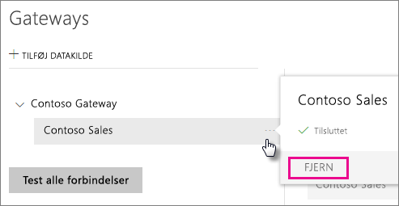
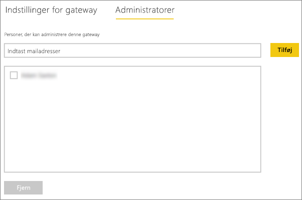
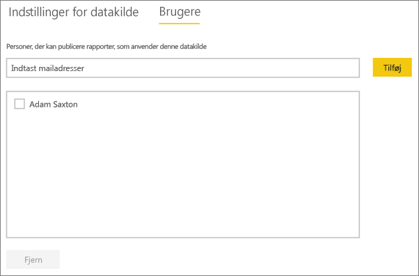

# Administrer din datakilde – Analysis Services
Når du har installeret datagatewayen i det lokale miljø, skal du tilføje datakilder, der kan bruges sammen med gatewayen. I denne artikel kan du se, hvordan du arbejder med gateways og datakilder. Du kan bruge Analysis Services-datakilden til enten planlagte opdateringer eller direkte forbindelser.

<iframe width="560" height="315" src="https://www.youtube.com/embed/ownIGbcRAAU" frameborder="0" allowfullscreen></iframe>

## Download og installér gatewayen
Du kan downloade gatewayen fra Power BI-tjenesten. Vælg **Downloads** > **Datagateway**, eller gå til [siden til download af gateway](https://go.microsoft.com/fwlink/?LinkId=698861).

## Begrænsninger for Analysis Services-liveforbindelser
Du kan bruge en liveforbindelse til tabellariske eller flerdimensionelle forekomster.

| **Serverversion** | **Påkrævet SKU** |
| --- | --- |
| 2012 SP1 CU4 eller nyere |Business Intelligence- og Enterprise-SKU |
| 2014 |Business Intelligence- og Enterprise-SKU |
| 2016 |Standard-SKU eller nyere |

* Funktionen til formatering på celleniveau og oversættelse understøttes ikke.
* Handlinger og navngivne sæt er ikke synlige for Power BI, men du kan stadig oprette forbindelse til flerdimensionelle kuber, der også indeholder handlinger eller navngivne sæt, og oprette visuelle elementer og rapporter.

## Tilføj en gateway
Hvis du vil tilføje en gateway, skal du blot [downloade](https://go.microsoft.com/fwlink/?LinkId=698861) og installere gatewayen på en server i dit miljø. Når du har installeret gatewayen, vises den på listen over gateways under **Administrer gateways**.

> [!NOTE]
> **Administrer gateways** vises ikke, før du er administrator af mindst én gateway. Det kan du blive ved enten at blive tilføjet som administrator eller ved at installere og konfigurere en gateway.
> 
> 

## Fjern en gateway
Hvis du fjerner en gateway, slettes også eventuelle datakilder under denne gateway.  Dette vil også ødelægge alle dashboards og rapporter, der anvender disse datakilder.

1. Vælg tandhjulsikonet  i øverste højre hjørne > **Administrer gateways**.
2. Gateway > **Fjern**
   
   

## Tilføj en datakilde
Du kan tilføje en datakilde ved enten at vælge en gateway og klikke på **Tilføj datakilde** eller gå til Gateway > **Tilføj datakilde**.

Du kan derefter vælge **Datakildetype** på listen. Vælg Analysis Services, hvis du opretter forbindelse til en flerdimensionel eller tabellarisk server.

Derefter skal du angive oplysninger om datakilden, herunder **Server** og **Database**.  

Den **brugernavn** og den **adgangskode**, som du angiver, bruges af gatewayen til at oprette forbindelse til Analysis Services-forekomsten.

> [!NOTE]
> Den Windows-konto, du angiver, skal have administratorrettigheder på serveren for den forekomst, som du opretter forbindelse til. Hvis adgangskoden til kontoen er angivet til at udløbe, kan brugerne få en forbindelsesfejl, hvis adgangskoden ikke er opdateret for datakilden. Du kan få mere at vide om, hvordan [legitimationsoplysninger](service-gateway-onprem.md#credentials) gemmes, i den primære artikel om datagateways i det lokale miljø.
> 
> 

Du kan klikke på **Tilføj**, når du har udfyldt det hele.  Du kan nu bruge denne datakilde til planlagt opdatering eller direkte forbindelser op mod en Analysis-server, der er i det lokale miljø.  Du får vist *Forbindelsen er oprettet*, hvis det lykkes.

### Avancerede indstillinger
Du kan konfigurere niveauet for beskyttelse af personlige oplysninger for datakilden. Dette styrer, hvordan data kan blandes. Dette bruges kun for planlagte opdateringer. Det gælder ikke direkte forbindelser. [Få mere at vide](https://support.office.com/article/Privacy-levels-Power-Query-CC3EDE4D-359E-4B28-BC72-9BEE7900B540)

## 'Hent Data'-oplevelse i Analysis Services på Power BI-webstedet
En entydig indstilling for Analysis Services er at bruge Hent Data direkte i Power BI-tjenesten. Du kan oprette forbindelse til en live Analysis Services-datakilde, der er konfigureret i gatewayen uden brug af Power BI Desktop. Din konto skal være opført på fanen **Brugere** for datakilden, under gatewayen, for at den kan blive vist på listen. Benyt følgende fremgangsmåde for at oprette forbindelse til datakilden:

1. Vælg **Hent data** i Power BI-tjenesten.
2. Vælg **Databaser**.
3. Vælg **SQL Server Analysis Services** > **Opret forbindelse**.
4. Vælg en datakilde på listen. De Analysis Services-datakilder, du har adgang til, vises på en liste her.
5. Vælg den model, du vil oprette forbindelse til. Vælg derefter **Opret forbindelse**.

Du får vist et datasæt med navnet på serveren. Du kan derefter vælge dette datasæt og begynde at oprette rapporter på den. Det fungerer i forbindelse med dynamiske data.

## Brugernavne med Analysis Services
Hver gang en bruger interagerer med en rapport, der har forbindelse til Analysis Services, overføres det effektive brugernavn til gatewayen og derefter til den lokale Analysis Services-server. Den mailadresse, du logger på Power BI med, er den, vi sender til Analysis Services, som den effektive bruger. Den overføres i forbindelsesegenskaben [EffectiveUserName](https://msdn.microsoft.com/library/dn140245.aspx#bkmk_auth). Denne mailadresse skal svare til et UPN, der er defineret i det lokale Active Directory-domæne. UPN'et er en egenskab for en Active Directory-konto. Den pågældende Windows-konto skal være til stede i en Analysis Services-rolle. Hvis der ikke findes et match i Active Directory, kan der ikke logges på. [Få mere at vide](https://msdn.microsoft.com/library/ms677605.aspx)

Du kan også knytte dit Power BI-logonnavn til et lokalt mappe-UPN. [Få mere at vide](service-gateway-enterprise-manage-ssas.md#map-user-names)

<iframe width="560" height="315" src="https://www.youtube.com/embed/Qb5EEjkHoLg" frameborder="0" allowfullscreen></iframe>

### Hvordan kan jeg se, hvad mit UPN er?
Du ved måske ikke, hvad dit UPN er, og du er muligvis ikke domæneadministrator. Du kan bruge følgende kommando fra din arbejdsstation for at finde ud af, hvad UPN'et for din konto er.

    whoami /upn

Resultatet ligner en mailadresse, men det er det UPN, der er på din domænekonto. Hvis du bruger en Analysis Services-datakilde til dynamiske forbindelser, og hvis den ikke svarer til den mailadresse, du logger på Power BI med, kan du se, hvordan [du tilknytter brugernavne](#map-user-names).

## Tilknyt brugernavne
<iframe width="560" height="315" src="https://www.youtube.com/embed/eATPS-c7YRU" frameborder="0" allowfullscreen></iframe>

Du kan knytte navne til Analysis Services på to forskellige måder:

1. Manuel brugertilknytning igen 
2. Active Directory-egenskabsopslag for at knytte AAD UPN'er til Active Directory-brugere igen (AD-opslagstilknytning)

Selvom det er muligt at udføre manuel tilknytning ved hjælp af den anden metode, er det tidskrævende og svært at vedligeholde. Det er især svært, når mønstermatch ikke er tilstrækkeligt, f.eks. når domænenavne for AAD og AD i det lokale miljø ikke er ens, eller når brugerkontonavne for AAD og AD ikke er ens. Det anbefales derfor ikke at foretage manuel tilknytning med den anden metode.

Vi beskriver disse to metoder i rækkefølge i de følgende to afsnit

### Manuel tilknytning af brugernavn igen
Du kan konfigurere brugerdefinerede UPN-regler (User Principal Name) for Analysis Services-datakilder. Dette vil hjælpe dig, hvis dine logon-navne til Power BI-tjenesten ikke stemmer overens med dit lokale mappe-UPN. Hvis du f.eks. logger på Power BI med john@contoso.com, men din lokale mappe-UPN er john@contoso.local, kan du konfigurere en tilknytningsregel for at få john@contoso.local overført til Analysis Services.

Benyt følgende fremgangsmåde for at komme til UPN-tilknytningsskærmen.

1. Gå til **gearikonet** , og vælg **Administrer gateways**.
2. Udvid den gateway, der indeholder Analysis Services-datakilden. Eller hvis du ikke har oprettet Analysis Services-datakilden, kan du gøre det på nuværende tidspunkt.
3. Vælg datakilden, og vælg derefter fanen **Brugere**.
4. Vælg **Tilknyt brugernavne**.
   
    

Derefter får du vist indstillinger til at tilføje regler samt foretage test for en angiven bruger.

> [!NOTE]
> Du kan komme til at foretage ændringer af en bruger ved en fejl. Hvis **Erstat (Oprindelig værdi)** f.eks. er *@contoso.com*, og **Med (Nyt navn)** er *@contoso.local*, erstattes alle brugere med et tegn, der indeholder *@contoso.com*, af *@contoso.local*. Hvis **Erstat (Oprindeligt navn)** er *dave@contoso.com*, og **Med (Nyt navn)** er *dave@contoso.local*, sendes en bruger med logonnet v-dave@contoso.com som v-dave*@contoso.local*.
> 
> 

### Tilknytning af AD-opslag
Hvis du vil udføre AD-opslag i det lokale miljø for at tilknytte AAD UPN'er til Active Directory-brugere igen, skal du benytte fremgangsmåden i dette afsnit. Lad os se, hvordan det fungerer.

Der sker følgende i **Power BI-tjenesten**:

- For hver forespørgsel fra en Power BI AAD-bruger til en SSAS-server i det lokale miljø overføres en UPN-streng, f.eks.:firstName.lastName@contoso.com

> [!NOTE]
> Manuelle UPN-brugertilknytninger, der er defineret i konfigurationen af Power BI-datakilden, anvendes stadig, *før* brugernavnsstrengen sendes til datagatewayen i det lokale miljø.
> 
> 

I datagatewayen i det lokale miljø med konfigurerbar brugerdefineret brugertilknytning skal du gøre følgende:

1. Find det Active Directory, du vil søge i (automatisk eller konfigurerbart).
2. Slå attributten på den AD-person (f.eks *mail*) op, der er baseret på den indgående UPN-streng ("firstName.lastName@contoso.com") fra **Power BI-tjenesten**.
3. Hvis AD-opslaget mislykkes, forsøger den at bruge det UPN, der blev overført som EffectiveUser til SSAS.
4. Hvis AD-opslaget lykkes, hentes *UserPrincipalName* for den pågældende AD-person. 
5. Mailadressen for *UserPrincipalName* overføres som *EffectiveUser* til SSAS, f.eks.:*Alias@corp.on-prem.contoso*

Sådan konfigurerer du gatewayen til at udføre AD-opslaget:

1. Download og installér den nyeste gateway
2. I gatewayen skal du ændre **datagatewaytjenesten i det lokale miljø**, så den kører med en domænekonto (i stedet for en lokal tjenestekonto – ellers fungerer AD-opslaget ikke korrekt på kørselstidspunktet). Du skal genstarte gatewaytjenesten, for at ændringerne kan træde i kraft.  Gå til gateway-appen på din maskine (søg efter "datagateway i det lokale miljø "). Det gør du ved at gå til **Tjenesteindstillinger > Rediger tjenestekonto**. Kontrollér, at du har genoprettelsesnøglen til denne gateway, da du skal gendanne den på den samme maskine, medmindre du vil oprette en ny gateway i stedet. 
3. Gå til installationsmappen for gatewayen, *C:\Program Files\On-premises data gateway* som administrator for at sikre, at du har skriverettigheder, og rediger følgende fil:
   
       Microsoft.PowerBI.DataMovement.Pipeline.GatewayCore.dll.config 
4. Rediger følgende to konfigurationsværdier i henhold til *dine* Active Directory-attributkonfigurationer af AD-brugerne. De konfigurationsværdier, der vises nedenfor, er kun nogle eksempler – du skal angive dem ud fra konfigurationen af Active Directory. 
   
   
5. Genstart **datagatewaytjenesten i det lokale miljø**, for at konfigurationsændringen kan træde i kraft.

### Arbejde med tilknytningsregler
Hvis du vil oprette en tilknytningsregel, skal du angive en værdi for **Oprindeligt navn** og **Nyt navn** og derefter vælge **Tilføj**.

| Felt | Beskrivelse |
| --- | --- |
| Erstat (Oprindeligt navn) |Den mailadresse, du har logget på Power BI med. |
| Med (Nyt navn) |Den værdi, du vil erstatte mailadressen med. Resultatet af erstatningen er det, der overføres til egenskaben *EffectiveUserName* for Analysis Services-forbindelsen. |

Når du markerer et element på listen, kan du vælge at omarrangere listen ved hjælp af **pileikonerne** eller **slette** posten.

### Brug af jokertegn (\*)
Du kan bruge et jokertegn i strengen **Erstat (Oprindeligt navn)**. Det kan kun bruges alene og ikke sammen med andre strengdele. Dette gør det muligt at tage alle brugere og overføre en enkelt værdi til datakilden. Det er nyttigt, når du gerne vil have, at alle brugere i organisationen benytter den samme bruger i det lokale miljø.

### Test en tilknytningsregel
Du kan validere, hvad et oprindeligt navn erstattes med, ved at angive en værdi for **Oprindeligt navn** og vælge **Test regel**.

> [!NOTE]
> Det kan tage nogle få minutter for tjenesten at bruge de regler, der er blevet gemt. Reglen fungerer med det samme i webbrowseren.
> 
> 

### Begrænsninger for tilknytningsregler
* Tilknytning gælder den bestemte datakilde, der konfigureres. Det er ikke en global indstilling. Hvis du har flere Analysis Services-datakilder, skal du knytte brugerne til hver enkelt datakilde.

## Fjern en datakilde
Hvis du fjerner en datakilde, ødelægger det alle dashboards eller rapporter, der er baseret på den pågældende datakilde.  

Hvis du vil fjerne en datakilde, skal du gå til Datakilde > **Fjern**.

## Administrer administratorer
Under fanen Administratorer for gatewayen kan du tilføje og fjerne brugere (eller sikkerhedsgrupper), som kan administrere gatewayen.

## Administrer brugere
Under fanen Brugere for datakilden kan du tilføje og fjerne brugere eller sikkerhedsgrupper, som kan bruge denne datakilde.

> [!NOTE]
> Listen med brugere bestemmer kun, hvem der har tilladelse til at publicere rapporter. Rapporternes ejere kan oprette dashboards eller indholdspakker og dele dem med andre brugere.
> 
> 

## Brug datakilden
Når du har oprettet datakilden, bliver den tilgængelig til brug med enten direkte forbindelser eller via planlagt opdatering.

> [!NOTE]
> Server- og databasenavn skal stemme overens mellem Power BI Desktop og datakilden i datagatewayen i det lokale miljø!
> 
> 

Linket mellem dit datasæt og datakilden i gatewayen er baseret på dit servernavn og databasenavn. Disse skal stemme overens. Hvis du f.eks. angiver en IP-adresse for servernavnet i Power BI Desktop, skal du bruge IP-adressen til datakilden i konfigurationen af gatewayen. Hvis du bruger *SERVER\FOREKOMST* i Power BI Desktop, skal du bruge det samme i den datakilde, der er konfigureret for gatewayen.

Det er tilfældet for både direkte forbindelser og planlagt opdatering.

### Brug af datakilden med direkte forbindelser
Du skal sikre dig, at servernavn og databasenavn stemmer overens mellem Power BI Desktop og den konfigurerede datakilde for gatewayen. Du skal også sikre dig, at din bruger er angivet på fanen **Brugere** i datakilden for at kunne publicere datasæt med direkte forbindelse. Valget til direkte forbindelser sker i Power BI Desktop, når du importerer data første gang.

Når du publicerer fra enten Power BI Desktop eller **Hent Data**, bør dine rapporter begynde at fungere. Det kan tage flere minutter, efter du har oprettet datakilden i gatewayen, før forbindelsen kan bruges.

### Brug datakilden med planlagt opdatering
Hvis du er angivet under fanen **Brugere** for den datakilde, der er konfigureret i gatewayen, og server- og databasenavn stemmer overens, får du vist gatewayen som en mulighed, der kan bruges sammen med planlagt opdatering.

## Næste trin
[Datagateway i det lokale miljø](service-gateway-onprem.md)  
[Datagateway i det lokale miljø – detaljeret](service-gateway-onprem-indepth.md)  
[Fejlfinding af datagateway i det lokale miljø](service-gateway-onprem-tshoot.md)  
Har du flere spørgsmål? [Prøv at spørge Power BI-community'et](http://community.powerbi.com/)

