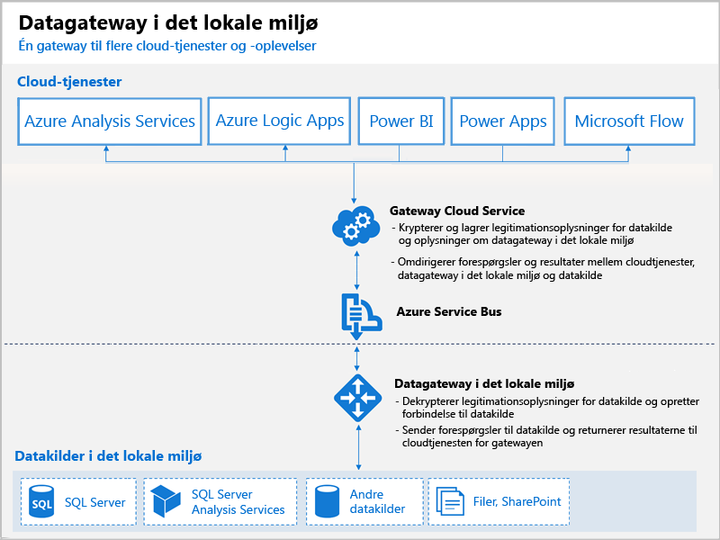

# Hvad er Power BI-gateways?

En Power BI-gateway er software, som du installerer på et lokalt netværk. Det gør det nemmere at få adgang til data på dette netværk. Den er som en dørvogter, der lytter efter anmodninger om forbindelse og kun tildeler dem, når en brugers anmodninger opfylder visse kriterier. Derved kan organisationer opbevare databaser og andre datakilder på netværket i det lokale miljø og samtidig bruge disse data sikkert i det lokale miljø i Power BI-rapporter og -dashboards.

Følgende diagram indeholder en grundlæggende visning, hvor gatewayen behandler anmodninger fra clouden for tre computere i det lokale miljø. Dette forklarer vi senere i artiklen.

## Typer af gateways

Power BI indeholder to gateways til to forskellige scenarier:

* **Datagateway i det lokale miljø (personlig tilstand)** – gør det muligt for én bruger at oprette forbindelse til datakilder og kan ikke deles med andre. Kan kun bruges med Power BI. Denne gateway er velegnet til scenarier, hvor du er den eneste, der opretter rapporter, og du ikke behøver at dele datakilder med andre.

* **Datagateway i det lokale miljø** – gør det muligt for flere brugere at oprette forbindelse til flere datakilder i det lokale miljø. Kan bruges af Power BI, PowerApps, Flow, Azure Analysis Services og Azure Logic Apps – det hele med en enkelt gatewayinstallation. Denne gateway er velegnet til mere komplekse scenarier, hvor flere personer har adgang til flere datakilder. 

## Brug af en gateway

Du skal udføre fire primære trin, når du vil bruge en gateway:

1. **Installér gatewayen** på en lokal computer ved hjælp af den relevante tilstand
2. **Føj brugere til gatewayen**, så de kan få adgang til datakilder i det lokale miljø
3. **Opret forbindelse til datakilder**, så de kan bruges i rapporter og dashboards
4. **Opdater data i det lokale miljø**, så Power BI-rapporter er opdaterede

Du kan installere en separat gateway eller føje en gateway til en *klynge*, hvilket anbefales for at opnå høj tilgængelighed.

## Sådan fungerer gateways

Den gateway, du installerer, kører som en Windows-tjeneste, **datagateway i det lokale miljø**. Denne lokale tjeneste er registreret i gatewaycloudtjenesten via Azure Service Bus. I følgende diagram vises strømmen mellem data i det lokale miljø og de cloudtjenester, der bruger gatewayen.

Forespørgsler og datastrøm:

1. En forespørgsel oprettes af cloudtjenesten med de krypterede legitimationsoplysninger for datakilden i det lokale miljø. Den sendes derefter til en kø for at blive behandlet af gatewayen.
2. Cloudtjenesten for gatewayen analyserer forespørgslen og sender anmodningen til Azure Service Bus.
3. Datagatewayen i det lokale miljø forespørger Azure Service Bus om ventende anmodninger.
4. Gatewayen henter forespørgslen, dekrypterer legitimationsoplysningerne og opretter forbindelse til datakilderne med disse legitimationsoplysninger.
5. Gatewayen sender forespørgslen til datakilden til eksekvering.
6. Resultaterne sendes fra datakilden tilbage til gatewayen og derefter videre til cloudtjenesten og din server.

## Næste trin
[Installér datagatewayen i det lokale miljø](service-gateway-install.md)

Har du flere spørgsmål? [Prøv at spørge Power BI-community'et](http://community.powerbi.com/)

