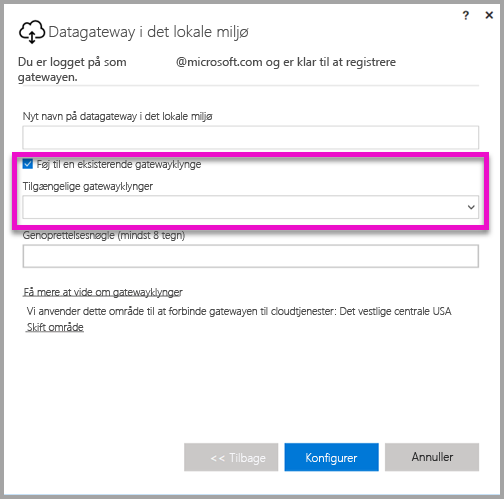
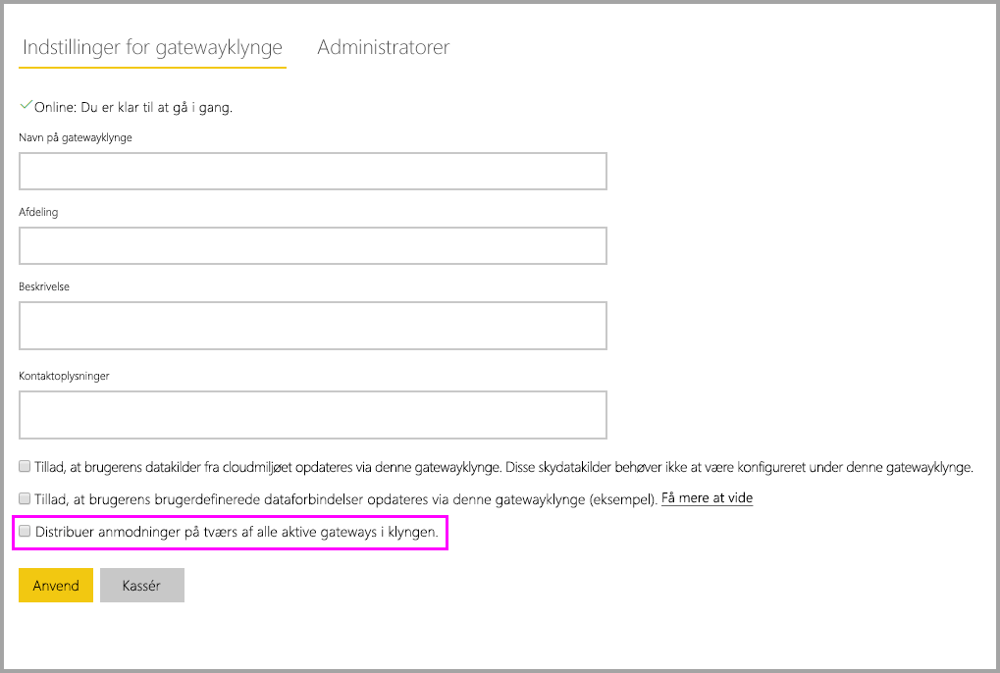

# <a name="high-availability-clusters-for-on-premises-data-gateway"></a>Klynger med høj tilgængelighed for en datagateway i det lokale miljø

Du kan oprette installationer med **klynger af datagateways** **i det lokale miljø med høj tilgængelighed** for at sikre, at din organisation kan få adgang til dataressourcer i det lokale miljø, som bruges i Power BI-rapporter og på dashboards. Disse klynger giver gatewayadministratorer mulighed for at gruppere gateways og dermed undgå enkelte fejlpunkter under oprettelse af adgang til datakilder i det lokale miljø. Power BI-tjenesten bruger altid den primære gateway i klyngen, medmindre den ikke er tilgængelig. I så fald skifter tjenesten til den næste gateway i klyngen og så videre.

I denne artikel beskrives de trin, du skal udføre for at oprette en klynge med høj tilgængelighed på datagateways i det lokale miljø, og der beskrives de bedste fremgangsmåder til at oprette dem. Gatewayklynger med høj tilgængelighed kræver opdateringen fra november 2017 eller nyere til datagatewayen i det lokale miljø.

## <a name="setting-up-high-availability-clusters-of-gateways"></a>Konfiguration af gatewayklynger med høj tilgængelighed

Under installationen af **datagatewayen i det lokale miljø** kan du angive, om gatewayen skal føjes til en eksisterende gatewayklynge. 



Hvis du vil føje en gateway til en eksisterende klynge, skal du angive *genoprettelsesnøglen* for den primære gatewayinstans for den klynge, du vil knytte den gateway til. Den primære gateway for klyngen skal køre gatewayopdateringen fra november 2017 eller nyere. 

## <a name="managing-a-gateway-cluster"></a>Administration af en gatewayklynge

Når en gatewayklynge består af to eller flere gateways, gælder alle administrationshandlinger i forbindelse med gateways, f.eks tilføjelse af en datakilde eller tildeling af administrative tilladelser til en gateway, for alle gateways, der indgår i klyngen.

Når administratorer bruger menupunktet **Administrer gateways**, der findes under tandhjulsikonet i **Power BI-tjenesten**, kan de se en liste over registrerede klynger eller individuelle gateways, men de kan ikke se de enkelte gatewayinstanser, der er medlemmer af klyngen.

Alle nye anmodninger af typen **Planlagt opdatering** og DirectQuery-handlinger omdirigeres automatisk til den primære instans for en given gatewayklynge. Hvis den primære gatewayinstans ikke er online, dirigeres anmodningen til en anden gatewayinstans i klyngen.

## <a name="distribute-requests-traffic-across-all-gateways-in-a-cluster"></a>Distribuer anmodninger på tværs af alle gateways i en klynge

Du kan vælge, at trafik skal fordeles på tværs af alle gateways i en klynge. På siden **Administrer gateways** i **Power BI-tjenesten** kan du klikke på en gatewayklynge på listen i navigationstræet i venstre side for at aktivere indstillingen "Fordel anmodninger på tværs af alle aktive gateways i denne klynge".



## <a name="powershell-support-for-gateway-clusters"></a>PowerShell-understøttelse af gatewayklynger

PowerShell-scripts er tilgængelige i installationsmappen for datagatewayen i det lokale miljø. Denne mappe er som standard *C:\Program Files\On-premises data gateway*. Du skal bruge PowerShell version 5 eller nyere, for at disse scripts fungerer korrekt. Med PowerShell-scripts kan brugerne udføre følgende handlinger:

-   Hente listen over de gatewayklynger, der er tilgængelige for en bruger
-   Hente listen over gatewayinstanser, der er registreret i en klynge, samt deres online eller offline status
-   Redigere aktiverings/deaktiveringsstatussen for en gatewayinstans i en klynge samt andre gatewayegenskaber
-   Slette en gateway

Hvis du vil køre PowerShell-kommandoerne i tabellen, skal du først gøre følgende:

1. Åbn et PowerShell-kommandovindue som administrator
2. Kør derefter følgende PowerShell-engangskommando (dette forudsætter, at du aldrig har kørt PowerShell-kommandoer på den aktuelle computer):

    ```
    Set-ExecutionPolicy -ExecutionPolicy Unrestricted -Force
    ```

3. Derefter skal du navigere til installationsmappen for datagatewayen i det lokale miljø i PowerShell-vinduet og importere det nødvendige modul vha. følgende kommando:

    ```
    Import-Module .\OnPremisesDataGatewayHAMgmt.psm1
    ```

Når disse trin er fuldført, kan du bruge kommandoerne i følgende tabel til at administrere dine gatewayklynger.

| **Kommando** | **Beskrivelse** | **Parametre** |
| --- | --- | --- |
| *Login-OnPremisesDataGateway* |Denne kommando gør det muligt for en bruger at logge på for at administrere sine gatewayklynger i det lokale miljø.  Du skal køre denne kommando og logge på, *for at* andre kommandoer med høj tilgængelighed kan fungere korrekt. Bemærk! Det AAD-godkendelsestoken, der er erhvervet som en del af et logonkald, er kun gyldigt i én time, inden det udløber. Du kan gøre logonkommandoen igen for at få et nyt token.| AAD-brugernavn og -adgangskode (angivet som en del af kommandoudførelsen, ikke den indledende aktivering)|
| *Get-OnPremisesDataGatewayClusters* | Henter listen over gatewayklynger for den bruger, der er logget på. | Du kan eventuelt kan du overføre formateringsparametre til denne kommando for at opnå bedre læsbarhed, f.eks. *Format-Table -AutoSize -Wrap* |
| *Get-OnPremisesDataClusterGateways* | Henter listen over gateways i den angivne klynge samt yderligere oplysninger om hver enkelt gateway (online/offline status, computernavn, osv.) | *-ClusterObjectID xyz* (hvor *xyz* erstattes af værdien for et faktisk objekt-id for en klynge. Værdien kan hentes vha. kommandoen *Get-OnPremisesDataGatewayClusters*)|
| *Set-OnPremisesDataGateway* | Tillader, at du definerer egenskabsværdier for en given gateway i en klynge, herunder mulighed for at aktivere eller deaktivere en bestemt gatewayinstans  | *-ClusterObjectID xyz* (*xyz* skal erstattes af værdien for et faktisk objekt-id for en klynge. Værdien kan hentes vha. kommandoen *Get-OnPremisesDataGatewayClusters*) *-GatewayObjectID abc* (*abc* skal erstattes af værdien for et faktisk objekt-id for en gateway. Værdien kan hentes vha. kommandoen *Get-OnPremisesDataClusterGateways*, hvis der er angivet et objekt-id for klyngen) |
| *Get-OnPremisesDataGatewayStatus* | Gør det muligt at hente status for en given gatewayinstans i en klynge  | *-ClusterObjectID xyz* (*xyz* skal erstattes af værdien for et faktisk objekt-id for en klynge. Værdien kan hentes vha. kommandoen *Get-OnPremisesDataGatewayClusters*) *-GatewayObjectID abc* (*abc* skal erstattes af værdien for et faktisk objekt-id for en gateway. Værdien kan hentes vha. kommandoen *Get-OnPremisesDataClusterGateways*, hvis der er angivet et objekt-id for klyngen) |
| *Remove-OnPremisesDataGateway*  | Gør det muligt at fjerne en gatewayinstans fra en klynge – Bemærk, at den primære gateway i klyngen ikke kan fjernes, før alle andre gateways i klyngen er blevet fjernet.| *-ClusterObjectID xyz* (*xyz* skal erstattes af værdien for et faktisk objekt-id for en klynge. Værdien kan hentes vha. kommandoen *Get-OnPremisesDataGatewayClusters*) *-GatewayObjectID abc* (*abc* skal erstattes af værdien for et faktisk objekt-id for en gateway. Værdien kan hentes vha. kommandoen *Get-OnPremisesDataClusterGateways*, hvis der er angivet et objekt-id for klyngen) |

## <a name="next-steps"></a>Næste trin

-   [Administrer din datakilde – Analysis Services](service-gateway-enterprise-manage-ssas.md)  
-   [Administrer din datakilde – SAP HANA](service-gateway-enterprise-manage-sap.md)  
-   [Administrer din datakilde – SQL Server](service-gateway-enterprise-manage-sql.md)  
-   [Administrer din datakilde – Oracle](service-gateway-onprem-manage-oracle.md)  
-   [Administrer din datakilde – Import/Planlagt opdatering](service-gateway-enterprise-manage-scheduled-refresh.md)  
-   [Datagateway i det lokale miljø, detaljeret](service-gateway-onprem-indepth.md)  
-   [Datagateway i det lokale miljø (personlig tilstand)](service-gateway-personal-mode.md)
-   [Konfigurer proxyindstillinger for datagatewayen i det lokale miljø](service-gateway-proxy.md)  
-   [Brug Kerberos til SSO (enkeltlogon) fra Power BI til datakilder i det lokale miljø](service-gateway-kerberos-for-sso-pbi-to-on-premises-data.md)  

Har du flere spørgsmål? [Prøv at spørge Power BI-community'et](http://community.powerbi.com/)
