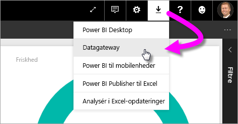
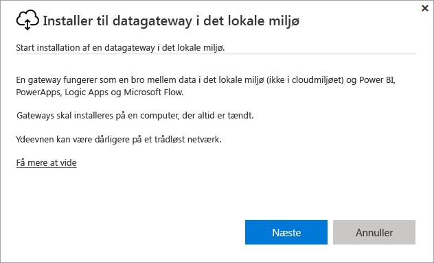
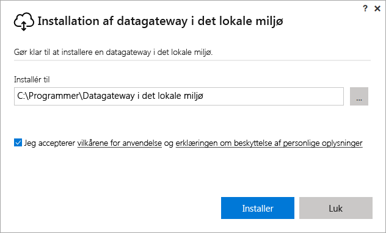
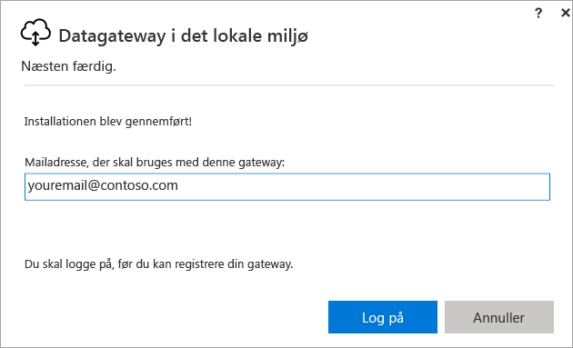
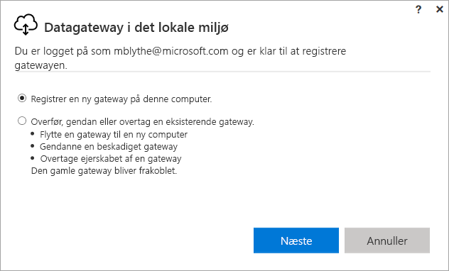
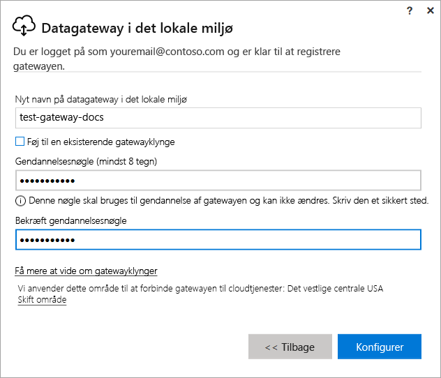
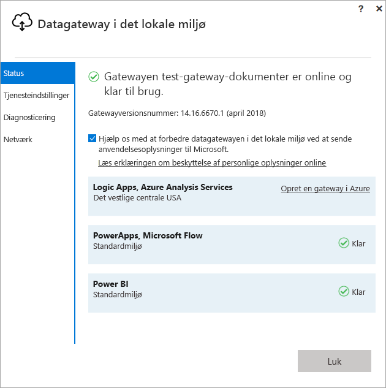
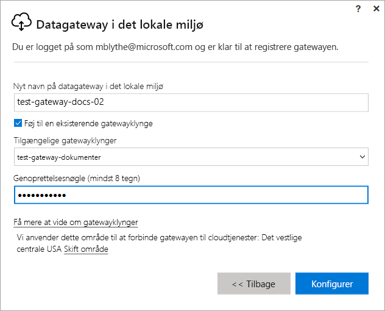

# Installér en gateway til Power BI

En Power BI-gateway er software, som du installerer på et lokalt netværk. Det gør det nemmere at få adgang til data på dette netværk. Som beskrevet i [oversigten](service-gateway-getting-started.md) kan du installere en gateway i personlig tilstand eller i standardtilstand (anbefales). I standardtilstand kan du installere en separat gateway eller føje en gateway til en *klynge*, hvilket anbefales for at opnå høj tilgængelighed. I denne artikel viser vi dig, hvordan du kan installere en standardgateway og derefter tilføje endnu en gateway for at oprette en klynge.

Hvis du ikke er tilmeldt Power BI, kan du [tilmelde dig en gratis prøveversion](https://app.powerbi.com/signupredirect?pbi_source=web), før du begynder.

## Download og installér en gateway

Gatewayen kører på den computer, hvor du installerer den, så sørg for at installere den på en computer, der altid er tændt. Det anbefales, at computeren kører på et traditionelt netværk i stedet for et trådløst, for at du kan opnå en bedre ydeevne og pålidelighed.

1. I øverste højre hjørne i Power BI-tjenesten skal du vælge **ikonet Download**  > **Datagateway**.

    

2. På downloadsiden skal du vælge knappen **DOWNLOAD GATEWAY**.

3. Vælg **Næste**.     

    

4. Vælg **Datagateway i det lokale miljø (anbefales)** > **Næste**.

    

5. Bevar standardinstallationsstien, og acceptér betingelserne > **Installér**.

    

6. Angiv den konto, du bruger til at logge på Power BI > **Log på**.

    

    Gatewayen er knyttet til din Power BI-konto, og du kan administrere gateways fra Power BI-tjenesten. Du er nu logget på din konto.

7. Vælg **Registrer en ny gateway på denne computer** > **Næste**.

    

8. Angiv et navn til gatewayen (skal være entydigt for hele lejeren) og en genoprettelsesnøgle. Du skal bruge denne nøgle, hvis du på et tidspunkt ønsker at gendanne eller flytte din gateway. Vælg **Konfigurer**.

    

    Læg mærke til indstillingen **Føj til en eksisterende gatewayklynge**. Vi bruger denne indstilling i næste afsnit i artiklen.

9. Gennemse oplysningerne i det sidste vindue. Bemærk, at gatewayen er tilgængelig for Power BI og for PowerApps og Flow, fordi jeg bruger den samme konto til alle tre. Vælg **Luk**.

    

Nu, hvor du har installeret en gateway, kan du tilføje endnu en gateway for at oprette en klynge.

## Tilføj endnu en gateway for at oprette en klynge

Med en klynge undgår gatewayadministratoren at have et enkelt fejlpunkt i forbindelse med dataadgang i det lokale miljø. Hvis den primære gateway er utilgængelig, distribueres dataanmodninger til den næste gateway, du tilføjer, osv. Du kan kun installere én standardgateway på en computer, så du skal installere den anden gateway for klyngen på en anden computer. Det giver mening, fordi du ønsker redundans i klyngen.

Gatewayklynger med høj tilgængelighed kræver opdateringen fra november 2017 eller nyere til datagatewayen i det lokale miljø.

1. Download gatewayen på en anden computer, og installér den.

2. Når du er logget på din Power BI-konto, kan du registrere gatewayen. Vælg **Føj til en eksisterende klynge**. Under **Tilgængelige gatewayklynger** skal du vælge den første gateway, du har installeret (den *primære gateway*) og angive genoprettelsesnøglen for denne gateway. Vælg **Konfigurer**.

    

## Næste trin

[Administrer en Power BI-gateway](service-gateway-manage.md)

Har du flere spørgsmål? [Prøv at spørge Power BI-community'et](http://community.powerbi.com/)