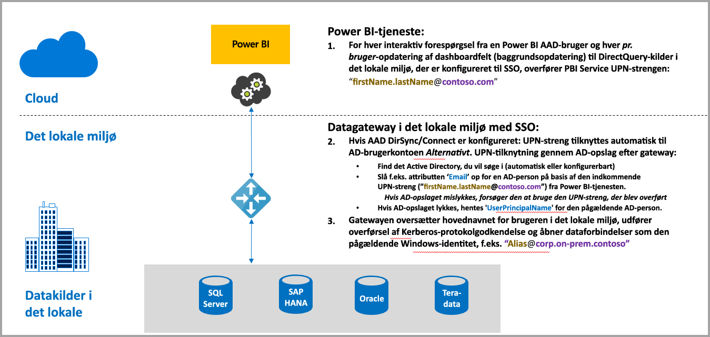
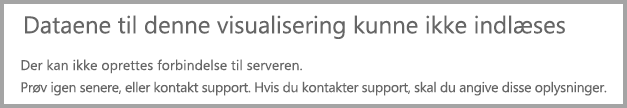
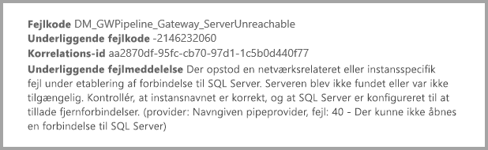
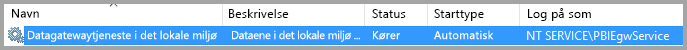
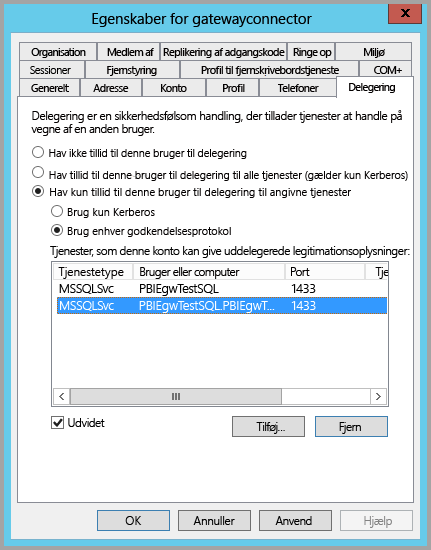
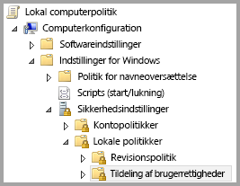
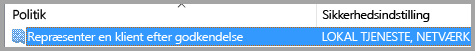
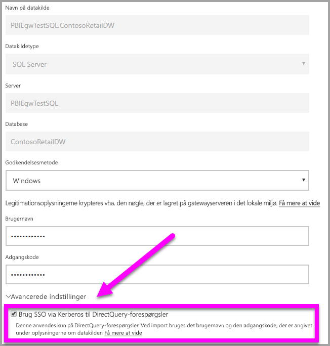
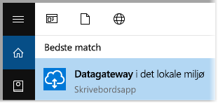
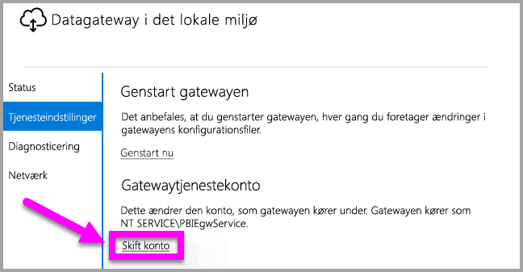

# Brug Kerberos til SSO (enkeltlogon) fra Power BI til datakilder i det lokale miljø
Du kan få problemfri forbindelse med enkeltlogon, så Power BI-rapporter og -dashboards kan opdateres fra data i det lokale miljø, ved at konfigurere din datagateway i det lokale miljø med Kerberos. Datagatewayen i det lokale miljø gør det muligt at foretage enkeltlogon (SSO) ved hjælp af DirectQuery, som den bruger til at oprette forbindelse til datakilder i det lokale miljø.

Følgende datakilder understøttes i øjeblikket – SQL Server, SAP HANA og Teradata – alle baseret på [Kerberos-begrænset delegering](https://technet.microsoft.com/library/jj553400.aspx).

* SQL Server
* SAP HANA
* SAP BW
* Teradata

Når en bruger kommunikerer med en DirectQuery-rapport i Power BI-tjenesten, kan hvert krydsfilter, udsnit, sortering og rapportredigering resultere i forespørgsler, der udføres direkte mod den underliggende datakilde i det lokale miljø.  Når der er konfigureret enkeltlogon for datakilden, udføres forespørgsler under id'et for den bruger, som interagerer med Power BI (dvs. via weboplevelsen eller Power BI-mobilapps). På den måde får hver bruger præcist de data, som de har tilladelser til i den underliggende datakilde – med enkeltlogon konfigureret er der ingen cachelagring af delte data på tværs af flere brugere.

## Kørsel af en forespørgsel med SSO – involverede trin
En forespørgsel, der køres med SSO, består af tre trin som vist i følgende diagram.

> [!NOTE]
> SSO til Oracle er endnu ikke aktiveret, men den er under udvikling og kommer snart.
> 
> 

Der følger flere oplysninger om disse trin:

1. For hver forespørgsel vil **Power BI-tjenesten** medtage *brugerens hovednavn* (UPN), når der sendes en forespørgsel til den konfigurerede gateway.
2. Gatewayen skal tilknytte Azure Active Directory-UPN'et til et lokalt Active Directory-id.
   
   a.  Hvis AAD DirSync (også kaldet *AAD Connect*) er konfigureret, fungerer tilknytningen automatisk i gatewayen.
   
   b.  Ellers kan gatewayen søge efter og knytte Azure AD-UPN til en lokal bruger ved at foretage opslag mod det lokale Active Directory-domæne.
3. Processen til gatewaytjenesten repræsenterer den tilknyttede lokale bruger, åbner forbindelsen til den underliggende database og sender forespørgslen. Gatewayen behøver ikke at være installeret på samme computer som databasen.
   
   - Brugerrepræsentation og forbindelse til databasen lykkes kun, hvis gatewaytjenestens konto er en domænekonto (eller en tjeneste-SID), og hvis Kerberos-begrænset delegering blev konfigureret, så databasen accepterer Kerberos-billetter fra gatewaytjenestens konto.  
   
   > [!NOTE]
   > I forbindelse med tjeneste-SID, og hvis AAD DirSync/Connect er konfigureret, og brugerkonti er synkroniseret, behøver gatewaytjenesten ikke at udføre lokale AD-opslag på kørselstidspunktet, og du kan bruge den lokale tjeneste-SID (i stedet for at kræve en domænekonto) til gatewaytjenesten.  Konfigurationstrinnene i den Kerberos-begrænsede delegering, der er skitseret i dette dokument, er de samme (anvendelsen er blot baseret på tjeneste-SID i stedet for domænekonto).
   > 
   > 

> [!NOTE]
> Sådan aktiverer du SSO til SAP HANA:
>
> - Kontrollér, at SAP HANA serveren kører den påkrævede minimumversion, hvilket afhænger af niveauet af din SAP HANA serverplatform:
>     - [HANA 2 SPS 01 Rev 012.03](https://launchpad.support.sap.com/#/notes/2557386)
>     - [HANA 2 SPS 02 Rev 22](https://launchpad.support.sap.com/#/notes/2547324)
>     - [HANA 1 SP 12 Rev 122.13](https://launchpad.support.sap.com/#/notes/2528439)
>
> - Installér SAP's seneste HANA ODBC-driver på gatewaycomputeren.  Minimumversionen er HANA ODBC version 2.00.020.00 fra august 2017.
>
> Du kan finde flere oplysninger om, hvordan du konfigurerer og angiver enkeltlogon for SAP HANA ved hjælp af Kerberos, i emnet [Enkeltlogon ved hjælp af Kerberos](https://help.sap.com/viewer/b3ee5778bc2e4a089d3299b82ec762a7/2.0.03/en-US/1885fad82df943c2a1974f5da0eed66d.html) i SAP HANA-sikkerhedsvejledningen og linkene fra denne side, især SAP Note 1837331 – HOWTO HANA DBSSO Kerberos/Active Directory]. 
>
>

## Fejl fra en utilstrækkelig Kerberos-konfiguration
Hvis den underliggende databaseserver og gateway ikke er konfigureret korrekt til **Kerberos-begrænset delegering**, kan du få vist følgende fejlmeddelelse:

Og de tekniske detaljer, der er knyttet til fejlmeddelelsen, kan se ud som følger:

På grund af den utilstrækkelige Kerberos-konfiguration kunne gatewayen ikke repræsentere den oprindelige bruger korrekt, og det lykkedes ikke at oprette forbindelse til databasen.

## Forberedelse af Kerberos-begrænset delegering
Der skal være konfigureret flere elementer, hvis Kerberos-begrænset delegering skal fungere korrekt, herunder *tjenestens hovednavn* (SPN) og delegeringsindstillinger i tjenestekonti.

### Forudsætning 1: Installér og konfigurer datagatewayen i det lokale miljø
Denne version af datagatewayen i det lokale miljø understøtter en direkte opgradering samt indstillingsovertagelse af eksisterende gateways.

### Forudsætning 2: Kør gatewayens Windows-tjeneste som en domænekonto
I en standardinstallation kører gatewayen som en tjenestekonto på en lokal computer (specifikt *NT-tjeneste\PBIEgwService*) som det, der er vist i følgende billede:

Når **Kerberos-begrænset delegering** skal aktiveres, skal gatewayen køre som en domænekonto, medmindre AAD allerede er synkroniseret med dit lokale Active Directory (med AAD DirSync/Connect). Hvis denne ændring af kontoen skal fungere korrekt, har du to valgmuligheder:

* Hvis du startede med en tidligere version af datagatewayen i det lokale miljø, skal du følge alle fem trin i rækkefølge meget præcist (herunder kørsel af gatewaykonfiguratoren i trin 3), som beskrevet i følgende artikel:
  
  * [Ændring af gatewaytjenestekontoen til en domænebruger](https://powerbi.microsoft.com/documentation/powerbi-gateway-proxy/#changing-the-gateway-service-account-to-a-domain-user)
  * Hvis du allerede har installeret prøveversionen af datagatewayen i det lokale miljø, er der en ny måde, der styres i brugergrænsefladen, at skifte tjenestekonti på direkte fra gatewaykonfiguratoren. Se afsnittet **Skift af gatewayen til en domænekonto** mod slutningen af denne artikel.

> [!NOTE]
> Hvis AAD DirSync/Connect er konfigureret, og brugerkonti er synkroniseret, behøver gatewaytjenesten ikke at udføre lokale AD-opslag på kørselstidspunktet, og du kan bruge den lokale tjeneste-SID (i stedet for at kræve en domænekonto) til gatewaytjenesten. Konfigurationstrinnene i den Kerberos-begrænsede delegering, der er skitseret i denne artikel, er de samme som den pågældende konfiguration (de anvendes simpelthen på basis af tjeneste-SID'en i stedet for domænekonto).
> 
> 

### Forudsætning 3: At have rettigheder som domæneadministrator til at konfigurere indstillinger for SPN'er (SetSPN) og Kerberos-begrænset delegering
Selvom det teknisk set er muligt for en domæneadministrator midlertidigt eller permanent at give andre rettigheder til at konfigurere SPN'er og Kerberos-delegering, uden at dette kræver rettigheder som domæneadministrator, er dette ikke den anbefalede fremgangsmåde. I følgende afsnit gennemgås konfigurationstrinnene, der kræves i **Forudsætning 3**, udførligt.

## Konfiguration af Kerbos-begrænset delegering for gatewayen og datakilden
Følgende to elementer skal konfigureres eller valideres, før systemet kan konfigureres korrekt:

1. Hvis det er nødvendigt, kan du konfigurere et SPN for gatewaytjenestens domænekonto (hvis der ikke allerede er oprettet et).
2. Konfigurer delegeringsindstillinger på gatewaytjenestens domænekonto.

Bemærk, at du skal være domæneadministrator for at kunne udføre disse to konfigurationstrin.

I de følgende afsnit beskrives disse trin efter tur.

### Konfigurer et SPN til gatewaytjenestekontoen
Først skal du fastlægge, om der allerede er oprettet et SPN for den domænekonto, der er anvendt som gatewaytjenestekonto, ved at følge disse trin:

1. Start **Active Directory-brugere og -computere** som domæneadministrator
2. Højreklik på domænet, vælg **Find**, og skriv kontonavnet for gatewaytjenestekontoen
3. Højreklik i søgeresultaterne på gatewaytjenestekontoen, og vælg **Egenskaber**.
   
   * Hvis fanen **Delegering** kan ses i dialogboksen **Egenskaber**, så var der allerede oprettet et SPN, og du kan gå videre til næste underafsnit om konfiguration af Delegering-indstillinger.

Hvis der ikke er en **Delegering**-fane i dialogboksen **Egenskaber**, kan du manuelt oprette et SPN for den pågældende konto, som tilføjer fanen **Delegering** (det er den nemmeste måde at konfigurere delegeringsindstillinger på). Oprettelse af et hovednavn til tjenesten, eller et SPN, kan udføres ved hjælp af [setspn-værktøjet](https://technet.microsoft.com/library/cc731241.aspx), der følger med Windows (du skal have rettigheder som domæneadministrator for at kunne oprette SPN'et).

Forestil dig f.eks., at gatewaytjenestekontoen er "PBIEgwTest\GatewaySvc", og at navnet på computeren, hvor gatewaytjenesten kører, kaldes **Computer1**. Hvis du vil angive SPN'et for gatewaytjenestekontoen for denne computer i dette eksempel, skal du køre følgende kommando:

Når dette trin er fuldført, kan vi gå videre til at konfigurere delegeringsindstillinger.

### Konfigurer delegeringsindstillinger på gatewaytjenestekontoen
Det andet konfigurationskrav er delegeringsindstillinger på gatewaytjenestekontoen . Der er mange værktøjer, som kan bruges til at udføre disse trin. I denne artikel bruger vi **Active Directory-brugere og -computere**, som er et MMC-snap-in (Microsoft Management Console), du kan bruge til at administrere og publicere oplysninger i mappen. Det findes som standard på domænecontrollere. Du kan også aktivere det via konfiguration af **Windows-funktioner** på andre computere.

Vi skal konfigurere **Kerberos-begrænset delegering** med protokoloverførsel. I forbindelse med begrænset delegering skal du være meget eksplicit med hensyn til de tjenester, du vil delegere til – f.eks. vil kun din SQL Server eller din SAP HANA-server acceptere delegeringskald fra gatewaytjenestekontoen.

I dette afsnit forudsættes det, at du allerede har konfigureret SPN'er for de underliggende datakilder (f.eks. SQL Server, SAP HANA, Teradata osv.). Du kan få mere at vide om, hvordan du konfigurerer disse datakildeserveres SPN'er i den tekniske dokumentation til de respektive databaseserver. Du kan også se i blogindlægget, der beskriver, [*Hvilket SPN kræver din app?*](https://blogs.msdn.microsoft.com/psssql/2010/06/23/my-kerberos-checklist/)

I følgende trin tager vi udgangspunkt i et lokalt miljø med to computere: en gatewaycomputer og en databaseserver (SQL Server-database) og med henblik på dette eksempel tager vi også udgangspunkt i følgende indstillinger og navne:

* Navn på gatewaycomputer: **PBIEgwTestGW**
* Gatewaytjenestekonto: **PBIEgwTest\GatewaySvc** (kontos viste navn: Gateway Connector)
* Navn på computer med SQL Server-datakilde: **PBIEgwTestSQL**
* SQL Server-datakildes tjenestekonto: **PBIEgwTest\SQLService**

Med udgangspunkt i disse eksempelnavne og -indstillinger er konfigurationstrinnene som følger:

1. Med rettigheder som domæneadministrator skal du starte **Active Directory-brugere og -computere**.
2. Højreklik på gatewaytjenestekontoen (**PBIEgwTest\GatewaySvc**), og vælg **Egenskaber**.
3. Vælg fanen **Delegering**.
4. Vælg **Hav kun tillid til denne computer i forbindelse med uddelegering til de angivne tjenester**.
5. Vælg **Brug enhver godkendelsesprotokol**.
6. Under **Tjenester, som denne konto kan give uddelegerede legitimationsoplysninger:** skal du vælge **Tilføj**.
7. I den nye dialogboks skal du vælge **Brugere eller computere**.
8. Angiv SQL Server-databasetjenesten (**PBIEgwTest\SQLService**), og vælg **OK**.
9. Vælg det hovednavn for tjenesten (SPN), du har oprettet for databaseserveren. I dette eksempel begynder tjenestens hovednavn med **MSSQLSvc**. Hvis du har tilføjet både det fulde domænenavn (FQDN) og NetBIOS- SPN til din databasetjeneste, vælges begge dele. Du får muligvis kun vist det ene.
10. Vælg **OK**. Du bør nu kunne se SPN'et på listen.
11. Du kan vælge **Udvidet**, hvis du vil have vist både FQDN og NetBIOS-SPN
12. Dialogboksen ligner følgende, hvis du har valgt **Udvidet**.
    
    
13. Vælg **OK**.
    
    På den computer, der kører gatewaytjenesten (**PBIEgwTestGW** i eksemplet), skal gatewaytjenestekontoen endeligt have tildelt den lokale politik "Repræsenter en klient efter godkendelse". Du kan udføre/bekræfte dette med Editor til lokal gruppepolitik (**gpedit**).
14. Kør: *gpedit.msc* på gatewaycomputeren
15. Gå til **Lokal computerpolitik > Computerkonfiguration > Windows-indstillinger > Sikkerhedsindstillinger > Lokale politikker > Tildeling af brugerrettigheder**, som vist i følgende billede.
    
    
16. Fra listen over politikker under **Tildeling af brugerrettigheder** skal du vælge **Repræsenter en klient efter godkendelse**.
    
    
    
    Højreklik og åbn **Egenskaber** for **Repræsenter en klient efter godkendelse**, og kontrollér listen over konti. Den skal omfatte gatewaytjenestekontoen (**PBIEgwTest\GatewaySvc**).
17. Fra listen over politikker under **Tildeling af brugerrettigheder** skal du vælge **Optræd som en del af operativsystemet (SeTcbPrivilege)**. Kontrollér, at gatewaytjenestekontoen også er medtaget på listen over konti.
18. Genstart processen for tjenesten med **datagatewayen i det lokale miljø**.

## Kørsel af en Power BI-rapport
Når alle de konfigurationstrin, der er skitseret tidligere i denne artikel, er fuldført, kan du bruge siden til **administration af gateway** i Power BI til at konfigurere datakilden, og under **Avancerede indstillinger** dér kan du aktivere SSO og derefter publicere rapporter og datasæt med binding til den pågældende datakilde.

Denne konfiguration fungerer i de fleste tilfælde. Med Kerberos kan der dog være forskellige konfigurationer afhængigt af dit miljø. Hvis rapporten stadig ikke kan indlæses, skal du kontakte domæneadministratoren for at få problemet undersøgt yderligere.

## Skift af gatewayen til en domænekonto
Vi har tidligere i denne artikel gennemgået skift af gateway fra en lokal tjenestekonto til en, der kører som en domænekonto, ved hjælp af brugergrænsefladen i **datagatewayen i det lokale miljø**. Her er de trin, der er nødvendige for at kunne gøre dette.

1. Start konfigurationsværktøjet til **datagatewayen i det lokale miljø**.
   
   
2. Vælg knappen**Sign-in** (Logon) på hovedsiden, og log på med din Power BI-konto.
3. Når logon er fuldført, kan du vælge fanen **Tjenesteindstillinger**.
4. Klik på **Change account** (Skift konto) for at starte den guidede gennemgang som vist i følgende figur.
   
   

## Næste trin
Du kan finde flere oplysninger om **datagatewayen i det lokale miljø** og **DirectQuery** i følgende ressourcer:

* [Datagateway i det lokale miljø](service-gateway-onprem.md)
* [DirectQuery i Power BI](desktop-directquery-about.md)
* [Datakilder, der understøttes af DirectQuery](desktop-directquery-data-sources.md)
* [DirectQuery og SAP BW](desktop-directquery-sap-bw.md)
* [DirectQuery og SAP HANA](desktop-directquery-sap-hana.md)

