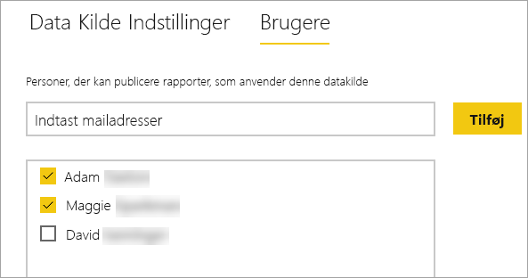
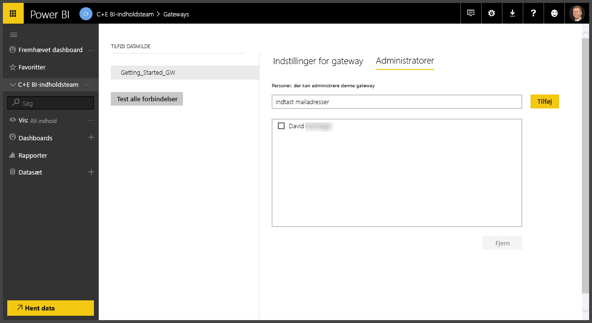
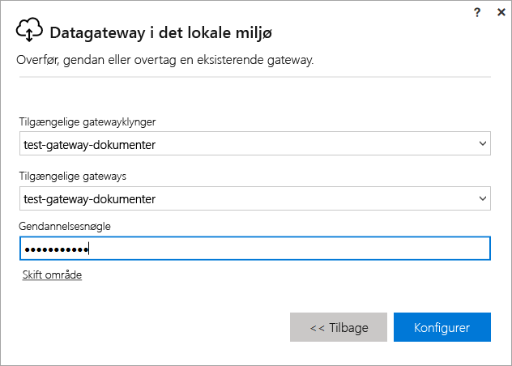

# Administrer en Power BI-gateway i det lokale miljø

Når du har [installeret en Power BI-datagateway](service-gateway-install.md), kan du administrere den på baggrund af dine krav. I dette emne kan du få mere at vide om, hvordan du tilføjer og fjerner datakilder og brugere, genstarter en gateway samt overfører, gendanner, overtager og fjerner en gateway. 

Du kan administrere en gateway vha. området **Administrer gateways**i Power BI-tjenesten, i gatewayappen på din lokale computer og via PowerShell-scripts. I denne artikel fokuseres der på Power BI-tjenesten. 

Hvis du lige har installeret en gateway, anbefales det, at du så [tilføjer en datakilde](#add-a-data-source) og derefter [tilføjer brugere](#add-users-to-a-data-source), så de kan få adgang til datakilden.

## Administrer datakilder

Power BI understøtter mange datakilder i det lokale miljø, og de har hver især sine egne krav. En gateway kan bruges til en enkelt datakilde eller flere datakilder. I dette eksempel viser vi dig, hvordan du tilføjer SQL Server som en datakilde, men trinnene er de samme for andre datakilder.

### Tilføj en datakilde

1. I øverste højre hjørne af Power BI-tjenesten skal du vælge tandhjulsikonet  > **Administrer gateways**.

    

2. Vælg enten en gateway > **Tilføj datakilde**, eller gå til Gateways > **Tilføj datakilde**.

    

3. Vælg **Datakildetype**.

    

4. Angiv oplysninger for datakilden. I dette eksempel er det **Server**, **Database** og andre oplysninger.  

    

5. For SQL Server kan du vælge **godkendelsesmetoden** **Windows** eller **Basic** (SQL-godkendelse).  Hvis du vælger **Basic**, skal du angive legitimationsoplysningerne for datakilden.

6. Under **Avancerede indstillinger** kan du eventuelt konfigurere [niveauet for beskyttelse af personlige oplysninger](https://support.office.com/article/Privacy-levels-Power-Query-CC3EDE4D-359E-4B28-BC72-9BEE7900B540) for din datakilde (gælder ikke for [DirectQuery](desktop-directquery-about.md)).

    

7. Vælg **Tilføj** Du får vist *Forbindelsen er oprettet*, hvis processen lykkes.

    

Du kan nu bruge denne datakilde til at inkludere data fra SQL Server i dine Power BI-dashboards og -rapporter.

### Fjern en datakilde

Du kan fjerne en datakilde, hvis du ikke længere bruger den. Vær opmærksom på, at hvis du fjerner en datakilde, ødelægger det alle dashboards og rapporter, der anvender den pågældende datakilde.

Hvis du vil fjerne en datakilde, skal du gå til datakilden og derefter vælge **Fjern**.

## Administrer brugere og administratorer

Når du har føjet en datakilde til en gateway, giver du brugere og sikkerhedsgrupper adgang til den specifikke datakilde (ikke hele gatewayen). Brugerlisten for datakilden styrer kun, hvem der har tilladelse til at udgive rapporter, der indeholder data fra datakilden. Rapporternes ejere kan oprette dashboards, indholdspakker og apps og derefter dele dem med andre brugere.

Du kan også give brugere og sikkerhedsgrupper administrativ adgang til gatewayen.

### Føj brugere til en datakilde

1. I øverste højre hjørne af Power BI-tjenesten skal du vælge tandhjulsikonet  > **Administrer gateways**.

2. Vælg den datakilde, hvor du vil tilføje brugere.

3. Vælg **Brugere**, og angiv en bruger fra din organisation, som du vil give adgang til den valgte datakilde. På følgende skærmbillede kan du se, at jeg tilføjer Maggie og Adam.

    

4. Hvis du vælger **Tilføj**, vises det tilføjede medlem i feltet.

    

Så nemt er det. Vær opmærksom på, at du skal føje brugere til hver enkelt datakilde, du vil give adgang til. Hver enkelt datakilde har en separat liste over brugere, og du skal føje brugere til hver enkelt datakilde særskilt.

### Fjern brugere fra en datakilde

Under fanen **Brugere** for datakilden kan du fjerne brugere og sikkerhedsgrupper, som bruger denne datakilde.

### Tilføj og fjern administratorer

Under fanen **Administratorer** for gatewayen kan du tilføje og fjerne brugere (eller sikkerhedsgrupper), som kan administrere gatewayen.

## Administrer en gatewayklynge

Når du har oprettet en klynge, der består af to eller flere gateways, gælder alle administrationshandlinger i forbindelse med gateways, f.eks. tilføjelse af en datakilde eller tildeling af administrative tilladelser til en gateway, for alle gateways, der indgår i klyngen. 

Når administratorer bruger menupunktet **Administrer gateways**, der findes under tandhjulsikonet i **Power BI-tjenesten**, kan de se en liste over registrerede klynger eller individuelle gateways, men de kan ikke se de enkelte gatewayinstanser, der er medlemmer af klyngen.

Alle nye anmodninger af typen **Planlagt opdatering** og DirectQuery-handlinger omdirigeres automatisk til den primære instans for en given gatewayklynge. Hvis den primære gatewayinstans ikke er online, dirigeres anmodningen til en anden gatewayinstans i klyngen.

## Del en gateway

Du kan ikke *dele* en gateway som sådan, men du kan føje administratorer til gatewayen, og du kan føje brugere til gatewayens datakilder. 

Når du har installeret en gateway, er du som standard administrator af denne gateway. Som vist tidligere kan du tilføje andre personer som administratorer. Disse administratorer kan tilføje datakilder, konfigurere og fjerne gatewayen.

Du kan også tildele brugere til de datakilder, du opretter under hver af din gateways. Brugerne kan derefter bruge disse datakilder til at opdatere Power BI-rapporter. De kan dog ikke ændre datakilderne eller gatewayindstillingerne.

## Overfør, gendan eller overtag en gateway

Kør installationsprogrammet for gatewayen på den computer, hvor du vil overføre, gendanne eller overtage gatewayen.

1. Download gatewayen, og installér den.

2. Når du er logget på din Power BI-konto, kan du registrere gatewayen. Vælg **Overfør, gendan eller overtag en eksisterende gateway** > **Næste**.

    

3. Vælg en af de tilgængelige klynger og gateways, og angiv genoprettelsesnøglen for den valgte gateway. Vælg **Konfigurer**.

    

## Genstart en gateway

Gatewayen kører som en Windows-tjeneste. På samme måde som med andre Windows-tjenester kan du starte og stoppe den på flere måder. Her kan du se, hvordan du kan gøre det fra kommandoprompten.

1. Start en kommandoprompt med administratorrettigheder på den computer, hvor gatewayen kører

2. Angiv `net stop PBIEgwService` for at stoppe tjenesten.

3. Angiv `net start PBIEgwService` for at genstarte tjenesten.

## Fjern en gateway

Du kan fjerne en gateway, hvis du ikke længere bruger den. Men vær opmærksom på, at hvis du fjerner en gateway, slettes alle datakilder under den. Dette vil også ødelægge alle dashboards og rapporter, der anvender disse datakilder.

1. I øverste højre hjørne af Power BI-tjenesten skal du vælge tandhjulsikonet  > **Administrer gateways**.

2. Vælg gatewayen > **Fjern**
   
   

## Næste trin

[Vejledning til installation af en datagateway](service-gateway-deployment-guidance.md)

Har du flere spørgsmål? [Prøv at spørge Power BI-community'et](http://community.powerbi.com/)
