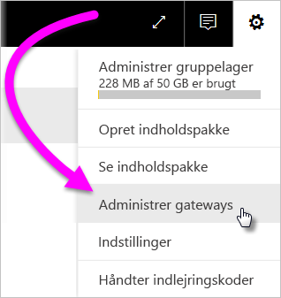
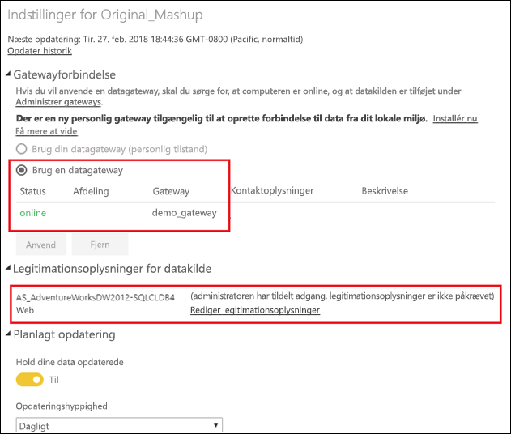

# Flet eller tilføj datakilder i det lokale miljø og i clouden

[!INCLUDE [gateway-rewrite](includes/gateway-rewrite.md)]

Du kan bruge datagatewayen i det lokale miljø til at flette eller tilføje datakilder i det lokale miljø og cloudmiljøet i samme forespørgsel. Denne løsning er nyttig, når du vil kombinere data fra flere kilder uden at bruge separate forespørgsler.

>[!NOTE]
>Denne artikel gælder kun for datasæt, der har datakilder i cloudmiljøet og det lokale miljø, som er flettet eller tilføjet i en enkelt forespørgsel. I forbindelse med datasæt, som indeholder separate forespørgsler – én, der opretter forbindelse til en datakilde i det lokale miljø, og en anden, der opretter forbindelse til en datakilde i cloudmiljøet – udfører gatewayen ikke forespørgslen for datakilden i cloudmiljøet.

## Forudsætninger

- En [gateway, der er installeret](/data-integration/gateway/service-gateway-install) på en lokal computer.
- En Power BI Desktop-fil med forespørgsler, der kombinerer datakilder i det lokale miljø og i clouden.

>[!NOTE]
>Hvis du vil tilgå datakilder i cloudmiljøet, skal du sikre, at gatewayen har adgang til disse datakilder.

1. I øverste højre hjørne af Power BI-tjenesten skal du vælge tandhjulsikonet  > **Administrer gateways**.

    

2. Vælg den gateway, du vil konfigurere.

3. Under **Indstillinger for gatewayklynge** skal du vælge **Tillad, at brugerens datakilder fra skyen opdateres via denne gateway** > **Anvend**.

    

4. Under denne gatewayklynge kan du tilføje en [datakilde i det lokale miljø](service-gateway-enterprise-manage-scheduled-refresh.md#add-a-data-source), som skal bruges i dine forespørgsler. Du behøver ikke at tilføje datakilder i clouden her.

5. Upload Power BI Desktop-filen med de forespørgsler, der kombinerer datakilder i det lokale miljø og i clouden, til Power BI-tjenesten.

6. På siden **Datasætindstillinger** for det nye datasæt:

   - For kilden i det lokale miljø skal du vælge den gateway, der er knyttet til datakilden.
   - Under **Legitimationsoplysninger for datakilde** skal du redigere legitimationsoplysningerne for datakilden efter behov.

    Sørg for, at niveauet for beskyttelse af personlige oplysninger for datakilder både i cloudmiljøet og i det lokale miljø er angivet korrekt for at sikre, at joinforbindelserne håndteres sikkert.

     

7. Når du har angivet cloudlegitimationsoplysningerne, kan du nu opdatere datasættet ved hjælp indstillingen **Opdater nu**. Du kan også vælge at planlægge, at det skal opdateres regelsmæssigt.

## De næste trin

Hvis du vil vide mere om dataopdateringer til gateways, skal du se [Brug datakilden til planlagt opdatering](service-gateway-enterprise-manage-scheduled-refresh.md#use-the-data-source-for-scheduled-refresh).
