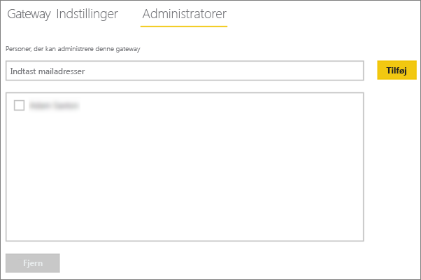
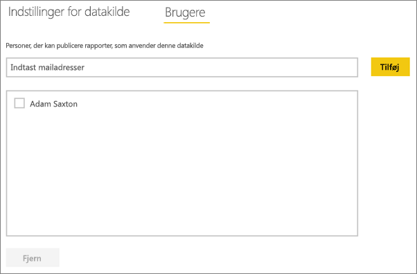
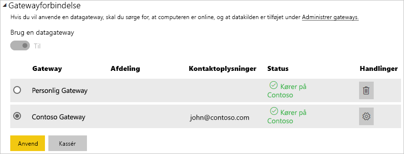

# <a name="manage-your-data-source---oracle"></a>Administrer din datakilde – Oracle
Når du har installeret datagatewayen i det lokale miljø, skal du tilføje datakilder, der kan bruges sammen med gatewayen. I denne artikel kan du se, hvordan du arbejder med gateways og datakilder. Du kan bruge Oracle-datakilden til enten planlagte opdateringer eller DirectQuery.

## <a name="download-and-install-the-gateway"></a>Download og installér gatewayen
Du kan downloade gatewayen fra Power BI-tjenesten. Vælg **Downloads** > **Datagateway**, eller gå til [siden til download af gateway](https://go.microsoft.com/fwlink/?LinkId=698861).


> [!WARNING]
> Oracle Data Provider til .NET (ODP.NET) skal være installeret og konfigureret, for at gatewayen kan oprette forbindelse til Oracle-serveren. Dette er en del af Oracle Data Access Components (ODAC). Få flere oplysninger om, hvordan du downloader Oracle-udbyderen ved at se [Installér Oracle-klienten](#installing-the-oracle-client) nedenfor.
> 
> 

## <a name="installing-the-oracle-client"></a>Installér Oracle-klienten
Til **32-bit** versioner af Power BI Desktop skal du bruge følgende link til at downloade og installere **32-bit** Oracle-klienten:

* [32-bit Oracle Data Access Components (ODAC) med Oracle Developer Tools til Visual Studio (12.1.0.2.4)](http://www.oracle.com/technetwork/topics/dotnet/utilsoft-086879.html)

Til **64-bit** versioner af Power BI Desktop eller til datagatewayen i det lokale miljø skal du bruge følgende link til at downloade og installere **64-bit** Oracle-klienten:

* [64-bit ODAC 12.2c Release 1 (12.2.0.1.0) til Windows x64](http://www.oracle.com/technetwork/database/windows/downloads/index-090165.html)

Når den er installeret, skal du konfigurere filen tnsnames.ora med de korrekte oplysninger for databasen. Power BI Desktop og gatewayen forsvinder fra net_service_name, der er defineret i filen tnsnames.ora. Hvis den ikke er konfigureret, kan du ikke oprette forbindelse. Standardstien til tnsnames.ora er følgende: `[Oracle Home Directory]\Network\Admin\tnsnames.ora`. Se flere oplysninger om, hvordan du konfigurerer tnsnames.ora-filer ved at se [Oracle: lokale navngivningsparametre (tnsnames.ora)](https://docs.oracle.com/cd/B28359_01/network.111/b28317/tnsnames.htm).

### <a name="example-tnsnamesora-file-entry"></a>Eksempel på indtastning i filen tnsnames.ora
Det grundlæggende format for en indtastning i tnsnames.ora er følgende:

```
net_service_name=
 (DESCRIPTION=
   (ADDRESS=(protocol_address_information))
   (CONNECT_DATA=
     (SERVICE_NAME=service_name)))
```

Her er et eksempel på udfyldte server- og portoplysninger.

```
CONTOSO =
  (DESCRIPTION =
    (ADDRESS = (PROTOCOL = TCP)(HOST = oracleserver.contoso.com)(PORT = 1521))
    (CONNECT_DATA =
      (SERVER = DEDICATED)
      (SERVICE_NAME = CONTOSO)
    )
  )
```

## <a name="add-a-gateway"></a>Tilføj en gateway
Hvis du vil tilføje en gateway, skal du blot [downloade](https://go.microsoft.com/fwlink/?LinkId=698861) og installere gatewayen på en server i dit miljø. Når du har installeret gatewayen, vises den på listen over gateways under **Administrer gateways**.

> [!NOTE]
> **Administrer gateways** vises ikke, før du er administrator af mindst én gateway. Det kan du blive ved enten at blive tilføjet som administrator eller ved at installere og konfigurere en gateway.
> 
> 

## <a name="remove-a-gateway"></a>Fjern en gateway
Hvis du fjerner en gateway, slettes også eventuelle datakilder under denne gateway.  Dette vil også ødelægge alle dashboards og rapporter, der anvender disse datakilder.

1. Vælg tandhjulsikonet  i øverste højre hjørne > **Administrer gateways**.
2. Gateway > **Fjern**
   
   

## <a name="add-a-data-source"></a>Tilføj en datakilde
Du kan tilføje en datakilde ved enten at vælge en gateway og klikke på **Tilføj datakilde** eller gå til Gateway > **Tilføj datakilde**.


Du kan derefter vælge **Datakildetype** på listen.


Derefter skal du angive oplysninger om datakilden, herunder **Server** og **Database**.  

Du skal også vælge en **Godkendelsesmetode**.  Denne kan enten være **Windows** eller **Basis**.  Du skal vælge **Basis**, hvis du skal bruge en konto, der er oprettet i Oracle i stedet for Windows-godkendelse. Indtast derefter legitimationsoplysningerne, der skal bruges til denne datakilde.

> [!NOTE]
> Alle forespørgsler til datakilden kører ved hjælp af disse legitimationsoplysninger. Du kan finde flere oplysninger om, hvordan du gemmer [legitimationsoplysninger](service-gateway-onprem.md#credentials) i hovedartiklen om datagateways i det lokale miljø.
> 
> 


Du kan klikke på **Tilføj**, når du har udfyldt det hele.  Du kan nu bruge denne datakilde til planlagt opdatering eller DirectQuery op mod en Oracle-server, der er i det lokale miljø. Du får vist *Forbindelsen er oprettet*, hvis det lykkes.


### <a name="advanced-settings"></a>Avancerede indstillinger
Du kan konfigurere niveauet for beskyttelse af personlige oplysninger for datakilden. Dette styrer, hvordan data kan blandes. Dette bruges kun til planlagt opdatering. Det gælder ikke for DirectQuery. [Få mere at vide](https://support.office.com/article/Privacy-levels-Power-Query-CC3EDE4D-359E-4B28-BC72-9BEE7900B540)


## <a name="remove-a-data-source"></a>Fjern en datakilde
Hvis du fjerner en datakilde, ødelægger det alle dashboards eller rapporter, der anvender den pågældende datakilde.  

Hvis du vil fjerne en datakilde, skal du gå til datakilden > **Fjern**.


## <a name="manage-administrators"></a>Administrer administratorer
Under fanen Administratorer for gatewayen kan du tilføje og fjerne brugere (eller sikkerhedsgrupper), som kan administrere gatewayen.



## <a name="manage-users"></a>Administrer brugere
Under fanen Brugere for datakilden kan du tilføje og fjerne brugere eller sikkerhedsgrupper, som kan bruge denne datakilde.

> [!NOTE]
> Listen over brugere kan kun bruges til at styre, hvem der har tilladelse til at publicere rapporter. Rapporternes ejere kan oprette dashboards eller indholdspakker og dele dem med andre brugere. Brugere, der anvender rapporten eller dashboardet, behøver ikke være på brugerlisten.
> 
> 



## <a name="using-the-data-source"></a>Brug datakilden
Når du har oprettet datakilden, bliver den tilgængelig til brug med enten DirectQuery-forbindelser eller via planlagt opdatering.

> [!WARNING]
> Server- og databasenavn skal stemme overens mellem Power BI Desktop og datakilden i datagatewayen i det lokale miljø!
> 
> 

Linket mellem dit datasæt og datakilden i gatewayen er baseret på dit servernavn og databasenavn. Disse skal stemme overens! Hvis du f.eks. angiver en IP-adresse for servernavnet i Power BI Desktop, skal du bruge IP-adressen til datakilden i konfigurationen af gatewayen. Dette navn skal også stemme overens med et alias defineret i filen tnsnames.ora. Se flere oplysninger om filen tnsnames.ora i [Installér Oracle-klienten](#installing-the-oracle-client).

Det er tilfældet for både DirectQuery og planlagt opdatering.

### <a name="using-the-data-source-with-directquery-connections"></a>Brug af datakilden med DirectQuery-forbindelser
Du skal sikre dig, at servernavn og databasenavn stemmer overens mellem Power BI Desktop og den konfigurerede datakilde for gatewayen. Du skal også at sikre dig, at din bruger er angivet på fanen **Brugere** i datakilden for at kunne publicere DirectQuery-datasæt. Valget til DirectQuery sker i Power BI Desktop, når du importerer data første gang. [Få mere at vide](desktop-use-directquery.md)

Når du publicerer fra enten Power BI Desktop eller **Hent data**, bør dine rapporter begynde at fungere. Det kan tage flere minutter, efter du har oprettet datakilden i gatewayen, før forbindelsen kan bruges.

### <a name="using-the-data-source-with-scheduled-refresh"></a>Brug datakilden med planlagt opdatering
Hvis du er angivet på fanen **Brugere** for den datakilde, der er konfigureret i gatewayen, og server- og databasenavn stemmer overens, får du vist gatewayen som en mulighed, der kan bruges sammen med planlagt opdatering.



## <a name="troubleshooting"></a>Fejlfinding
Du kan støde på flere fejl fra Oracle, når navngivningssyntaksen enten er forkert eller ikke konfigureret korrekt.

* ORA-12154: TNS: Den angivne forbindelsesidentifikator kunne ikke løses  
* ORA-12514: TNS-lytter kender i øjeblikket ikke til den anmodede tjeneste i forbindelsesbeskrivelse  
* ORA-12541: TNS: ingen lytter  
* ORA-12170: TNS: Timeout indtruffet for forbindelse  
* ORA-12504: TNS-lytter var ikke oplyst SERVICE_NAME i CONNECT_DATA  

Disse fejl kan opstå, hvis Oracle-klienten enten ikke er installeret, eller hvis den ikke er konfigureret korrekt. Hvis den er installeret, skal du bekræfte, at filen tnsnames.ora er konfigureret korrekt, og at du bruger det korrekte net_service_name. Du skal også sikre, at net_service_name er det samme for maskinen, der bruger Power BI Desktop, og maskinen, der kører gatewayen. Du kan finde flere oplysninger under [Installér Oracle-klienten](#installing-the-oracle-client).

> [!NOTE]
> Du støder måske også på et problem pga. kompatibilitet mellem Oracle-serverversionen og Oracle-klientversionen. Disse skal normalt stemme overens.
> 
> 

Se yderligere fejlfindingsoplysninger i forbindelse med gatewayen i [Fejlfinding af datagatewayen i det lokale miljø](service-gateway-onprem-tshoot.md).

## <a name="next-steps"></a>Næste trin
[Datagateway i det lokale miljø](service-gateway-onprem.md)  
[Datagateway i det lokale miljø – detaljeret](service-gateway-onprem-indepth.md)  
[Fejlfinding af datagatewayen i det lokale miljø](service-gateway-onprem-tshoot.md)  
[Power BI Premium](service-premium.md)

Har du flere spørgsmål? [Prøv at spørge Power BI-community'et](http://community.powerbi.com/)

