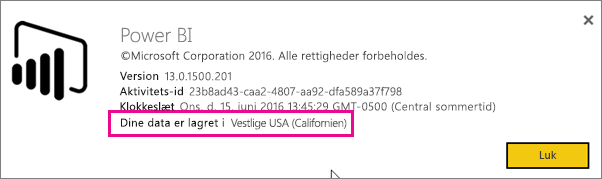
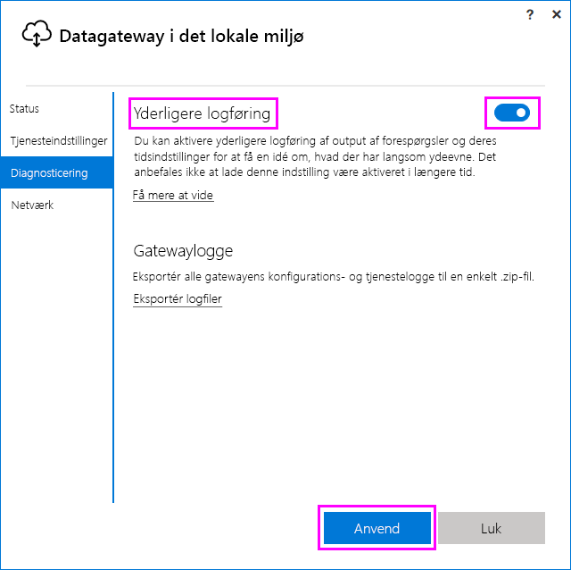
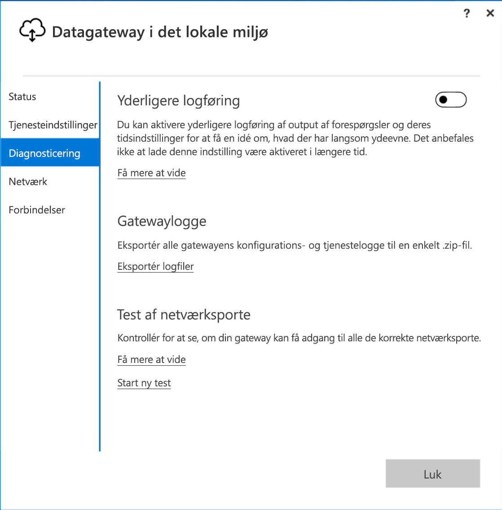
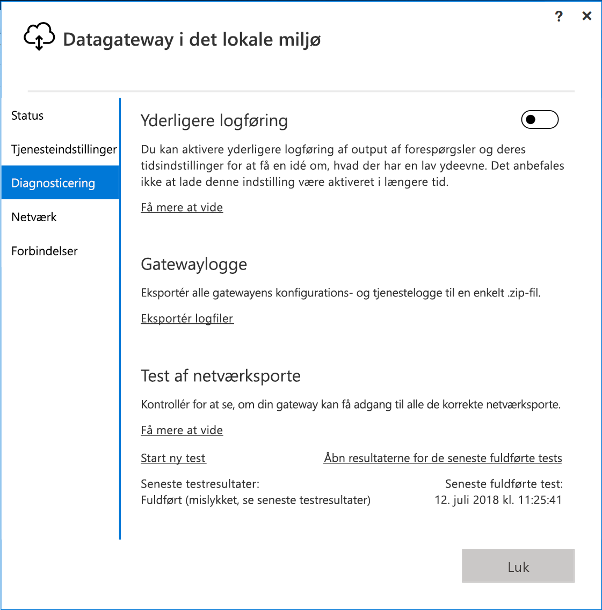

# <a name="troubleshooting-the-on-premises-data-gateway"></a>Fejlfinding af datagatewayen i det lokale miljø

I denne artikel beskrives nogle af de almindelige problemer, der kan opstå, når du bruger **datagatewayen i det lokale miljø**.

<!-- Shared Community & support links Include -->
[!INCLUDE [gateway-onprem-tshoot-support-links-include](./includes/gateway-onprem-tshoot-support-links-include.md)]

<!-- Shared Troubleshooting Install Include -->
[!INCLUDE [gateway-onprem-tshoot-install-include](./includes/gateway-onprem-tshoot-install-include.md)]

## <a name="configuration"></a>Konfiguration

### <a name="how-to-restart-the-gateway"></a>Sådan genstarter du gatewayen

Gatewayen kører som en Windows-tjeneste, så du kan starte og stoppe den på flere måder. Du kan f.eks. åbne en kommandoprompt med administratorrettigheder på den computer, hvor gatewayen kører, og derefter køre en af følgende kommandoer:

* Kør følgende kommando for at stoppe tjenesten:

    '''   net stop PBIEgwService   '''

* Kør følgende kommando for at starte tjenesten:

    '''   net start PBIEgwService   '''

### <a name="log-file-configuration"></a>Konfiguration af logfil

Loggene for gatewaytjenesten kategoriseres i tre buckets: oplysninger, fejl og netværk. Denne kategorisering sikrer bedre fejlfinding, hvor du har mulighed for at fokusere på et bestemt område afhængigt af fejlen eller problemet. Du kan se de tre kategorier i følgende stykke af konfigurationsfilen for gatewayen: `GatewayInfo.log,GatewayErrors.log,GatewayNetwork.log`.

```xml
  <system.diagnostics>
    <trace autoflush="true" indentsize="4">
      <listeners>
        <remove name="Default" />
        <add name="ApplicationFileTraceListener"
             type="Microsoft.PowerBI.DataMovement.Pipeline.Common.Diagnostics.RotatableFilesManagerTraceListener, Microsoft.PowerBI.DataMovement.Pipeline.Common"
             initializeData="%LOCALAPPDATA%\Microsoft\On-premises data gateway\,GatewayInfo.log,GatewayErrors.log,GatewayNetwork.log,20,50" />
      </listeners>
    </trace>
  </system.diagnostics>
```

Denne fil findes som standard under: *\Programmer\Datagateway i det lokale miljø\Microsoft.PowerBI.EnterpriseGateway.exe.config*. Du konfigurerer antallet af logfiler, du vil bevare, ved at ændre det første tal (20 i dette eksempel): `GatewayInfo.log,GatewayErrors.log,GatewayNetwork.log,20,50`.

### <a name="error-failed-to-create-a-gateway-try-again"></a>Fejl: Der kunne ikke oprettes en gateway. Prøv igen

Alle oplysningerne er tilgængelige, men kaldet til Power BI-tjenesten returnerede en fejl. Fejlen og en aktivitets-id vises. Der er flere årsager til, at dette kan ske. Du kan indsamle og gennemse logfilerne som angivet nedenfor, hvis du vil have flere oplysninger.

Dette kan også være på grund af problemer med proxykonfigurationen. Brugergrænsefladen tillader ikke proxykonfiguration. Du kan få mere at vide mere om at foretage [ændringer af proxykonfiguration](service-gateway-proxy.md)

### <a name="error-failed-to-update-gateway-details-please-try-again"></a>Fejl: Oplysninger om gatewayen kunne ikke opdateres. Prøv igen

Oplysninger blev modtaget fra Power BI-tjenesten til gatewayen. Oplysninger blev videresendt til den lokale Windows-tjeneste, men den kunne ikke returnere. Eller en symmetrisk nøgle blev ikke oprettet. Den indre undtagelse kan ses under **Vis detaljer**. Hvis du vil have flere oplysninger, kan du indsamle og gennemse logfilerne som angivet nedenfor.

### <a name="error-power-bi-service-reported-local-gateway-as-unreachable-restart-the-gateway-and-try-again"></a>Fejl: Power BI-tjenesten rapporterede, at den lokale gateway ikke er tilgængelig. Genstart gatewayen, og prøv igen

I slutningen af konfigurationen kaldes Power BI-tjenesten igen for at bekræfte gatewayen. Power BI-tjenesten rapporterer ikke gatewayen som *live*. Kommunikationen kan muligvis gennemføres, hvis Windows-tjenesten startes igen. Du kan indsamle og gennemse logfilerne som angivet nedenfor, hvis du vil have flere oplysninger.

### <a name="script-error-during-sign-into-power-bi"></a>Scriptfejl under logon til Power BI

Du modtager måske en scriptfejl, når du logger på Power BI som led i konfigurationen af datagatewayen i det lokale miljø. Problemet bliver løst med installation af følgende sikkerhedsopdatering. Den kan installeres via Windows Update.

[MS16-051: Sikkerhedsopdatering til Internet Explorer: 10. maj 2016 (KB 3154070)](https://support.microsoft.com/kb/3154070)

### <a name="gateway-configuration-failed-with-a-null-reference-exception"></a>Konfigurationen af gatewayen mislykkedes med en undtagelse pga. null-reference

Der kan opstå en fejl, som er meget lig følgende.

        Failed to update gateway details.  Please try again.
        Error updating gateway configuration.

Dette omfatter en staksporing, og denne staksporing kan inkludere følgende meddelelse.

        Microsoft.PowerBI.DataMovement.Pipeline.Diagnostics.CouldNotUpdateGatewayConfigurationException: Error updating gateway configuration. ----> System.ArgumentNullException: Value cannot be null.
        Parameter name: serviceSection

Hvis du opgraderer fra en ældre gateway, bevarer vi konfigurationsfilen. Der kan være et afsnit, som mangler. Når gatewayen prøver at læse det, kan ovenstående undtagelse fås pga. en null-reference.

Benyt følgende fremgangsmåde for at løse problemet.

1. Fjern gatewayen.
2. Slet følgende mappe.

        c:\Program Files\On-premises data gateway
3. Installer gatewayen igen.
4. Anvend evt. genoprettelsesnøglen til at gendanne en eksisterende gateway.

### <a name="support-for-tls-1112"></a>Understøttelse af TLS 1.1/1.2

Med opdateringen fra august 2017 og senere opdateringer bruger datagatewayen i det lokale miljø som standard TLS 1.1 eller 1.2 (Transport Layer Security) til at kommunikere med **Power BI tjenesten**. Tidligere versioner af datagatewayen i det lokale miljø bruger som standard TLS 1.0. Du skal opgradere installationerne af datagatewayen i det lokale miljø til udgaven fra august 2017 eller en nyere udgave for at sikre, at din gateway fortsat fungerer.

>[!NOTE]
>Understøttelse af TLS 1.0 udløb den 1. November 2017.

Det er vigtigt at bemærke, at TLS 1.0 stadig understøttes af datagatewayen i det lokale miljø fra før 1. november 2017, og den bruges af gatewayen som fallback-løsning. Hvis du vil sikre, at al gatewaytrafik bruger TLS 1.1 eller 1.2 (og for at forhindre, at der bruges TLS 1.0 på din gateway), skal du tilføje eller ændre følgende registreringsdatabasenøgler på den computer, hvor gatewaytjenesten kører:

        [HKEY_LOCAL_MACHINE\SOFTWARE\Microsoft\.NETFramework\v4.0.30319]"SchUseStrongCrypto"=dword:00000001
        [HKEY_LOCAL_MACHINE\SOFTWARE\Wow6432Node\Microsoft\.NETFramework\v4.0.30319]"SchUseStrongCrypto"=dword:00000001

> [!NOTE]
> Når du tilføjer eller ændrer disse registreringsdatabasenøgler, anvendes ændringerne for alle .NET-programmer. Hvis du vil vide mere om, hvilke ændringer i registreringsdatabasen der påvirker TLS for andre programmer, skal du se [Indstillinger for TLS (Transport Layer Security) i registreringsdatabasen](https://docs.microsoft.com/windows-server/security/tls/tls-registry-settings).

## <a name="data-sources"></a>Datakilder

### <a name="error-unable-to-connect-details-invalid-connection-credentials"></a>Fejl: Forbindelsen kunne ikke oprettes. Detaljer: "Legitimationsoplysningerne for forbindelsen er ugyldige"

I **Vis detaljer** vises den fejlmeddelelse, der er modtaget fra datakilden. Hvis du bruger SQL Server, får du vist noget, der ligner nedenstående.

    Login failed for user 'username'.

Bekræft, at du har det rigtige brugernavn og den rigtige adgangskode. Bekræft også, at der kan oprettes forbindelse til datakilden med disse legitimationsoplysninger. Sørg for, at den konto, der bruges, stemmer overens med **godkendelsesmetoden**.

### <a name="error-unable-to-connect-details-cannot-connect-to-the-database"></a>Fejl: Forbindelsen kunne ikke oprettes. Detaljer: "Der kan ikke opnås forbindelse til databasen"

Vi kunne oprette forbindelse til serveren, men ikke til den angivne database. Kontrollér navnet på databasen, og at legitimationsoplysningerne for brugeren er den korrekte tilladelse til at få adgang til databasen.

I **Vis detaljer** vises den fejlmeddelelse, der er modtaget fra datakilden. Hvis du bruger SQL Server, får du vist noget, der ligner nedenstående.

    Cannot open database "AdventureWorks" requested by the login. The login failed. Login failed for user 'username'.

### <a name="error-unable-to-connect-details-unknown-error-in-data-gateway"></a>Fejl: Forbindelsen kunne ikke oprettes. Detaljer: "Ukendt fejl i datagateway"

Denne fejl kan opstå af forskellige årsager. Sørg for at kontrollere, at du kan oprette forbindelse til datakilden fra den computer, der er vært for gatewayen. Dette kan skyldes, at serveren ikke er tilgængelig.

I **Vis detaljer** får du vist fejlkoden **DM_GWPipeline_UnknownError**.

Du kan også se i hændelseslogfilerne > **Logfiler for programmer og tjenester** > **datagatewaytjenesten i det lokale miljø** for at få flere oplysninger.

### <a name="error-we-encountered-an-error-while-trying-to-connect-to-server-details-we-reached-the-data-gateway-but-the-gateway-cant-access-the-on-premises-data-source"></a>Fejl: Der opstod en fejl under forsøget på at oprette forbindelse til <server>. Detaljer: "Vi har nået den ønskede datagateway, men gatewayen kan ikke få adgang til datakilden i det lokale miljø".

Vi kunne ikke oprette forbindelse til den angivne datakilde. Sørg for at kontrollere de oplysninger, der er angivet for denne datakilde.

I **Vis detaljer** får du vist fejlkoden **DM_GWPipeline_Gateway_DataSourceAccessError**.

Hvis den underliggende fejlmeddelelse ligner nedenstående, betyder det, at den konto, du bruger til datakilden, ikke er serveradministrator for denne Analysis Services-forekomst. [Få mere at vide](https://docs.microsoft.com/sql/analysis-services/instances/grant-server-admin-rights-to-an-analysis-services-instance)

    The 'CONTOSO\account' value of the 'EffectiveUserName' XML for Analysis property is not valid.

Hvis den underliggende fejlmeddelelse ligner nedenstående, kan det betyde, at tjenestekontoen til Analysis Services mangler mappeattributten [token-groups-global-and-universal](https://msdn.microsoft.com/library/windows/desktop/ms680300.aspx) (TGGAU).

    The username or password is incorrect.

Domæner med kompatibilitetsadgang fra før Windows 2000 har TGGAU-attributten aktiveret. De domæner, der senest er oprettet, aktiverer ikke denne attribut som standard. Du kan læse mere om dette [her](https://support.microsoft.com/kb/331951).

Du kan bekræfte dette ved at gøre følgende.

1. Opret forbindelse til Analysis Services-computeren i SQL Server Management Studio. Medtag EffectiveUserName for den pågældende bruger i egenskaberne for avanceret forbindelse, og se, om dette gengiver fejlen.
2. Du kan bruge værktøjet dsacls Active Directory til at kontrollere, om attributten er angivet. Dette værktøj findes på en domænecontroller. Du skal kende det entydige domænenavn for kontoen og videregive dette til værktøjet.

        dsacls "CN=John Doe,CN=UserAccounts,DC=contoso,DC=com"

    Du ønsker at få vist noget, der ligner nedenstående, i resultaterne.

            Allow BUILTIN\Windows Authorization Access Group
                                          SPECIAL ACCESS for tokenGroupsGlobalAndUniversal
                                          READ PROPERTY

For at løse problemet skal du aktivere TGGAU på den konto, der bruges til Windows-tjenesten Analysis Services.

#### <a name="another-possibility-for-username-or-password-incorrect"></a>En anden årsag kan være forkert brugernavn eller adgangskode

Denne fejl kan også forekomme, hvis Analysis Services-serveren findes i et andet domæne end brugerne, og der er ikke er etableret et tovejstillidsforhold.

Du skal samarbejde med domæneadministratorerne om at bekræfte tillidsforholdet mellem domæner.

#### <a name="unable-to-see-the-data-gateway-data-sources-in-the-get-data-experience-for-analysis-services-from-the-power-bi-service"></a>Det var ikke muligt at få vist datagatewayens datakilder under "Hent Data" for Analysis Services fra Power BI-tjenesten

Sørg for, at din konto er angivet under fanen **Brugere** i datakilden i konfigurationen af gatewayen. Hvis du ikke har adgang til gatewayen, kan du kontakte administratoren af gatewayen og bede vedkommende bekræfte. Det er kun konti på listen **Brugere**, der kan se datakilden på Analysis Services-listen.

### <a name="error-you-dont-have-any-gateway-installed-or-configured-for-the-data-sources-in-this-dataset"></a>Fejl: Du har ikke nogen gateway, der er installeret eller konfigureret til datakilderne i dette datasæt

Kontrollér, at du har føjet en eller flere datakilder til gatewayen, som beskrevet i [Tilføj en datakilde](service-gateway-manage.md#add-a-data-source). Hvis gatewayen ikke vises på administrationsportalen under **Administrer gateways**, skal du prøve at rydde browsercachen eller logge af tjenesten og derefter logge på igen.

## <a name="datasets"></a>Datasæt

### <a name="error-there-is-not-enough-space-for-this-row"></a>Fejl: Der er ikke tilstrækkelig plads til denne række

Dette sker, hvis du har en enkelt række, der er større end 4 MB. Du skal afgøre, hvilken række der er fra din datakilde og forsøge at filtrere den ud eller mindske den pågældende rækkes størrelse.

### <a name="error-the-server-name-provided-doesnt-match-the-server-name-on-the-sql-server-ssl-certificate"></a>Fejl: Det servernavn, du har angivet, stemmer ikke overens med servernavnet på SQL Server SSL-certifikatet

Dette kan ske, når det angivne certifikat-CN er for serverens fuldt kvalificerede domænenavn (FQDN), men du kun har angivet serverens NetBIOS-navn. Dette medfører en uoverensstemmelse for certifikatet. For at løse dette problem skal du få servernavnet i gatewayens datakilde og PBIX-filen til at bruge serverens fuldt kvalificerede navn.

### <a name="i-dont-see-the-on-premises-data-gateway-present-when-configuring-scheduled-refresh"></a>Jeg kan ikke se datagatewayen i det lokale miljø, når jeg konfigurerer en planlagt opdatering

Dette kan skyldes nogle forskellige scenarier.

1. Navnet på serveren og databasen stemmer ikke overens med det, der er angivet i Power BI Desktop, og den datakilde, der er konfigureret for gatewayen. Disse skal have samme værdi. Der skelnes ikke mellem store og små bogstaver.
2. Din konto er ikke angivet under fanen **Brugere** i datakilden i konfigurationen af gatewayen. Du skal kontakte administratoren af gatewayen og bede om at blive føjet til listen.
3. Din Power BI Desktop-fil indeholder flere datakilder, og det er ikke alle disse datakilder, der er konfigureret i gatewayen. Hvis gatewayen skal vises i Planlagt opdatering, skal hver enkelt datakilde være defineret sammen med gatewayen.

### <a name="error-the-received-uncompressed-data-on-the-gateway-client-has-exceeded-the-limit"></a>Fejl: De modtagne ikke-komprimerede data på gatewayklienten overstiger grænsen

Den nøjagtige begrænsning er 10 GB ikke-komprimerede data pr. tabel. Hvis du støder på dette problem, er der indstillinger, der er velegnet til at optimere og undgå problemet. Det hjælper især, hvis brugen af konstante og lange strengværdier reduceres, og der i stedet bruges en normaliseret nøgle, eller hvis kolonnen fjernes (når den ikke bruges).

## <a name="reports"></a>Rapporter

### <a name="report-could-not-access-the-data-source-because-you-do-not-have-access-to-our-data-source-via-an-on-premises-data-gateway"></a>Rapporten kunne ikke få adgang til datakilden, fordi du ikke har adgang til vores datakilde via en datagateway i det lokale miljø

Dette skyldes som regel et af nedenstående forhold.

1. Oplysningerne om datakilden stemmer ikke overens med de oplysninger, der findes i det underliggende datasæt. Navn på server og database skal stemme overens mellem den datakilde, der er defineret for datagatewayen i det lokale miljø, og det, du angiver i Power BI Desktop. Hvis du bruger en IP-adresse i Power BI Desktop, skal datakilden for datagatewayen i det lokale miljø også bruge en IP-adresse.
2. Der er ikke en tilgængelig datakilde på nogen gateway i din organisation. Du kan konfigurere datakilden på en ny eller eksisterende datagateway i det lokale miljø.

### <a name="error-data-source-access-error-please-contact-the-gateway-administrator"></a>Fejl: Adgangsfejl i datakilden. Kontakt gatewayadministratoren

Hvis denne rapport gør brug af en direkte forbindelse til Analysis Services, kan du komme ud for et problem med en værdi, der overføres til EffectiveUserName, der enten ikke er gyldig, eller som ikke har tilladelser på Analysis Services-computeren. Problemer med godkendelse skyldes som regel, at den værdi, der overføres for EffectiveUserName, ikke stemmer overens med en lokal brugers hovednavn (UPN).

Du kan få bekræftet dette ved at gøre som angivet herunder.

1. Find det effektive brugernavn i [gatewaylogfilerne](#logs).
2. Når du har den værdi, der sendes, skal du bekræfte, at den er korrekt. Hvis det er din bruger, kan du bruge følgende kommando fra en kommandoprompt til at se UPN-værdien. UPN-værdien ligner en mailadresse.

        whoami /upn

Du kan eventuelt se, hvad Power BI henter fra Azure Active Directory.

1. Gå til [https://developer.microsoft.com/graph/graph-explorer](https://developer.microsoft.com/graph/graph-explorer).
2. Vælg **Log på** øverst til højre.
3. Kør følgende forespørgsel. Du får vist et ret stort JSON-svar.

        https://graph.windows.net/me?api-version=1.5
4. Søg efter **userPrincipalName**.

Hvis dit Azure Active Directory-UPN ikke stemmer overens med dit lokale Active Directory-UPN, kan du bruge funktionen [Tilknyt brugernavne](service-gateway-enterprise-manage-ssas.md#map-user-names) til at erstatte det med en gyldig værdi. Du kan også arbejde sammen med enten din lejeradministrator eller den lokale Active Directory-administrator om at få ændret dit UPN.

<!-- Shared Troubleshooting Firewall/Proxy Include -->
[!INCLUDE [gateway-onprem-tshoot-firewall-include](./includes/gateway-onprem-tshoot-firewall-include.md)]

Du kan finde det datacenterområde, du befinder dig i, ved at gøre følgende:

1. Vælg **?** i øverste højre hjørne af Power BI-tjenesten.
2. Vælg **Om Power BI**.
3. Dit dataområde vises under **Dine data er lagret i**.

    

Hvis du stadig ikke kan komme videre, kan du prøve at få en netværkssporing ved hjælp af et værktøj som [fiddler](#fiddler) eller netsh, selvom disse er avancerede indsamlingsmetoder, og det kan være nødvendigt at få hjælp til at analysere de indsamlede data. Du kan kontakte [support](https://support.microsoft.com) for at få hjælp.

## <a name="performance"></a>Ydeevne

<iframe width="560" height="315" src="https://www.youtube.com/embed/IJ_DJ30VNk4?showinfo=0" frameborder="0" allowfullscreen></iframe>

### <a name="performance-counters"></a>Ydelsestællere

Der er en række ydelsestællere, der kan bruges til at måle aktiviteter for gatewayen. Det kan være nyttigt at vide, om der er en stor aktivitetsbelastning, så der kan være behov for en ny gateway. Disse tællere afspejler ikke, hvor lang tid noget tager.

Der er adgang til disse tællere via Windows-værktøjet Ydelsesmåler.


Der er generelle grupperinger af disse tællere.

| Tællertype | Beskrivelse |
| --- | --- |
| ADO.NET |Dette bruges til alle DirectQuery-forbindelser. |
| ADOMD |Dette bruges til Analysis Services 2014 og tidligere. |
| OLEDB |Det bruges af visse datakilder. Det omfatter SAP HANA og Analysis Service 2016 eller senere. |
| Miks |Dette omfatter alle importerede datakilder. Hvis du planlægger opdatering eller udfører en anmodet opdatering, går det gennem miksprogrammet. |

Her er en liste over tilgængelige ydelsestællere.

| Tæller | Beskrivelse |
| --- | --- |
| Antal åbne ADO.NET-forbindelser udført pr. sek. |Antal handlinger på åbne ADO.NET-forbindelser udført pr. sekund (gennemført eller mislykket). |
| Antal åbne ADO.NET-forbindelser mislykket pr. sekund |Antal handlinger på åbne ADO.NET-forbindelser mislykket pr. sekund. |
| Antal ADO.NET-forespørgsler udført pr. sekund |Antal ADO.NET-forespørgsler udført pr. sekund (gennemført eller mislykket). |
| Antal ADO.NET-forespørgsler mislykket pr. sekund |Antal mislykkede ADO.NET-forespørgsler udført pr. sekund. |
| Antal åbne ADOMD-forbindelser udført pr. sekund |Antal handlinger på åbne ADOMD-forbindelser udført pr. sekund (gennemført eller mislykket). |
| Antal åbne ADOMD-forbindelser mislykket pr. sekund |Antal handlinger på åbne ADOMD-forbindelser mislykket pr. sekund. |
| Antal ADOMD-forespørgsler udført pr. sekund |Antal ADOMD-forespørgsler udført pr. sekund (gennemført eller mislykket). |
| Antal ADOMD-forespørgsler mislykket pr. sekund |Antal mislykkede ADOMD-forespørgsler udført pr. sekund. |
| Antallet af alle åbne forbindelser udført pr. sekund |Antal handlinger på åbne forbindelser udført pr. sekund (gennemført eller mislykket). |
| Antallet af alle åbne forbindelser mislykket pr. sekund |Antal handlinger på åbne forbindelser udført pr. sekund. |
| Antallet af alle forespørgsler udført pr. sekund |Antal forespørgsler udført pr. sekund (gennemført eller mislykket). |
| Antal elementer i ADO.NET-forbindelsesgruppen |Antal elementer i ADO.NET-forbindelsesgruppen. |
| Antal elementer i OLEDB-forbindelsesgruppen |Antal elementer i OLEDB-forbindelsesgruppen. |
| Antal elementer i Service Bus-gruppen |Antal elementer i Service Bus-gruppen. |
| Antal åbne Miks-forbindelser udført pr. sekund |Antal handlinger på åbne Miks-forbindelser udført pr. sekund (gennemført eller mislykket). |
| Antal åbne Miks-forbindelser mislykket pr. sekund |Antal handlinger på åbne Miks-forbindelser mislykket pr. sekund. |
| Antal Miks-forespørgsler udført pr. sekund |Antal Miks-forespørgsler udført pr. sekund (gennemført eller mislykket). |
| Antal Miks-forespørgsler mislykket pr. sekund |Antal mislykkede Miks-forespørgsler udført pr. sekund |
| Antal mislykkede OLEDB-forespørgsler med flere resultatsæt pr. sekund |Antal mislykkede OLEDB-forespørgsler med flere resultatsæt udført pr. sekund. |
| Antal OLEDB-forespørgsler med flere resultatsæt udført pr. sekund |Antal OLEDB-forespørgsler med flere resultatsæt udført pr. sekund (gennemført eller mislykket). |
| Antal åbne OLEDB-forbindelser udført pr. sekund |Antal handlinger på åbne OLEDB-forbindelser udført pr. sekund (gennemført eller mislykket). |
| Antal åbne OLEDB-forbindelser mislykket pr. sekund |Antal handlinger på åbne OLEDB-forbindelser mislykket pr. sekund. |
| Antal OLEDB-forespørgsler udført pr. sekund |Antal OLEDB-forespørgsler med flere resultatsæt udført pr. sekund (gennemført eller mislykket). |
| Antal OLEDB-forespørgsler mislykket pr. sekund |Antal OLEDB-forespørgsler med flere resultatsæt, der mislykkedes pr. sekund. |
| Antal OLEDB-forespørgsler med enkelt resultatsæt udført pr. sekund |Antal OLEDB-forespørgsler med enkelt resultatsæt udført pr. sekund (gennemført eller mislykket). |
| Antal mislykkede forespørgsler pr. sekund |Antal mislykkede forespørgsler udført pr. sekund. |
| Antal OLEDB-forespørgsler med enkelt resultatsæt mislykket pr. sekund |Antal mislykkede OLEDB-forespørgsler med enkelt resultatsæt udført pr. sekund. |

## <a name="reviewing-slow-performing-queries"></a>Gennemgå forespørgsler med langsom ydeevne

Du vil muligvis opdage, at svar via gatewayen kan gå langsomt. Det kan være for DirectQuery-forespørgsler, eller når dit importerede datasæt opdateres. Du kan aktivere yderligere logføring af output af forespørgsler og deres tidsindstillinger for at få en idé om, hvad der har langsom ydeevne. Når du har fundet en forespørgsel, der har kørt i lang tid, kan det kræve yderligere ændring af datakilden at finindstille ydeevnen af forespørgslen. F.eks. justering af indekser for en SQL Server-forespørgsel.

Du skal ændre to konfigurationsfiler for at bestemme varigheden af en forespørgsel.

### <a name="microsoftpowerbidatamovementpipelinegatewaycoredllconfig"></a>Microsoft.PowerBI.DataMovement.Pipeline.GatewayCore.dll.config

I filen *Microsoft.PowerBI.DataMovement.Pipeline.GatewayCore.dll.config* skal du ændre `EmitQueryTraces`-værdien fra `False` til `True`. Filen er som standard placeret i *C:\Programmer\On-premises data gateway*. Aktivering af `EmitQueryTraces` begynder at logføre forespørgsler, der er sendt fra gatewayen til en datakilde.

> [!IMPORTANT]
> Aktivering af EmitQueryTraces kan øge logfilens størrelse markant afhængigt af brugen af gatewayen. Når du er færdig med at gennemgå logfilerne, kan du indstille EmitQueryTraces til Falsk. Det anbefales ikke at lade denne indstilling være aktiveret i længere tid.

```
<setting name="EmitQueryTraces" serializeAs="String">
    <value>True</value>
</setting>
```

**Eksempel på en forespørgselsindtastning**

```
DM.EnterpriseGateway Information: 0 : 2016-09-15T16:09:27.2664967Z DM.EnterpriseGateway    4af2c279-1f91-4c33-ae5e-b3c863946c41    d1c77e9e-3858-4b21-3e62-1b6eaf28b176    MGEQ    c32f15e3-699c-4360-9e61-2cc03e8c8f4c    FF59BC20 [DM.GatewayCore] Executing query (timeout=224) "<pi>
SELECT
TOP (1000001) [t0].[ProductCategoryName],[t0].[FiscalYear],SUM([t0].[Amount])
 AS [a0]
FROM
(
(select [$Table].[ProductCategoryName] as [ProductCategoryName],
    [$Table].[ProductSubcategory] as [ProductSubcategory],
    [$Table].[Product] as [Product],
    [$Table].[CustomerKey] as [CustomerKey],
    [$Table].[Region] as [Region],
    [$Table].[Age] as [Age],
    [$Table].[IncomeGroup] as [IncomeGroup],
    [$Table].[CalendarYear] as [CalendarYear],
    [$Table].[FiscalYear] as [FiscalYear],
    [$Table].[Month] as [Month],
    [$Table].[OrderNumber] as [OrderNumber],
    [$Table].[LineNumber] as [LineNumber],
    [$Table].[Quantity] as [Quantity],
    [$Table].[Amount] as [Amount]
from [dbo].[V_CustomerOrders] as [$Table])
)
 AS [t0]
GROUP BY [t0].[ProductCategoryName],[t0].[FiscalYear] </pi>"
```

### <a name="microsoftpowerbidatamovementpipelinediagnosticsdllconfig"></a>Microsoft.PowerBI.DataMovement.Pipeline.Diagnostics.dll.config

I filen *Microsoft.PowerBI.DataMovement.Pipeline.Diagnostics.dll.config* skal du ændre `TracingVerbosity`-værdien fra `4` til `5`. Filen er som standard placeret i *C:\Programmer\On-premises data gateway*. Hvis du ændrer denne indstilling, logføres detaljerede indtastninger i gatewayens logfil. Dette omfatter indtastninger, der viser varighed. Du kan også aktivere detaljerede poster ved at aktivere knappen "Yderligere logføring" i gatewayprogrammet i det lokale miljø.

   

> [!IMPORTANT]
> Aktivering af TracingVerbosity til `5` kan øge logfilens størrelse markant afhængigt af brugen af gatewayen. Når du er færdig med at gennemgå logfilerne, skal du indstille TraceVerbosity til `4`. Det anbefales ikke at lade denne indstilling være aktiveret i længere tid.

```
<setting name="TracingVerbosity" serializeAs="String">
    <value>5</value>
</setting>
```

<a name="activities"></a>

### <a name="activity-types"></a>Aktivitetstyper

| Aktivitetstype | Beskrivelse |
| --- | --- |
| MGEQ |Forespørgsler udført via ADO.NET. Dette omfatter DirectQuery-datakilder. |
| MGEO |Forespørgsler udført via OLEDB. Det omfatter SAP HANA og Analysis Service 2016 . |
| MGEM |Forespørgsler udført fra Miks-programmet. Dette anvendes med importerede datasæt, der bruger planlagt opdatering eller opdatering efter behov. |

### <a name="determine-the-duration-of-a-query"></a>Fastlæg varigheden af en forespørgsel
Når du vil fastlægge den tid, det tog at forespørge på datakilden, kan du gøre som beskrevet herunder.

1. Åbn gatewayens logfil.
2. Søg efter en [aktivitetstype](#activities) for at finde forespørgslen. Et eksempel på dette ville være MGEQ.
3. Notér den anden GUID, da dette er anmodnings-id'et.
4. Fortsæt med at søge efter MGEQ, indtil du finder indtastningen FireActivityCompletedSuccessfullyEvent med varigheden. Du kan bekræfte, at indtastningen har samme anmodnings-id. Varigheden er i millisekunder.

        DM.EnterpriseGateway Verbose: 0 : 2016-09-26T23:08:56.7940067Z DM.EnterpriseGateway    baf40f21-2eb4-4af1-9c59-0950ef11ec4a    5f99f566-106d-c8ac-c864-c0808c41a606    MGEQ    21f96cc4-7496-bfdd-748c-b4915cb4b70c    B8DFCF12 [DM.Pipeline.Common.TracingTelemetryService] Event: FireActivityCompletedSuccessfullyEvent (duration=5004)

   > [!NOTE]
   > FireActivityCompletedSuccessfullyEvent er en detaljeret indtastning. Denne post logføres ikke, medmindre TraceVerbosity er på niveau 5.

## <a name="firewall-or-proxy"></a>Firewall eller proxy

Du kan finde oplysninger om, hvordan du angiver proxyoplysninger for din gateway, under [Konfigurer proxyindstillinger for Power BI-gateways](service-gateway-proxy.md).

Du kan teste, om din firewall eller proxy blokerer forbindelser. Det gør du ved at køre [Test-NetConnection](https://docs.microsoft.com/powershell/module/nettcpip/test-netconnection) fra en PowerShell-prompt. Dette tester forbindelsen til Azure Service Bus. Det er kun netværksforbindelsen, der testes, og det har ikke noget med cloudservertjenesten eller gatewayen at gøre. Det hjælper med at finde ud af, om din computer faktisk kan få forbindelse til internettet.

    Test-NetConnection -ComputerName watchdog.servicebus.windows.net -Port 9350

> [!NOTE]
> Test-NetConnection er kun tilgængeligt på Windows Server 2012 R2 og nyere versioner. Det er også tilgængeligt på Windows 8.1 og nyere. På tidligere operativsystemversioner kan du bruge Telnet til at teste portforbindelser.

Resultatet ligner dette eksempel. Forskellen vil være TcpTestSucceeded. Hvis **TcpTestSucceeded** ikke er *true*, er du muligvis blokeret af en firewall.

    ComputerName           : watchdog.servicebus.windows.net
    RemoteAddress          : 70.37.104.240
    RemotePort             : 5672
    InterfaceAlias         : vEthernet (Broadcom NetXtreme Gigabit Ethernet - Virtual Switch)
    SourceAddress          : 10.120.60.105
    PingSucceeded          : False
    PingReplyDetails (RTT) : 0 ms
    TcpTestSucceeded       : True

Hvis du vil se mere omfattende oplysninger, skal du udskifte værdierne for **computernavn** og **port** med de værdier, der vises for [porte](https://docs.microsoft.com/power-bi/service-gateway-onprem#ports).

Firewallen kan også blokere de forbindelser, som Azure Service Bus opretter til Azure-datacentrene. Hvis det er tilfældet, kan du føje IP-adresserne for dit område til hvidlisten (fjerne blokeringen) for de pågældende datacentre. Du kan få vist en liste over Azure IP-adresser [her](https://www.microsoft.com/download/details.aspx?id=41653).

### <a name="network-ports-test"></a>Test af netværksporte

Test af netværksporte er et værktøj, du kan bruge til at teste, om din gateway kan få adgang til de korrekte porte for alle de fjernservere, som er påkrævet af din gateway til overførsel af data. Hvis testen af netværksporte ikke kan oprette forbindelse til nogen af portene, kan der være netværksproblemer på gatewayen. Hvis du oplever netværksproblemer med din gateway, kan du køre testen af netværksporte for at kontrollere, om dit netværksmiljø er optimalt.  

#### <a name="start-a-new-test"></a>Start en ny test

Du kan køre en ny test af netværksporte fra brugergrænsefladen til datagatewayen i det lokale miljø.



Når du kører en test af netværksporte, henter din gateway en liste over porte og servere fra Azure Service Bus, og den forsøger derefter at oprette forbindelse til alle serverne og portene. Når linket Start ny test vises, er testen af netværksporte afsluttet.  

#### <a name="test-results"></a>Testresultater

Du kan se en oversigt over testen under Seneste testresultater under linket Start ny test. De to resultater er Fuldført (uden fejl) og Fuldført (fejl, se seneste testresultater). Hvis testen er fuldført uden fejl, kunne din gateway oprette forbindelse til alle de krævede porte. Hvis testen mislykkedes, kan det skyldes, at dit netværksmiljø blokerer de krævede porte og servere. 



Hvis du vil se resultaterne af den senest fuldført test, skal du vælge linket Åbn senest fuldførte test. Testresultaterne åbnes i standardteksteditoren i Windows.  

Testresultaterne viser alle de servere, porte og IP-adresser, som din gateway skal have adgang til. Hvis testresultaterne viser Lukket for nogle af portene, skal du sikre, at dit netværksmiljø ikke blokerer for forbindelsen. Du skal muligvis kontakte din netværksadministrator for at få åbnet de krævede porte.


## <a name="kerberos"></a>Kerberos

Hvis den underliggende databaseserver og datagatewayen i det lokale miljø ikke er konfigureret korrekt til [begrænset Kerberos-delegering](service-gateway-kerberos-for-sso-pbi-to-on-premises-data.md), skal du aktivere [detaljeret logføring](#microsoftpowerbidatamovementpipelinediagnosticsdllconfig) på gatewayen og, som udgangspunkt for fejlfindingen, foretage undersøgelser baseret på fejlene/sporene i gatewayens logfiler.

### <a name="impersonationlevel"></a>ImpersonationLevel

ImpersonationLevel er relateret til SPN-konfigurationen eller den lokale politikindstilling.

```
[DataMovement.PipeLine.GatewayDataAccess] About to impersonate user DOMAIN\User (IsAuthenticated: True, ImpersonationLevel: Identification)
```

**Løsning**

Følg disse trin til at løse problemet:
1. Konfigurer et SPN for gatewayen i det lokale miljø
2. Konfigurer begrænset delegering i dit Active Directory (AD)

### <a name="failedtoimpersonateuserexception-failed-to-create-windows-identity-for-user-userid"></a>FailedToImpersonateUserException: Windows-identiteten for brugerid'et blev ikke oprettet

FailedToImpersonateUserException sker, hvis du ikke kan repræsentere en anden bruger. Det kan også ske, hvis den konto, du forsøger at repræsentere, er fra et andet domæne end det, som domænet for gatewaytjenesten er på (dette er en begrænsning).

**Løsning**

* Kontrollér, at konfigurationen er korrekt iht. trinnene i afsnittet ImpersonationLevel ovenfor
* Kontrollér, at det brugerid, der gøres forsøg på at repræsentere, er til en gyldig AD-konto

### <a name="general-error-1033-error-while-parsing-the-protocol"></a>Generel fejl; 1033-fejl under parsing af protokollen

Du får vist 1033-fejlen, når dit eksterne id, som er konfigureret i SAP HANA, ikke stemmer overens med logon, hvis brugeren repræsenteres ved hjælp af UPN (alias@domain.com). Øverst i logfilerne kan du se følgende, som vist nedenfor: "Original UPN "alias@domain.com" replaced with a new UPN "alias@domain.com"."

```
[DM.GatewayCore] SingleSignOn Required. Original UPN 'alias@domain.com' replaced with new UPN 'alias@domain.com.'
```

**Løsning**

* SAP HANA kræver, at den repræsenterede bruger anvender attributten sAMAccountName i AD (brugeralias). Hvis dette ikke er korrekt, får du vist 1033-fejlen.

    

* I logfilerne bør du se sAMAccountName (alias) og ikke UPN, som er aliasset efterfulgt af domænet (alias@doimain.com)

    

```
      <setting name="ADUserNameReplacementProperty" serializeAs="String">
        <value>sAMAccount</value>
      </setting>
      <setting name="ADServerPath" serializeAs="String">
        <value />
      </setting>
      <setting name="CustomASDataSource" serializeAs="String">
        <value />
      </setting>
      <setting name="ADUserNameLookupProperty" serializeAs="String">
        <value>AADEmail</value>
```

### <a name="sap-aglibodbchdb-dllhdbodbc-communication-link-failure-10709-connection-failed-rte-1-kerberos-error-major-miscellaneous-failure-851968-minor-no-credentials-are-available-in-the-security-package"></a>[SAP AG][LIBODBCHDB DLL][HDBODBC] Communication link failure;-10709 Connection failed (RTE:[-1] Kerberos error. Major: "Miscellaneous failure [851968]", minor: "No credentials are available in the security package"

Du får vist meddelelsen "-10709 Connection failed", hvis din delegering ikke er konfigureret korrekt i AD.

**Løsning**

* Kontrollér, at du har SAP Hana-serveren på fanen Delegering i AD for kontoen til gatewaytjenesten

   

<!-- Shared Troubleshooting tools Include -->
[!INCLUDE [gateway-onprem-tshoot-tools-include](./includes/gateway-onprem-tshoot-tools-include.md)]

### <a name="refresh-history"></a>Opdater historik

Når gatewayen bruges til planlagt opdatering, kan **Opdater historik** hjælpe dig med at se, hvilke fejl der er opstået samt levere brugbare data, hvis du får brug for at oprette en supportanmodning. Du kan få vist både planlagte opdateringer samt opdateringer efter behov. Sådan får du vist **Opdater historik**.

1. I Power BI-navigationsruden i **Datasæt** skal du vælge et datasæt &gt; Åbn menu &gt; **Planlæg opdatering**.

    
2. I **Indstillinger for...** &gt;**Planlæg opdatering** skal du vælge **Opdater historik**.

    

    

Du kan finde yderligere oplysninger om fejlfinding af opdateringsscenarier i artiklen [Fejlfinding i forbindelse med opdatering af scenarier](refresh-troubleshooting-refresh-scenarios.md).

## <a name="next-steps"></a>Næste trin
[Konfiguration af proxyindstillinger for Power BI-gateways](service-gateway-proxy.md)  
[Datagateway i det lokale miljø](service-gateway-onprem.md)  
[Datagateway i det lokale miljø – detaljeret](service-gateway-onprem-indepth.md)  
[Administrer din datakilde – Analysis Services](service-gateway-enterprise-manage-ssas.md)  
[Administrer din datakilde – SAP HANA](service-gateway-enterprise-manage-sap.md)  
[Administrer din datakilde – SQL Server](service-gateway-enterprise-manage-sql.md)  
[Administrer din datakilde – Import/Planlagt opdatering](service-gateway-enterprise-manage-scheduled-refresh.md)  
Har du flere spørgsmål? [Prøv at spørge Power BI-community'et](http://community.powerbi.com/)
