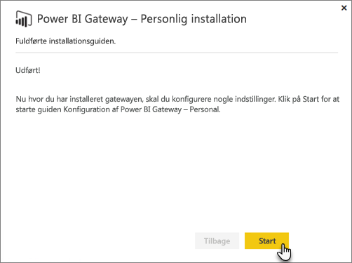
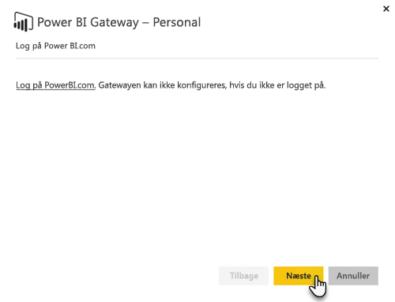
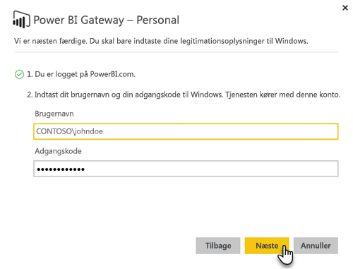

# Datagateway i det lokale miljø

En datagateway i det lokale miljø fungerer som en bro, der giver hurtig og sikker dataoverførsel mellem data i det lokale miljø (data, der ikke er i cloudmiljøet) og tjenesterne Power BI, Microsoft Flow, Logic Apps og PowerApps.

Du kan bruge en enkelt gateway sammen med forskellige tjenester på samme tid. Hvis du både bruger Power BI og PowerApps, kan der bruges en enkelt gateway til begge dele. Det afhænger af den konto, du logger på med.

> [!NOTE]
> Datagatewayen i det lokale miljø implementerer datakomprimering og transportkryptering i alle tilstande.

<!-- Shared Requirements Include -->
[!INCLUDE [gateway-onprem-requirements-include](./includes/gateway-onprem-requirements-include.md)]

### Begrænsninger for Analysis Services-liveforbindelser

Du kan bruge en liveforbindelse til tabellariske eller flerdimensionelle forekomster.

| **Serverversion** | **Påkrævet SKU** |
| --- | --- |
| 2012 SP1 CU4 eller nyere |Business Intelligence- og Enterprise-SKU |
| 2014 |Business Intelligence- og Enterprise-SKU |
| 2016 |Standard-SKU eller nyere |

* Funktionen til formatering på celleniveau og oversættelse understøttes ikke.
* Handlinger og navngivne sæt er ikke synlige for Power BI, men du kan stadig oprette forbindelse til flerdimensionelle kuber, der også indeholder handlinger eller navngivne sæt, og oprette visuelle elementer og rapporter.

<!-- Shared Install steps Include -->
[!INCLUDE [gateway-onprem-datasources-include](./includes/gateway-onprem-datasources-include.md)]

## Download og installér datagatewayen i det lokale miljø

Hvis du vil downloade gatewayen, skal du vælge **Datagateway** i menuen Downloads. Download [datagatewayen i det lokale miljø](http://go.microsoft.com/fwlink/?LinkID=820925).

Bemærk, at du kan opdatere datagatewayen i det lokale miljø ved at installere gatewayen igen som beskrevet i dette afsnit. Når du installerer en nyere version af gatewayen, bevares dine eksisterende indstillinger. Hvis du installerer den samme version, behandles det som en fuldstændig geninstallation, og dine indstillinger bevares ikke.

<!-- Shared Install steps Include -->
[!INCLUDE [gateway-onprem-install-include](./includes/gateway-onprem-install-include.md)]

## Installér gatewayen i personlig tilstand

> [!NOTE]
> Den personlige version af gatewayen kan kun bruges med Power BI.

Når den personlige gateway er installeret, skal du starte **guiden Konfiguration af Power BI Gateway – Personal**.

Du skal derefter logge på Power BI for at registrere gatewayen i cloudtjenesten.

Du skal også angive brugernavn og adgangskode til Windows, som Windows-tjenesten skal køre som. Du kan angive en anden Windows-konto fra din egen. Gatewaytjenesten kører med denne konto.

Når installationen er fuldført, skal du gå til dine datasæt i Power BI og sørge for, at der angives legitimationsoplysninger for dine datakilder i det lokale miljø.

## Lagring af krypterede legitimationsoplysninger i clouden

Når du føjer en datakilde til gatewayen, skal du angive legitimationsoplysninger for den pågældende datakilde. Alle forespørgsler til datakilden kører ved hjælp af disse legitimationsoplysninger. Legitimationsoplysningerne krypteres sikkert ved hjælp af symmetrisk kryptering, så de ikke kan dekrypteres i clouden, før de gemmes i clouden. Legitimationsoplysningerne sendes til den maskine, der kører gatewayen, hvor de dekrypteres, når datakilderne tilgås.

<!-- Account and Port information -->
[!INCLUDE [gateway-onprem-accounts-ports-more](./includes/gateway-onprem-accounts-ports-more.md)]

<!-- How the gateway works -->
[!INCLUDE [gateway-onprem-how-it-works-include](./includes/gateway-onprem-how-it-works-include.md)]

## Begrænsninger og overvejelser

* [Azure Information Protection](https://docs.microsoft.com/microsoft-365/enterprise/protect-files-with-aip
) understøttes ikke i øjeblikket.
* [Access Online](https://products.office.com/access) understøttes ikke i øjeblikket.
* R-scripts understøttes kun, når gatewayen køres i personlig tilstand.

## Administration på lejerniveau

Som lejeradministrator kan du se alle de datagateways i det lokale miljø, som er installeret i din lejer, og administrere dem. Denne funktion er i øjeblikket i offentlig prøveversion. Du kan finde flere oplysninger i [dokumentationen til Power Platform-administration](/power-platform/admin/onpremises-data-gateway-management).

Hvis du er lejeradministrator, anbefaler vi, at du beder brugerne i din organisation om at tilføje dig som administrator for hver enkelt af de gateways, de installerer. Dette gør det muligt for dig at administrere alle gateways i din organisation via siden Indstillinger for Gateway eller en via [PowerShell-kommandoer](service-gateway-high-availability-clusters.md#powershell-support-for-gateway-clusters). 

## Aktivér udgående Azure-forbindelser

Datagatewayen i det lokale miljø bruger Azure Service Bus til cloudforbindelsen og opretter tilsvarende udgående forbindelser til det tilknyttede Azure-område. Som standard er dette placeringen af din Power BI-lejer. Se [Hvor er min Power BI-lejer placeret?](https://powerbi.microsoft.com/documentation/powerbi-admin-where-is-my-tenant-located/)
Hvis en firewall blokerer udgående forbindelser, skal du konfigurere firewallen for at tillade udgående forbindelser fra datagatewayen i det lokale miljø til det tilknyttede Azure-område. Se [Microsoft Azure Datacenter IP-områder](https://www.microsoft.com/download/details.aspx?id=41653) for at få oplysninger om IP-adresseintervallet for hvert Azure-datacenter.
> [!NOTE]
> IP-adresseområderne kan ændres over tid, så sørg for, at du downloader de nyeste oplysninger med jævne mellemrum. 

## Fejlfinding

Hvis du har problemer med at installere og konfigurere en gateway, skal du se [Fejlfinding af datagatewayen i det lokale miljø](service-gateway-onprem-tshoot.md). Hvis du mener, at du har et problem med din firewall, skal du se afsnittet om [firewall eller proxy](service-gateway-onprem-tshoot.md#firewall-or-proxy) i artiklen om fejlfinding.

Hvis du mener, at du oplever proxyproblemer med gatewayen, skal du se [Konfiguration af proxyindstillinger for Power BI-gateways](service-gateway-proxy.md).

## Næste trin

[Administrer din datakilde – Analysis Services](service-gateway-enterprise-manage-ssas.md)  
[Administrer din datakilde – SAP HANA](service-gateway-enterprise-manage-sap.md)  
[Administrer din datakilde – SQL Server](service-gateway-enterprise-manage-sql.md)  
[Administrer din datakilde – Oracle](service-gateway-onprem-manage-oracle.md)  
[Administrer din datakilde – Import/Planlagt opdatering](service-gateway-enterprise-manage-scheduled-refresh.md)  
[Datagateway i det lokale miljø – detaljeret](service-gateway-onprem-indepth.md)  
[Datagateway i det lokale miljø (personlig tilstand) – den nye version af den personlige gateway](service-gateway-personal-mode.md)  
[Konfigurer proxyindstillinger for datagatewayen i det lokale miljø](service-gateway-proxy.md)  

Har du flere spørgsmål? [Prøv at spørge Power BI-community'et](http://community.powerbi.com/)
