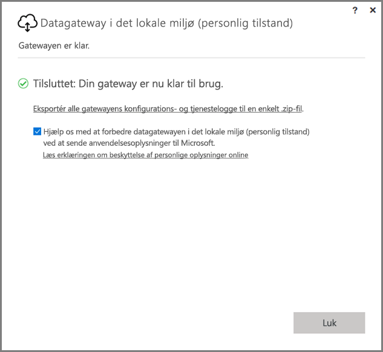
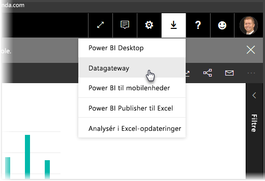
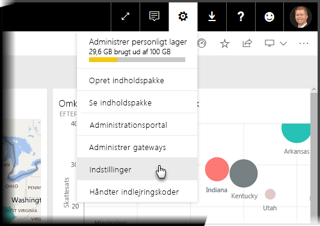
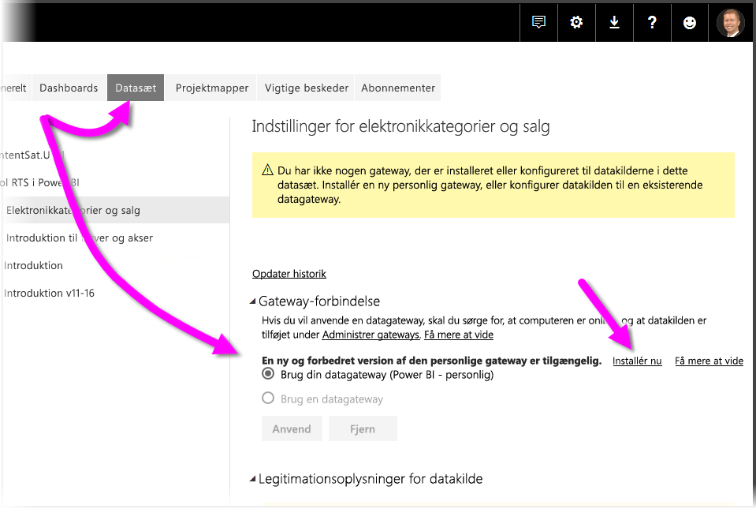
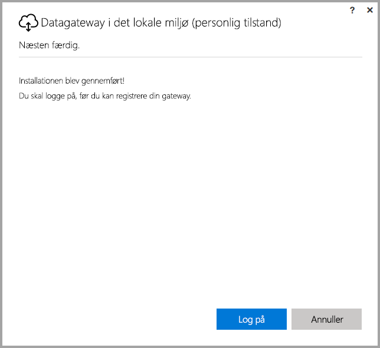
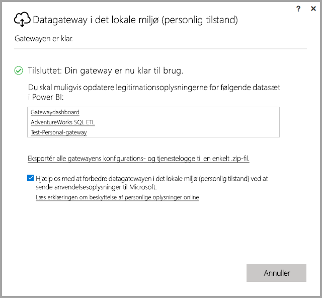

# <a name="on-premises-data-gateway-personal-mode"></a>Datagateway i det lokale miljø (personlig tilstand)
Du kan bruge datakilder i det lokale miljø og oprette Power BI-rapporter og -dashboards ved hjælp af en gateway. En **gateway** er software, der gør det nemmere at få adgang til data, som er gemt på et privat netværk i det lokale miljø. Derefter giver den dig mulighed for at bruge disse data i onlinetjenester som **Power BI-tjenesten**. **Datagatewayen i det lokale miljø (personlig tilstand)** er en opdatering, som er blevet udgivet for nylig, til Power BI Gateway. Den giver enkeltpersoner mulighed for at installere en gateway på deres egen computer og få adgang til data i det lokale miljø.



> [!NOTE]
> **Datagatewayen i det lokale miljø (personlig tilstand)** erstatter den tidligere understøttede version af den personlige gateway, der kaldes for **Power BI Gateway – Personal**. Den tidligere personlige gateway fungerer indtil den 31. juli 2017. I afsnittene nedenfor kan du finde oplysninger om, hvordan du opdaterer til den nye version.
> 
> 

## <a name="features-of-the-on-premises-data-gateway-personal-mode"></a>Funktioner i datagatewayen i det lokale miljø (personlig tilstand)
Med udgivelsen af **datagatewayen i det lokale miljø (personlig tilstand)** bliver en samling af forbedringer og funktioner nu tilgængelige. I den tidligere version af den personlige gateway (der kaldes for **Power BI Gateway – Personal**) medførte implementeringen af den nogle begrænsninger. Som med mange Power BI-produkter har vi lyttet til kundernes behov og anmodninger, samt hvordan de bruger produktet. Derfor er **datagatewayen i det lokale miljø (personlig tilstand)** blevet redesignet fra bunden og indeholder følgende funktioner og forbedringer:

* **Forbedret pålidelighed** – Den nye version af den personlige gateway byder på forbedret pålidelighed i forhold til den tidligere version på grund af forbedringer i koden og den strukturelle software.
* **Forbedret udvidelse** – Som en del af forbedringerne af den strukturelle software kan yderligere funktioner nemt føjes til den personlige gateway, i takt med at de bliver tilgængelige.
* **Slet den personlige gateway fra Power BI-tjenesten** – Med den nye version kan du nu slette din personlige gateway inde fra **Power BI-tjenesten**.
* **Konfigurations- og tjenestelogfiler** – Med den nye version kan du nemt kan eksportere konfigurations- og tjenestelogfiler til en .zip-fil med et enkelt klik.

## <a name="installing-on-premises-data-gateway-personal-mode"></a>Installation af datagateway i det lokale miljø (personlig tilstand)
For at installere **datagatewayen i det lokale miljø (personlig tilstand)** uden at have den tidligere version af gatewayen installeret skal du vælge tandhjulsikonet i **Power BI-tjenesten** og vælge **Datagateway**.



Du kan også downloade gatewayen fra [denne placering](https://go.microsoft.com/fwlink/?LinkId=820925&clcid=0x409). Du kan følge installationstrinnene, og da installationsprocessen giver dig mulighed for at installere begge versioner af gatewayen (standardgatewayen, som kan deles med andre, eller personlig tilstand), skal du sørge for, at du vælger **datagateway i det lokale miljø (personlig tilstand)**, når du bliver spurgt om, hvilken version af gatewayen du vil installere.

### <a name="updating-from-the-previous-personal-gateway"></a>Opdatering fra den tidligere personlige gateway
Hvis **Power BI Gateway – Personal** allerede er installeret,bliver du bedt om at installere den nye og forbedrede version af den personlige gateway, når du får vist **Datasæt** under **Indstillinger** i **Power BI-tjenesten**.



Når du vælger et datasæt og derefter vælger **Gatewayforbindelse**, får du besked om, at den nye og forbedrede version af den personlige gateway er tilgængelig. Når du gør det, skal du vælge **Installér nu**.



> [!NOTE]
> Hvis du kører den tidligere version af **Power BI Gateway – Personal** som en proces med administratorrettigheder, skal du sikre, at du også starter installationen af den nye gateway med administratorrettigheder, så legitimationsoplysningerne for dit datasæt kan opdateres automatisk. Ellers skal du opdatere legitimationsoplysningerne for datasættet manuelt.
> 
> 

Du bliver ledt igennem opdateringsprocessen, hvorefter du får vist, at installationen er fuldført. Luk ikke noget endnu; der er ét sidste trin.



Her er det sidste trin. Når den nye personlige gateway er installeret, og det sidste skærmbillede i installationen stadig er synligt, skal du logge på **Power BI-tjenesten** og vente, indtil du kan se, at gatewayen er online, som vist på følgende billede.



Hvis du har opdateret den personlige gateway på den samme maskine, som den tidligere gateway er installeret på, bliver dine legitimationsoplysninger opdateret automatisk, og alle opdateringsaktiviteter vil gå igennem den nye gateway. Hvis den tidligere gateway er installeret på en anden maskine, bliver du bedt om at opdatere dine legitimationsoplysninger for bestemte datasæt. Læg mærke til listen over datasæt i vinduet på det forrige billede. På listen kan du se datasæt, hvor legitimationsoplysningerne muligvis skal opdateres. Hvert datasæt på listen er et direkte link, som du blot skal klikke på for nemt at opdatere dine legitimationsoplysninger.

Det var det – næsten. Når den nye gateway er installeret, har du ikke længere brug for den tidligere version, der er installeret på computeren, så du bør fjerne den. Det kan du gøre ved at søge efter **Power BI Gateway – Personal** på computeren og derefter fjerne den.

### <a name="determining-which-version-of-the-personal-gateway-you-have-installed"></a>Hvordan finder jeg ud af, hvilken version af den personlige gateway jeg har installeret?
Du kan se, hvilken version af den personlige gateway du har installeret, på følgende måde:

* Den tidligere version af den personlige gateway kaldes **Power BI Gateway – Personal** og bruger Power BI-ikonet i dialogboksen til installation.
* Den nye version af den personlige gateway kaldes **datagateway i det lokale miljø (personlig tilstand)** og bruger gatewayikonet (en sky med pil, der peger op og ned, nederst).

Du kan gå til **Tilføj/fjern programmer** og se, om **Power BI Gateway – Personal** vises på listen. Hvis det er tilfældet, er den tidligere version af den personlige gateway installeret.

## <a name="using-fast-combine-with-the-personal-gateway"></a>Brug af Kombiner hurtigt med den personlige gateway
Hvis du brugte **Kombiner hurtigt** med den tidligere gateway, skal du benytte følgende fremgangsmåde for at genaktivere **Kombiner hurtigt**, så funktionen fungerer med **datagatewayen i det lokale miljø (personlig tilstand)**:

1. Åbn følgende fil ved hjælp af Stifinder:
   
   ```
   %localappdata%\Microsoft\On-premises data gateway (personal mode)\Microsoft.PowerBI.DataMovement.Pipeline.GatewayCore.dll.config
   ```
2. Tilføj følgende tekst nederst i filen:
   
       ```
       <setting name="EnableFastCombine" serializeAs="String">```
       <value>true</value>
       </setting>
       ```
3. Når dette er fuldført, træder indstillingen i kraft i ca. ét minut. Du kontrollerer, om den fungerer korrekt, ved at prøve en opdatering efter behov i **Power BI-tjenesten** for at bekræfte, at **Kombiner hurtigt** fungerer.

## <a name="limitations-and-considerations"></a>Begrænsninger og overvejelser
Der er et par ting, du skal overveje, når du bruger **datagatewayen i det lokale miljø (personlig tilstand)**, som beskrevet på følgende liste.

* Hvis du bruger **Windows Hello** eller en pinkode til at logge på Windows, kan du støde på følgende fejl: 
  * *Den valgte brugerkonto stemmer ikke overens med kravene i programmet. Brug en anden konto.*
  * For at løse fejlen skal du vælge *Brug en anden konto* og logge på igen. 

Følgende datakilder understøttes ikke i øjeblikket for **datagatewayen i det lokale miljø (personlig tilstand)**:

* ADO.NET 
* CurrentWorkbook
* FTP
* HDFS
* SAP BusinessObjects         
* Spark

Understøttelse af Spark er planlagt til andet halvår af 2017-kalenderåret.

## <a name="frequently-asked-questions-faq"></a>Ofte stillede spørgsmål
* Kan jeg køre **datagatewayen i det lokale miljø (personlig tilstand)** side om side med **datagateways i det lokale miljø** (tidligere kaldet Enterprise-versionen af gatewayen)?
  
  * **Svar**: Ja, med den nye version kan begge køre samtidigt.
* Kan jeg køre **datagatewayen i det lokale miljø (personlig tilstand)** som en tjeneste?
  
  * **Svar:** Nej. **Datagatewayen i det lokale miljø (personlig tilstand)** kan kun køres som et program. Hvis du har brug for at køre gatewayen som en tjeneste og/eller i administratortilstand, skal du overveje [**datagatewayen i det lokale miljø**](service-gateway-onprem.md) (tidligere kaldet Enterprise-gatewayen).
* Hvor ofte opdateres **datagatewayen i det lokale miljø (personlig tilstand)**?
  
  * **Svar**: Vi planlægger at opdatere den personlige gateway hver måned.
* Hvorfor bliver jeg bedt om at opdatere mine legitimationsoplysninger?
  
  * **Svar**: Mange situationer kan udløse en anmodning om legitimationsoplysninger. Den mest almindelige er, at du har geninstalleret **datagatewayen i det lokale miljø (personlig tilstand)** på en anden maskine end din **Power BI Gateway – Personal**. Det kan også skyldes et problem i datakilden, og Power BI kunne ikke udføre en test af forbindelsen, eller der opstod en timeout eller en systemfejl. Du kan opdatere dine legitimationsoplysninger i **Power BI-tjenesten** ved at trykke på **tandhjulsikonet** og vælge **Indstillinger** og derefter **Datasæt**. Find derefter det pågældende datasæt, og klik på *Opdater legitimationsoplysninger*.
* I hvor lang tid er min tidligere personlige gateway offline under opgraderingen?
  
  * **Svar**: Opgradering af den personlige gateway til den nye version bør kun tage nogle få minutter. 
* Hvad sker der, hvis jeg ikke overfører til den nye personlige gateway inden den 31. juli 2017?
  
  * **Svar**: Hvis du opdaterer dine rapporter med den aktuelle gateway, stopper opdateringerne. Den eneste måde at oprette en opdateringstidsplan på er ved at installere og konfigurere den nye gateway.
* Jeg bruger R-script. Understøttes det?
  
  * **Svar**: Vi forventer at tilføje understøttelse af R-scripts snart.
* Hvorfor får jeg ikke vist meddelelsen om at opdatere min gateway i **Power BI-tjenesten**?
  
  * **Svar**: Dette er sandsynligvis fordi, du har et eller flere datasæt, som indeholder en datakilde, der stadig ikke understøttes i øjeblikket.

## <a name="next-steps"></a>Næste trin
[Konfiguration af proxyindstillinger for Power BI Gateways](service-gateway-proxy.md)  
Har du flere spørgsmål? [Prøv at spørge Power BI-community'et](http://community.powerbi.com/)

