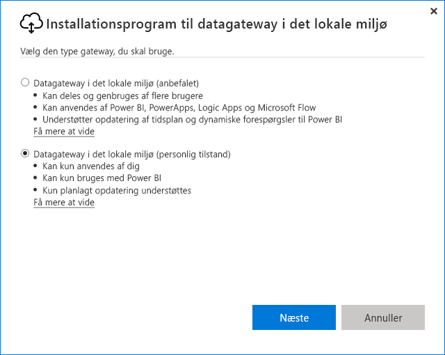

# <a name="use-personal-gateways-in-power-bi"></a>Brug personlige gateways i Power BI

[!INCLUDE [gateway-rewrite](includes/gateway-rewrite.md)]

Datagatewayen i det lokale miljø (personlig tilstand) er en version af datagatewayen i det lokale miljø, som kun fungerer med Power BI. Du kan bruge en personlig gateway til at installere en gateway på din egen computer og få adgang til data i det lokale miljø.

> [!NOTE]
> Du kan kun have én gateway i tilstanden Personlig for hver Power BI-bruger. Hvis du installerer endnu en gateway i personlig tilstand for den samme bruger, selv på en anden computer, erstatter den nyeste installation den tidligere eksisterende installation.

## <a name="on-premises-data-gateway-vs-on-premises-data-gateway-personal-mode"></a>Datagateway i det lokale miljø kontra datagateway (personlig tilstand)

I følgende tabel beskrives forskelle mellem en datagateway i det lokale miljø og en datagateway i det lokale miljø (personlig tilstand).

|   |Datagateway i det lokale miljø | Datagateway i det lokale miljø (personlig tilstand) |
| ---- | ---- | ---- |
|Understøttede cloudtjenester |Power BI, PowerApps, Azure Logic Apps, Power Automate, Azure Analysis Services, dataflow |Power BI |
|Kørsler |Som konfigureret af brugere, der har adgang til gatewayen |Som dig til Windows-godkendelse og som konfigureret af dig til andre godkendelsestyper |
|Kan kun installeres som computeradministrator |Ja |Nej |
|Centraliseret administration af gateway og datakilde |Ja |Nej |
|Importér data, og planlæg opdatering |Ja |Ja |
|DirectQuery-support |Ja |Nej |
|Understøttelse af LiveConnect til Analysis Services |Ja |Nej |

## <a name="install-the-on-premises-data-gateway-personal-mode"></a>Installér datagatewayen i det lokale miljø (personlig tilstand)

Gør følgende for at installere datagatewayen i det lokale miljø (personlig tilstand):

1. [Download datagatewayen i det lokale miljø](https://go.microsoft.com/fwlink/?LinkId=820925&clcid=0x409).

2. I installationsprogrammet skal du vælge datagatewayen i det lokale miljø (personlig tilstand) og derefter vælge **Næste**.

   

Gatewayfilerne er installeret i _"%localappdata%\Microsoft\On-Premises data gateway (personlig tilstand)._ Efter installationen er fuldført, og du logger på, kan du se følgende skærmbillede.


## <a name="use-fast-combine-with-the-personal-gateway"></a>Brug Kombiner hurtigt med den personlige gateway

Med Kombiner hurtigt på en personlig gateway kan du ignorere angivne niveauer for beskyttelse af personlige oplysninger under udførelse af forespørgsler. Gør følgende for at aktivere Kombiner hurtig, så det kan fungere sammen med datagatewayen i det lokale miljø (personlig tilstand):

1. Åbn følgende fil ved hjælp af Stifinder:

   `%localappdata%\Microsoft\On-premises data gateway (personal mode)\Microsoft.PowerBI.DataMovement.Pipeline.GatewayCore.dll.config`

2. Tilføj følgende tekst nederst i filen:

    ```xml
    <setting name="EnableFastCombine" serializeAs="String">
       <value>true</value>
    </setting>
    ```

3. Når den er færdig, træder indstillingen i kraft i ca. ét minut. Du kontrollerer, om den fungerer korrekt, ved at prøve en opdatering efter behov i Power BI-tjenesten for at bekræfte, at Kombiner hurtigt fungerer.

## <a name="frequently-asked-questions-faq"></a>Ofte stillede spørgsmål

**Spørgsmål:** Kan jeg køre datagatewayen i det lokale miljø (personlig tilstand) side om side med datagateways i det lokale miljø (tidligere kaldet Enterprise-versionen af gatewayen)?
  
**Svar:** Ja, begge gateways kan køre samtidigt.

**Spørgsmål:** Kan jeg køre datagatewayen i det lokale miljø (personlig tilstand) som en tjeneste?
  
**Svar:** Nej. Datagatewayen i det lokale miljø (personlig tilstand) kan kun køres som et program. Hvis du har brug for at køre gatewayen som en tjeneste eller i administratortilstand, skal du overveje [datagatewayen](/data-integration/gateway/service-gateway-onprem) i det lokale miljø (tidligere kaldet Enterprise-gatewayen).

**Spørgsmål:** Hvor ofte opdateres datagatewayen i det lokale miljø (personlig tilstand)?
  
**Svar:** Vi planlægger at opdatere den personlige gateway hver måned.

**Spørgsmål:** Hvorfor bliver jeg bedt om at opdatere mine legitimationsoplysninger?
  
**Svar:** Mange situationer kan udløse en anmodning om legitimationsoplysninger. Den mest almindelige er, at du har geninstalleret datagatewayen i det lokale miljø (personlig tilstand) på en anden maskine end din Power BI Gateway – Personal. Det kan også skyldes et problem i datakilden, og Power BI kunne ikke udføre en test af forbindelsen, eller der opstod en timeout eller en systemfejl. Hvis du vil opdatere dine legitimationsoplysninger i Power BI-tjenesten, skal du vælge tandhjulsikonet og vælge **Indstillinger** > **Datasæt**. Find det pågældende datasæt, og vælg **Legitimationsoplysninger til datakilde**.

**Spørgsmål:** Hvor længe er min tidligere personlige gateway offline under opgraderingen?
  
**Svar:** Opgradering af den personlige gateway til den nye version tager kun nogle få minutter.

**Spørgsmål:** Jeg bruger R- og Python-scripts. Understøttes de?
  
**Svar:** R- og Python-scripts understøttes i forbindelse med personlig tilstand.

## <a name="next-steps"></a>Næste trin

* [Konfiguration af proxyindstillinger for datagateway i det lokale miljø](/data-integration/gateway/service-gateway-proxy)  

Har du flere spørgsmål? Prøv at spørge [Power BI-community'et](https://community.powerbi.com/).
