# <a name="tutorial-connect-to-on-premises-data-in-sql-server"></a>Selvstudium: Opret forbindelse til lokale data i SQL Server

En gateway i det lokale miljø er software, som du installerer på et lokalt netværk. Det gør det nemmere at få adgang til data på dette netværk. I dette selvstudium opretter du en rapport i Power BI Desktop, der er baseret på eksempeldata, som er importeret fra SQL Server. Du udgiver derefter rapporten i Power BI-tjenesten og konfigurerer en gateway, så tjenesten har adgang til dataene i det lokale miljø. Denne adgang betyder, at tjenesten kan opdatere dataene for at holde rapporten opdateret.

I dette selvstudium lærer du, hvordan du kan:
> [!div class="checklist"]
> * Oprette en rapport ud fra data i SQL Server
> * Udgive rapporten i Power BI-tjenesten
> * Tilføje SQL Server som en datakilde til gatewayen
> * Opdatere dataene i rapporten

Hvis du ikke er tilmeldt Power BI, kan du [tilmelde dig en gratis prøveversion](https://app.powerbi.com/signupredirect?pbi_source=web), før du begynder.


## <a name="prerequisites"></a>Forudsætninger

* [Installér Power BI Desktop](https://powerbi.microsoft.com/desktop/)
* [Installér SQL Server](https://docs.microsoft.com/sql/database-engine/install-windows/install-sql-server) på en lokal computer 
* [Installér en datagateway i det lokale miljø](service-gateway-install.md) på den samme lokale computer (i produktion vil det typisk være en anden computer)


## <a name="set-up-sample-data"></a>Konfigurer eksempeldata

Du starter ved at føje eksempeldata til SQL Server, så du kan bruge disse data i resten af selvstudiet.

1. I SSMS (SQL Server Management Studio) skal du oprette forbindelse til din instans af SQL Server og oprette en testdatabase.

    ```sql
    CREATE DATABASE TestGatewayDocs
    ```

2. I den database, du har oprettet, skal du tilføje en tabel og indsætte data.

    ```sql
    USE TestGatewayDocs

    CREATE TABLE Product (
        SalesDate DATE,
        Category  VARCHAR(100),
        Product VARCHAR(100),
        Sales MONEY,
        Quantity INT
    )

    INSERT INTO Product VALUES('2018-05-05','Accessories','Carrying Case',9924.60,68)
    INSERT INTO Product VALUES('2018-05-06','Accessories','Tripod',1350.00,18)
    INSERT INTO Product VALUES('2018-05-11','Accessories','Lens Adapter',1147.50,17)
    INSERT INTO Product VALUES('2018-05-05','Accessories','Mini Battery Charger',1056.00,44)
    INSERT INTO Product VALUES('2018-05-06','Accessories','Telephoto Conversion Lens',1380.00,18)
    INSERT INTO Product VALUES('2018-05-06','Accessories','USB Cable',780.00,26)
    INSERT INTO Product VALUES('2018-05-08','Accessories','Budget Movie-Maker',3798.00,9)
    INSERT INTO Product VALUES('2018-05-09','Digital video recorder','Business Videographer',10400.00,13)
    INSERT INTO Product VALUES('2018-05-10','Digital video recorder','Social Videographer',3000.00,60)
    INSERT INTO Product VALUES('2018-05-11','Digital','Advanced Digital',7234.50,39)
    INSERT INTO Product VALUES('2018-05-07','Digital','Compact Digital',10836.00,84)
    INSERT INTO Product VALUES('2018-05-08','Digital','Consumer Digital',2550.00,17)
    INSERT INTO Product VALUES('2018-05-05','Digital','Slim Digital',8357.80,44)
    INSERT INTO Product VALUES('2018-05-09','Digital SLR','SLR Camera 35mm',18530.00,34)
    INSERT INTO Product VALUES('2018-05-07','Digital SLR','SLR Camera',26576.00,88)
    ```

3. Vælg dataene fra tabellen for at kontrollere dem.

    ```sql
    SELECT * FROM Product
    ```

    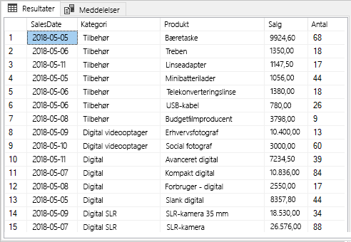


## <a name="build-and-publish-a-report"></a>Opret og udgiv en rapport

Nu, hvor du har eksempeldata, du kan arbejde med, skal du oprette forbindelse til SQL Server i Power BI Desktop og oprette en rapport, der er baseret på disse data. Derefter udgiver du rapporten i Power BI-tjenesten.

1. Under fanen **Hjem** i Power BI Desktop skal du vælge **Hent data** > **SQL Server**.

2. Under **Server** skal du angive navnet på serveren, og under **Database** skal du skrive "TestGatewayDocs". Vælg **OK**. 

    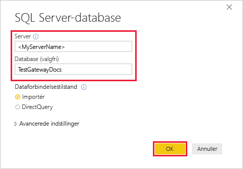

3. Kontrollér dine legitimationsoplysninger, og vælg derefter **Opret forbindelse**.

4. Under **Navigator** skal du vælge tabellen **Produkt** og derefter vælge **Indlæs**.

    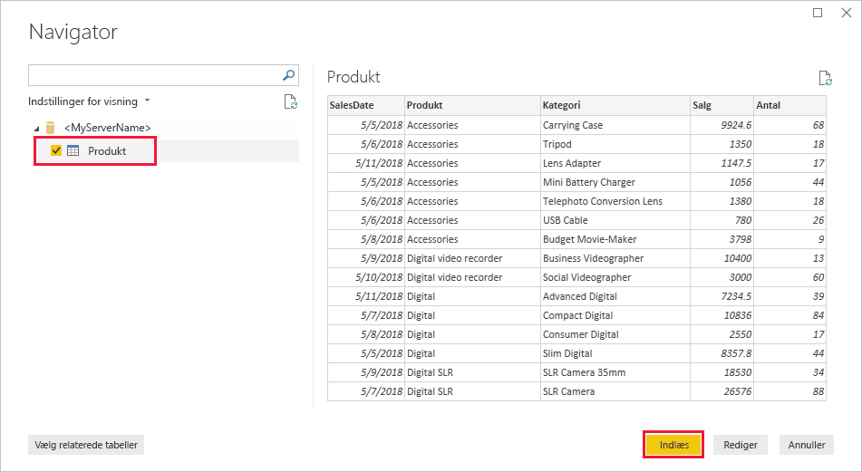

5. I ruden **Visualiseringer** i Power BI Desktop-visningen **Rapport** skal du vælge **Stablet søjlediagram**.

    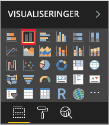    

6. Mens søjlediagrammet er markeret på rapportlærredet, skal du vælge felterne **Kategori** og **Salg** i ruden **Felter**.  

    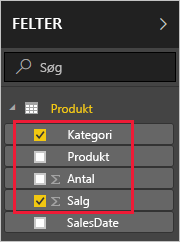

    Diagrammet bør nu se ud som i det følgende.

    

    Bemærk, at **SLR Camera** er den vare, der i øjeblikket sælger bedst. Dette ændrer sig, når du opdaterer data og opdaterer rapporten senere i dette selvstudium.

7. Gem rapporten med navnet "TestGatewayDocs.pbix".

8. Under fanen **Hjem** skal du vælge **Udgiv** > **Mit arbejdsområde** > **Vælg**. Log på Power BI-tjenesten, hvis du bliver bedt om det. 

    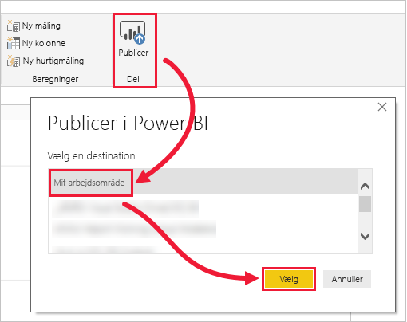

9. På skærmen **Lykkedes** skal du vælge **Åbn 'TestGatewayDocs.pbix' i Power BI**.


## <a name="add-sql-server-as-a-gateway-data-source"></a>Tilføj SQL Server som en datakilde til gatewayen

I Power BI Desktop opretter du direkte forbindelse til SQL Server, men Power BI-tjenesten kræver en gateway for at fungere som bro. Nu kan du tilføje din instans af SQL Server som datakilde for den gateway, som du oprettede i en tidligere artikel (angivet under [Forudsætninger](#prereqisites)). 

1. I øverste højre hjørne af Power BI-tjenesten skal du vælge tandhjulsikonet  > **Administrer gateways**.

    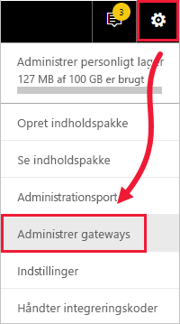

2. Vælg **Tilføj datakilde**, og angiv "test-sql-datakilde" for **Navn på datakilde**.

    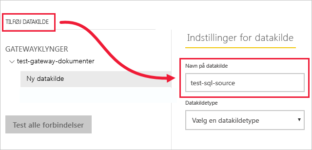

3. For **Datakildetype** skal du vælge **SQL Server**, og angiv derefter andre værdier som vist.

    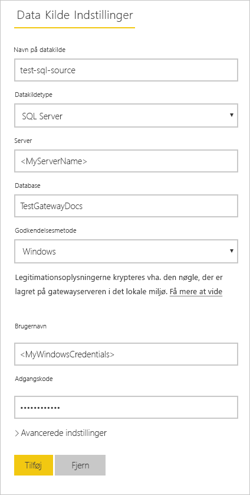

    | Indstilling | Værdi |
    | ---    | ---   |
    | **Navn på datakilde**       | test-sql-source      |
    | **Datakildetype**       | SQL Server      |
    | **Server**       |  Navnet på din instans af SQL Server (skal være identisk med det, du har angivet i Power BI Desktop)    |
    | **Database**       | TestGatewayDocs      |
    | **Godkendelsesmetode**       | Windows      |
    | **Brugernavn**        |  Den konto, f.eks. michael@contoso.com, du bruger til at oprette forbindelse til SQL Server     |
    | **Adgangskode**       |  Adgangskoden til den konto, du bruger til at oprette forbindelse til SQL Server    |

4. Vælg **Tilføj** Du får vist *Forbindelsen er oprettet*, når processen lykkes.

    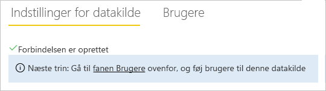

    Du kan nu bruge denne datakilde til at inkludere data fra SQL Server i dine Power BI-dashboards og -rapporter.


## <a name="configure-and-use-data-refresh"></a>Konfigurer og brug dataopdatering

Du har en rapport, der er udgivet i Power BI-tjenesten, og SQL Server-datakilden er konfigureret. Når det er på plads, skal du nu foretage en ændring i tabellen Produkt, og denne ændring passerer gennem gatewayen til den udgivne rapport. Du kan også konfigurere en planlagt opdatering for at håndtere fremtidige ændringer.

1. Opdater data i tabellen Produkt i SSMS (SQL Server Management Studio).

    ```sql
    UPDATE Product
    SET Sales = 32508, Quantity = 252
    WHERE Product='Compact Digital'     

    ```

2. I venstre navigationsrude i Power BI-tjenesten skal du vælge **Mit arbejdsområde**.

3. Under **Datasæt** skal du vælge **flere** (**. . .**) > **Opdater nu** for datasættet **TestGatewayDocs**.

    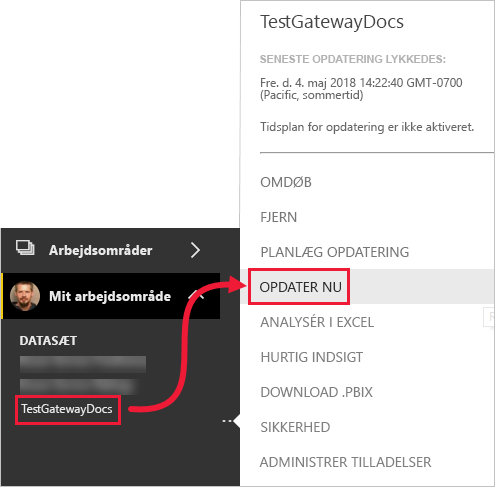

4. Vælg **Mit arbejdsområde** > **Rapporter** > **TestGatewayDocs**. Se, hvordan opdateringen passerede igennem, og nu er det **Compact Digital**, der sælger bedst. 

    

5. Vælg **Mit arbejdsområde** > **Rapporter** > **TestGatewayDocs**. Vælg **flere** (**. . .**) > **Planlæg opdatering**.

6. Under **Planlæg opdatering** skal du slå opdatering **til** og derefter vælge **Anvend**. Datasættet opdateres dagligt som standard.

    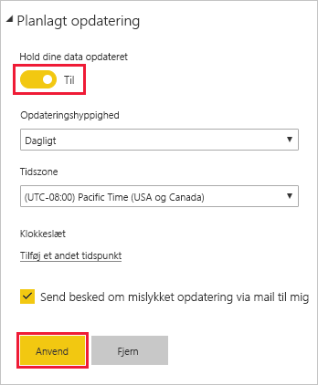

## <a name="clean-up-resources"></a>Fjern ressourcer
Hvis du ikke længere vil bruge eksempeldataene, kan du køre `DROP DATABASE TestGatewayDocs` i SSMS (SQL Server Management Studio). Hvis du ikke vil bruge SQL Server-datakilden, kan du [fjerne datakilden](service-gateway-manage.md#remove-a-data-source). 


## <a name="next-steps"></a>Næste trin
I dette selvstudium lærte du, hvordan du kan:
> [!div class="checklist"]
> * Oprette en rapport ud fra data i SQL Server
> * Udgive rapporten i Power BI-tjenesten
> * Tilføje SQL Server som en datakilde til gatewayen
> * Opdatere dataene i rapporten

Gå videre til den næste artikel for at få mere at vide
> [!div class="nextstepaction"]
> [Administrer en Power BI-gateway](service-gateway-manage.md)

