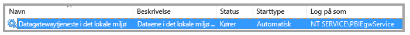
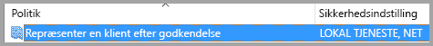
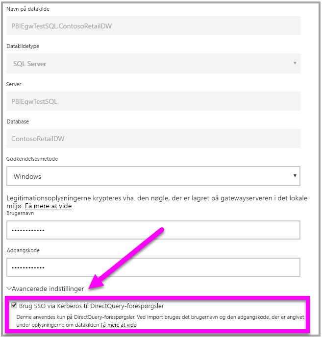

# <a name="use-resource-based-kerberos-for-single-sign-on-sso-from-power-bi-to-on-premises-data-sources"></a>Brug ressourcebaseret Kerberos til SSO (enkeltlogon) fra Power BI til datakilder i det lokale miljø

Brug [ressourcebaseret Kerberos-begrænset delegering](/windows-server/security/kerberos/kerberos-constrained-delegation-overview) til at aktivere enkeltlogon-forbindelse til Windows Server 2012 og nyere versioner, som tillader, at front end- og back end-tjenester er i forskellige domæner. Hvis dette skal fungere, skal domænet for back end-tjenesten have tillid til domænet for front end-tjenesten.

## <a name="preparing-for-resource-based-kerberos-constrained-delegation"></a>Forberedelse af ressourcebaseret Kerberos-begrænset delegering

Der skal være konfigureret flere elementer, hvis Kerberos-begrænset delegering skal fungere korrekt, herunder _tjenestens hovednavn_ (SPN) og delegeringsindstillinger i tjenestekonti.

### <a name="prerequisite-1-operating-system-requirements"></a>Forudsætning 1: Krav til operativsystem

Ressourcebaseret begrænset delegering kan kun konfigureres på en domænecontroller, der kører Windows Server 2012 R2- eller Windows Server 2012 eller nyere.

### <a name="prerequisite-2-install-and-configure-the-on-premises-data-gateway"></a>Forudsætning 2: Installér og konfigurer datagatewayen i det lokale miljø.

Denne version af datagatewayen i det lokale miljø understøtter en direkte opgradering samt _indstillingsovertagelse_ af eksisterende gateways.

### <a name="prerequisite-3-run-the-gateway-windows-service-as-a-domain-account"></a>Forudsætning 3: Kør gatewayens Windows-tjeneste som en domænekonto.

I en standardinstallation kører gatewayen som en tjenestekonto på en lokal computer (specifikt _NT-tjeneste\PBIEgwService_) som det, der er vist i følgende billede:



Når **Kerberos-begrænset delegering skal aktiveres, skal gatewayen køre som en domænekonto, medmindre Azure AD allerede er synkroniseret med dit lokale Active Directory (med Azure AD DirSync/Connect). Hvis du har brug for at skifte kontoen til en domænekonto, kan du se [Skift af gatewayen til en domænekonto](service-gateway-sso-kerberos.md#switching-the-gateway-to-a-domain-account) senere i denne artikel.

Hvis Azure AD DirSync/Connect er konfigureret, og brugerkonti er synkroniserede, behøver gatewaytjenesten ikke at udføre lokale AD-opslag på kørselstidspunktet. Du kan bruge det lokale tjeneste-SID (i stedet for at kræve en domænekonto) til gatewaytjenesten. De trin til konfiguration af Kerberos Constrained Delegation, som er beskrevet i denne artikel, er de samme som den konfiguration (de anvendes blot på gatewayens computerobjekt i Active Directory i stedet for på domænekontoen).

### <a name="prerequisite-4-have-domain-admin-rights-to-configure-spns-setspn-and-kerberos-constrained-delegation-settings"></a>Forudsætning 4: Du skal have rettigheder som domæneadministrator til at konfigurere indstillinger for SPN'er (SetSPN) og Kerberos-begrænset delegering

Selvom det teknisk set er muligt for en domæneadministrator midlertidigt eller permanent at give andre rettigheder til at konfigurere SPN'er og Kerberos-delegering, uden at dette kræver rettigheder som domæneadministrator, er dette ikke den anbefalede fremgangsmåde. I følgende afsnit gennemgås de konfigurationstrin, der kræves i **Forudsætning 3**, udførligt.

## <a name="configuring-kerberos-constrained-delegation-for-the-gateway-and-data-source"></a>Konfiguration af Kerberos-begrænset delegering for gatewayen og datakilden

Følgende to elementer skal konfigureres eller valideres, før systemet kan konfigureres korrekt:

1. Hvis det er nødvendigt, kan du konfigurere et SPN for gatewaytjenestens domænekonto.

1. Konfigurer delegeringsindstillinger på gatewaytjenestens domænekonto.

Bemærk, at du skal være domæneadministrator for at kunne udføre disse to konfigurationstrin.

I de følgende afsnit beskrives disse trin efter tur.

### <a name="configure-an-spn-for-the-gateway-service-account"></a>Konfigurer et SPN til gatewaytjenestekontoen

Først skal du fastlægge, om der allerede er oprettet et SPN for den domænekonto, der er anvendt som gatewaytjenestekonto, ved at følge disse trin:

1. Start **Active Directory-brugere og -computere** som domæneadministrator.

1. Højreklik på domænet, vælg **Find**, og skriv kontonavnet for gatewaytjenestekontoen

1. Højreklik i søgeresultaterne på gatewaytjenestekontoen, og vælg **Egenskaber**.

1. Hvis fanen **Delegering** kan ses i dialogboksen **Egenskaber**, så var der allerede oprettet et SPN, og du kan gå videre til næste underafsnit om konfiguration af Delegering-indstillinger.

    Hvis der ikke er en **Delegering**-fane i dialogboksen **Egenskaber**, kan du manuelt oprette et SPN for den pågældende konto, som tilføjer fanen **Delegering** (det er den nemmeste måde at konfigurere delegeringsindstillinger på). Oprettelse af et hovednavn til tjenesten, eller et SPN, kan udføres ved hjælp af [setspn-værktøjet](https://technet.microsoft.com/library/cc731241.aspx), der følger med Windows (du skal have rettigheder som domæneadministrator for at kunne oprette SPN'et).

    Forestil dig f.eks., at gatewaytjenestekontoen er "PBIEgwTest\GatewaySvc", og at navnet på computeren, hvor gatewaytjenesten kører, kaldes **Computer1**. Hvis du vil angive SPN'et for gatewaytjenestekontoen for denne computer i dette eksempel, skal du køre følgende kommando:

      

    Når dette trin er fuldført, kan vi gå videre til at konfigurere delegeringsindstillinger.

### <a name="configure-delegation-settings"></a>Konfigurer delegeringsindstillinger

I følgende trin antager vi, at vi har et lokalt miljø med to computere i forskellige domæner: en gatewaycomputer og en databaseserver, der kører SQL Server. Af hensyn til dette eksempel antager vi også, at vi har følgende indstillinger og navne:

- Gatewaymaskinens navn: **PBIEgwTestGW**
- Gatewaytjenestekonto: **PBIEgwTestFrontEnd\GatewaySvc** (kontoens viste navn: Gateway Connector)
- Navn på computer med SQL Server-datakilde: **PBIEgwTestSQL**
- SQL Server-datakildes tjenestekonto: **PBIEgwTestBackEnd\SQLService**

Med udgangspunkt i disse eksempelnavne og -indstillinger skal du bruge følgende konfigurationstrin:

1. Ved hjælp af **Active Directory-brugere og -computere**, som er en MMC-snap-in (Microsoft Management Console), skal du på domænecontrolleren for domænet **PBIEgwTestFront-end** sørge for, at der ikke er anvendt nogen delegeringsindstillinger for gatewaytjenestekontoen.

    

1. Ved hjælp af **Active Directory-brugere og -computere** skal du på domænecontrolleren for domænet **PBIEgwTestBack-end** sørge for, at der ikke er anvendt nogen delegeringsindstillinger for back end-tjenestekontoen. Herudover skal du sikre, at attributten "msDS-AllowedToActOnBehalfOfOtherIdentity" heller ikke er angivet. Du kan finde denne attribut i "attributeditoren", som vist på følgende billede:

    

1. Opret en gruppe i **Active Directory-brugere og -computere** på domænecontrolleren for domænet **PBIEgwTestBack-end**. Føj gatewaytjenestekontoen til denne gruppe, som vist på følgende billede. På billedet vises en ny gruppe ved navn _ResourceDelGroup_ og gatewaytjenestekontoen **GatewaySvc**, der er føjet til denne gruppe.

    

1. Åbn en kommandoprompt, og kør følgende kommandoer for domænecontrolleren for domænet **PBIEgwTestBack-end** for at opdatere attributten msDS-AllowedToActOnBehalfOfOtherIdentity for back end-tjenestekontoen:

    ```powershell
    $c=get-adgroupResourceDelGroup
    set-aduser **SQLService** -principalsAllowedToDelegateToAccount$c
    ```

1. Du kan bekræfte, at opdateringen afspejles, på fanen "Attributeditor" i egenskaberne for back end-tjenestekontoen i **Active Directory-brugere og -computere.**

På den computer, der kører gatewaytjenesten (**PBIEgwTestGW** i eksemplet), skal gatewaytjenestekontoen endeligt have tildelt den lokale politik "Repræsenter en klient efter godkendelse". Du kan udføre/bekræfte dette med Editor til lokal gruppepolitik (**gpedit**).

1. Kør: _gpedit.msc_ på gatewaycomputeren.

1. Gå til **Lokal computerpolitik > Computerkonfiguration > Windows-indstillinger > Sikkerhedsindstillinger > Lokale politikker > Tildeling af brugerrettigheder**, som vist på følgende billede.

    

1. Fra listen over politikker under **Tildeling af brugerrettigheder** skal du vælge **Repræsenter en klient efter godkendelse**.

    

1. Højreklik og åbn **Egenskaber** for **Repræsenter en klient efter godkendelse**, og kontrollér listen over konti. Den skal omfatte gatewaytjenestekontoen ( **PBIEgwTestFront-end**  **\GatewaySvc** ).

1. Fra listen over politikker under **Tildeling af brugerrettigheder** skal du vælge **Optræd som en del af operativsystemet (SeTcbPrivilege)**. Kontrollér, at gatewaytjenestekontoen også er medtaget på listen over konti.

1. Genstart processen for tjenesten med **datagatewayen i det lokale miljø**.

## <a name="running-a-power-bi-report"></a>Kørsel af en Power BI-rapport

Når alle de konfigurationstrin, der er skitseret tidligere i denne artikel, er fuldført, kan du bruge siden til **administration af gateway** i Power BI til at konfigurere datakilden. Derefter kan du under dens **avancerede indstillinger** aktivere SSO og publicere rapporter og datasæt med binding til datakilden.



Denne konfiguration fungerer i de fleste tilfælde. Med Kerberos kan der dog være forskellige konfigurationer afhængigt af dit miljø. Hvis rapporten stadig ikke kan indlæses, skal du kontakte domæneadministratoren for at få problemet undersøgt yderligere.

## <a name="next-steps"></a>Næste trin

Du kan finde flere oplysninger om **datagatewayen i det lokale miljø** og **DirectQuery** i følgende ressourcer:

- [Datagateway i det lokale miljø](service-gateway-onprem.md)
- [DirectQuery i Power BI](desktop-directquery-about.md)
- [Datakilder, der understøttes af DirectQuery](desktop-directquery-data-sources.md)
- [DirectQuery og SAP BW](desktop-directquery-sap-bw.md)
- [DirectQuery og SAP HANA](desktop-directquery-sap-hana.md)