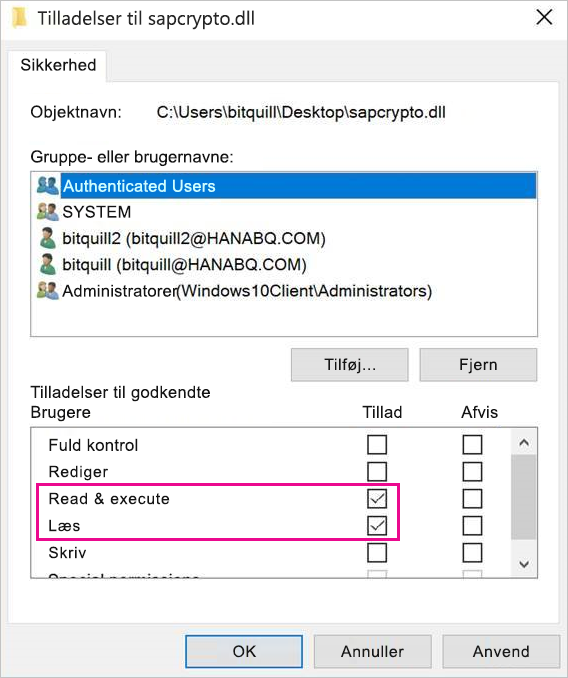

# <a name="use-kerberos-single-sign-on-for-sso-to-sap-bw-using-commoncryptolib-sapcryptodll"></a>Brug enkeltlogon (SSO) i Kerberos til SAP BW ved hjælp af CommonCryptoLib (sapcrypto.dll)

I denne artikel beskrives, hvordan du konfigurerer din SAP BW-server for at aktivere SSO fra Power BI-tjenesten ved hjælp af CommonCryptoLib (sapcrypto.dll).

> [!NOTE]
> Fuldfør trinnene i denne artikel foruden trinnene i [Konfigurer SSO i Kerberos](service-gateway-sso-kerberos.md), før du forsøger at opdatere en SAP BW-baseret rapport, der bruger SSO i Kerberos. Ved hjælp af CommonCryptoLib som dit SNC-bibliotek aktiveres SSO-forbindelser for både SAP BW-programservere og SAP BW-meddelelsesservere.

## <a name="configure-sap-bw-server-to-enable-sso-using-commoncryptolib"></a>Konfigurer SAP BW-server for at aktivere SSO ved hjælp af CommonCryptoLib

> [!NOTE]
> Datagatewayen i det lokale miljø er 64-bit software og kræver derfor 64-bit versionen af CommonCryptoLib (sapcrypto. dll). Hvis du planlægger at teste SSO-forbindelsen til din SAP BW-server i SAP GUI, før du forsøger at oprette en SSO-forbindelse via gatewayen (anbefales), skal du også bruge 32-bit versionen af CommonCryptoLib, da SAP GUI er 32-bit-software.

1. Sørg for, at din BW-server er konfigureret korrekt til SSO i Kerberos ved hjælp af CommonCryptoLib. Hvis det er tilfældet, burde du kunne bruge SSO til at få adgang til BW-server (enten direkte eller via en SAP BW-meddelelsesserver) med et SAP-værktøj som SAP GUI, der er konfigureret til at bruge CommonCryptoLib. Du kan finde flere oplysninger om [konfigurationstrin under SAP Single Sign-on: Godkend med Kerberos/SPNEGO](https://blogs.sap.com/2017/07/27/sap-single-sign-on-authenticate-with-kerberosspnego/). Din BW-server skal bruge CommonCryptoLib som SNC-bibliotek og have et SNC-navn, der starter med "CN =", f.eks. "CN=BW1". Du kan finde flere oplysninger om krav til SNC-navne under [SNC-parametre til konfiguration af Kerberos](https://help.sap.com/viewer/df185fd53bb645b1bd99284ee4e4a750/3.0/en-US/360534094511490d91b9589d20abb49a.html) (helt konkret parameteren snc/identity/as).

1. Hvis du ikke allerede har gjort det, skal du installere x64-versionen af [SAP.net Connector](https://support.sap.com/en/product/connectors/msnet.html) på den computer, hvor gatewayen er installeret. Du kan kontrollere, om komponenten er installeret, ved at forsøge at oprette forbindelse til din BW-server i Power BI Desktop. Hvis du ikke kan oprette forbindelse ved hjælp af version 2.0, er .NET Connector ikke installeret.

1. Sørg for, at SAP Secure logon Client (SLC) ikke kører på den computer, hvor gatewayen er installeret. SLC cachelagrer Kerberos-billetter på en måde, der kan forstyrre gatewayens mulighed for at bruge Kerberos til SSO. Hvis SLC er installeret, skal du afinstallere den eller sørge for at lukke SAP Secure logon-klienten: Højreklik på ikonet på proceslinjen, og vælg Log af og Afslut, før du forsøger at oprette en SSO-forbindelse ved hjælp af gatewayen. SLC understøttes ikke til brug på Windows Server-maskiner. Du kan finde flere oplysninger under [SAP Note 2780475](https://launchpad.support.sap.com/#/notes/2780475) (s-bruger påkrævet).

    

    Hvis du fjerner SLC eller vælger **Log af** og **Afslut**, skal du åbne et cmd-vindue og angive `klist purge` for at fjerne alle cachelagrede Kerberos-billetter, før du forsøger at oprette en SSO-forbindelse via gatewayen.

1. Download 64-bit versionen af CommonCryptoLib (sapcrypto.dll) **8.5.25 eller nyere** fra SAP Launchpad, og kopiér den til en mappe på din gatewaycomputer. I den samme mappe, hvortil du kopierede sapcrypto.dll, skal du oprette en fil med navnet sapcrypto.ini med følgende indhold:

    ```
    ccl/snc/enable_kerberos_in_client_role = 1
    ```

    Ini-filen indeholder konfigurationsoplysninger, der kræves af CommonCryptoLib for at aktivere SSO i gateway-scenariet.

    > [!NOTE]
    > Disse filer skal gemmes på samme placering. Med andre ord skal _/path/to/sapcrypto/_ indeholde både sapcrypto.ini og sapcrypto.dll.

    Både gateway-tjenestebrugeren og den Active Directory-bruger (AD), som tjenestebrugeren repræsenterer, har behov for læse- og udførelsesrettigheder til begge filer. Det anbefales, at du tildeler tilladelser til både .ini- og .dll-filer til gruppen Godkendte brugere. Med henblik på test kan du også eksplicit tildele disse tilladelser til både den Tjenestebruger af gatewayen og den bruger af Active Directory, som du skal bruge til testen. På nedenstående skærmbillede har vi tildelt gruppen Godkendte brugere **Læse &amp; udførelses**-rettigheder til sapcrypto.dll:

    

1. Hvis du ikke har en SAP BW-datakilde, skal du tilføje en datakilde på siden **Administrer gateways** i Power BI-tjenesten. Hvis du allerede har en BW-datakilde, der er tilknyttet den gateway, som SSO-forbindelsen skal passere igennem, skal du være klar til at redigere den. Vælg **SAP Business Warehouse** som **Datakildetype**, hvis du vil oprette en SSO-forbindelse til en BW-programserver. Vælg **Sap Business Warehouse-meddelelsesserver**, hvis du vil oprette en SSO-forbindelse til en BW-meddelelsesserver.

    Som **SNC-bibliotek** skal du enten vælge miljøvariablen **SNC\_LIB eller SNC\_LIB\_64** eller **Brugerdefineret**. Hvis du vælger indstillingen **SNC\_LIB**, skal du angive værdien af miljøvariablen **SNC\_LIB\_64** på gatewaycomputer til den absolutte sti til 64-bit kopien af sapcrypto.dll på gatewaycomputeren, f.eks. C:\Users\Test\Desktop\sapcrypto.dll. Hvis du vælger **brugerdefineret**, kan du indsætte den absolutte sti til sapcrypto.dll i feltet Brugerdefineret SNC-bibliotekssti, der vises på siden **Administrer gateways**. Som **SNC-partnernavn** skal du angive SNC-navnet på BW-serveren. Under **Avancerede indstillinger** skal du sikre, at afkrydsningsfeltet **Brug SSO via Kerberos til DirectQuery-forespørgsler** er markeret. De øvrige felter skal udfyldes, ligesom de ville blive, hvis du oprettede en forbindelse via Windows-godkendelse fra PBI Desktop.

1. Opret en CCL\_PROFILE-systemmiljøvariabel, og peg på den i sapcrypto.ini:

    

    Husk, at sapcrypto.dll og .ini-filerne skal findes på den samme placering. I det viste eksempel, hvor sapcrypto.ini er placeret på skrivebordet, skal sapcrypto.dll også placeres på skrivebordet.

1. Genstart gatewaytjenesten:

    

1. [Kør en Power BI-rapport](service-gateway-sso-kerberos.md#run-a-power-bi-report)

## <a name="troubleshooting"></a>Fejlfinding

Hvis du ikke kan opdatere rapporten i Power BI-tjenesten, kan du bruge gateway-sporing, sporing af CPIC og sporing af CommonCryptoLib som en hjælp til at diagnosticere problemet. Sporing af CPIC og CommonCryptoLib er SAP-produkter, så Microsoft kan ikke yde direkte support til disse funktioner. For Active Directory-brugere, der får tildelt SSO-adgang til BW, kan visse Active Directory-konfigurationer kræve, at brugerne er medlem af administratorgruppen på den computer, hvor gatewayen er installeret.

1. **Gatewaylogge:** Du skal blot genskabe problemet, åbne [gateway-appen](https://docs.microsoft.com/data-integration/gateway/service-gateway-app), gå til fanen **Diagnosticering** og vælge **Eksportér logs**:

    

1. **Sporing af CPIC:** Indstil to miljøvariabler for at aktivere sporing af CPIC: CPIC\_TRACE og CPIC\_TRACE\_DIR. Den første variabel angiver sporingsniveauet, og den anden variabel angiver mappen med sporingsfilen. Mappen skal være en placering, som medlemmerne af gruppen Godkendte brugere kan skrive til. Angiv CPIC\_TRACE til 3 og CPIC\_TRACE\_DIR til en hvilken som helst mappe, som du vil have, at sporingsfilerne skal skrives til.

    

    Reproducerer problemet, og kontrollér, at CPIC\_TRACE\_DIR indeholder sporingsfiler.

1. **Sporing af CommonCryptoLib:** Aktivér sporing af CommonCryptoLib ved at føje to linjer til den sapcrypto.ini-fil, du oprettede tidligere:

    ```
    ccl/trace/level=5
    ccl/trace/directory=<drive>:\logs\sectrace
    ```

    Sørg for at ændre indstillingen _ccl/trace/directory_ til en placering, som medlemmer af gruppen Godkendte brugere kan skrive til. Alternativt kan du oprette en ny .ini-fil for at ændre denne funktion. Opret en fil med navnet sectrace.ini i den samme mappe som sapcrypto.ini og sapcrypto.dll med nedenstående indhold. Erstat indstillingen DIRECTORY med en placering på computeren, som den godkendte bruger kan skrive til:

    ```
    LEVEL = 5

    DIRECTORY = <drive>:\logs\sectrace
    ```

    Du kan nu genskabe problemet og kontrollere, at den placering, der peges på af DIRECTORY, indeholder sporingsfiler. Sørg for at slå sporing af CPIC og CCL fra, når du er færdig.

    Du kan finde flere oplysninger om sporing af CommonCryptoLib i [SAP-note 2491573](https://launchpad.support.sap.com/#/notes/2491573) (s-bruger påkrævet).

## <a name="next-steps"></a>Næste trin

Du kan finde flere oplysninger om **datagateway i det lokale miljø** og **DirectQuery** i følgende ressourcer:

* [Hvad er en datagateway i det lokale miljø?](/data-integration/gateway/service-gateway-getting-started)
* [DirectQuery i Power BI](desktop-directquery-about.md)
* [Datakilder, der understøttes af DirectQuery](desktop-directquery-data-sources.md)
* [DirectQuery og SAP BW](desktop-directquery-sap-bw.md)
* [DirectQuery og SAP HANA](desktop-directquery-sap-hana.md)
