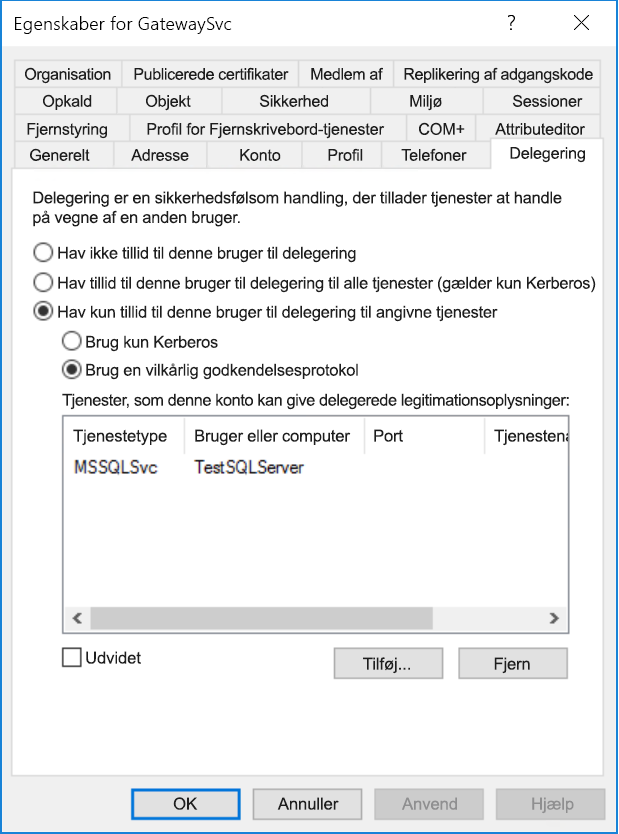
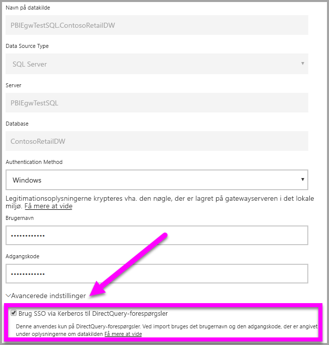
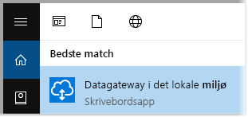
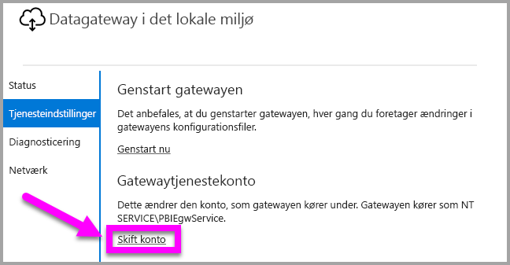
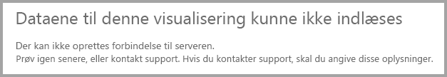
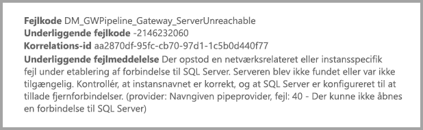

# <a name="use-kerberos-for-single-sign-on-sso-from-power-bi-to-on-premises-data-sources"></a>Brug Kerberos til SSO (enkeltlogon) fra Power BI til datakilder i det lokale miljø

Brug [Kerberos-begrænset delegering](/windows-server/security/kerberos/kerberos-constrained-delegation-overview) til at aktivere en problemfri forbindelse med enkeltlogon. Aktivering af SSO gør det nemt for Power BI-rapporter og -dashboards at opdatere data fra kilder i det lokale miljø.

## <a name="supported-data-sources"></a>Understøttede datakilder

Vi understøtter i øjeblikket følgende datakilder:

* SQL Server
* SAP HANA
* SAP BW
* Teradata
* Spark
* Impala

Vi understøtter også SAP HANA med [SAML (Security Assertion Markup Language)](service-gateway-sso-saml.md).

### <a name="sap-hana"></a>SAP HANA

Hvis du vil aktivere SSO til SAP HANA, skal du først følge disse trin:

* Kontrollér, at SAP HANA serveren kører den påkrævede minimumversion, hvilket afhænger af niveauet af din SAP HANA serverplatform:
  * [HANA 2 SPS 01 Rev 012.03](https://launchpad.support.sap.com/#/notes/2557386)
  * [HANA 2 SPS 02 Rev 22](https://launchpad.support.sap.com/#/notes/2547324)
  * [HANA 1 SP 12 Rev 122.13](https://launchpad.support.sap.com/#/notes/2528439)
* Installér SAP's seneste HANA ODBC-driver på gatewaycomputeren.  Minimumversionen er HANA ODBC version 2.00.020.00 fra august 2017.

Du kan finde flere oplysninger om, hvordan du konfigurerer og angiver enkeltlogon for SAP HANA ved hjælp af Kerberos, i emnet [Enkeltlogon ved hjælp af Kerberos](https://help.sap.com/viewer/b3ee5778bc2e4a089d3299b82ec762a7/2.0.03/en-US/1885fad82df943c2a1974f5da0eed66d.html) i SAP HANA-sikkerhedsvejledningen og linkene fra denne side, især SAP Note 1837331 – HOWTO HANA DBSSO Kerberos/Active Directory].

## <a name="preparing-for-kerberos-constrained-delegation"></a>Forberedelse af Kerberos-begrænset delegering

Der skal være konfigureret flere elementer, hvis Kerberos-begrænset delegering skal fungere korrekt, herunder *tjenestens hovednavn* (SPN) og delegeringsindstillinger i tjenestekonti.

### <a name="prerequisite-1-install--configure-the-on-premises-data-gateway"></a>Forudsætning 1: Installér og konfigurer datagatewayen i det lokale miljø.

Denne version af datagatewayen i det lokale miljø understøtter en direkte opgradering samt indstillingsovertagelse af eksisterende gateways.

### <a name="prerequisite-2-run-the-gateway-windows-service-as-a-domain-account"></a>Forudsætning 2: Kør gatewayens Windows-tjeneste som en domænekonto.

I en standardinstallation kører gatewayen som en tjenestekonto på en lokal computer (specifikt *NT-tjeneste\PBIEgwService*) som det, der er vist i følgende billede:


Når **Kerberos-begrænset delegering** skal aktiveres, skal gatewayen køre som en domænekonto, medmindre Azure AD allerede er synkroniseret med dit lokale Active Directory (med Azure AD DirSync/Connect). Hvis du har brug for at skifte kontoen til en domænekonto, kan du se [Skift af gatewayen til en domænekonto](#switching-the-gateway-to-a-domain-account) senere i denne artikel.

> [!NOTE]
> Hvis Azure AD DirSync/Connect er konfigureret, og brugerkonti er synkroniseret, behøver gatewaytjenesten ikke at udføre lokale AD-opslag på kørselstidspunktet, og du kan bruge den lokale tjeneste-SID (i stedet for at kræve en domænekonto) til gatewaytjenesten. De trin til konfiguration af Kerberos Constrained Delegation, som er beskrevet i denne artikel, er de samme som den konfiguration (de anvendes blot på gatewayens computerobjekt i Active Directory i stedet for på domænekontoen).

### <a name="prerequisite-3-have-domain-admin-rights-to-configure-spns-setspn-and-kerberos-constrained-delegation-settings"></a>Forudsætning 3: Du skal have rettigheder som domæneadministrator til at konfigurere indstillinger for SPN'er (SetSPN) og Kerberos-begrænset delegering

Selvom det teknisk set er muligt for en domæneadministrator midlertidigt eller permanent at give andre rettigheder til at konfigurere SPN'er og Kerberos-delegering, uden at dette kræver rettigheder som domæneadministrator, er dette ikke den anbefalede fremgangsmåde. I følgende afsnit gennemgås de konfigurationstrin, der kræves i **Forudsætning 3**, udførligt.

## <a name="configuring-kerberos-constrained-delegation-for-the-gateway-and-data-source"></a>Konfiguration af Kerbos-begrænset delegering for gatewayen og datakilden

Følgende to elementer skal konfigureres eller valideres, før systemet kan konfigureres korrekt:

1. Hvis det er nødvendigt, kan du konfigurere et SPN for gatewaytjenestens domænekonto.

2. Konfigurer delegeringsindstillinger på gatewaytjenestens domænekonto.

Bemærk, at du skal være domæneadministrator for at kunne udføre disse to konfigurationstrin.

I de følgende afsnit beskrives disse trin efter tur.

### <a name="configure-an-spn-for-the-gateway-service-account"></a>Konfigurer et SPN til gatewaytjenestekontoen

Først skal du fastlægge, om der allerede er oprettet et SPN for den domænekonto, der er anvendt som gatewaytjenestekonto, ved at følge disse trin:

1. Start **Active Directory-brugere og -computere** som domæneadministrator.

2. Højreklik på domænet, vælg **Find**, og skriv kontonavnet for gatewaytjenestekontoen

3. Højreklik i søgeresultaterne på gatewaytjenestekontoen, og vælg **Egenskaber**.

4. Hvis fanen **Delegering** kan ses i dialogboksen **Egenskaber**, så var der allerede oprettet et SPN, og du kan gå videre til næste underafsnit om konfiguration af Delegering-indstillinger.

    Hvis der ikke er en **Delegering**-fane i dialogboksen **Egenskaber**, kan du manuelt oprette et SPN for den pågældende konto, som tilføjer fanen **Delegering** (det er den nemmeste måde at konfigurere delegeringsindstillinger på). Oprettelse af et hovednavn til tjenesten, eller et SPN, kan udføres ved hjælp af [setspn-værktøjet](https://technet.microsoft.com/library/cc731241.aspx), der følger med Windows (du skal have rettigheder som domæneadministrator for at kunne oprette SPN'et).

    Forestil dig f.eks., at gatewaytjenestekontoen er "PBIEgwTest\GatewaySvc", og at navnet på computeren, hvor gatewaytjenesten kører, kaldes **Computer1**. Hvis du vil angive SPN'et for gatewaytjenestekontoen for denne computer i dette eksempel, skal du køre følgende kommando:

    

    Når dette trin er fuldført, kan vi gå videre til at konfigurere delegeringsindstillinger.

### <a name="configure-delegation-settings-on-the-gateway-service-account"></a>Konfigurer delegeringsindstillinger på gatewaytjenestekontoen

Det andet konfigurationskrav er delegeringsindstillinger på gatewaytjenestekontoen . Der er mange værktøjer, som kan bruges til at udføre disse trin. I denne artikel bruger vi **Active Directory-brugere og -computere**, der er et MMC-snap-in (Microsoft Management Console), som du kan bruge til at administrere og publicere oplysninger i mappen. Det er tilgængeligt på domænecontrollere som standard. Du kan også aktivere det via konfiguration af **Windows-funktioner** på andre computere.

Vi skal konfigurere **Kerberos-begrænset delegering** med protokoloverførsel. Med begrænset delegering skal du være eksplicit med, hvilke tjenester du vil uddelegere til. Det er f.eks. kun SQL Server- eller SAP HANA-serveren, der accepterer delegeringskald fra gatewaytjenestekontoen.

I dette afsnit forudsættes det, at du allerede har konfigureret SPN'er for de underliggende datakilder (f.eks. SQL Server, SAP HANA, Teradata, Spark osv.). Du kan få mere at vide om, hvordan du konfigurerer disse datakildeserveres SPN'er i den tekniske dokumentation til den respektive databaseserver. Du kan også se i blogindlægget, der beskriver, [*Hvilket SPN kræver din app?*](https://blogs.msdn.microsoft.com/psssql/2010/06/23/my-kerberos-checklist/)

I følgende trin antager vi, at vi har et lokalt miljø med to computere: en gatewaycomputer og en databaseserver, der kører SQL Server. Af hensyn til dette eksempel antager vi også, at vi har følgende indstillinger og navne:

* Gatewaymaskinens navn: **PBIEgwTestGW**
* Gatewaytjenestekonto: **PBIEgwTest\GatewaySvc** (kontoens visningsnavn: Gateway Connector)
* Navn på computer med SQL Server-datakilde: **PBIEgwTestSQL**
* SQL Server-datakildens tjenestekonto: **PBIEgwTest\SQLService**

Med udgangspunkt i disse eksempelnavne og -indstillinger er konfigurationstrinnene som følger:

1. Med rettigheder som domæneadministrator skal du starte **Active Directory-brugere og -computere**.

2. Højreklik på gatewaytjenestekontoen (**PBIEgwTest\GatewaySvc**), og vælg **Egenskaber**.

3. Vælg fanen **Delegering**.

4. Vælg **Hav kun tillid til denne computer i forbindelse med uddelegering til de angivne tjenester**.

5. Vælg **Brug enhver godkendelsesprotokol**.

6. Under **Tjenester, som denne konto kan give uddelegerede legitimationsoplysninger** skal du vælge **Tilføj**.

7. I den nye dialogboks skal du vælge **Brugere eller computere**.

8. Angiv SQL Server-databasetjenesten (**PBIEgwTest\SQLService**), og vælg **OK**.

9. Vælg det hovednavn for tjenesten (SPN), du har oprettet for databaseserveren. I dette eksempel begynder tjenestens hovednavn med **MSSQLSvc**. Hvis du har tilføjet både det fulde domænenavn (FQDN) og NetBIOS- SPN til din databasetjeneste, vælges begge dele. Du får muligvis kun vist det ene.

10. Vælg **OK**. Du bør nu kunne se SPN'et på listen.

11. Du kan også vælge **Udvidet**, hvis du vil have vist både FQDN og NetBIOS-SPN.

12. Dialogboksen ligner følgende dialogboks, hvis du valgte **Udvidet**. Vælg **OK**.

    

På den computer, der kører gatewaytjenesten (**PBIEgwTestGW** i eksemplet), skal gatewaytjenestekontoen endeligt have tildelt den lokale politik "Repræsenter en klient efter godkendelse". Du kan udføre/bekræfte dette med Editor til lokal gruppepolitik (**gpedit**).

1. Kør: *gpedit.msc* på gatewaycomputeren.

1. Gå til **Lokal computerpolitik > Computerkonfiguration > Windows-indstillinger > Sikkerhedsindstillinger > Lokale politikker > Tildeling af brugerrettigheder**, som vist i følgende billede.

    

1. Fra listen over politikker under **Tildeling af brugerrettigheder** skal du vælge **Repræsenter en klient efter godkendelse**.

    

    Højreklik og åbn **Egenskaber** for **Repræsenter en klient efter godkendelse**, og kontrollér listen over konti. Den skal omfatte gatewaytjenestekontoen (**PBIEgwTest\GatewaySvc**).

1. Fra listen over politikker under **Tildeling af brugerrettigheder** skal du vælge **Optræd som en del af operativsystemet (SeTcbPrivilege)**. Kontrollér, at gatewaytjenestekontoen også er medtaget på listen over konti.

1. Genstart processen for tjenesten med **datagatewayen i det lokale miljø**.

Hvis du bruger SAP HANA, anbefaler vi at følge disse ekstra trin, som kan generere en mindre forbedring af ydeevnen.

1. Find og åbn denne konfigurationsfil i installationsmappen for gatewayen: *Microsoft.PowerBI.DataMovement.Pipeline.GatewayCore.dll.config*.

1. Find egenskaben *FullDomainResolutionEnabled*, og rediger dens værdi til *True*.

    ```xml
    <setting name=" FullDomainResolutionEnabled " serializeAs="String">
          <value>True</value>
    </setting>
    ```

## <a name="running-a-power-bi-report"></a>Kørsel af en Power BI-rapport

Når alle de konfigurationstrin, der er skitseret tidligere i denne artikel, er fuldført, kan du bruge siden til **administration af gateway** i Power BI til at konfigurere datakilden. Derefter kan du under dens **avancerede indstillinger** aktivere SSO og publicere rapporter og datasæt med binding til datakilden.



Denne konfiguration fungerer i de fleste tilfælde. Med Kerberos kan der dog være forskellige konfigurationer afhængigt af dit miljø. Hvis rapporten stadig ikke kan indlæses, skal du kontakte domæneadministratoren for at få problemet undersøgt yderligere.

## <a name="switching-the-gateway-to-a-domain-account"></a>Skift af gatewayen til en domænekonto

Vi har tidligere i denne artikel gennemgået skift af gateway fra en lokal tjenestekonto til en, der kører som en domænekonto, ved hjælp af brugergrænsefladen i **datagatewayen i det lokale miljø**. Her er de trin, der er nødvendige for at kunne gøre dette.

1. Start konfigurationsværktøjet til **datagatewayen i det lokale miljø**.

   

2. Vælg knappen**Sign-in** (Logon) på hovedsiden, og log på med din Power BI-konto.

3. Når logon er fuldført, kan du vælge fanen **Tjenesteindstillinger**.

4. Klik på **Skift konto** for at starte den guidede gennemgang som vist på følgende billede.

   

## <a name="configuring-sap-bw-for-sso"></a>Konfiguration af SAP BW til SSO

Nu hvor du forstår, hvordan Kerberos fungerer sammen med en gateway, kan du konfigurere SSO til SAP Business Warehouse (SAP BW). I følgende trin forudsættes det, at du allerede har [forberedt til Kerberos-begrænset delegering](#preparing-for-kerberos-constrained-delegation), som beskrevet tidligere i denne artikel.

Denne vejledning er et forsøg på at være så omfattende som muligt. Hvis du allerede har fuldført nogle af disse trin, kan du springe dem over: Du har f.eks. allerede oprettet en tjenestebruger til din BW-server og knyttet et SPN til den, eller du allerede har installeret gsskrb5-biblioteket.

### <a name="setup-gsskrb5-on-client-machines-and-the-bw-server"></a>Konfigurer gsskrb5 på klientmaskiner og BW-serveren

> [!NOTE]
> gsskrb5 understøttes ikke længere aktivt af SAP. Du kan finde flere oplysninger under [SAP Note 352295](https://launchpad.support.sap.com/#/notes/352295). Bemærk også, at gsskrb5 ikke tillader SSO-forbindelser fra datagatewayen til BW-meddelelsesservere. Det er kun forbindelser til BW-programservere, der er mulige.

gsskrb5 skal bruges af både klienten og serveren, for at en SSO-forbindelse via gatewayen kan fuldføres. Common Crypto-biblioteket (sapcrypto) understøttes ikke i øjeblikket.

1. Download gsskrb5/gx64krb5 fra [SAP Note 2115486](https://launchpad.support.sap.com/) (SAP s-bruger er påkrævet). Sørg for, at du mindst har version 1.0.11.x af gsskrb5.dll og gx64krb5.dll.

1. Placer biblioteket på en placering på gatewaymaskinen, der er tilgængelig for din gatewayinstans (og også for den grafiske SAP-brugergrænseflade, hvis du vil teste SSO-forbindelsen ved hjælp af SAP GUI/Logon).

1. Placer en ekstra kopi på BW-servermaskinen på en placering, der er tilgængelig for BW-serveren.

1. På klient- og servermaskinerne skal du få SNC\_LIB- og SNC\_LIB\_64-miljøvariabler til at pege på placeringen for henholdsvis gsskrb5.dll og gx64krb5.dll.

### <a name="create-a-bw-service-user-and-enable-snc-communication-using-gsskrb5-on-the-bw-server"></a>Opret en BW-tjenestebruger, og aktivér SNC-kommunikation vha. gsskrb5 på BW-serveren

Ud over den konfiguration af gatewayen, du allerede har foretaget, er der et par yderligere SAP BW-specifikke trin. Afsnittet [**Konfigurer delegeringsindstillinger på gatewaytjenestekontoen**](#configure-delegation-settings-on-the-gateway-service-account) i dokumentationen forudsætter, at du allerede har konfigureret SPN'er for de underliggende datakilder. Sådan fuldføres konfigurationen af gatewayen for SAP BW:

1. På en Active Directory-domænecontrollerserver skal du oprette en tjenestebruger (indledningsvist blot en almindelig Active Directory-bruger) for din BW-programserver i dit Active Directory-miljø. Derefter skal du tildele et SPN til den.

    SAP anbefaler, at du starter SPN med SAP/, men det bør også være muligt at bruge andre præfikser, f.eks. HTTP/. Du bestemmer, hvad der kommer efter SAP/. Du kan f.eks. bruge BW-serverens tjenestebrugers brugernavn. Hvis du f.eks. opretter BWServiceUser@\<DOMAIN\> som din tjenestebruger, kan du bruge SPN SAP/BWServiceUser. En måde at angive SPN-tilknytningen på er ved at benytte kommandoen setspn. Hvis du f.eks. vil angive SPN'et for den tjenestebruger, vi lige har oprettet, skal du køre følgende kommando fra et cmd-vindue på en domænecontrollermaskine: `setspn -s SAP/ BWServiceUser DOMAIN\ BWServiceUser`. Du kan finde flere oplysninger i dokumentationen til SAP BW.

1. Giv tjenestebrugeren adgang til BW-programserveren:

    1. På BW-servermaskinen skal du føje tjenestebrugeren til gruppen Lokal administrator for din BW-server: Åbn programmet Computeradministration, og dobbeltklik på gruppen Lokal administrator for din server.

        

    1. Dobbeltklik på gruppen Lokal administrator, og vælg derefter **Tilføj** for at føje din BW-tjenestebruger til gruppen. Brug knappen **Kontrollér navne** for at sikre, at du har skrevet navnet korrekt. Vælg **OK**.

1. Angiv BW-serverens tjenestebruger som den bruger, der starter BW-servertjenesten på BW-servermaskinen.

    1. Åbn programmet "Kør", og skriv "Services.msc". Kig efter den tjeneste, der svarer til BW-programserverinstansen. Højreklik på den, og vælg **Egenskaber**.

        

    1. Skift til fanen **Log på**, og skift brugeren til din BW-tjenestebruger, som angivet ovenfor. Angiv brugerens adgangskode, og vælg **OK**.

1. Log på din server i SAP GUI/Logon, og angiv følgende profilparametre ved hjælp af transaktionen RZ10:

    1. Angiv profilparameteren snc/identity/as til p:\<den BW-tjenestebruger, som du har oprettet\>, f.eks. p:BWServiceUser@MYDOMAIN.COM. Bemærk, at når der står p: foran tjenestebrugerens UPN; er det ikke p:CN=, som f.eks. når Common Crypto Lib bruges som SNC-bibliotek.

    1. Angiv profilparameteren snc/gssapi\_lib til \<path til gsskrb5.dll/gx64krb5.dll på servermaskinen (det bibliotek, du bruger, afhænger af OS-bittæthed)\>. Husk at sætte biblioteket på en placering, som BW-programserveren kan få adgang til.

    1. Du skal også angive følgende profilparametre og ændre værdierne efter behov, så de passer til dine behov. Bemærk, at de sidste fem indstillinger gør det muligt for klienter at oprette forbindelse til BW-serveren ved hjælp af SAP Logon/GUI, uden at SNC er konfigureret.

        | **Indstilling** | **Værdi** |
        | --- | --- |
        | snc/data\_protection/max | 3 |
        | snc/data\_protection/min | 1 |
        | snc/data\_protection/use | 9 |
        | snc/accept\_insecure\_cpic | 1 |
        | snc/accept\_insecure\_gui | 1 |
        | snc/accept\_insecure\_r3int\_rfc | 1 |
        | snc/accept\_insecure\_rfc | 1 |
        | snc/permit\_insecure\_start | 1 |

    1. Angiv egenskaben snc/enable til 1.

1. Når du har angivet disse profilparametre, skal du åbne SAP-administrationskonsollen på servermaskinen og genstarte BW-instansen. Hvis serveren ikke vil starte, skal du dobbelttjekke, at du har angivet profilparametrene korrekt. Du kan få flere oplysninger om profilparameterindstillinger i [SAP-dokumentationen](https://help.sap.com/saphelp_nw70ehp1/helpdata/en/e6/56f466e99a11d1a5b00000e835363f/frameset.htm). Du kan også se vores fejlfindingsoplysninger senere i dette afsnit, hvis du støder på problemer.

### <a name="map-a-bw-user-to-an-active-directory-user"></a>Knyt en BW-bruger til en Active Directory-bruger

Knyt en Active Directory-bruger til en SAP BW-programserverbruger, og test SSO-forbindelsen i SAP GUI/Logon.

1. Log på BW-serveren ved hjælp af SAP GUI/Logon. Udfør transaktion SU01.

1. I **Bruger** skal du angive den BW-bruger, du vil aktivere SSO-forbindelser for (på skærmbilledet angiver vi tilladelser for BIUSER). Vælg ikonet **Rediger** øverst til venstre i SAP-logonvinduet (billedet af en pen).

    

1. Vælg fanen **SNC**. Skriv p:\<din active directory-bruger\>@\<dit domæne\> i SNC-navnetekstfeltet. Bemærk det obligatoriske p:, der skal være foran Active Directory-brugerens UPN. Den Active Directory-bruger, som du angiver, skal tilhøre den person eller organisation, som du vil aktivere SSO-adgang for til BW-programserveren. Hvis du f.eks. vil aktivere SSO-adgang for brugeren [testuser@TESTDOMAIN.COM](mailto:testuser@TESTDOMAIN.COM), skal du skrive p:testuser@TESTDOMAIN.COM.

    

1. Vælg ikonet for lagring (disketten i øverste venstre hjørne af skærmen).

### <a name="test-sign-in-using-sso"></a>Test logon vha. SSO

Kontrollér, at du kan logge på serveren ved hjælp af SAP Logon/SAP GUI via SSO som den Active Directory-bruger, du lige har aktiveret SSO-adgang for.

1. Log på en maskine, hvor SAP Logon er installeret *som den Active Directory-bruger du lige har aktiveret SSO-adgang for*, og start SAP GUI/Logon. Opret en ny forbindelse.

1. Vælg **Brugerspecificeret system** i vinduet **Opret ny systemadgang**, og vælg **Næste**.

    

1. Udfyld de relevante oplysninger på næste side, herunder programserver, instansnummer og system-ID, og vælg derefter **Afslut**.

1. Højreklik på den nye forbindelse, og vælg **Egenskaber**. Vælg fanen **Netværk**. I vinduet **SNC-navn** skal du angive p:\<BW-tjenestebrugerens UPN\>, f.eks. p:BWServiceUser@MYDOMAIN.COM, og derefter vælge **OK**.

    

1. Dobbeltklik på den forbindelse, du lige har oprettet, for at forsøge at oprette en SSO-forbindelse til BW-serveren. Hvis denne forbindelse lykkes, kan du fortsætte til næste trin. Ellers skal du gennemse de tidligere trin i dette dokument for at sikre, at de er blevet afsluttet korrekt, eller gennemse afsnittet med fejlfinding nedenfor. Bemærk, at hvis du ikke kan oprette forbindelse til BW-serveren via SSO i denne kontekst, så kan du ikke oprette forbindelse til BW-serveren ved hjælp af SSO i gatewaykonteksten.

### <a name="troubleshoot-installation-and-connections"></a>Fejlfinding i forbindelse med installation og forbindelser

Hvis du støder på problemer, skal du følge disse trin for at foretage fejlfinding af gsskrb5-installationen og SSO-forbindelser fra SAP GUI/Logon.

1. Det kan være nyttigt at få vist webserverlogge (...work\dev\_w0 på servermaskinen) til fejlfinding i forbindelse med de fejl, du måtte støde på under fuldførelsen af gsskrb5-installationstrinene, især hvis BW-serveren ikke starter, efter at profilparametrene er blevet ændret.

1. Hvis du ikke kan starte BW-tjenesten på grund af en "logonfejl", har du muligvis angivet en forkert adgangskode ved angivelsen af BW-brugeren "start som". Bekræft adgangskoden ved at logge på en maskine i dit Active Directory-miljø som BW-tjenestebrugeren.

1. Hvis du får vist fejl om legitimationsoplysninger til SQL, der forhindrer serveren i at starte, skal du kontrollere, om du har givet tjenestebrugeren adgang til BW-databasen.

1. "(GSS-API) angivet destination er ukendt eller kan ikke nås": Det betyder som regel, at du har angivet det forkerte SNC-navn. Sørg for kun at bruge "p:" og ikke "p:CN=" eller andet i klientprogrammet ud over tjenestebrugerens UPN.

1. "(GSS-API) et ugyldigt navn blev angivet": Sørg for, at "p:" er i værdien for serverens parameter for SNC-identitet.

1. "(SNC-fejl) det angivne modul blev ikke fundet": Dette sker som regel, fordi gsskrb5.dll/gx64krb5.dll er placeret et sted, der kræver administratorrettigheder for at få adgang.

### <a name="add-registry-entries-to-the-gateway-machine"></a>Føj registreringsdatabaseposter til gatewaycomputeren

Føj påkrævede poster i registreringsdatabasen til registreringsdatabasen for den maskine, som gatewayen er installeret på.

1. Udfør følgende kommandoer i et cmd-vindue:

    1. REG ADD HKLM\SOFTWARE\Wow6432Node\SAP\gsskrb5 /v ForceIniCredOK /t REG\_DWORD /d 1 /f

    1. REG ADD HKLM\SOFTWARE\SAP\gsskrb5 /v ForceIniCredOK /t REG\_DWORD /d 1 /f

### <a name="set-configuration-parameters-on-the-gateway-machine"></a>Angiv konfigurationsparametre på gatewaycomputeren

Der er to muligheder for at angive parameterkonfiguration, afhængigt af om Azure AD DirSync er konfigureret, så brugerne kan logge på Power BI-tjenesten som Azure Ad-brugere.

Hvis Azure AD DirSync er konfigureret, skal du følge disse trin.

1. Åbn den primære gatewaykonfigurationsfil *Microsoft.PowerBI.DataMovement.Pipeline.GatewayCore.dll*. Denne fil er som standard gemt på *C:\Program Files\On-premises data gateway*.

1. Kontrollér, at egenskaben **FullDomainResolutionEnabled** er angivet til Sand, og **SapHanaSsoRemoveDomainEnabled** er angivet til Falsk.

1. Gem konfigurationsfilen.

1. Genstart gatewaytjenesten via fanen Tjenester på Jobliste (højreklik, Genstart)

    

Hvis du ikke har konfigureret Azure AD DirSync, skal du følge disse trin for **hver enkelt bruger af Power BI-tjenesten, du vil knytte til en Azure AD-bruger**. Disse trin linker manuelt en bruger af Power BI-tjenesten til en bruger af Active Directory med tilladelse til at logge på BW.

1. Åbn den primære gatewaykonfigurationsfil Microsoft.PowerBI.DataMovement.Pipeline.GatewayCore.dll. Denne fil er som standard gemt i C:\Programfiler\datagateway i det lokale miljø.

1. Angiv **ADUserNameLookupProperty** til msDS-cloudExtensionAttribute1 og **ADUserNameReplacementProperty** til SAMAccountName. Gem konfigurationsfilen.

1. Genstart gatewaytjenesten via fanen **Tjenester** på Jobliste (højreklik, **Genstart**).

    

1. Angiv egenskaben msDS-cloudExtensionAttribute1 for den Active Directory-bruger, du har knyttet til en BW-bruger, til den bruger af Power BI-tjenesten, som du vil aktivere Kerberos SSO for. En måde at angive egenskaben msDS-cloudExtensionAttribute1 er via Active Directory Users- og Computers MMC-snap-in'et (bemærk, at der også kan bruges andre metoder).

    1. Log på en domænecontrollermaskine som en administratorbruger.

    1. Åbn mappen **Brugere** i snap-in-vinduet, og dobbeltklik på den Active Directory-bruger, du har knyttet til en BW-bruger.

    1. Vælg fanen **Attributeditor**.

        Hvis du ikke kan se denne fane, skal du søge efter vejledning i, hvordan du aktiverer den, eller bruge en anden metode til at indstille egenskaben msDS-cloudExtensionAttribute1. Vælg én af attributterne og derefter 'm'-nøglen for at navigere til de Active Directory-egenskaber, der starter med 'm'. Find egenskaben msDS-cloudExtensionAttribute1, og dobbeltklik på den. Angiv værdien til det brugernavn, du bruger til at logge på Power BI-tjenesten, i formularen YourUser@YourDomain.

    1. Vælg **OK**.

        

    1. Vælg **Anvend**. Kontrollér, at den korrekte værdi er blevet angivet i kolonnen Værdi.

### <a name="add-a-new-bw-application-server-data-source-to-the-power-bi-service"></a>Føj en ny datakilde for BW-programserveren til Power BI-tjenesten

Føj BW-datakilden til din gateway: Følg instruktionerne tidligere i denne artikel om [kørsel af en rapport](#running-a-power-bi-report).

1. I vinduet til konfiguration af datakilde skal du angive programserverens **værtsnavn**, **systemnummer** og **klient-ID**, på samme måde som du ville, når du logger på din BW-server fra Power BI Desktop. Vælg **Windows** som **godkendelsesmetode**.

1. I feltet **SNC-partnernavn** skal du angive p: \<det SPN, du knyttede til din BW-tjenestebruger\>. Hvis SPN f.eks. er SAP/BWServiceUser@MYDOMAIN.COM, skal du angive p:SAP/BWServiceUser@MYDOMAIN.COM i feltet **SNC-partnernavn**.

1. For SNC-biblioteket skal du vælge SNC\_LIB eller SNC\_LIB\_64.

1. **Brugernavn** og **adgangskode** skal være brugernavnet og adgangskoden for en Active Directory-bruger med tilladelse til at logge på BW-serveren via SSO (en Active Directory-bruger, der er knyttet til en BW-bruger via SU01-transaktionen). Disse legitimationsoplysninger bruges kun, hvis feltet **Brug SSO via Kerberos til DirectQuery-forespørgsler** *ikke* er markeret.

1. Markér feltet **Brug SSO via Kerberos til DirectQuery-forespørgsler**, og vælg **Anvend**. Hvis testen af forbindelsen ikke fuldføres, skal du kontrollere, at de forrige trin til installation og konfiguration blev udført korrekt.

    Gatewayen anvender altid de angivne legitimationsoplysninger til at oprette en testforbindelse til serveren og foretage planlagte opdateringer af importbaserede rapporter. Gatewayen forsøger kun at oprette en SSO-forbindelse, hvis **Brug SSO via Kerberos til DirectQuery-forespørgsler** er markeret, og brugeren får adgang til en direkte forespørgselsbaseret rapport eller et forespørgselsbaseret datasæt.

### <a name="test-your-setup"></a>Test din installation

Publicer en DirectQuery-rapport fra Power BI Desktop til Power BI-tjenesten for at teste din installation. Kontrollér, at du er logget på Power BI-tjenesten som enten Azure AD-bruger eller en bruger, som du har knyttet til egenskaben msDS-cloudExtensionAttribute1 for en Azure AD-bruger. Hvis installationen er fuldført, skal du kunne oprette en rapport, der er baseret på det publicerede datasæt i Power BI-tjenesten, og hente data via visualiseringerne i rapporten.

### <a name="troubleshooting-gateway-connectivity-issues"></a>Fejlfinding af gatewayforbindelsesproblemer

1. Se loggene til gatewayen. Åbn programmet til konfiguration af gatewayen, vælg **Diagnosticering**, og vælg **Eksportlogfiler**. De seneste fejl vises nederst i den logfil, som du undersøger.

    

1. Slå BW-sporing til, og gennemse de genererede logfiler. Der er flere forskellige typer BW-sporing. Du kan få flere oplysninger i dokumentationen til SAP.

## <a name="errors-from-an-insufficient-kerberos-configuration"></a>Fejl fra en utilstrækkelig Kerberos-konfiguration

Hvis den underliggende databaseserver og gateway ikke er konfigureret korrekt til **Kerberos-begrænset delegering**, kan du få vist følgende fejlmeddelelse:



Og de tekniske detaljer, der er knyttet til fejlmeddelelsen (DM_GWPipeline_Gateway_ServerUnreachable), kan se ud på følgende måde:



Resultatet er, at gatewayen ikke kunne repræsentere den oprindelige bruger korrekt, og det lykkedes ikke at oprette forbindelse til databasen.

## <a name="next-steps"></a>Næste trin

Du kan finde flere oplysninger om **datagatewayen i det lokale miljø** og **DirectQuery** i følgende ressourcer:

* [Datagateway i det lokale miljø](service-gateway-onprem.md)
* [DirectQuery i Power BI](desktop-directquery-about.md)
* [Datakilder, der understøttes af DirectQuery](desktop-directquery-data-sources.md)
* [DirectQuery og SAP BW](desktop-directquery-sap-bw.md)
* [DirectQuery og SAP HANA](desktop-directquery-sap-hana.md)