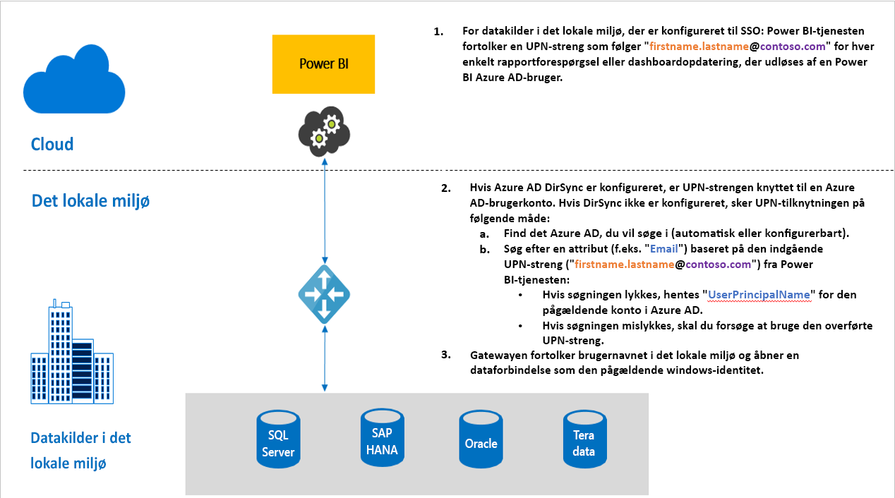

# Oversigt over enkeltlogon (SSO) til gateways i Power BI

Du kan få problemfri forbindelse med enkeltlogon, så Power BI-rapporter og -dashboards kan opdateres fra data i det lokale miljø, ved at konfigurere din datagateway i det lokale miljø med begrænset delegering fra Kerberos eller SAML (Security Assertion Markup Language). Datagatewayen i det lokale miljø gør det muligt at foretage SSO ved hjælp af DirectQuery, som den bruger til at oprette forbindelse til datakilder i det lokale miljø.

Vi understøtter i øjeblikket følgende datakilder:

* SQL Server ([Kerberos](service-gateway-sso-kerberos.md))
* SAP HANA ([Kerberos](service-gateway-sso-kerberos.md) og [SAML](service-gateway-sso-saml.md)
* SAP BW ([Kerberos](service-gateway-sso-kerberos.md)
* Teradata ([Kerberos](service-gateway-sso-kerberos.md))
* Spark ([Kerberos](service-gateway-sso-kerberos.md))
* Impala ([Kerberos](service-gateway-sso-kerberos.md))

Når en bruger kommunikerer med en DirectQuery-rapport i Power BI-tjenesten, kan hvert krydsfilter, udsnit, sortering og rapportredigering resultere i forespørgsler, der udføres direkte mod den underliggende datakilde i det lokale miljø.  Når SSO er konfigureret for datakilden, udføres forespørgsler i henhold til id'et for den bruger, som interagerer med Power BI (dvs. via weboplevelsen eller Power BI-mobilapps). På den måde får hver bruger præcist de data, som de har tilladelser til i den underliggende datakilde – med enkeltlogon konfigureret er der ingen cachelagring af delte data på tværs af flere brugere.

## Forespørgselstrin under kørsel af SSO

En forespørgsel, der køres med SSO, består af tre trin som vist i følgende diagram.

> [!NOTE]
> SSO til Oracle er endnu ikke aktiveret, men den er under udvikling og kommer snart.

Der følger flere oplysninger om disse trin:

1. For hver forespørgsel vil **Power BI-tjenesten** medtage *brugerens hovednavn* (UPN), når der sendes en forespørgsel til den konfigurerede gateway.

2. Gatewayen skal tilknytte Azure Active Directory-UPN'et til et lokalt Active Directory-id.

   a.  Hvis Azure AD DirSync (også kendt som *Azure AD Connect*) er konfigureret, fungerer tilknytningen automatisk i gatewayen.

   b.  Ellers kan gatewayen søge efter og knytte Azure AD-UPN til en lokal bruger ved at foretage opslag mod det lokale Active Directory-domæne.

3. Processen til gatewaytjenesten repræsenterer den tilknyttede lokale bruger, åbner forbindelsen til den underliggende database og sender forespørgslen. Gatewayen behøver ikke at være installeret på samme computer som databasen.

## Næste trin

Nu, hvor du har en grundlæggende forståelse af SSO, kan du læse mere detaljerede oplysninger om Kerberos og SAML:

* [Enkeltlogon (SSO) – Kerberos](service-gateway-sso-kerberos.md)
* [Enkeltlogon (SSO) – SAML](service-gateway-sso-saml.md)
