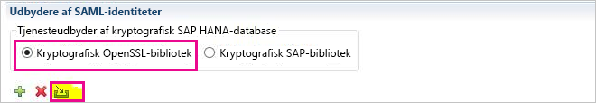
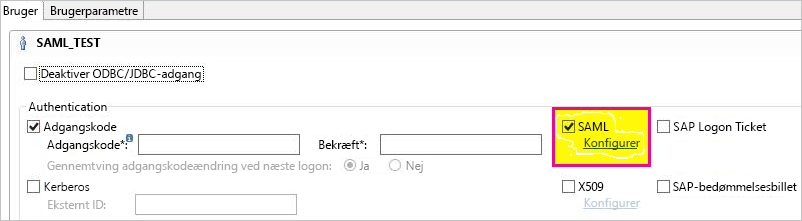
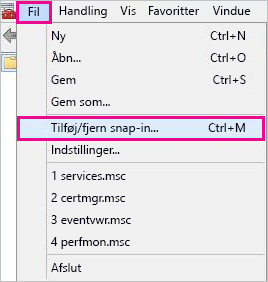

# <a name="use-security-assertion-markup-language-saml-for-sso-from-power-bi-to-on-premises-data-sources"></a>Brug SAML (Security Assertion Markup Language) til SSO fra Power BI til datakilder i det lokale miljø

Aktivering af SSO gør det nemt for Power BI-rapporter og -dashboards at opdatere data fra kilder i det lokale miljø, samtidig med at de tilladelser på brugerniveau, der er konfigureret for disse kilder, overholdes. Brug [SAML (Security Assertion Markup Language)](https://www.onelogin.com/pages/saml) til at aktivere problemfri forbindelse via enkeltlogon. 

## <a name="supported-data-sources"></a>Understøttede datakilder

Vi understøtter i øjeblikket SAP HANA med SAML. Få flere oplysninger om konfiguration af enkeltlogon til SAP HANA ved hjælp af SAML i [SAML SSO på BI-platformen til HANA](https://wiki.scn.sap.com/wiki/display/SAPHANA/SAML+SSO+for+BI+Platform+to+HANA).

Vi understøtter flere datakilder med [Kerberos](service-gateway-sso-kerberos.md) (herunder SAP HANA).

I forbindelse SAP HANA anbefales det, at du aktiverer kryptering, før du etablerer en SAML SSO-forbindelse. Du aktiverer kryptering ved at konfigurere HANA-serveren til at acceptere krypterede forbindelser og ved at konfigurere gatewayen til at bruge kryptering til at kommunikere med din HANA-server. Da HANA ODBC-driveren ikke krypterer SAML-udsagn som standard, sendes det signerede SAML-udsagn fra gatewayen til HANA-serveren som *godkendt* og er sårbar over for opfangelse og genbrug af tredjeparter. Du kan finde en vejledning til, hvordan du aktiverer kryptering til HANA ved hjælp af OpenSSL-biblioteket i [Aktivér kryptering for SAP HANA](/power-bi/desktop-sap-hana-encryption).

## <a name="configuring-the-gateway-and-data-source"></a>Konfiguration af gatewayen og datakilden

Hvis du vil bruge SAML, skal du etablere et tillidsforhold mellem de HANA-servere, du vil aktivere SSO for, og gatewayen. I dette scenarie fungerer gatewayen som SAML-identitetsudbyder (IdP). Der er forskellige måder at etablere denne relation på, f.eks. ved at importere x509-certifikatet for gatewayens IdP til HANA-servernes tillidslager eller ved at få signeret x509-certifikatet for gatewayen af et rodnøglecenter, som HANA-serverne har tillid til. Selvom vi beskriver den sidste fremgangsmåde i denne vejledning, kan du bruge en anden fremgangsmåde, hvis det er nemmere.

Selvom der bruges OpenSSL som HANA-serverens kryptografiske provider i denne vejledning, anbefales det af SAP, at du bruger Kryptografisk SAP-bibliotek (også kendt som CommonCryptoLib eller sapcrypto) i stedet for OpenSSL til at fuldføre konfigurationstrinnene, der hvor tillidsforholdet etableres. Du finder flere oplysninger i den officielle dokumentation til SAP.

Følgende trin indeholder en beskrivelse af, hvordan du etablerer et tillidsforhold mellem en HANA-server og gatewayens IdP ved at signere x509-certifikatet for gatewayens IdP ved hjælp af et rodnøglecenter, som HANA-serveren har tillid til. Du skal oprette dette rodnøglecenter:

1. Opret X509-certifikatet og den private nøgle for rodnøglecentret. Du opretter f.eks. x509-certifikatet og den private nøgle for rodnøglecentret i .pem-format ved at angive denne kommando:

   ```
   openssl req -new -x509 -newkey rsa:2048 -days 3650 -sha256 -keyout CA_Key.pem -out CA_Cert.pem -extensions v3_ca
   ```

    Kontrollér, at den private nøgle for rodnøglecentret er beskyttet godt. Hvis det hentes af en tredjepart, kan det blive brugt til at opnå uautoriseret adgang til HANA-server. 

 1. Føj certifikatet (f.eks. CA_Cert.pem) til HANA-serverens tillidslager, så HANA-serveren har tillid til alle certifikater, der er signeret af det rodnøglecenter, du har oprettet. 

    Du kan finde placeringen af din HANA-servers tillidslager ved at undersøge konfigurationsindstillingen **ssltruststore**. Hvis du har fulgt vejledningen i SAP-dokumentationen, der dækker den måde, du konfigurerer OpenSSL på, har din HANA-server måske allerede tillid til et rodnøglecenter, som du kan genbruge. Du finder flere oplysninger i [Sådan konfigureres Open SSL for SAP HANA Studio til SAP HANA Server](https://archive.sap.com/documents/docs/DOC-39571). Hvis du har flere HANA-servere, som du vil aktivere SAML SSO for, skal du kontrollere, at hver server har tillid til dette rodnøglecenter.

1. Opret X509-certifikatet for gatewayens idP. 

   Hvis du f.eks. vil oprette en anmodning om signering af certifikat (IdP_Req.pem) og en privat nøgle (IdP_Key.pem), som er gyldige i ét år, skal du udføre følgende kommando:

   ```
   openssl req -newkey rsa:2048 -days 365 -sha256 -keyout IdP_Key.pem -out IdP_Req.pem -nodes
   ```

 1. Signer anmodningen om signering af certifikat ved hjælp af det rodnøglecenter, du har konfigureret dine HANA-servere til at have tillid til. 

    Hvis du f.eks. vil signere IdP_Req.pem ved hjælp af CA_Cert.pem og CA_Key.pem (rodnøglecentrets certifikat og nøgle), skal du udføre følgende kommando:

    ```
    openssl x509 -req -days 365 -in IdP_Req.pem -sha256 -extensions usr_cert -CA CA_Cert.pem -CAkey CA_Key.pem -CAcreateserial -out IdP_Cert.pem
    ```

     Det resulterende IdP-certifikat er gyldigt i ét år (se indstillingen -dage). 

Importér certifikatet for din IdP i HANA Studio for at oprette en ny SAML-identitetsudbyder:

1. I SAP HANA Studio skal du højreklikke på navnet på din SAP HANA-server og derefter navigere til **Sikkerhed** &gt; **Åbn sikkerhedskonsollen** &gt; **SAML-identitetsudbyder** &gt; **Kryptografisk OpenSSL-bibliotek**.

    

1. Vælg **Importér**, naviger til IdP_Cert.pem, og importér det.

1. Vælg mappen **Sikkerhed** i SAP HANA Studio.

    

1. Udvid **Brugere**, og vælg derefter den bruger, du vil knytte din Power BI-bruger til.

1. Vælg **SAML**, og vælg derefter **Konfigurer**.

    

1. Vælg den identitetsudbyder, du oprettede i trin 2. Angiv Power BI-brugerens UPN (typisk den mailadresse, som brugeren logger på Power BI med) som **Ekstern identitet**, og vælg derefter **Tilføj**. Hvis du har konfigureret din gateway til at bruge konfigurationsindstillingen *ADUserNameReplacementProperty*, skal du angive den værdi, der skal erstatte Power BI-brugerens oprindelige UPN. 

   Hvis du f.eks. angiver *ADUserNameReplacementProperty* til **SAMAccountName**, så skal du angive brugerens **SAMAccountName**.

    

Nu, hvor du har konfigureret certifikatet og identiteten for gatewayen, skal du konvertere certifikatet til et .pfx-format og konfigurere gatewayen til at bruge certifikatet:

1. Konvertér certifikatet til pfx-formatet ved at køre følgende kommando. Med denne kommando navngives den resulterende .pfx-fil samlcert.pfx og angiver adgangskoden til *root*:

    ```
    openssl pkcs12 -export -out samltest.pfx -in IdP_Cert.pem -inkey IdP_Key.pem -passin pass:root -passout pass:root
    ```

1. Kopiér pfx-filen til gatewaycomputeren:

    1. Dobbeltklik på samltest.pfx, og vælg derefter **Lokal maskine** &gt; **Næste**.

    1. Angiv adgangskoden, og vælg derefter **Næste**.

    1. Vælg **Placer alle certifikater i følgende lager,** og vælg derefter **Gennemse** &gt; **Personlig** &gt; **OK**.

    1. Vælg **Næste** og derefter **Udfør**.

       

1. Giv kontoen for gatewaytjenesten adgang til den private nøgle for certifikatet:

    1. Kør Microsoft Management Console (MMC) på gatewaycomputeren.

        

    1. Under **Filer** skal du vælge **Tilføj/fjern snap-in**.

        

    1. Vælg **Certifikater** &gt; **Tilføj**, og vælg derefter **Computerkonto** &gt; **Næste**.

    1. Vælg **Lokal computer** &gt; **Afslut** &gt; **OK**.

    1. Udvid **Certifikater** &gt; **Personlig** &gt; **Certifikater**, og find certifikatet.

    1. Højreklik på certifikatet, og naviger til **Alle opgaver** &gt; **Administrer private nøgler**.

        

    1. Føj kontoen for gatewaytjenesten til listen. Kontoen er som standard **NT SERVICE\PBIEgwService**. Du kan finde ud af, hvilken konto der kører gatewaytjenesten ved at køre **services.msc** og finde **Datagatewaytjeneste i det lokale miljø**.

        

Følg til sidst disse trin for at føje certifikataftrykket til konfigurationen af gatewayen:

1. Kør følgende PowerShell-kommando for at angive certifikaterne på din computer:

    ```powershell
    Get-ChildItem -path cert:\LocalMachine\My
    ```

1. Kopiér aftrykket for det certifikat, du har oprettet.

1. Naviger til gatewaymappen, der som standard ligger her C:\Program Files\On-premises data gateway.

1. Åbn PowerBI.DataMovement.Pipeline.GatewayCore.dll.config, og find afsnittet *SapHanaSAMLCertThumbprint*. Indsæt det aftryk, du har kopieret.

1. Genstart gatewaytjenesten.

## <a name="running-a-power-bi-report"></a>Kørsel af en Power BI-rapport

Nu kan du bruge siden **Administrer gateway** i Power BI til at konfigurere SAP HANA-datakilden. Aktivér SSO via SAML under **Avancerede indstillinger**. Når du gør det, kan du publicere rapporter og datasæt med binding til den pågældende datakilde.

   

## <a name="troubleshooting"></a>Fejlfinding

Når du har konfigureret SAML-baseret SSO, får du muligvis vist følgende fejl på Power BI-portalen: *De angivne legitimationsoplysninger kan ikke bruges til SapHana-kilden.* Denne fejl tyder på, at SAML legitimationsoplysningerne blev afvist af SAP HANA.

Godkendelsessporinger på serversiden indeholder detaljerede oplysninger om fejlfinding af problemer med legitimationsoplysninger på SAP HANA. Følg disse trin for at konfigurere sporing for din SAP HANA-server:

1. Slå godkendelsessporing til på SAP HANA-serveren ved at køre følgende forespørgsel:

    ```
    ALTER SYSTEM ALTER CONFIGURATION ('indexserver.ini', 'SYSTEM') set ('trace', 'authentication') = 'debug' with reconfigure 
    ```

1. Genskab problemet.

1. Åbn administrationskonsollen i HANA Studio, og vælg fanen **Diagnosticeringsfiler**.

1. Åbn den nyeste indeksserversporing, og søg efter *SAMLAuthenticator.cpp*.

    Du bør finde en detaljeret fejlmeddelelse, der angiver rodårsagen, f.eks.:

    ```
    [3957]{-1}[-1/-1] 2018-09-11 21:40:23.815797 d Authentication   SAMLAuthenticator.cpp(00091) : Element '{urn:oasis:names:tc:SAML:2.0:assertion}Assertion', attribute 'ID': '123123123123123' is not a valid value of the atomic type 'xs:ID'.
    [3957]{-1}[-1/-1] 2018-09-11 21:40:23.815914 i Authentication   SAMLAuthenticator.cpp(00403) : No valid SAML Assertion or SAML Protocol detected
    ```

1. Når fejlfindingen er fuldført, kan du slå godkendelsessporingen fra ved at køre følgende forespørgsel:

    ```
    ALTER SYSTEM ALTER CONFIGURATION ('indexserver.ini', 'SYSTEM') UNSET ('trace', 'authentication');
    ```

## <a name="next-steps"></a>Næste trin

Du kan finde flere oplysninger om datagatewayen i det lokale miljø og DirectQuery i følgende ressourcer:

* [Hvad er en datagateway i det lokale miljø?](/data-integration/gateway/service-gateway-onprem)
* [DirectQuery i Power BI](desktop-directquery-about.md)
* [Datakilder, der understøttes af DirectQuery](desktop-directquery-data-sources.md)
* [DirectQuery og SAP BW](desktop-directquery-sap-bw.md)
* [DirectQuery og SAP HANA](desktop-directquery-sap-hana.md)
