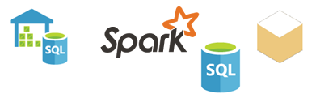

# Datakilder til Power BI-tjenesten
Dataene er i hjertet af Power BI. Lad os antage, at du er i gang med at udforske data. Det kan du gøre ved at oprette diagrammer og dashboards eller stille spørgsmål i **Spørgsmål og svar**. De visualiseringer og svar, du ser, får deres underliggende data fra et datasæt. Men hvor kommer dette datasæt fra? Det kommer fra en datakilde.

I denne artikel gennemgås de datakildetyper, du kan oprette forbindelse til fra Power BI-tjenesten. Husk, at der også er mange typer datakilder, du kan hente data fra. Hvis du vælger disse datakilder, skal du muligvis bruge Power BI Desktop eller Excels avancerede dataforespørgsels- og modelleringsfunktioner først. Du kan læse mere om de pågældende muligheder senere. Lad os i mellemtiden se på de forskellige typer datakilder, der er tilgængelige direkte fra webstedet for Power BI-tjenesten.

Du kan hente data fra en af datakilderne i Power BI ved at vælge **Hent Data** i nederste venstre hjørne af siden.

 

Når du har valgt **Hent data**, kan du vælge de data, du vil have adgang til

## Find indhold

Afsnittet **Find indhold** indeholder alle de data og rapporter, du har brug for, og de er allerede gjort klar til dig. Der er to typer indholdspakker i Power BI: Organisatoriske indholdspakker og tjenester. 

**Organisatoriske indholdspakker**: Hvis du og andre brugere i din organisation har en Power BI Pro-konto, kan du oprette, dele og bruge indholdspakker. Du kan få mere at vide i [Introduktion til organisatoriske indholdspakker](service-organizational-content-pack-introduction.md).

**Tjenester**: Der findes rigtig mange tjenester med indholdspakker til Power BI, og der kommer hele tiden flere til. De fleste tjenester kræver, at du har en konto. Du kan få mere at vide i [Opret forbindelse til tjenester, du bruger sammen med Power BI](service-connect-to-services.md).

## Opret nyt indhold

Afsnittet **Opret nyt indhold** indeholder indstillinger, så du selv kan oprette og importere indhold. I Power BI er der to måder at oprette eller importere dit eget indhold: Filer og databaser. 

### Filer

**Excel** ( *.xlsx*, *.xlsm*) – en projektmappe i Excel kan indeholde forskellige datatyper. Den kan f.eks, indeholde data, du selv har indtastet i regneark. Den kan også indeholde data, som du har forespurgt og indlæst fra eksterne datakilder ved hjælp af Power-forespørgsel. Power-forespørgsel er tilgængelig via **Hent og omdan** i Excel 2016 eller Power Pivot. Du kan importere data fra tabeller i regneark, eller importere data fra en datamodel. Du kan finde flere oplysninger under [Hent data fra filer til Power BI](service-get-data-from-files.md).

**Power BI Desktop** ( *.pbix*) – du kan bruge Power BI Desktop til at forespørge på og indlæse data fra eksterne datakilder samt oprette rapporter. Du kan også udvide din datamodel med målinger og relationer, eller du kan importere din Power BI Desktop-fil til Power BI-webstedet. Power BI Desktop er bedst til mere erfarne brugere. Disse brugere er normalt dem, der har en god forståelse af deres datakilder. De har også kendskab til dataforespørgsel og -transformation samt datamodelleringsbegreber. Du kan finde flere oplysninger i [Opret forbindelse til data i Power BI Desktop](desktop-connect-to-data.md).

**Kommasepareret værdi** ( *.csv*) – filer er simple tekstfiler med rækker af data. Hver række kan indeholde en eller flere værdier, der er adskilt af komma. F.eks. kan en *.csv*, der indeholder navnet og adressen data, have mange rækker. Hver række kan indeholde værdier for fornavn, efternavn, adresse, by, stat osv. Du kan ikke importere data til en *.csv*-fil, men mange programmer, f.eks. Excel, kan gemme simple tabeldata som en *.csv*-fil.

Til andre filtyper som XML-tabel ( *.xml*) eller tekstfiler ( *.txt*) kan du bruge **Hent og omdan** til at forespørge på, omdanne og indlæse disse data i en Excel- eller Power BI Desktop-fil først. Du kan derefter importere Excel- eller Power BI Desktop-filen til Power BI.

Det gør også en stor forskel, hvor du gemmer dine filer. OneDrive for Business giver den største fleksibilitet og integration med Power BI. Det er OK for at bevare dine filer på det lokale drev. Men hvis du har brug at opdatere dine data, er der er nogle få ekstra trin. Du kan få flere oplysninger ved at følge nedenstående links til artikler.

### Databaser

**Databaser i cloudmiljøet** – fra Power BI-tjenesten kan du oprette direkte forbindelse til:

* Azure SQL Database
* Azure SQL Data Warehouse
* Spark på Azure HDInsight

Forbindelser fra Power BI til disse databaser er dynamiske. Lad os antage, at du opretter forbindelse til en Azure SQL Database. Du begynder derefter at udforske dens data ved at oprette rapporter i Power BI. Når du opdeler dine data eller føjer et andet felt til en visualisering, udfører Power BI en forespørgsel direkte til databasen. Du kan få mere at vide i [Azure og Power BI](service-azure-and-power-bi.md).

**Databaser i det lokale miljø** – fra Power BI-tjenesten kan du oprette direkte forbindelse til SQL Server Analysis Services-tabelmodeldatabaser. For at gøre det skal du bruge en Power BI Enterprise-gateway. Hvis du er i tvivl om, hvordan du opretter forbindelse til din organisations tabelmodeldatabase, kan du kontakte administratoren eller it-afdelingen. Du kan få flere oplysninger i [Dynamiske SQL Server Analysis Services-data i Power BI](sql-server-analysis-services-tabular-data.md).

I forbindelse med andre databasetyper i din organisation skal du bruge Power BI Desktop eller Excel til at oprette forbindelse til, forespørge på og indlæse data i en datamodel. Du kan derefter importere din fil til Power BI, hvor der findes et datasæt. Hvis du konfigurerer en planlagt opdatering, bruger Power BI den pågældende konfiguration og forbindelsesoplysningerne fra filen til at oprette direkte forbindelse til datakilden og forespørge på opdateringer. Power BI indlæser derefter disse opdateringer i datasættet. Du kan finde flere oplysninger i [Opret forbindelse til data i Power BI Desktop](desktop-connect-to-data.md).

## Hvad nu, hvis mine data kommer fra en anden kilde?
Der er bogstaveligt talt hundredvis af forskellige datakilder, som du kan bruge sammen med Power BI. Uanset hvor du henter dine data, skal disse data være i et format, der kan forbruges af Power BI-tjenesten. Med data, der forbruges, Power BI-tjenesten kan oprette rapporter og dashboards, besvare spørgsmål med **spørgsmål og svar**osv.

Nogle datakilder har allerede data, der er formateret til Power BI-tjenesten. Disse kilder er som indholdspakker fra tjenesteudbydere, som Google Analytics og Twilio. SQL Server Analysis Services-tabelmodeldatabaser er også klar til brug. Du kan også oprette direkte forbindelse til databaser i cloudmiljøet, f.eks. Azure SQL Database og Spark på HDInsight.

I andre tilfælde kan det være nødvendigt at forespørge på og indlæse de ønskede data i en fil. Lad os f.eks. antage, at du har logistikdata i din organisation. Du gemmer dataene i en data warehouse-database på en server. I Power BI-tjenesten kan du ikke oprette direkte forbindelse til den pågældende database og begynde at udforske dataene, medmindre det er en tabelmodeldatabase. Du kan dog bruge Power BI Desktop eller Excel til at forespørge på og indlæse disse logistikdata i en datamodel, som du derefter gemmer som en fil. Du kan derefter importere filen til Power BI, hvor der findes et datasæt.

Nu tænker du nok: "Men logistikdataene i denne database ændres hver dag. Hvordan jeg opdatere mit Power BI-datasæt?" Når du importerer data til datasættet, importere du også forbindelsesoplysningerne fra enten Power BI Desktop eller Excel-filen.

Lad os antage, at du konfigurerer en planlagt opdatering eller udfører en manuel opdatering af datasættet. Power BI bruger forbindelsesoplysningerne fra datasættet sammen med et par andre indstillinger til at oprette forbindelse direkte til databasen. Programmet forespørger derefter på opdateringer og indlæser disse opdateringer i datasættet. Desuden skal du sandsynligvis bruge en Power BI-gateway for at sikre dataoverførsel mellem serveren i det lokale miljø og Power BI. Når overførslen er fuldført, opdateres alle visualiseringer i rapporter og dashboards automatisk.

Selvom du ikke kan oprette forbindelse til din datakilde direkte fra Power BI-tjenesten, betyder det nemlig ikke, at du ikke kan hente disse data ind i Power BI. Det kræver måske blot lige et par yderligere trin og lidt hjælp fra it-afdelingen. Se [Datakilder i Power BI Desktop](desktop-data-sources.md) for at få flere oplysninger.

## Lidt flere oplysninger
Du vil se, at begreberne datasæt og datakilde bruges meget i Power BI. De bruges ofte synonymt. Men de er rent faktisk to forskellige ting, selvom de er relaterede.

Du opretter automatisk et **datasæt** i Power BI, når du bruger **Hent data**. Med **Hent data** opretter du forbindelse til og importerer data fra en indholdspakke eller fil, eller du opretter forbindelse til en dynamisk datakilde. Et datasæt indeholder oplysninger om datakilden og legitimationsoplysningerne for datakilden. I mange tilfælde indeholder den også et undersæt af data, der er kopieret fra datakilden. Når du opretter visualiseringer i rapporter og dashboards, ser du ofte på dataene i datasættet.

En **datakilde** er det sted, hvor dataene i et datasæt kommer fra. Dataene kan f.eks. komme fra:

* En onlinetjeneste, som Google Analytics eller QuickBooks
* En database i cloudmiljøet, som Azure SQL Database
* En database eller fil på en lokal computer eller server i din egen organisation

## Opdatering af data
Måske gemmer du dine filer på dit lokale drev eller et drev et sted i din organisation. Du skal muligvis bruge en Power BI-gateway, så du kan opdatere datasættet i Power BI. Den computer, hvor filen skal være, når der finder en opdatering sted. Du kan også importere din fil igen eller bruge Udgiv fra Excel eller Power BI Desktop, men de muligheder er ikke automatiserede processer.

Du kan gemme filerne på OneDrive for Business eller SharePoint – teamwebsteder og derefter oprette forbindelse til eller importere dem til Power BI. Derefter er dit datasæt, dine rapporter og dit dashboard altid opdateret. Da både OneDrive og Power BI er i cloudmiljøet, kan Power BI oprette direkte forbindelse til den gemte fil. Der oprettes forbindelse en gang i timen, hvor der søges efter opdateringer. Datasættet og eventuelle visualiseringer opdateres automatisk, hvis der er nogen opdateringer.

Indholdspakker fra tjenester opdateres automatisk. I de fleste tilfælde opdateres de en gang om dagen. Du kan opdatere manuelt, men det afhænger af tjenesteudbyderen, om du får vist opdaterede data. Opdateringer til indholdspakker fra personer i din organisation afhænger af de anvendte datakilder. De afhænger også af, hvordan den person, der oprettede indholdspakken, konfigurerede opdateringen.

Azure SQL Database, Azure SQL Data Warehouse og Spark på Azure HDInsight er datakilder i cloudmiljøet. Da Power BI-tjenesten også er i clouden, kan Power BI kan oprette direkte forbindelse til de pågældende data ved hjælp af **DirectQuery**. Det, du ser i Power BI, er altid synkroniseret, og det er ikke nødvendigt at konfigurere en planlagt opdatering.

Når du opretter forbindelse til SQL Server Analysis Service fra Power BI, er det en direkte forbindelse på samme måde som en Azure-database i cloudmiljøet. Forskellen er selve databasen er på en server i din organisation. Denne type forbindelse kræver en Power BI-gateway, som normalt konfigureres af en it-afdeling.

Opdatering af data er en supervigtig del af Power BI og alt for omfattende til at behandle her. Hvis du vil have en grundig forståelse, kan du finde oplysninger i [Opdatering af data i Power BI](refresh-data.md).

## Overvejelser og begrænsninger
Følgende begrænsninger gælder for alle datakilder, der bruges i Power BI-tjenesten. Der er andre begrænsninger, der gælder for bestemte funktioner, men følgende liste gælder for hele Power BI-tjenesten:

* **Grænse for datasættets størrelse** – der er en grænse på 1 GB for hvert datasæt i Power BI-tjenesten.
* **Rækkegrænse** – det maksimale antal rækker i dit datasæt, når du ikke bruger **DirectQuery** er 2 milliarder. Tre af disse rækker er reserveret, så resultatet er et anvendeligt maksimum på 1.999.999.997 rækker. Det maksimale antal rækker, når du bruger **DirectQuery**, er 1 million rækker.
* **Grænse for kolonner** – det maksimale antal kolonner, der er tilladt i et datasæt på tværs af alle tabeller i datasættet, er 16.000 kolonner. Denne grænse gælder for Power BI-tjenesten og de datasæt, der bruges i Power BI Desktop. Power BI bruger en intern rækkenummerkolonne pr. tabel i datasættet, hvilket betyder, at det maksimale antal kolonner er 16.000 minus en for hver tabel i datasættet.

