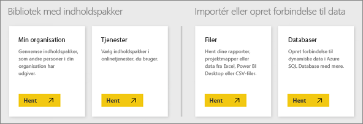

# Datakilder til Power BI-tjenesten
Dataene er i hjertet af Power BI. Når du udforsker data, opretter diagrammer og dashboards, stiller spørgsmål med Spørgsmål og svar, får alle disse visualiseringer og svar, som du ser, rent faktisk deres underliggende data fra et datasæt. Men hvor kommer dette datasæt fra? Fra en datakilde.

I denne artikel gennemgås de forskellige typer datakilder, du kan oprette forbindelse til fra Power BI tjenesten. Husk på, at der også er mange typer datakilder, du kan hente data fra. Men disse kilder kan muligvis kræve, at der først bruges Power BI Desktop eller Excels avancerede dataforespørgsels- og modelleringsfunktioner. Det kan du læse mere om senere. Lad os i mellemtiden se på de forskellige typer datakilder, du kan oprette forbindelse til direkte fra webstedet for Power BI tjenesten.

Du kan hente data fra enhver af disse datakilder i Power BI ved at klikke på **Mit arbejdsområde** > **Hent Data**.

## Filer

**Excel** (.xlsx, xlxm) – Excel er unikt, i og med at en projektmappe kan indeholde både data, du selv har lagt ind i regneark, og du kan forespørge på og indlæse data fra eksterne datakilder ved hjælp af Power-forespørgsel (Hent og omdan i Excel 2016) eller Power Pivot. Du kan importere data, der er i tabellerne i regneark (dataene *skal* være i en tabel), eller importere data, der er indlæst i en datamodel. Du kan få flere oplysninger i [Hent data fra Excel](service-get-data-from-files.md).

**Power BI Desktop** (.pbix) – Du kan bruge Power BI Desktop til at forespørge på og indlæse data fra eksterne datakilder, udvide din datamodel med målinger og relationer samt oprette rapporter. Du kan importere din Power BI Desktop-fil til dit Power BI-websted. Power BI Desktop er bedst til mere erfarne brugere, der har en god forståelse af deres datakilder, dataforespørgsel og omdannelse samt datamodelleringsbegreber. Du kan finde flere oplysninger i [Opret forbindelse til data i Power BI Desktop](desktop-connect-to-data.md).

**Kommasepareret værdi** (.csv) – filer er simple tekstfiler med rækker med data. Hver enkelt række kan indeholde en eller flere værdier, hver især adskilt af et komma. En .csv-fil, der indeholder navne- og adressedata, kan for eksempel have et antal rækker, hvor de enkelte rækker indeholder værdier for fornavn, efternavn, adresse, by, område osv. Du kan ikke importere data til en .csv-fil, men mange programmer, f.eks. Excel, kan gemme simple tabeldata som en .csv-fil.

Til andre filtyper som XML-tabel (.xml) eller tekstfiler (.txt) kan du bruge Hent og omdan til at forespørge på, omdanne og indlæse disse data i en Excel- eller Power BI Desktop-fil først. Du kan derefter importere Excel- eller Power BI Desktop-filen til Power BI.

Det gør også en stor forskel, hvor du gemmer dine filer. OneDrive for Business giver den største fleksibilitet og integration med Power BI. Hvis du gemmer dine filer på dit lokale drev, er det fint, men hvis du vil opdatere dataene, skal der udføres nogle få ekstra trin. Der findes flere oplysninger i de artikler, der linkes til.

## Indholdspakker

Indholdspakker indeholder alle data og rapporter, du har brug for – allerede forberedt. I Power BI er der to typer indholdspakker: Dem fra tjenester som Google Analytics, Marketo eller Salesforce og dem, der oprettes og deles med andre brugere i din organisation.

**Tjenester** – der findes rigtig mange tjenester med indholdspakker til Power BI, og der kommer hele tiden flere til. De fleste tjenester kræver, at du har en konto. Du kan få mere at vide i [Opret forbindelse til tjenester](service-connect-to-services.md).

**Organisatoriske** – hvis du og andre brugere i din organisation har en Power BI Pro-konto, kan du oprette, dele og bruge indholdspakker. Du kan få mere at vide i [organisationsindholdspakker](service-organizational-content-pack-introduction.md).

## Databaser

**Databaser i clouden** – fra Power BI-tjenesten kan du oprette direkte forbindelse til Azure SQL Database, Azure SQL Data Warehouse, Spark on Azure HD Insight og SQL Server Analysis Services ved hjælp af DirectQuery. Forbindelser fra Power BI til disse databaser er live. Det betyder, at når du har oprettet forbindelse til eksempelvis en Azure SQL Database, og du begynder at udforske dens data ved at oprette rapporter i Power BI, udføres der en forespørgsel direkte til databasen, når du opretter udsnit af dine data eller føjer et andet felt til en visualisering. Du kan få mere at vide i [Azure og Power BI](service-azure-and-power-bi.md).

**Databaser i det lokale miljø** – fra Power BI-tjenesten kan du oprette forbindelse til SQL Server Analysis Services-tabelmodeldatabaser. En Power BI Enterprise-gateway er obligatorisk. Hvis du er i tvivl om, hvordan du opretter forbindelse til din organisations tabellariske modeldatabase, kan du kontakte administratoren eller it-afdelingen. Du kan få mere at vide i [SQL Server Analysis-tabeldata i Power BI](sql-server-analysis-services-tabular-data.md).

I forbindelse med andre typer af databaser i din organisation skal du først bruge Power BI Desktop eller Excel til at oprette forbindelse til, forespørge på og indlæse data i en datamodel. Du kan derefter importere din fil til Power BI, hvor der oprettes et datasæt. Hvis du konfigurerer planlagt opdatering, vil Power BI bruge forbindelsesoplysningerne fra filen sammen med indstillinger for opdatering, som du konfigurerer, til at oprette direkte forbindelse til datakilden og forespørge på opdateringer. Disse opdateringer indlæses derefter i datasættet i Power BI. Du kan finde flere oplysninger i [Opret forbindelse til data i Power BI Desktop](desktop-connect-to-data.md).

## Hvad nu, hvis mine data kommer fra en anden kilde?
Der er bogstaveligt talt hundredvis af forskellige datakilder, som du kan bruge sammen med Power BI. Men uanset hvor du henter dataene fra, skal disse data være i et format, som Power BI-tjenesten kan bruge til at oprette rapporter og dashboards, besvare spørgsmål med Spørgsmål og svar osv.

Nogle datakilder har allerede deres data i et format, der er klar til Power BI-tjenesten, for eksempel indholdspakker fra tjenesteudbydere som Google Analytics og Twilio. SQL Server Analysis Services-tabelmodeldatabaser er også klar. Og du kan oprette direkte forbindelse til databaser i clouden som eksempelvis Azure SQL Database og Spark på HDInsight.

I andre tilfælde kan det være nødvendigt at forespørge på og indlæse de ønskede data i en fil. Lad os for eksempel antage, at du har logistikdata i en data warehouse-database på en server i din organisation. I Power BI-tjenesten kan du ikke oprette direkte forbindelse til denne database og begynde at udforske dataene (medmindre det er en tabelmodeldatabase). Du kan dog bruge Power BI Desktop eller Excel til at forespørge på og indlæse disse logistikdata i en datamodel, som du derefter gemmer som en fil. Du kan derefter importere filen til Power BI, hvor der oprettes et datasæt.

Nu tænker du nok "Men disse logistikdata på denne database ændres hver dag. Hvordan sikrer jeg, at mit datasæt i Power BI er opdateret?". Forbindelsesoplysningerne fra Power BI Desktop- eller Excel-filen importeres til datasættet sammen med dataene. Hvis du konfigurerer planlagt opdatering eller udfører en manuel opdatering af datasættet, vil Power BI bruge forbindelsesoplysningerne fra datasættet, sammen med et par andre indstillinger, til at oprette direkte forbindelse til databasen, søge efter opdateringer og indlæse disse opdateringer i datasættet. Det vil sandsynligvis kræve en Power BI-gateway for at sikre dataoverførsel mellem den lokale server og Power BI. Visualiseringer i rapporter og dashboards opdateres automatisk.

Forstår du, bare fordi du ikke kan oprette forbindelse til din datakilde direkte fra Power BI tjenesten, betyder det ikke, at du ikke kan hente disse data ind i Power BI. Det kræver måske blot lige et par yderligere trin og lidt hjælp fra it-afdelingen. Se [Datakilder i Power BI Desktop](desktop-data-sources.md) for at få flere oplysninger.

## Lidt flere oplysninger
Du vil se, at begreberne datasæt og datakilde bruges meget i Power BI. De bruges ofte synonymt, men er rent faktisk to forskellige ting, selvom de er relaterede.

Et ***datasæt*** oprettes automatisk i Power BI, når du bruger Hent data til at oprette forbindelse til og importere data fra en indholdspakke eller fil, eller du opretter forbindelse til en live datakilde. Et datasæt indeholder oplysninger om datakilden, legitimationsoplysninger til datakilden og i mange tilfælde et undersæt af data, der er kopieret fra datakilden. Når du opretter visualiseringer i rapporter og dashboards, ser du i de fleste tilfælde på dataene i datasættet.

En ***datakilde*** er det sted, hvor dataene i et datasæt kommer fra. For eksempel en onlinetjeneste som Google Analytics eller QuickBooks, en database i clouden som Azure SQL Database eller en database eller en fil på en lokal computer eller server i din egen organisation.

### Opdatering af data
Hvis du gemmer dine filer på dit lokale drev eller et drev et sted i organisationen, kan en Power BI-gateway være påkrævet for at opdatere datasættet i Power BI. Og den computer, filen er gemt på, skal være tændt, når en opdatering udføres. Du kan også importere din fil igen eller bruge Udgiv fra Excel eller Power BI Desktop, men det er ikke automatiske processer.

Hvis du gemmer filerne på OneDrive for Business eller SharePoint – teamwebsteder og derefter opretter forbindelse til eller importerer dem til Power BI, vil datasættet, rapporterne og dashboardet altid være opdateret. Da både OneDrive og Power BI er i clouden, kan Power BI oprette direkte forbindelse til den gemte fil, omtrent en gang i timen, og søge efter opdateringer. Hvis der er nogen, opdateres datasættet og eventuelle visualiseringer automatisk.

Indholdspakker fra tjenester opdateres automatisk. I de fleste tilfælde en gang om dagen. Du kan opdatere manuelt, men det afhænger af tjenesteudbyderen, om du får vist opdaterede data. Indholdspakker fra andre i din organisation afhænger af de anvendte datakilder, og hvordan den person, som oprettede indholdspakken, konfigurerer opdatering.

Azure SQL Database, Azure SQL Data Warehouse og Spark på Azure HDInsight er unikke, fordi de er datakilder i clouden. Da Power BI-tjenesten også er i clouden, kan Power BI kan oprette liveforbindelse til dem ved hjælp af DirectQuery. Det, du ser i Power BI, er altid synkroniseret, og det er ikke nødvendigt at konfigurere en opdatering.

SQL Server Analysis Services er unik i og med, at når du opretter forbindelse til den fra Power BI, er det en liveforbindelse på samme måde som en Azure database i cloudmiljøet, men selve databasen er på en server i organisationen. Denne type forbindelse kræver en Power BI-gateway, som normalt er konfigureret af en it-afdeling.

Opdatering af data er en supervigtig del af Power BI og alt for omfattende til at behandle her. Hvis du vil have en grundig forståelse, kan du finde oplysninger i [Opdatering af data i Power BI](refresh-data.md).

## Overvejelser og begrænsninger
For alle datakilder, der bruges i Power BI-tjenesten, gælder følgende overvejelser og begrænsninger. Der er andre begrænsninger, der gælder for bestemte funktioner, men følgende liste gælder generelt set for Power BI-tjenesten:

* **Grænse for datasættets størrelse** – der er en grænse på 1 GB for hvert datasæt i Power BI-tjenesten.
* **Grænse for rækker** – det maksimale antal rækker i dit datasæt (når der ikke bruges DirectQuery) er 2 milliarder, hvor tre af disse rækker er reserveret (hvilket givet et anvendeligt maksimum på 1.999.999.997 rækker). Det maksimale antal rækker, når du bruger DirectQuery, er 1 million rækker.
* **Grænse for kolonner** – det maksimale antal kolonner, der er tilladt i et datasæt på tværs af alle tabeller i datasættet, er 16.000 kolonner. Dette gælder for Power BI-tjenesten og de datasæt, der bruges i Power BI Desktop. Power BI bruger en intern rækkenummerkolonne pr. tabel, der er inkluderet i datasættet, hvilket betyder, at det maksimale antal kolonner er 16.000 minus en for hver tabel, der bruges i datasættet.

